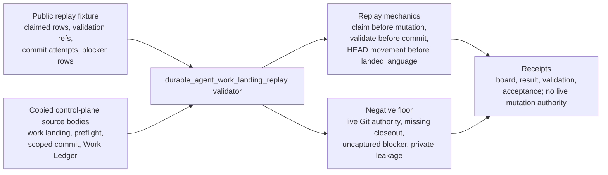

# Durable Agent Work-Landing Replay

Durable agent work-landing replay is the public work-spine organ for showing how Microcosm treats agent work as a transaction instead of a chat claim. It binds owned-path claims, owner-native validation, scoped commit attempts, protected Git-metadata blockers, Task Ledger capture, Work Ledger finalizers, and seed reentry into a source-available replay contract.

The organ is useful to a cold agent because it turns a landing claim into an evidence checklist: a row is not "landed" unless claimed paths, validation refs, commit-attempt refs, HEAD-before/after evidence, blocker capture, and ledger closeout all line up in the recorded replay. It validates the replay contract and the negative fixtures. It does not perform the live landing itself.

## Shape



## Public Contract

- The source pattern is `durable_agent_work_landing_replay_compound`.
- The fixture lives at `fixtures/first_wave/durable_agent_work_landing_replay/input/`.
- The runtime example lives at `examples/durable_agent_work_landing_replay/exported_work_landing_replay_bundle/`.
- The validator is `microcosm_core.organs.durable_agent_work_landing_replay`.
- The CLI command is `microcosm durable-agent-work-landing-replay run-work-landing-bundle`.
- The governing standard is `standards/std_microcosm_durable_agent_work_landing_replay.json`.
- The organ model row is `core/organ_atlas.json#durable_agent_work_landing_replay`.
- The acceptance row is `core/organ_registry.json#durable_agent_work_landing_replay`.

## Technical Mechanism

The replay fixture imports six public-safe macro control-plane bodies through `examples/durable_agent_work_landing_replay/exported_work_landing_replay_bundle/source_module_manifest.json`. Those bodies are copied into `source_modules/` with digest provenance instead of being summarized from memory:

- `system/lib/workitem_runtime_entrypoint.py`
- `system/lib/work_landing_status.py`
- `tools/meta/control/work_landing.py`
- `tools/meta/control/mission_transaction_preflight.py`
- `tools/meta/control/scoped_commit.py`
- `tools/meta/factory/work_ledger.py`

The validator checks the replay rows against those source-backed mechanics
rather than accepting a prose landing claim. `validate_projection_protocol`
requires source pattern refs, projection receipt refs, and public runtime refs.
`validate_landing_policy` requires the scoped-commit, broad-checkpoint,
metadata-blocked patch-bundle, and hard-stop lanes, with broad checkpointing
kept behind explicit operator authorization and release authority kept false.
`validate_work_landing_runs` enforces claim-before-mutation evidence, validation
before commit attempt, HEAD movement before landed language, blocker capture
before metadata-blocked closeout, dirty-tree boundary evidence, and Work Ledger
finalizer evidence.

The source-open body floor is enforced separately by
`validate_source_module_imports`. The manifest must declare
`copied_non_secret_macro_body`, `body_in_receipt: false`, exact-copy
source-to-target relations, allowed public macro material classes, expected
digests, and required anchors inside each copied source body. That check keeps
the reader claim tied to actual macro control-plane files while receipts carry
only refs, digests, counts, and verdicts.

The result builder merges projection-protocol, landing-policy, work-run,
source-module, source-open-body, and secret-exclusion checks into one body-free
receipt set. The board receipt records three claimed-path rows, two
validation-before-commit mechanics, one metadata-blocked row, one landed-commit
row, nine observed negative cases for the first-wave fixture, and zero
authority for live Git mutation or release.

## Prior Art Grounding

This organ is grounded in provenance and software supply-chain integrity
patterns. The [W3C PROV](https://www.w3.org/TR/prov-overview/) family provides a
general model for entities, activities, and agents involved in producing an
artifact. [SLSA](https://slsa.dev/spec/) brings a similar concern to software
builds: source, build process, provenance, and artifact integrity are tracked so
consumers can reason about where an artifact came from and how it was produced.

Microcosm borrows that provenance posture for agent work landing: claimed paths,
validation refs, commit attempts, HEAD-before/after evidence, blocker capture,
Task/Work Ledger closeout, and seed reentry are separate evidence fields. It
does not perform a live Git landing or prove arbitrary commits outside the
replay.

## Structured Lattice Bindings

- JSON capsule: `core/paper_module_capsules.json::paper_modules[16:paper_module.durable_agent_work_landing_replay]`
- Mechanism source: `core/mechanism_sources.json#mechanism.durable_agent_work_landing_replay.validates_public_work_landing_replay_contract`
- Atlas binding: `core/organ_atlas.json#durable_agent_work_landing_replay`
- Code locus: `src/microcosm_core/organs/durable_agent_work_landing_replay.py`
- Standard contract: `standards/std_microcosm_durable_agent_work_landing_replay.json::paper_module_contract`
- Concept edge: `concept.work_landing_and_continuity_control_bundle`

These bindings are source rows for discoverability and coverage. They do not make this Markdown file source authority, and they do not upgrade replay receipts into live commit authority.

## Governing Lattice Relation

The JSON capsule binds this module to mechanism
`mechanism.durable_agent_work_landing_replay.validates_public_work_landing_replay_contract`,
organ `durable_agent_work_landing_replay`, concept
`concept.work_landing_and_continuity_control_bundle`, principles `P-5`, `P-10`,
`P-14`, `P-15`, and `P-16`, axioms `AX-4` and `AX-9`, and the runtime code
locus `src/microcosm_core/organs/durable_agent_work_landing_replay.py`. That
lattice position makes the module a bounded work-landing accounting replay: it
explains how evidence is recorded and rejected, not how to perform live Git
mutation.

The concept edge is the claim ceiling. Broader work-continuity claims must route
through sibling modules such as `bridge_phase_continuity_runtime` and
`work_landing_control_spine`, while live landing behavior remains with the
macro control-plane source files and Work Ledger/scoped-commit owner lanes. This
module can cite their copied public-safe bodies as evidence, but it cannot
promote itself into their live authority.

## JSON Capsule Binding

- Source row: `core/paper_module_capsules.json::paper_modules[16:paper_module.durable_agent_work_landing_replay]`
- `source_authority: json_capsule`
- This Markdown is a reader projection. The generated Mermaid projection is
  `available_from_capsule_edges`, and the generated Atlas projection is
  `linked_from_capsule_edges`; both are navigation projections derived from
  capsule edges, not landing authority.
- The proof boundary is the public work-landing replay fixture, copied
  non-secret control-plane bodies, source manifest, validation-before-commit
  rows, HEAD before/after evidence, blocker-capture rows, and validation receipts.
- The authority ceiling excludes live Git mutation, arbitrary commit-landed
  truth, live Task Ledger mutation, live Work Ledger mutation, provider
  dispatch, source mutation, release, and whole-system correctness.

## Claim Ceiling

This module may claim public replay evidence that claimed-path rows,
validation-before-commit rows, HEAD before/after evidence, blocker-capture
rows, Work Ledger finalizer evidence, copied non-secret control-plane bodies,
source manifests, body-free receipts, and negative cases support the declared
work-landing replay contract. The organ, mechanism, code locus, governed
concept, and principles are bound in the structured lattice bindings above.

This module may not claim live Git mutation, arbitrary commit-landed truth,
live Task Ledger mutation, live Work Ledger mutation, provider dispatch, broad
checkpoint authority, source mutation authority, hosted-public readiness,
release approval, publication approval, implementation correctness beyond the
listed witnesses, or whole-system correctness.

## Reader Evidence Routing

Read the replay as an evidence-accounting organ, not as a live landing
controller. The board receipt is the primary reader surface: it shows which
claimed-path rows carried validation evidence, which rows were blocked by
Git-metadata or dirty-tree constraints, and which rows had enough HEAD
before/after evidence to use landed language.

Read the source-module manifest as provenance evidence for the imported control
plane, not as a permission slip to mutate those macro files. The manifest binds
the copied public-safe bodies by digest and line count so a cold agent can see
which mechanics the replay model was checked against.

Read negative cases as the authority floor. Rows that claim live Git mutation,
broad checkpoint authority, missing Work Ledger closeout, uncaptured blockers,
release approval, or private path/body export are supposed to fail. Passing
those refusals is part of the positive claim.

## Reader Proof Boundary

The reader-verifiable proof is limited to the public replay fixture, copied
non-secret control-plane bodies, source manifest, validation-before-commit rows,
HEAD before/after evidence, blocker-capture rows, Work Ledger finalizer evidence,
body-free receipts, and the nine named negative cases. The JSON capsule is the
authority for the organ, mechanism, concept, principle, axiom, and code-locus
edges; this Markdown explains the replay boundary.

Passing receipts do not mutate Git, certify arbitrary commits, perform live Task
Ledger or Work Ledger mutation, authorize broad checkpoints, run providers,
publish, release, or prove whole-system correctness.

## Public Site Availability Boundary

Public site or Atlas availability may expose this replay as a source-open
landing-accounting card, a route to the fixture and source manifest, and a
generated capsule diagram. That availability is a navigation and evidence-shape
claim only; it is not live landing authority and cannot certify current Git
state.

Any public copy should preserve the replay-vs-live distinction and should avoid
phrasing that implies release approval, hosted orchestration, provider behavior,
or broad checkpoint safety.

## Public-Safe Body Handling

Receipts should carry source refs, digests, line counts, validation ordering,
HEAD evidence, blocker-capture evidence, finalizer refs, verdicts, and
anti-claims. They should not carry copied macro body text, private Work Ledger
or Task Ledger bodies, provider/account state, unpublished private paths, or
secret-bearing payloads. If copied source-module digests drift, route the repair
through exact-copy refresh before treating this page as up to date.

## Evidence Receipts

- `receipts/first_wave/durable_agent_work_landing_replay/durable_agent_work_landing_replay_result.json`
- `receipts/first_wave/durable_agent_work_landing_replay/durable_agent_work_landing_replay_board.json`
- `receipts/first_wave/durable_agent_work_landing_replay/durable_agent_work_landing_replay_validation_receipt.json`
- `receipts/acceptance/first_wave/durable_agent_work_landing_replay_fixture_acceptance.json`

Run the fixture receipt refresh from `microcosm-substrate` with:

```sh
PYTHONPATH=src python3 -m microcosm_core.organs.durable_agent_work_landing_replay run --input fixtures/first_wave/durable_agent_work_landing_replay/input --out receipts/first_wave/durable_agent_work_landing_replay
```

Run the exported bundle validator without mutating durable receipts with:

```sh
PYTHONPATH=src python3 -m microcosm_core.organs.durable_agent_work_landing_replay run-work-landing-bundle --input examples/durable_agent_work_landing_replay/exported_work_landing_replay_bundle --out /tmp/durable-agent-work-landing-replay
```

## Validation Receipt Path

Validate the reader projection from the repo root without mutating durable
receipt or generated projection surfaces:

```bash
./repo-pytest microcosm-substrate/tests/test_durable_agent_work_landing_replay.py -q --basetemp=/tmp/microcosm_durable_agent_work_landing_replay_pytest
./repo-python microcosm-substrate/scripts/build_doctrine_projection.py --check-paper-module-corpus
```

## Named Proof Consumers

- First-wave runtime consumer:
  `microcosm_core.organs.durable_agent_work_landing_replay run` consumes the
  fixture input, writes result, board, validation, and optional acceptance
  receipts, and observes the nine negative cases declared in
  `EXPECTED_NEGATIVE_CASES`.
- Exported-bundle consumer:
  `microcosm_core.organs.durable_agent_work_landing_replay run-work-landing-bundle`
  consumes the exported bundle without durable receipt mutation, validates the
  source-module manifest, checks copied source-body digests and anchors, and
  emits the command card path used by runtime-shell demos.
- Focused pytest consumer:
  `tests/test_durable_agent_work_landing_replay.py` checks negative-case
  coverage, public-relative body-free receipts, exported-bundle runtime shape,
  digest mismatch rejection, source-body-in-receipt rejection, exact copied
  public body floor, HEAD-advance enforcement, and fresh command-card receipt
  reuse.
- Corpus consumer:
  `scripts/build_doctrine_projection.py --check-paper-module-corpus` verifies
  that this reader projection remains accepted by the paper-module corpus
  without treating generated Mermaid or Atlas rows as source authority.
- Claim-ceiling consumer:
  `standards/std_microcosm_durable_agent_work_landing_replay.json`, the organ
  `AUTHORITY_CEILING`, and the fixture negative cases keep live Git mutation,
  broad checkpoint authority, unrelated dirty-path staging, live Task/Work
  Ledger mutation, provider dispatch, source mutation, publication, release,
  private body export, and whole-system correctness outside this module.

## Receipt Expectations

The first-wave fixture should produce a result receipt, a board receipt, and a
validation receipt under `receipts/first_wave/durable_agent_work_landing_replay/`.
The acceptance route should produce
`receipts/acceptance/first_wave/durable_agent_work_landing_replay_fixture_acceptance.json`.
Those receipts should preserve refs, digests, validation order, HEAD evidence,
blocker-capture evidence, and anti-claims while keeping imported source bodies
out of receipt payloads.

For temporary validation, write bundle receipts under `/tmp` and compare the
same fields without treating the temp output as durable doctrine authority.
Current-reader claims should stop at replay conformance: the receipts can show
that the fixture enforces work-landing accounting, but they cannot certify live
Git state, broad checkpoint safety, provider behavior, release readiness, or
whole-system correctness.

## Negative Cases

The fixture rejects the nine named negative cases in `core/fixture_manifests/durable_agent_work_landing_replay.fixture_manifest.json`: missing validation evidence, validation recorded after a commit attempt, missing Work Ledger closeout, commit-landed language without a HEAD advance, live Git mutation authority, missing dirty-tree boundary, uncaptured metadata blockers, release overclaims, and private path/body leakage.

## Authority Ceiling

This organ is source-open replay authority only. It validates public synthetic replay receipts and copied non-secret macro bodies with digest provenance. It does not mutate Git, stage unrelated dirty paths, prove arbitrary commits landed outside the replay, export private source bodies, run providers, publish, host, or authorize release.

## Re-Entry Conditions

Re-enter this module when any of these drift:

- `standards/std_microcosm_durable_agent_work_landing_replay.json::source_open_body_imports`
- `examples/durable_agent_work_landing_replay/exported_work_landing_replay_bundle/source_module_manifest.json`
- `src/microcosm_core/organs/durable_agent_work_landing_replay.py::EXPECTED_NEGATIVE_CASES`
- the four receipt refs above

If source-module digests drift, refresh the exported bundle or downgrade the paper claim until the manifest and receipt evidence agree. If a row claims live Git authority, broad checkpoint authority, provider execution, private body export, or release authority, keep it out of the public organ claim and route it as a blocked or private-lane residual instead.
If focused validation reports an exact-copy source-module body mismatch, route
that as `microcosm_exact_copy_refresh` work rather than treating the Markdown
projection as the source of truth.
