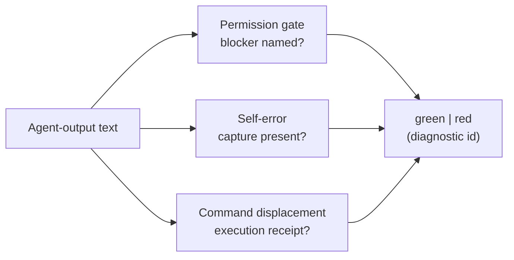

# Egress Self-Compliance Audit

`egress_self_compliance_audit` checks a snippet of an AI agent's own output for
three self-policing slips: asking permission with no real blocker named,
admitting an error with no durable capture, and handing a command to the operator
with no execution receipt.

## Purpose

These are common ways an agent's output quietly breaks its operating discipline.
This organ makes the check fast and transparent: it is phrase membership, openly
bounded, not a claim of semantic understanding.

It surfaces the public `egress_self_compliance_gate` capsule. Each of three
detectors fires only when a tripwire phrase is present and its matching legitimiser
phrase is absent: permission-gate-without-blocker, self-error-without-capture, and
command-displacement-to-operator. Text is green when no detector fires, red
otherwise. The honest limit is stated up front — a violation worded outside the
known phrase tables is missed, and benign text that happens to contain a tripwire
can be flagged.

## Shape



## JSON Capsule Binding

- source_ref:
  `core/paper_module_capsules.json::paper_modules[100:paper_module.egress_self_compliance_audit]`
- source_authority: json_capsule
- Projection role: This Markdown is a reader projection of the JSON capsule row,
  not the source authority. The generated Mermaid projection is
  `paper_module.egress_self_compliance_audit.mermaid` with status
  `available_from_capsule_edges`, and the generated Atlas projection is
  `organ_atlas.egress_self_compliance_audit` with status
  `linked_from_capsule_edges`.
- proof boundary: the capsule binds the accepted organ, the resolved mechanism
  row, the runtime locus, the surfaced engine-room capsule, and the governing
  concept, principle, and axiom edges; the generated JSON projection carries the
  exact resolved relationship edges.
- authority ceiling: this page can explain the phrase-policy fixtures and the
  validation receipts, but it cannot become taint analysis, prompt-injection
  defense, sandboxing, an information-flow proof, or release authority.

## Structured Lattice Bindings

The structured capsule row is
`core/paper_module_capsules.json#paper_module.egress_self_compliance_audit`. It
binds this Markdown projection to the organ, the resolved mechanism row
`mechanism.egress_self_compliance_audit.verifies_egress_self_compliance_gate`,
the runtime locus
`src/microcosm_core/organs/egress_self_compliance_audit.py`, and the surfaced
capsule `src/microcosm_core/engine_room/egress_self_compliance_gate.py`. It abides
by axiom `AX-2` (a small checker decides claims over certificates) and principle
`P-3` (prefer a small, rerunnable verifier over narrative confidence).

Generated atlas docs remain builder-owned projections: refresh them with
`PYTHONPATH=src python3 scripts/build_organ_atlas.py --write` instead of editing
`ORGANS.md`, `ARCHITECTURE.md`, `AGENT_ROUTES.md`, or
`atlas/agent_task_routes.json` by hand.

## Reader Evidence Routing

The honest unit is the tripwire-plus-legitimiser rule, not a safety guarantee.
Read the stated limit before trusting a green:

- A safety/evals engineer should confirm the policy is substring membership with
  an explicit ceiling — not taint analysis or info-flow. The useful question is
  whether the boundary is named honestly rather than oversold.
- A hiring reviewer should read the two negatives. The useful question is whether
  a bare permission ask and a command handed off without a receipt are flagged
  red with their diagnostic id.
- A peer developer should run the fixtures. The useful question is whether a green
  means each detector recomputed clean, and whether repairing a negative flips it
  green (so it is recomputation, not a baked verdict).

## Validation

```bash
PYTHONPATH=src python3 -m microcosm_core.organs.egress_self_compliance_audit run --input fixtures/first_wave/egress_self_compliance_audit/input --out receipts/first_wave/egress_self_compliance_audit --acceptance-out receipts/acceptance/first_wave/egress_self_compliance_audit_fixture_acceptance.json
```

The positive cases (`permission_gate_with_named_blocker`, `self_error_with_capture`)
name a real blocker and bind an error to a durable capture, so the gate stays
green. The negative cases are rejected by recomputation:
`permission_gate_without_blocker` and `command_displacement_no_receipt` each fire
their diagnostic id. The registry, ledger, and runtime spine checks in `make test`
exercise the organ's acceptance receipt.

## Authority Ceiling

A green run shows that the phrase-membership detectors reproduced the declared
green/red verdicts and diagnostic markers on the authored cases. It is phrase
membership only — not taint analysis, prompt-injection defense, sandboxing, or an
information-flow proof — does not cover real agent output by guarantee, and does
not authorize release, publication, provider calls, or source mutation.
