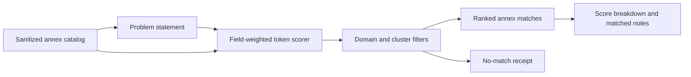

# Engine Room Annex Knowledge Router

This staged Engine Room capsule imports the runnable route-selection core of
the macro annex registry into Microcosm as a public-safe refactor.

## What It Demonstrates

- Structured routing fields score with the highest weights.
- Family text, tags, and open-first summaries provide weaker fallback evidence.
- Curated notes are sorted by relevance and contribute matched note ids.
- Domain and cluster filters prevent unrelated annexes from ranking.
- Every result carries a score decomposition via `match_breakdown`.

## Shape



The shape is intentionally a public-safe router, not a corpus crawler. It reads
a sanitized fixture catalog and a problem statement, applies field-weighted
token scoring and optional filters, then emits ranked matches with visible score
breakdowns. It does not clone annex repositories, inspect private annex bodies,
run BM25/Lucene/embedding search, perform license review, or authorize use of
the private annex corpus.

## Technical Mechanism

The runtime mechanism is a deterministic ranking pass over a caller-supplied
catalog. `route_catalog()` is the receipt boundary: it calls `route_annexes()`,
records the problem text and optional domain/cluster filters, carries
`source_refs`, and returns either a routed row set or an empty no-match row set
with `status: routed` or `status: no_match`. The row score is intentionally
decomposed into four buckets so readers can audit why a fixture ranked without
reading private annex bodies.

The scoring path starts by normalizing punctuation, slashes, underscores, and
hyphens into lowercase tokens, then drops a small local stopword set. Structured
fields from `routing_summary` dominate the score: problem spaces,
capabilities, domains, and clusters use weights of 120 for exact equality, 80
for phrase containment, and 18 per overlapping token. Family text is weaker:
slug, display name, description, and tags use 32/24/6 weights. `open_first`
summaries are weaker again at 20/16/4. Curated notes are sorted by bounded
`relevance`, scored at 18/12/3, and contribute only their ids to
`matched_note_ids`. The receipt therefore exposes the rank cause as
`match_breakdown` rather than asking the reader to trust an opaque relevance
number.

Filters run before scoring. If the caller supplies a domain or cluster, the
candidate row must match the normalized field exactly or it is excluded before
any text score can rescue it. Empty problem text returns no candidates. Fixture
cases bind both sides of that mechanism: `provider_backoff_route` and
`note_match` exercise positive structured and note-backed ranking, while
`domain_filter_no_match` and `empty_problem_no_match` exercise the negative
filter and empty-query paths. `evaluate_fixture_dir()` then turns the four JSON
cases into a pass/fail receipt with `case_count`, `passed_case_count`,
`claim_ceiling`, and `anti_claims`.

## Source-Open Body Floor

The source-open floor for this module is the runnable Engine Room refactor plus
its fixture and test surfaces:

- runtime: `src/microcosm_core/engine_room/annex_knowledge_router.py`
- standard: `standards/std_microcosm_engine_room_annex_knowledge_router.json`
- fixture manifest:
  `core/fixture_manifests/engine_room_annex_knowledge_router.fixture_manifest.json`
- public fixtures:
  `fixtures/first_wave/engine_room_annex_knowledge_router/input`
- focused tests: `tests/test_engine_room_annex_knowledge_router.py`
- generated JSON capsule row:
  `paper_modules/engine_room_annex_knowledge_router.json`

That floor is enough for a reader to replay the public routing fixtures and
inspect how scores and filters are computed. It is not enough to claim private
annex-corpus search, third-party license review, organ admission, Atlas release
authority, or release readiness.

## Claim Ceiling

This is explainable tiered weighted-token retrieval over a sanitized annex
catalog. It is not BM25, not TF-IDF, not embedding search, not repository
cloning, not third-party license review, and not authority over the private
annex corpus. Its JSON capsule authority is narrow: the capsule binds one
staged mechanism subject, resolved source loci, fixtures, standard, tests, and
receipt surfaces. It does not admit an organ, unblock the Atlas owner lane, or
authorize public release.

## Prior Art Grounding

The organ borrows the general information-retrieval pattern of scoring a
candidate corpus with visible term evidence and returning ranked, inspectable
matches. The closest prior-art families are classic TREC-style retrieval
evaluation, BM25/Lucene explainable term scoring, and fielded/faceted search
interfaces where structured fields carry different weights than body text:

- [Text REtrieval Conference (TREC)](https://trec.nist.gov/) as the long-running
  benchmark lineage for retrieval tasks, relevance judgments, and scored runs.
- [Apache Lucene `BM25Similarity`](https://lucene.apache.org/core/9_8_0/core/org/apache/lucene/search/similarities/BM25Similarity.html)
  as a concrete example of explainable sparse term scoring.

Microcosm takes the inspectable scoring and field-weighting inspiration, but
this module intentionally remains a public-safe weighted-token router over a
sanitized annex catalog. It does not claim to implement BM25, TF-IDF,
embeddings, or private-corpus search.

## Structured Lattice Bindings

- generated JSON row:
  `paper_modules/engine_room_annex_knowledge_router.json`.
- current source authority:
  `paper_module_payload.source_authority: json_capsule`.
- exact source ref:
  `core/paper_module_capsules.json::paper_modules[88:paper_module.engine_room_annex_knowledge_router]`.
- generated edge state:
  mechanism subject
  `mechanism.engine_room_annex_knowledge_router.validates_public_annex_knowledge_router`;
  source loci
  `src/microcosm_core/engine_room/annex_knowledge_router.py` and
  `src/microcosm_core/engine_room/demo.py`.
- generated projection state:
  Mermaid `available_from_capsule_edges`; Atlas
  `blocked_until_organ_atlas_owner_lane_binds_edges`.
- Markdown projection:
  `paper_modules/engine_room_annex_knowledge_router.md`.
- staged runtime:
  `src/microcosm_core/engine_room/annex_knowledge_router.py`.
- standard:
  `standards/std_microcosm_engine_room_annex_knowledge_router.json`.
- fixture manifest:
  `core/fixture_manifests/engine_room_annex_knowledge_router.fixture_manifest.json`.
- focused tests:
  `tests/test_engine_room_annex_knowledge_router.py`.
- coverage contract locus:
  `tests/test_microcosm_paper_module_coverage_contract.py`.

These bindings are reader evidence over capsule authority. The JSON capsule is
the source authority for the paper module row; this Markdown page explains the
capsule to cold readers. Generated Mermaid is a projection from the capsule
edges, while the Atlas card stays blocked until the organ-atlas owner lane binds
edges.

## Governing Lattice Relation

The governing lattice role is a staged mechanism, not an accepted organ.
`mechanism.engine_room_annex_knowledge_router.validates_public_annex_knowledge_router`
grounds the module in
`src/microcosm_core/engine_room/annex_knowledge_router.py`, runs in the
`engine_room_demo` host context, and connects to
`concept.architecture_and_navigation_route_contract_bundle` plus
`concept.import_projection_and_drift_control_bundle`. That relation says the
module is evidence for route-selection behavior inside the Engine Room import
and projection-control bundle; it does not upgrade the sanitized router into
general annex search or release authority.

The standard row `std_microcosm_engine_room_annex_knowledge_router` supplies
the hard public/private boundary: required positives are
`provider_backoff_route` and `note_match`, required negatives are
`domain_filter_no_match` and `empty_problem_no_match`, and the authority ceiling
sets BM25, TF-IDF, embedding search, repository cloning, license authority,
private-corpus authority, and release authority to false. The paper-module
capsule then binds this Markdown projection to the mechanism, source loci,
fixtures, focused test, and generated Mermaid/Atlas projection statuses. Those
edges are navigation and evidence-routing edges, not source authority; the JSON
capsule row and mechanism/standard rows remain the governing records.

## Subject Admission Audit

The current capsule row names a mechanism subject, not an organ subject:

- `mechanisms/mechanism.engine_room_annex_knowledge_router.validates_public_annex_knowledge_router.json`
  resolves the staged mechanism and its public fixture evidence.
- `core/mechanism_sources.json::mechanisms[90:mechanism.engine_room_annex_knowledge_router.validates_public_annex_knowledge_router]`
  is the mechanism registry row.
- `core/organ_registry.json::implemented_organs` does not contain an accepted
  `engine_room_annex_knowledge_router` organ, and the capsule does not claim
  one.
- `paper_module.engine_room_demo` names this module as a staged dependency, but
  a downstream dependency edge is not subject admission for the dependency
  module itself.

That is why the proof boundary is mechanism-level. The admissible future
expansion is a real organ admission or Atlas owner binding, not a Markdown
claim.

## Reader Evidence Routing

- Runtime route:
  `src/microcosm_core/engine_room/annex_knowledge_router.py` is the local
  source locus for the staged router. It supports replaying the sanitized
  fixture behavior under the mechanism subject; it does not create an organ
  subject.
- Positive fixtures:
  provider-backoff and curated-note fixtures show that structured routing fields
  and matched note ids affect ranking. Read a high `score` as local
  weighted-token relevance against the sanitized catalog only, not as semantic
  search, BM25/Lucene equivalence, embedding similarity, or proof about the
  private annex corpus.
- Explanation surface:
  `match_breakdown` is the reader-facing account of why a row ranked. Structured
  fields carry more weight than notes and fallback text, and matched note ids
  explain which curated notes contributed. Do not treat matched notes as full
  annex-body disclosure.
- Negative fixtures:
  domain-filtered no-match and empty-problem no-match cases are filter and
  threshold receipts. They prove the public fixture rejects those cases; they do
  not prove that no real annex exists.
- Corpus boundary:
  the fixture catalog is sanitized and finite. The page may name routes,
  fixtures, standards, counts, and receipt shapes, but it must not expose
  private macro annex bodies, raw operator voice, provider payloads, or live
  workspace state.

## Public Exercise

```bash
PYTHONPATH=src python3 -m microcosm_core.engine_room.annex_knowledge_router evaluate-fixtures \
  --input fixtures/first_wave/engine_room_annex_knowledge_router/input \
  --json
```

## Validation Receipt Path

The reader-verifiable receipt is the focused pytest plus the paper-module
corpus parity check:

```bash
PYTHONPATH=microcosm-substrate/src ./repo-pytest microcosm-substrate/tests/test_engine_room_annex_knowledge_router.py -q
cd microcosm-substrate && PYTHONPATH=src ../repo-python scripts/build_doctrine_projection.py --check-paper-module-corpus
```

Passing these commands proves only that the public fixture behavior and JSON
capsule projection remain reproducible; it does not unblock the Atlas owner
lane, prove private-corpus search, or authorize release.

## Limitations

- The scoring model is a simple weighted token overlap model. It has no inverse
  document frequency, term saturation, learned embedding space, semantic
  reranker, or benchmarked retrieval metric.
- The catalog is finite and sanitized. A no-match receipt only proves the
  public fixture did not route under the supplied filters; it does not prove
  that no useful private annex, public repository, or future corpus row exists.
- `matched_note_ids` expose which curated notes contributed, but they are ids
  and summaries only. They do not disclose or validate private annex bodies.
- Domain and cluster filters are exact normalized filters. They prevent obvious
  cross-domain ranking in the fixture, but they do not solve ontology drift,
  synonym expansion, or ambiguous route taxonomy.
- The validator proves the public fixture matrix and CLI receipt shape. It does
  not prove private macro-corpus coverage, third-party license safety, accepted
  organ admission, Atlas owner binding, release readiness, or whole-system
  correctness.

## Public Site Availability Boundary

The public site may expose this page and its generated JSON capsule row as a
reader route. That availability is projection-only: generated site HTML,
object maps, search indexes, and content graphs must come from the existing
site builder reading source Markdown and Microcosm data, not from hand-authored
site output or release copy. Site visibility does not broaden the JSON capsule
authority into organ admission, Atlas release authority, private-corpus proof,
or release readiness.

## Public-Safe Body Handling

This page may name source paths, fixture ids, standards, tests, receipt paths,
counts, and digest-bearing manifests. It must not embed private macro bodies,
provider payloads, raw operator voice, browser/session state, or live
workspace state. If an exported bundle carries copied public-safe source
modules, those bodies stay in the bundle source-module area and are represented
in reader-facing receipts or cards only by summaries, booleans, counts,
anchors, and hashes.

## Reader Proof Boundary

Read this page as a public reader projection over a staged Engine Room capsule.
The generated JSON row reports
`paper_module_payload.source_authority: json_capsule` and exact source ref
`core/paper_module_capsules.json::paper_modules[88:paper_module.engine_room_annex_knowledge_router]`.
The useful proof is still narrow: the capsule names a staged mechanism subject,
resolved runtime loci, public fixtures, the standard, and focused tests. It does
not prove BM25/Lucene equivalence, embedding search, repository cloning, license
review, private annex corpus coverage, accepted organ admission, whole-system
correctness, or release readiness.

## JSON Capsule Binding

`paper_module.engine_room_annex_knowledge_router` is bound in
`core/paper_module_capsules.json::paper_modules[88:paper_module.engine_room_annex_knowledge_router]`.
The generated JSON instance reports
`paper_module_payload.source_authority: json_capsule`, one capsule-backed
mechanism subject, and resolved code loci for the annex router plus the Engine
Room demo composition locus. Its generated Mermaid projection is
`available_from_capsule_edges`; its Atlas projection remains
`blocked_until_organ_atlas_owner_lane_binds_edges`.

This Markdown is a reader projection over that capsule: the generated Mermaid
projection is available from capsule edges, the generated Atlas projection is
blocked until the organ-atlas owner lane binds edges, and the authority ceiling
and proof boundary exclude organ admission, private-corpus proof, release
readiness, and whole-system correctness.

Treat `src/microcosm_core/engine_room/annex_knowledge_router.py`, the mechanism
JSON row, the standard, the fixture manifest, and the focused fixture test as
bounded reader evidence under that capsule. Do not treat this Markdown page,
generated Mermaid, site visibility, or green fixture status as broader release
authority.

## JSON Capsule Boundary

This module is a JSON-capsule-backed paper module with a narrow capsule
boundary. Keep that boundary in three parts:

- Current authority:
  `core/paper_module_capsules.json::paper_modules[88:paper_module.engine_room_annex_knowledge_router]`
  is the source row; this Markdown is a reader projection.
- Current proof: the runnable source, standard, fixtures, and focused tests make
  the staged mechanism inspectable and mark the proof boundary, but they do not
  admit an organ or prove the private annex corpus.
- Re-entry: after organ admission or Atlas owner binding lands a broader
  resolved edge, regenerate with
  `scripts/build_doctrine_projection.py --write-paper-module-corpus`, and keep
  Markdown, Mermaid, Atlas, and site output as generated or reader projections
  rather than hand-authored source authority.

## Capsule Projection Packet

- source authority now:
  `core/paper_module_capsules.json::paper_modules[88:paper_module.engine_room_annex_knowledge_router]`.
- generated row now: `paper_modules/engine_room_annex_knowledge_router.json`
  reports `paper_module_payload.source_authority: json_capsule`.
- generated projection status now: Mermaid `available_from_capsule_edges`;
  Atlas `blocked_until_organ_atlas_owner_lane_binds_edges`.
- mechanism subject:
  `mechanism.engine_room_annex_knowledge_router.validates_public_annex_knowledge_router`.
- resolved source locus:
  `src/microcosm_core/engine_room/annex_knowledge_router.py`.
- composition source locus:
  `src/microcosm_core/engine_room/demo.py`.
- missing authority edge now: no accepted `organ` JSON instance currently
  resolves for `engine_room_annex_knowledge_router`, so this page must not
  invent an organ subject.
- re-entry condition: after organ admission or Atlas owner binding lands a
  broader edge, run
  `scripts/build_doctrine_projection.py --write-paper-module-corpus`, and verify
  the generated instance still reflects capsule authority without broadening the
  claim ceiling.
- authority ceiling: this page can explain the staged public exercise and source
  loci; it cannot claim organ admission, release readiness, private-root
  equivalence, private-corpus search, or aggregate doctrine-lattice coverage.

## Receipt Expectations

A valid future capsule refresh or broader admission should provide:

- positive fixture receipts for provider-backoff routing and curated note
  matches,
- negative fixture receipts for domain-filtered no-match and empty-problem
  no-match cases,
- per-result score decomposition through `match_breakdown`,
- matched note ids when curated notes contribute to ranking,
- JSON validity for the standard and fixture manifest,
- paper-module corpus readback showing this module's Mermaid and Atlas status
  remains consistent with generated capsule and Atlas-owner state, and
- release-boundary confirmation that ranked public fixture matches remain
  routing evidence, not private corpus authority, license review, or release
  authority.

## Integration Status

`status=json_capsule_bound_mechanism_level`: the paper-module capsule is bound
to a resolved mechanism subject and public fixture evidence. Organ registry,
Atlas card binding, release acceptance, package-data, and public release remain
outside this Markdown projection.
