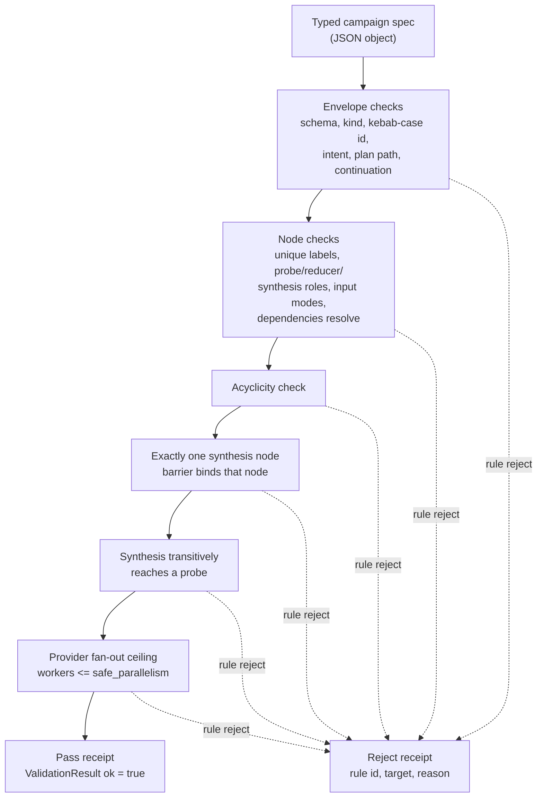

# Engine Room Bridge Campaign DAG

`engine_room_bridge_campaign_dag` is the first disjoint Engine Room capsule. It
imports the macro bridge-campaign contract shape as a public-safe refactor:
validate a typed probe/reducer/synthesis graph, prove the graph is acyclic, make
sure synthesis reaches probe evidence, and reject provider over-parallelism
before any campaign reaches a dispatcher.

Source refs:

- `tools/meta/bridge/bridge_campaign.py`
- `tools/meta/bridge/dispatch_validator.py`
- `tools/meta/bridge/provider_capabilities.py`

## Purpose

A bridge campaign fans one piece of work out across several agent providers,
then folds their outputs back into a single synthesis. The cost of getting the
graph wrong is paid after dispatch: a cycle that never terminates, a synthesis
step that summarises nothing because it does not actually depend on any probe,
or a fan-out that asks one provider for more parallel workers than it can take.
This component answers one question before any of that happens. Is the campaign
graph well formed enough to be safe to run?

The design choice that makes this useful is that it is a validator and nothing
else. `validate_campaign` reads a small JSON spec and returns a list of typed
rule decisions; it never dispatches an agent, calls a provider, or runs a
reducer. The rule ids deliberately mirror the macro contract's CR and VR rule
families, so the public capsule carries a faithful subset of the same checks the
private runtime applies, without carrying the runtime itself.

The check that is worth pausing on is reachability. It is not enough for the
graph to be acyclic and for the node types to be valid. The single synthesis
node must transitively depend on at least one probe, so that the conclusion can
be traced back to evidence rather than to other conclusions. A graph that wires
synthesis only to a reducer with no probe behind it is rejected. That is the
difference between a structure that looks like a campaign and one whose output
is grounded in something the campaign actually gathered.

## Shape



The shape is intentionally pre-dispatch. The module reads a typed campaign
graph, validates node kinds and dependencies, rejects cycles, requires
synthesis paths to reach probe evidence, checks provider fan-out ceilings, and
emits a pass/reject receipt. It does not dispatch bridge workers, call
providers, execute reducers, run synthesis, or prove provider safety.

## Technical Mechanism

The runtime mechanism is a deterministic graph validator in
`src/microcosm_core/engine_room/bridge_campaign_dag.py`. `validate_campaign`
normalizes one campaign JSON object, then emits rule decisions instead of
performing side effects. The rule set checks the input envelope
(`schema_version`, `kind`, kebab-case `campaign_id`, bounded `intent`,
public-looking `plan_path`, and bounded continuation packet), then checks node
structure: unique labels, valid `probe` / `reducer` / `synthesis` roles,
declared dependencies, acyclicity, exactly one synthesis node, barrier binding,
and transitive reachability from synthesis back to at least one probe.

The provider boundary is part of the same mechanism. `SAFE_PARALLELISM` gives a
small local ceiling for `chatgpt`, `claude`, `gemini`, and `local`; rule
`VR005` rejects a request whose worker count exceeds the selected provider
ceiling. Because the validator returns a `ValidationResult` with decision rows,
errors, and warnings, the receipt explains why a graph passed or failed without
dispatching any provider work.

`validate_fixture_dir` is the public proof harness. It loads the four fixture
campaigns, compares each fixture's declared `expected_ok` field against the
observed validator result, and reports `status: pass` only if every positive and
negative case behaves as declared. The positive case is a three-probe graph that
fans into one reducer and one synthesis node. The negative cases are a cycle, a
99-worker provider ceiling violation, and a synthesis path that depends on a
reducer with no probe evidence.

This mechanism sits under the capsule edge
`paper_module.engine_room_bridge_campaign_dag -> mechanism.engine_room_demo.validates_public_engine_room_demo`.
The doctrine relation is intentionally component-shaped: the JSON sidecar
records the existing Engine Room demo mechanism as the subject, the
`concept.import_projection_and_drift_control_bundle` concept, principles
`P-1`, `P-2`, `P-5`, `P-6`, `P-9`, and `P-15`, axioms `AX-1`, `AX-4`,
`AX-5`, and `AX-8`, and the dependency on `paper_module.engine_room_demo`.
Those edges bind the reader projection to source, graph-shape proof, projection
discipline, and authority ceilings without promoting this staged component into
a standalone accepted organ.

## Source-Open Body Floor

The source-open floor for this module is the runnable Engine Room refactor plus
its fixture and test surfaces:

- runtime: `src/microcosm_core/engine_room/bridge_campaign_dag.py`
- standard: `standards/std_microcosm_engine_room_bridge_campaign_dag.json`
- fixture manifest:
  `core/fixture_manifests/engine_room_bridge_campaign_dag.fixture_manifest.json`
- public fixtures:
  `fixtures/first_wave/engine_room_bridge_campaign_dag/input`
- focused tests: `tests/test_engine_room_bridge_campaign_dag.py`
- generated JSON capsule row:
  `paper_modules/engine_room_bridge_campaign_dag.json`

That floor is enough for a reader to replay the public preflight fixtures and
inspect the DAG checks. It is not enough to claim private bridge-runtime parity,
provider safety, campaign execution authority, accepted-organ authority, or
release readiness.

## Claim Ceiling

This capsule is a contract/preflight validator. It does not dispatch agents,
execute campaigns, prove provider safety, authorize release, or claim
equivalence to the private bridge runtime. It is staged under unshared Engine
Room paths while the accepted-organ registry, atlas, runtime shell, and CLI
integration surfaces remain separate authority surfaces. The JSON capsule binds
this module as component evidence for
`mechanism.engine_room_demo.validates_public_engine_room_demo`; it does not
invent a standalone `engine_room_bridge_campaign_dag` organ or mechanism.

## Structured Lattice Bindings

- generated JSON row:
  `paper_modules/engine_room_bridge_campaign_dag.json`.
- current source authority:
  `core/paper_module_capsules.json::paper_modules[87:paper_module.engine_room_bridge_campaign_dag]`
  with `paper_module_payload.source_authority: json_capsule`.
- generated subject/code state:
  component subject
  `mechanism.engine_room_demo.validates_public_engine_room_demo` plus resolved
  code loci `src/microcosm_core/engine_room/bridge_campaign_dag.py` and
  `src/microcosm_core/engine_room/demo.py`.
- generated relationship state:
  capsule-derived subject, concept, principle, axiom, dependency, and code-locus
  edges.
- generated projection state:
  Mermaid `available_from_capsule_edges`; Atlas
  `blocked_until_organ_atlas_owner_lane_binds_edges`; Markdown
  `legacy_import_projection_until_roundtrip_builder`.
- Markdown projection:
  `paper_modules/engine_room_bridge_campaign_dag.md`.
- staged runtime:
  `src/microcosm_core/engine_room/bridge_campaign_dag.py`.
- standard:
  `standards/std_microcosm_engine_room_bridge_campaign_dag.json`.
- fixture manifest:
  `core/fixture_manifests/engine_room_bridge_campaign_dag.fixture_manifest.json`.
- focused tests:
  `tests/test_engine_room_bridge_campaign_dag.py`.
- coverage contract locus:
  the capsule-backed exemption from `ENGINE_ROOM_LEGACY_REENTRY_LOCI` and
  `ENGINE_ROOM_LEGACY_VALIDATION_TESTS` in
  `tests/test_microcosm_paper_module_coverage_contract.py`.

These bindings are capsule authority for the paper-module projection and reader
evidence for the component fixture. The source locus, standard, fixtures, and
tests make the staged DAG validator auditable, while the authority ceiling keeps
provider dispatch, campaign execution, standalone organ admission, release, and
private-root equivalence out of scope.

Public exercise:

```bash
PYTHONPATH=src python3 -m microcosm_core.engine_room.bridge_campaign_dag validate-fixtures \
  --input fixtures/first_wave/engine_room_bridge_campaign_dag/input \
  --json
```

## Validation Receipt Path

The reader-verifiable receipt is the focused pytest plus the paper-module
corpus parity check:

```bash
PYTHONPATH=microcosm-substrate/src ./repo-pytest microcosm-substrate/tests/test_engine_room_bridge_campaign_dag.py -q
cd microcosm-substrate && PYTHONPATH=src ../repo-python scripts/build_doctrine_projection.py --check-paper-module-corpus
```

Passing these commands proves that the public fixture behavior and capsule JSON
projection remain reproducible; it does not execute campaigns, validate reducer
or synthesis correctness, prove provider safety, authorize release, or create a
standalone Engine Room organ.

Positive case: a three-probe campaign fans into one reducer and one synthesis
node. Negative cases: a cycle, a 99-worker provider-ceiling violation, and a
synthesis path that never reaches a probe.

## Named Proof Consumers

- Runtime CLI consumer:
  `PYTHONPATH=src ../repo-python -m microcosm_core.engine_room.bridge_campaign_dag validate-fixtures --input fixtures/first_wave/engine_room_bridge_campaign_dag/input --json`.
  Expected proof shape: `status: pass`, `case_count: 4`, and all fixture
  expectations met.
- Focused regression:
  `PYTHONPATH=src ../repo-python -m pytest -p no:cacheprovider --basetemp=/tmp/microcosm_engine_room_bridge_campaign_dag_pytest tests/test_engine_room_bridge_campaign_dag.py -q`.
  Expected proof shape: the six tests cover the valid campaign, cycle rejection,
  provider ceiling rejection, dangling synthesis rejection, fixture-matrix
  receipt, and CLI JSON receipt.
- Capsule/corpus parity:
  `PYTHONPATH=src ../repo-python scripts/build_doctrine_projection.py --check-paper-module-corpus`.
  Expected proof shape: the generated JSON sidecar remains reproducible from the
  capsule and Markdown projection, with Mermaid available from capsule edges and
  Atlas honestly blocked behind the organ-atlas owner lane.
- Sidecar readback:
  `jq '{source_authority:.paper_module_payload.source_authority, mermaid:.paper_module_payload.generated_projections.mermaid.status, atlas:.paper_module_payload.generated_projections.atlas_card.status, edge_count:(.relationships.edges|length), unresolved:(.relationships.unpopulated_selective_relations|length)}' paper_modules/engine_room_bridge_campaign_dag.json`.
  Expected proof shape: `json_capsule`, `available_from_capsule_edges`,
  `blocked_until_organ_atlas_owner_lane_binds_edges`, resolved capsule edges, and
  zero unpopulated selective relations.

## Reader Evidence Routing

- valid fixture: the typed graph passed public pre-dispatch checks for probes,
  reducer fan-in, and synthesis reachability.
- cycle failure: the local validator rejects a dependency cycle; this is a
  graph-shape proof only, not a statement about every private campaign graph.
- over-parallel failure: the public fixture enforces the declared provider
  capacity ceiling; it is not live provider safety, quota authority, or release
  clearance.
- dangling synthesis failure: synthesis nodes must trace back to probe
  evidence before dispatch is allowed.
- non-proof boundary: no fixture here executes a campaign, dispatches a
  provider, validates reducer output, proves synthesis correctness, creates a
  standalone organ, or flips the generated Atlas card out of the
  organ-atlas-owner lane.

## Public Site Availability Boundary

The public site may expose this page and its generated JSON capsule row as a
reader route. That availability is projection-only: generated site HTML, object
maps, search indexes, and content graphs must come from the existing site
builder reading source Markdown and Microcosm data, not from hand-authored site
output or release copy. Site visibility does not authorize provider dispatch,
campaign execution, standalone organ admission, release, or private-root
equivalence.

## Public-Safe Body Handling

This page may name source paths, fixture ids, standards, tests, receipt paths,
counts, and digest-bearing manifests. It must not embed private macro bodies,
provider payloads, raw operator voice, browser/session state, or live
workspace state. If an exported bundle carries copied public-safe source
modules, those bodies stay in the bundle source-module area and are represented
in reader-facing receipts or cards only by summaries, booleans, counts,
anchors, and hashes.

## Reader Proof Boundary

Read this page as a public reader projection over a staged Engine Room
exercise. The generated JSON row reports
`paper_module_payload.source_authority: json_capsule`; its Mermaid projection is
`available_from_capsule_edges`, while the generated Atlas projection remains
`blocked_until_organ_atlas_owner_lane_binds_edges`. The useful proof is narrow:
the page names the staged public pre-dispatch fixture, source loci, generated
source row, and authority ceiling without claiming provider safety, campaign
execution, release, or private-root equivalence.

## JSON Capsule Binding

This Markdown is a reader projection over the JSON capsule row at
`core/paper_module_capsules.json::paper_modules[87:paper_module.engine_room_bridge_campaign_dag]`.
The generated JSON instance reports
`paper_module_payload.source_authority: json_capsule` and
`source_authority: json_capsule`.

The capsule subject is
`mechanism.engine_room_demo.validates_public_engine_room_demo`. It binds this
module to the accepted Engine Room demo mechanism as component evidence, while
the direct `engine_room_bridge_campaign_dag` organ context stays in source loci
and prose rather than becoming a broad organ-subject claim. The generated Mermaid projection
is available through the capsule edge set. The generated
Atlas projection uses `organ_atlas.engine_room_bridge_campaign_dag` and remains
`blocked_until_organ_atlas_owner_lane_binds_edges` until the organ-atlas owner
binds that card.

The authority ceiling is narrow: this page and its JSON capsule prove a
public-safe bridge-campaign pre-dispatch fixture route for typed campaign
graphs, acyclicity, synthesis reachability, and provider fan-out ceilings. They
do not prove campaign execution, reducer or synthesis correctness, provider
safety, release readiness, private-root equivalence, or source mutation
authority. The proof boundary remains the focused fixture CLI, the focused
pytest validation receipts, and the paper-module corpus parity check.

## JSON Capsule Boundary

This module is now a JSON-capsule-backed paper module, with Markdown remaining
the reader projection rather than source authority. Keep the boundary in three
parts:

- Current authority:
  `core/paper_module_capsules.json::paper_modules[87:paper_module.engine_room_bridge_campaign_dag]`
  is the capsule source row, and `paper_modules/engine_room_bridge_campaign_dag.md`
  is the reader projection.
- Current proof: the runnable source, standard, fixtures, focused tests, and
  Engine Room demo mechanism make the staged pre-dispatch validator inspectable.
- Projection boundary: Mermaid is generated from capsule edges; Atlas remains
  blocked until the organ-atlas owner binds the card. Neither projection is
  hand-authored release evidence.

## Subject Admission Audit

The capsule row binds to an existing resolving mechanism subject:
`mechanism.engine_room_demo.validates_public_engine_room_demo`. The direct
standalone subject audit remains intentionally negative:

- `core/organ_registry.json::implemented_organs` does not contain an accepted
  `engine_room_bridge_campaign_dag` organ.
- `core/mechanism_sources.json::mechanisms` does not contain a
  `mechanism.engine_room_bridge_campaign_dag.*` row.
- `standards/std_microcosm_engine_room_bridge_campaign_dag.json::relationships.used_by_organs`
  is empty and its registry integration status is
  `inventory_only_registered_not_active_v2_promoted`.
- `paper_module.engine_room_demo` names this module as a staged dependency, but
  a downstream dependency edge is not subject admission for the dependency
  module itself.

That is why this page routes readers to the public fixture, source, standard,
test surfaces, and Engine Room demo mechanism without claiming a standalone
organ. A future standalone admission would require a real organ or mechanism
row, followed by a capsule/projection refresh; it is not inferred from this
component capsule.

## Capsule Re-entry Packet

- source authority now:
  `core/paper_module_capsules.json::paper_modules[87:paper_module.engine_room_bridge_campaign_dag]`
  with `paper_module_payload.source_authority: json_capsule`.
- generated row now: `paper_modules/engine_room_bridge_campaign_dag.json`
  reports `paper_module_payload.source_authority: json_capsule`.
- generated projection status now: Mermaid `available_from_capsule_edges`;
  Atlas `blocked_until_organ_atlas_owner_lane_binds_edges`.
- resolved source loci:
  `src/microcosm_core/engine_room/bridge_campaign_dag.py` and
  `src/microcosm_core/engine_room/demo.py`.
- subject edge now:
  `mechanism.engine_room_demo.validates_public_engine_room_demo`, used as
  component evidence without inventing a standalone bridge-campaign mechanism.
- re-entry condition: if a standalone bridge-campaign organ or mechanism is
  later admitted, update the capsule subject through `core/paper_module_capsules.json`
  and regenerate the paper-module corpus/projection; do not infer that edge from
  this page.
- authority ceiling: this page can explain the staged public exercise and source
  loci; it cannot claim provider dispatch, campaign execution, release
  readiness, private-root equivalence, or whole-system correctness.

## Receipt Expectations

A valid future capsule admission or refresh should provide:

- one positive fixture receipt for a probe -> reducer -> synthesis campaign,
- negative fixture receipts for cyclic graphs, provider-ceiling violations, and
  synthesis nodes without probe evidence reachability,
- explicit pass/reject reasons for each fixture case,
- JSON validity for the standard and fixture manifest,
- paper-module corpus readback showing this module's Mermaid status is
  `available_from_capsule_edges` and Atlas remains honestly blocked behind the
  organ-atlas owner lane, and
- release-boundary confirmation that a preflight pass remains graph-contract
  evidence, not provider safety, campaign execution, or release authority.

## Prior Art Grounding

This staged component is grounded in workflow-orchestration prior art that models
work as a directed acyclic graph with typed nodes, dependency edges, fan-in, and
validation before execution. Useful reference points are:

- [Apache Airflow DAGs](https://airflow.apache.org/docs/apache-airflow/2.4.3/core-concepts/dags.html),
  where tasks are grouped into a directed acyclic graph with explicit
  dependencies.
- [BPMN](https://www.omg.org/spec/BPMN/2.0/) and related workflow notation
  traditions, where process graphs separate control-flow structure from the
  concrete execution substrate.

Microcosm borrows the graph validation and pre-dispatch accounting pattern:
acyclicity, evidence reachability, and provider-capacity ceilings are checked
before a campaign can run. This capsule stops at the contract/preflight layer;
it does not dispatch agents or claim provider-safety proof.
