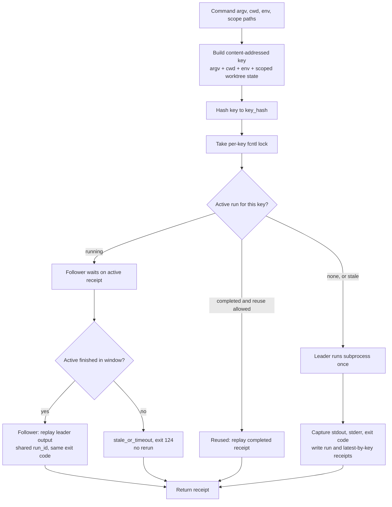

# Engine Room Command-Run Singleflight

This staged Engine Room capsule imports the runnable core of the macro
`system/lib/command_run_singleflight.py` into Microcosm as a public-safe
refactor.

## Purpose

When several agents or background tasks fire the same command at the same
moment, the naive outcome is several identical subprocesses doing the same work
at once. That wastes the machine, and where the command has a side effect it can
corrupt shared state by writing twice. The capsule answers one question: when two
callers ask for the same command at the same time, can the system run it exactly
once and hand the second caller the first caller's captured output?

The approach worth noticing is how it decides that two requests are "the same".
It does not compare command names. It builds a content-addressed key over the
argv, the working directory, a small slice of the environment, and, crucially,
the scoped worktree state. Inside a Git repository that state includes HEAD, the
porcelain status, and the diff and content hashes for the named scope paths.
So two runs of the same command collapse into one only while the code they would
see is identical. Edit a file in scope and the key changes, which forces a fresh
run rather than serving a stale result. The `scope_mutation_changes_key` fixture
exists precisely to pin that behaviour.

The coordination itself is deliberately small: an `fcntl` file lock per key
elects one leader, the leader runs the subprocess and captures its output, and
followers wait and replay that captured stdout, stderr, exit code, and run id
rather than launching their own copy. There is no daemon, no queue, and no
network lock service. The point of the capsule is to show that the collapse and
the content-addressing both hold under a real two-process race, not to stand in
for a scheduler.

## What It Demonstrates

- Content-addressed command keys over argv, cwd digest, selected environment,
  scoped Git dirty state when available, and scoped file-content fallback.
- `fcntl` leader/follower coordination so duplicate active invocations collapse
  to one subprocess execution.
- Completed-run reuse when the caller opts in.
- Captured stdout/stderr replay for followers and reuse receipts.

## Shape



The shape is intentionally local. It proves a duplicate command key can elect
one leader and make followers reuse that leader's captured receipt. It does not
claim a durable queue, daemon, distributed lock, scheduler, or export of the
macro `state/command_runs/` tree.

## Technical Mechanism

The runtime mechanism is a local subprocess singleflight, not a scheduler loop.
`build_command_key` constructs a stable command key from argv, cwd label and
digest, resource class, selected environment, and scoped state. When the cwd is
inside Git, scoped state includes HEAD, porcelain status, binary diff hashes,
staged diff hashes, and scoped file-content hashes; outside Git, the fallback is
the scoped file-content fingerprint. The key hash is therefore an equality
claim over command identity plus selected local state, not over command name
alone.

`run_command_singleflight` uses the key hash to locate a per-key `fcntl` lock,
active receipt, latest receipt, run metadata, stdout file, and stderr file under
the caller-provided state root. Under the lock, the first process writes active
metadata and becomes the leader. A concurrent duplicate sees the active running
metadata and becomes a follower. A caller that explicitly sets
`reuse_completed=True` may replay a completed receipt instead of launching a new
subprocess.

The leader path `_run_leader` starts the subprocess once, writes active/run
metadata, captures stdout and stderr, persists the final exit code, updates the
latest-by-key receipt, and appends leader lifecycle events. The follower path
`_wait_for_active` polls the active receipt until it is completed, then replays
the same stdout, stderr, exit code, and `run_id`; if the active run is stale or
does not finish before the wait window, the follower returns `stale_or_timeout`
with exit code `124` and does not rerun the command. Empty argv is rejected
before key construction.

The public fixture matrix exercises this mechanism through four named cases:
`single_leader`, `completed_reuse`, `scope_mutation_changes_key`, and
`missing_command_rejected`. The focused pytest adds the real OS-process race:
two callers start the same command, the roles resolve to `leader` and
`follower`, both receipts share one `run_id`, both replay `counter=1`, and the
side-effect counter increments exactly once.

## Concurrency Claim

The mechanism is cross-process singleflight, not just memoization. Its cache key
is content-addressed over command identity and scoped state, including Git HEAD,
porcelain status, and scoped dirty-file content when available. That means the
same command can safely reuse or collapse while an edited scoped file creates a
different key and must miss.

The `fcntl` lock is the leader/follower election. The leader executes the
subprocess once and writes the captured receipt; followers wait for the active
run and replay the leader's captured stdout, stderr, return code, and metadata.
The expected regression is a real OS-process race: two callers start with the
same key and the side-effect counter increments exactly once.

The sibling idempotency pattern belongs in `metabolism_runtime`: active work is
deduped with a SQLite partial unique index, while terminal work can be rerun.
Together, the two patterns distinguish "collapse duplicate active execution"
from "cache completed results."

## Claim Ceiling

This is a subprocess singleflight capsule, not a job scheduler, not a daemon,
not a distributed lock service, and not an export of live `state/command_runs/`
state. Its JSON capsule authority is limited to the paper-module relationships
named in `core/paper_module_capsules.json`; it does not claim an accepted organ,
Atlas ownership, release approval, private-root equivalence, source mutation
authority, or whole-system correctness.

## Prior Art Grounding

The organ is directly inspired by duplicate-call suppression and cache-stampede
control patterns, especially Go's singleflight package:

- [`golang.org/x/sync/singleflight`](https://pkg.go.dev/golang.org/x/sync/singleflight),
  which defines a namespace of work where duplicate calls for the same key share
  one in-flight execution.

Microcosm borrows the leader/follower and shared-result shape, then adapts it
to local subprocess runs with content-addressed command identity, scoped
worktree state, captured stdout/stderr replay, and an explicit distinction from
completed-result caching. It is singleflight for command execution, not a
general scheduler or distributed lock service.

## Governing Lattice Relation

This module sits in the Microcosm lattice as a mechanism-backed proof of
duplicate active-command collapse. Its admitted subject is
`mechanism.engine_room_command_run_singleflight.validates_public_command_run_singleflight`,
whose source row names the validating behavior: content-addressed subprocess
keys, `fcntl` leader/follower election, completed-run reuse, scoped
dirty/content fingerprint invalidation, captured stdout/stderr replay, and
empty-command refusal. The Markdown is therefore a reader narrative over that
mechanism row, not an independent source of authority.

The concept edge is
`concept.import_projection_and_drift_control_bundle`: the public refactor
imports the macro `system/lib/command_run_singleflight.py` shape into
Microcosm while keeping the proof surface bounded to fixture inputs, source
refs, and body-free receipts. The capsule's principles
`P-1`, `P-2`, `P-6`, `P-8`, `P-9`, and `P-15`, plus axioms
`AX-1`, `AX-5`, `AX-7`, `AX-8`, and `AX-11`, are the governing relationship
edges reported by the JSON sidecar; this page cites those ids rather than
minting new doctrine to make the module look more complete.

The important dependency edge is
`paper_module.engine_room_metabolism_runtime`. That sibling module shows the
runtime idempotency pattern for active work, while this module isolates the
command-run singleflight pattern. Read together, the pair separates two claims:
active work can be deduped by a stateful runtime, and duplicate subprocess
invocations can be collapsed by a content-addressed key plus per-key lock. The
boundary matters because a green singleflight receipt is not evidence for a
durable scheduler, daemon, or distributed lock service.

Projection status follows the same lattice boundary. The generated Mermaid
projection is available from capsule edges, but the Atlas card remains blocked
until the organ-atlas owner binds `organ_atlas.engine_room_command_run_singleflight`.
The proof consumer for this relation is still
`tests/test_engine_room_command_run_singleflight.py` plus the fixture CLI and
paper-module corpus check named below.

## Structured Lattice Bindings

- generated JSON row:
  `paper_modules/engine_room_command_run_singleflight.json`.
- source authority:
  `core/paper_module_capsules.json::paper_modules[85:paper_module.engine_room_command_run_singleflight]`
  with `paper_module_payload.source_authority: json_capsule`.
- generated subject/code state:
  mechanism subject
  `mechanism.engine_room_command_run_singleflight.validates_public_command_run_singleflight`
  and resolved code locus
  `src/microcosm_core/engine_room/command_run_singleflight.py`.
- generated relationship state:
  capsule-derived subject, law, concept, principle, code-locus, and dependency
  edges. The named dependency is
  `paper_module.engine_room_metabolism_runtime`, which carries the sibling
  idempotency pattern for active-work dedupe.
- generated projection state:
  Mermaid `available_from_capsule_edges`; Atlas
  `blocked_until_organ_atlas_owner_lane_binds_edges`; Markdown
  `legacy_import_projection_until_roundtrip_builder`.
- Markdown projection:
  `paper_modules/engine_room_command_run_singleflight.md`.
- staged runtime:
  `src/microcosm_core/engine_room/command_run_singleflight.py`.
- standard:
  `standards/std_microcosm_engine_room_command_run_singleflight.json`.
- fixture manifest:
  `core/fixture_manifests/engine_room_command_run_singleflight.fixture_manifest.json`.
- focused tests:
  `tests/test_engine_room_command_run_singleflight.py`.
- public example:
  `examples/engine_room_command_run_singleflight/README.md`.
- macro source ref copied into the public refactor:
  `system/lib/command_run_singleflight.py`.

These bindings are evidence routes for a cold reader and a bounded
capsule-authority flip for this paper module. They do not admit a direct organ
subject, bind the organ-atlas card, or expand the fixture beyond local
subprocess singleflight behavior.

## Subject Boundary Audit

The admitted subject is the mechanism row
`mechanism.engine_room_command_run_singleflight.validates_public_command_run_singleflight`.
There is still no accepted `engine_room_command_run_singleflight` organ claim,
and `organ_atlas.engine_room_command_run_singleflight` remains blocked until the
organ-atlas owner binds its edges. The source authority is therefore enough for
Mermaid and lattice walkability, but not enough for organ readiness, Atlas
readiness, scheduler authority, or release approval.

## Reader Evidence Routing

- `role: leader`: this process won the key lock and executed the subprocess.
- `role: follower`: this process attached to the active run and replayed the
  leader's captured stdout, stderr, exit code, and metadata.
- `role: reused`: completed-result reuse occurred because the caller explicitly
  set `reuse_completed`.
- `dirty_fingerprint`: command-key invalidation is scoped to content. The
  `scope_mutation_changes_key` fixture mutates a scoped file and expects a new
  key, so edited scoped content is not laundered into an old singleflight run.
- `status: stale_or_timeout` with exit code `124`: the wrapper refused to rerun
  while an active run failed to finish inside the wait window.
- empty argv rejection: input validation only, not scheduler policy.
- non-proof boundary: these receipts do not prove daemon behavior, distributed
  locking, live `state/command_runs/` export, Atlas ownership, accepted-organ
  status, release readiness, or whole-system correctness.

## Public Exercise

```bash
PYTHONPATH=src python3 -m microcosm_core.engine_room.command_run_singleflight evaluate-fixtures \
  --input fixtures/first_wave/engine_room_command_run_singleflight/input \
  --json
```

The fixture manifest names two positive cases (`single_leader`,
`completed_reuse`) and two negative-boundary cases
(`scope_mutation_changes_key`, `missing_command_rejected`). The expected receipt
is `status: pass`, `case_count: 4`, and `passed_case_count: 4`.

## Validation Receipt Path

The reader-verifiable receipt is the focused pytest plus the paper-module
corpus parity check:

```bash
PYTHONPATH=microcosm-substrate/src ./repo-pytest \
  microcosm-substrate/tests/test_engine_room_command_run_singleflight.py \
  -q --basetemp /tmp/microcosm-command-run-singleflight
cd microcosm-substrate && PYTHONPATH=src python3 scripts/build_doctrine_projection.py --check-paper-module-corpus
```

Passing these commands proves only that the public fixture behavior and
capsule-backed JSON projection remain reproducible; it does not prove scheduler
authority, daemon authority, distributed lock service behavior, release
readiness, or whole-system correctness.

## Named Proof Consumers

The named proof consumer is
`tests/test_engine_room_command_run_singleflight.py`. Its focused tests cover:
scoped file mutation changing the dirty fingerprint; completed-run reuse without
rerunning; concurrent duplicate collapse with one leader, one follower, shared
`run_id`, replayed output, and exactly one side effect; stale active-run timeout
refusal without rerun; empty-command rejection; fixture-matrix parity; and the
module CLI JSON receipt.

The runtime proof consumer is
`microcosm_core.engine_room.command_run_singleflight evaluate-fixtures`, which
loads `fixtures/first_wave/engine_room_command_run_singleflight/input/*.json`
and reports `status`, `case_count`, `passed_case_count`, source refs,
`source_faithful_public_refactor`, claim ceiling, and anti-claims.

The projection proof consumer is
`scripts/build_doctrine_projection.py --check-paper-module-corpus`, which keeps
the capsule-backed Markdown/JSON corpus reproducible while preserving the
generated Mermaid status and the blocked Atlas-card boundary named in the JSON
capsule.

## Public Site Availability Boundary

The public site may expose this page and its generated capsule-backed JSON row as a
reader route. That availability is projection-only: generated site HTML,
object maps, search indexes, and content graphs must come from the existing
site builder reading source Markdown and Microcosm data, not from hand-authored
site output or release copy. Site visibility does not make this page an accepted
organ, bind the Atlas card, or authorize release.

## Public-Safe Body Handling

This page may name source paths, fixture ids, standards, tests, receipt paths,
counts, and digest-bearing manifests. It must not embed private macro bodies,
provider payloads, raw operator voice, browser/session state, or live
workspace state. If an exported bundle carries copied public-safe source
modules, those bodies stay in the bundle source-module area and are represented
in reader-facing receipts or cards only by summaries, booleans, counts,
anchors, and hashes.

## JSON Capsule Binding

This Markdown is a reader projection over the JSON capsule row at
`core/paper_module_capsules.json::paper_modules[85:paper_module.engine_room_command_run_singleflight]`.
The generated JSON instance reports
`paper_module_payload.source_authority: json_capsule` and
`source_authority: json_capsule`.

The capsule subject is
`mechanism.engine_room_command_run_singleflight.validates_public_command_run_singleflight`.
No direct accepted-organ subject is claimed. The generated Mermaid projection
is `available_from_capsule_edges`. The generated Atlas projection uses
`organ_atlas.engine_room_command_run_singleflight` and remains
`blocked_until_organ_atlas_owner_lane_binds_edges` until the organ-atlas owner
binds that card.

The authority ceiling is narrow: this page and its JSON capsule prove a
public-safe command-run singleflight fixture over content-addressed command
keys, leader/follower coordination, completed-run reuse, captured output
replay, and scoped dirty/content fingerprints. They do not prove scheduler
authority, daemon authority, distributed lock service behavior, live
command-run export, provider dispatch, release readiness, private-root
equivalence, or source mutation authority. The proof boundary remains the
focused fixture CLI, the focused pytest validation receipts, and the
paper-module corpus parity check.

## Receipt Expectations

A valid capsule refresh should provide:

- a green fixture receipt with all four public fixture cases passing,
- a concurrent duplicate receipt set where one caller is `leader`, one caller is
  `follower`, both share a `run_id`, and the side-effect counter increments
  exactly once,
- a completed-reuse receipt where `role: reused`, `reused_completed: true`, and
  the original `run_id` is preserved,
- a scoped-mutation receipt showing command-key invalidation after scoped file
  content changes,
- empty-argv rejection evidence with no subprocess execution,
- JSON validity for the standard and fixture manifest,
- corpus readback showing this module's Mermaid status remains
  `available_from_capsule_edges` and its Atlas status remains honest about the
  organ-atlas owner binding requirement, and
- release-boundary confirmation that command-run singleflight remains separate
  from scheduling, daemon, distributed-lock, live-state-export, and release
  authority.

## Integration Status

`status=json_capsule_active_atlas_binding_pending`: capsule authority and
Mermaid/lattice walkability are active; direct organ admission, Atlas card
binding, package-data integration, and release approval remain outside this
paper-module reader page.
