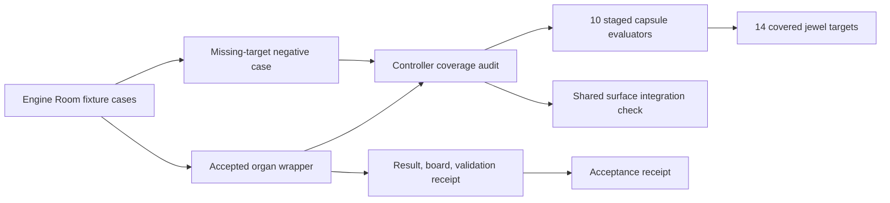

# Engine Room Demo

`engine_room_demo` is the accepted Microcosm composition organ for the staged Engine Room batch. It wraps the public-safe capsules under `microcosm_core.engine_room`, runs the composed demo/audit path, and writes first-wave receipts without promoting fixture rows into private-root or release authority.

## Purpose

The Engine Room batch is ten separate capsules: a Lean proof-search lab, a metabolism runtime, command singleflight, a generated-projection drift gate, a derived-fact engine, a public-projection leak gate, an egress self-compliance gate, a navigation-fitness benchmark, a bridge-campaign DAG, and an annex knowledge router. Each capsule has its own fixture and receipt. This organ exists so that a reader does not have to trust ten claims separately. It answers one question: do the ten capsules together cover the fourteen targets the controller asked for, and does each one still own its full surface and run.

A capsule "owns its surface" only when six files exist for it: module source, fixture input, fixture manifest, paper module, standard, and test. The audit checks all six per capsule, runs each fixture through its declared evaluator, and unions the targets the capsules actually declare against the fourteen the controller expected. A passing run means the set is complete and every fixture executed, not that any single capsule is finished or correct.

The design choice worth noting is in the negative case. Rather than compare against a frozen answer key, the negative fixture recomputes the live set of covered targets and fails only when the fixture names a target that is genuinely outside it. That keeps the refusal honest as the capsule set grows: the test cannot drift into agreement with a stale list, because there is no stored list to agree with.

A second deliberate boundary is that the runner reads the shared organ registry, acceptance file, and atlas, but never writes to them. It reports whether the composition organ is integrated into those shared surfaces as a separate visibility line, and always records `shared_registry_mutated: false`. Composition coverage and shared-registry integration are kept as two distinct facts, so a green demo cannot quietly imply registry authority it does not hold.

## What It Runs

- Verifies the 14 Engine Room jewel targets selected by the controller prompt.
- Checks the owned staged capsule surfaces: module source, fixture input, fixture manifest, paper module, standard, and tests.
- Executes the staged capsule demo through the public fixture chain.
- Observes a negative fixture where an expected target is intentionally absent.

## Shape



The shape is a composition proof over declared public capsules. The wrapper
asks the staged Engine Room runner to verify target coverage, surface presence,
fixture execution, shared-surface visibility, and the missing-target negative
case. It writes public receipts and an acceptance receipt without exporting
private macro run state or turning the staged demo into release authority.

## Technical Mechanism

`src/microcosm_core/organs/engine_room_demo.py` is a receipt-writing wrapper
around `src/microcosm_core/engine_room/demo.py`. The wrapper loads one or more
fixture cases, calls `_evaluate_case` for each case, and writes four body-free
artifacts: result, board, validation receipt, and optional acceptance receipt.
The positive case delegates to `audit_controller_coverage`; the negative case
does not compare against a static answer key, but recomputes the actual staged
target set and fails only when the fixture names a target outside that set.

`audit_controller_coverage` is the mechanism that makes the composition claim
specific. It enumerates the ten `CAPSULES`, unions their declared jewel targets
against `EXPECTED_JEWEL_TARGETS`, checks each capsule's owned source, fixture,
manifest, paper module, standard, and test surface, optionally runs the staged
capsule exercises through `run_demo`, and reads registry, acceptance, and atlas
ids only as visibility evidence. The resulting receipt distinguishes staged
capsule completion from shared-registry integration and always reports
`shared_registry_mutated: false`.

`run_demo` is the execution spine below the audit. It imports each staged
capsule module, calls the declared evaluator (`evaluate_fixture_dir` or
`validate_fixture_dir`), records compact per-capsule status, and summarizes the
covered jewel targets. A pass therefore means the selected public fixture chain
ran for the declared capsule set and covered the expected target lattice; it
does not mean the Engine Room batch is production-ready, privately equivalent,
benchmark-complete, or release-approved.

## Governing Doctrine Relations

The generated sidecar binds this page to
`concept.import_projection_and_drift_control_bundle`,
`mechanism.engine_room_demo.validates_public_engine_room_demo`, and three
adjacent Engine Room mechanisms for projection leakage, generated-projection
drift, and command singleflight. Its governing principle refs are `P-1`, `P-2`,
`P-3`, `P-5`, `P-6`, `P-8`, `P-9`, `P-12`, and `P-15`; its axiom refs are
`AX-1`, `AX-4`, `AX-5`, `AX-7`, `AX-8`, and `AX-11`. In this module those refs
all converge on one rule: composition evidence must be routed through explicit
source, fixture, receipt, and projection boundaries before it can support a
reader claim.

The ten dependency modules are not decorative neighbors. They are the actual
staged Engine Room capsule families consumed by the demo runner:
Lean/proof-search, metabolism runtime, command singleflight, generated
projection drift, derived facts, public projection leak checks, egress
self-compliance, navigation fitness, bridge campaign DAGs, and annex knowledge
routing. The capsule edge set is therefore a mechanism lattice over those
bounded organs, not an invitation to generalize beyond their receipts.

## Named Proof Consumers

- Fixture wrapper consumer:
  `PYTHONPATH=src ../repo-python -m microcosm_core.organs.engine_room_demo run --input fixtures/first_wave/engine_room_demo/input --out /tmp/microcosm-engine-room-demo/fixture --acceptance-out /tmp/microcosm-engine-room-demo/acceptance.json --json`
  consumes `build_result`, the positive controller-audit fixture, the semantic
  missing-target negative case, receipt writing, body-free acceptance output,
  and the module authority ceiling.
- Controller audit consumer:
  `PYTHONPATH=src ../repo-python -m microcosm_core.engine_room.demo audit --root . --json`
  consumes the ten-capsule inventory, 14-target coverage set, staged surface
  checks, shared-surface visibility readback, and the no-shared-mutation
  boundary.
- Staged capsule execution consumer:
  `PYTHONPATH=src ../repo-python -m microcosm_core.engine_room.demo run --root . --json`
  consumes each public capsule evaluator and proves the composition runner can
  execute the declared Engine Room fixture chain without touching shared
  registry, acceptance, atlas, or generated projection surfaces.
- Focused regression consumer:
  `PYTHONPATH=src ../repo-python -m pytest -p no:cacheprovider tests/test_engine_room_demo.py tests/test_engine_room_demo_organ.py -q`
  pins the capsule inventory, CLI JSON output, controller audit, semantic
  negative case, receipt writer, public-relative fixture refs, and private-path
  redaction floor.
- Corpus consumer:
  `PYTHONPATH=src ../repo-python scripts/build_doctrine_projection.py --check-paper-module-corpus`
  checks that this Markdown reader projection remains consistent with the
  generated paper-module sidecar and the capsule-backed corpus. It is a
  read-only receipt for the Markdown slice, not permission to hand-edit
  generated projections.

## Claim Ceiling

This organ validates the declared public composition contract only. It is not production readiness, not private-root equivalence, not a frontier theorem-proving claim, not a complete security proof, not benchmark validation, and not release approval.

## Structured Lattice Bindings

- generated JSON row:
  `paper_modules/engine_room_demo.json`.
- capsule source authority:
  `core/paper_module_capsules.json::paper_modules[31:paper_module.engine_room_demo]`.
- Markdown projection:
  `paper_modules/engine_room_demo.md`.
- resolved organ subject:
  `engine_room_demo`.
- resolved mechanism subject:
  `mechanism.engine_room_demo.validates_public_engine_room_demo`.
- accepted organ wrapper:
  `src/microcosm_core/organs/engine_room_demo.py`.
- staged composition runner:
  `src/microcosm_core/engine_room/demo.py`.
- standard:
  `standards/std_microcosm_engine_room_demo.json`.
- fixture manifest:
  `core/fixture_manifests/engine_room_demo.fixture_manifest.json`.
- focused tests:
  `tests/test_engine_room_demo.py` and `tests/test_engine_room_demo_organ.py`.
- acceptance and atlas surfaces:
  `core/acceptance/first_wave_acceptance.json`, `core/organ_registry.json`, and
  `core/organ_atlas.json`.

These bindings are stronger than a legacy Markdown inventory: the generated
JSON row already reports `source_authority: json_capsule`, Mermaid status
`available_from_capsule_edges`, and Atlas status `linked_from_capsule_edges`.
They still do not prove implementation correctness by themselves; the runtime
receipts and focused tests remain the evidence lane.

## Reader Evidence Routing

Read `expected_jewel_count: 14` and `covered_jewel_count: 14` as controller
target coverage for the staged Engine Room batch. Read `capsule_count: 10` and
`passed_capsule_count: 10` as successful execution of the selected public
fixture evaluators.

Read `shared_registry_mutated: false` as an authority boundary: the staged
runner observes registry, acceptance, and atlas visibility, but it does not
mutate those shared surfaces. Read `shared_integration_status` as a visibility
receipt, not as permission to alter the shared registry from this page.

Read `body_in_receipt: false` as the public-copy boundary. Receipts can expose
counts, target ids, fixture refs, stable error codes, authority ceilings, and
omission-safe summaries; they must not copy private macro run state, provider
payloads, raw operator threads, browser/HUD material, credentials, or cloned
third-party body text.

## Reader Proof Boundary

The proof boundary for this module is the capsule row, the accepted organ
wrapper, the staged composition runner, the fixture manifest, focused tests,
and the body-free receipt set. At the current generated-row projection, the
module reports 32 relationship edges, Mermaid
`available_from_capsule_edges`, Atlas `linked_from_capsule_edges`, and zero
unresolved selective relations. Those counts are projection readback, not a
replacement for the JSON capsule or runtime receipts.

Cold readers should treat the passing composition path as evidence that the
declared Engine Room demo can execute its public fixture and negative case. It
does not prove that every Engine Room target is production-ready, that private
macro state is equivalent to public state, or that release approval exists.

## Public Site Availability Boundary

Public pages may show the staged command, jewel target counts, selected
capsule count, negative-case status, fixture refs, and acceptance receipt refs.
They may also show the generated card payload, mechanism refs, sibling Engine
Room paper-module links, source refs, authority ceilings, negative-case code,
and body-free receipt paths as public-safe projection material.

The source inputs for website availability are the capsule row, this reader
projection, and `paper_modules/engine_room_demo.json`.
`tools/meta/dissemination/build_microcosm_public_site.py` owns the generated
public-site projections. `content-graph.json`, `object-map.json`, search index
rows, `llms.txt`, and HTML pages are routeability projections, not source
authority. Do not hand-edit generated site outputs to make this module visible;
refresh through the existing builder when site ownership is safe.

Site copy may not describe the demo as launched, production-ready,
security-proof, benchmark-complete, release-approved, source-mutation
authority, provider authority, or equivalent to the private root. A visual board
or site card is a navigation layer over the receipt path above.

## Public-Safe Body Handling

The public-safe body rule is body-free receipts plus source refs. Receipts may
name stable ids, refs, hashes, counts, verdicts, and omission receipts. They
must not inline private macro run state, raw operator or provider payloads,
browser/HUD bodies, account/session material, credentials, or copied
third-party body text. If a future fixture needs copied source bodies, the
source-module manifest must carry the exact-copy relation and keep receipt
payloads body-free.

## JSON Capsule Binding

- source_ref:
  `core/paper_module_capsules.json::paper_modules[31:paper_module.engine_room_demo]`
- source_authority: json_capsule
- Projection role: This Markdown is a reader projection of the JSON capsule
  row, not the source authority. The generated Mermaid projection is
  `paper_module.engine_room_demo.mermaid` with status
  `available_from_capsule_edges`, and the generated Atlas projection is
  `organ_atlas.engine_room_demo` with status `linked_from_capsule_edges`.
- proof boundary: the capsule binds the organ subject, the resolved runtime
  source locus, and 32 generated relationship edges. The current generated row
  reports zero unresolved selective relations; future concept, principle,
  axiom, or dependency changes still belong in the JSON capsule owner lane.
- authority ceiling: this page can explain the staged Engine Room composition
  fixture and validation receipts, but it cannot upgrade the public demo into
  production readiness, private-root equivalence, benchmark validation, a
  security proof, release approval, or a wider proof boundary.

## Prior Art Grounding

The organ borrows from integration-testing and CI composition practice: multiple
component checks are assembled into one public demo/audit path, negative
fixtures prove refusal behavior, and receipts summarize execution without
upgrading fixture evidence into release claims. Useful anchors include:

- IBM's [integration testing](https://www.ibm.com/think/topics/integration-testing)
  overview, which frames testing around whether composed modules interact as
  intended.
- [pytest fixtures](https://docs.pytest.org/en/stable/reference/fixtures.html),
  as a common pattern for public synthetic setup and reusable test inputs.
- [GitHub Actions](https://github.com/features/actions), as a widely used
  workflow surface for composing build, test, and publish stages with explicit
  status.

Microcosm borrows the composed-demo and audit-pipeline shape, but keeps the
claim at declared public composition only. It is not production readiness,
private-root equivalence, benchmark validation, a security proof, or release
approval.

## Public Command

```bash
PYTHONPATH=src python3 -m microcosm_core.organs.engine_room_demo run \
  --input fixtures/first_wave/engine_room_demo/input \
  --out receipts/first_wave/engine_room_demo \
  --acceptance-out receipts/acceptance/first_wave/engine_room_demo_fixture_acceptance.json
```

The CLI alias is:

```bash
microcosm engine-room-demo run \
  --input fixtures/first_wave/engine_room_demo/input \
  --out receipts/first_wave/engine_room_demo \
  --acceptance-out receipts/acceptance/first_wave/engine_room_demo_fixture_acceptance.json
```

The fixture manifest names one positive case (`positive_controller_audit`) and
one negative case (`missing_expected_target_negative`) that expects
`ENGINE_ROOM_EXPECTED_TARGET_MISSING`. The expected organ result is
`status: pass`, `expected_jewel_count: 14`, `positive_case_count: 1`,
`negative_case_count: 1`, and `observed_negative_case_count: 1`.

The staged composition runner can also be inspected without writing acceptance
receipts:

```bash
PYTHONPATH=src python3 -m microcosm_core.engine_room.demo audit --root . --json
PYTHONPATH=src python3 -m microcosm_core.engine_room.demo run --root . --json
```

Focused verification from the macro repo root:

```bash
PYTHONPATH=microcosm-substrate/src ./repo-pytest microcosm-substrate/tests/test_engine_room_demo.py microcosm-substrate/tests/test_engine_room_demo_organ.py -q --basetemp /tmp/microcosm-engine-room-demo
cd microcosm-substrate && PYTHONPATH=src python3 scripts/build_doctrine_projection.py --check-paper-module-corpus
```

## Validation Receipt Path

Validate the reader projection from the repo root without mutating durable
receipt or generated projection surfaces:

```bash
PYTHONPATH=microcosm-substrate/src ./repo-pytest microcosm-substrate/tests/test_engine_room_demo.py microcosm-substrate/tests/test_engine_room_demo_organ.py -q --basetemp=/tmp/microcosm_engine_room_demo_pytest
./repo-python microcosm-substrate/scripts/build_doctrine_projection.py --check-paper-module-corpus
```

## Receipt Expectations

A valid future capsule refresh should provide:

- an organ result receipt with all 14 expected Engine Room jewel targets named,
- a controller audit receipt with 10 capsule evaluators and no missing capsule
  surfaces,
- a negative-case receipt containing `ENGINE_ROOM_EXPECTED_TARGET_MISSING`,
- an acceptance receipt for `engine_room_demo_fixture_acceptance.json`,
- `body_in_receipt: false` on result, board, validation, and acceptance
  receipts,
- authority-ceiling fields keeping production readiness, private-root
  equivalence, proof/security expansion, provider dispatch, source mutation,
  publication, and release authority false,
- JSON validity for the standard and fixture manifest,
- corpus readback showing this module remains capsule-backed with Mermaid and
  Atlas projections available, and
- release-boundary confirmation that a passing composition demo is bounded
  public evidence, not launch approval.
