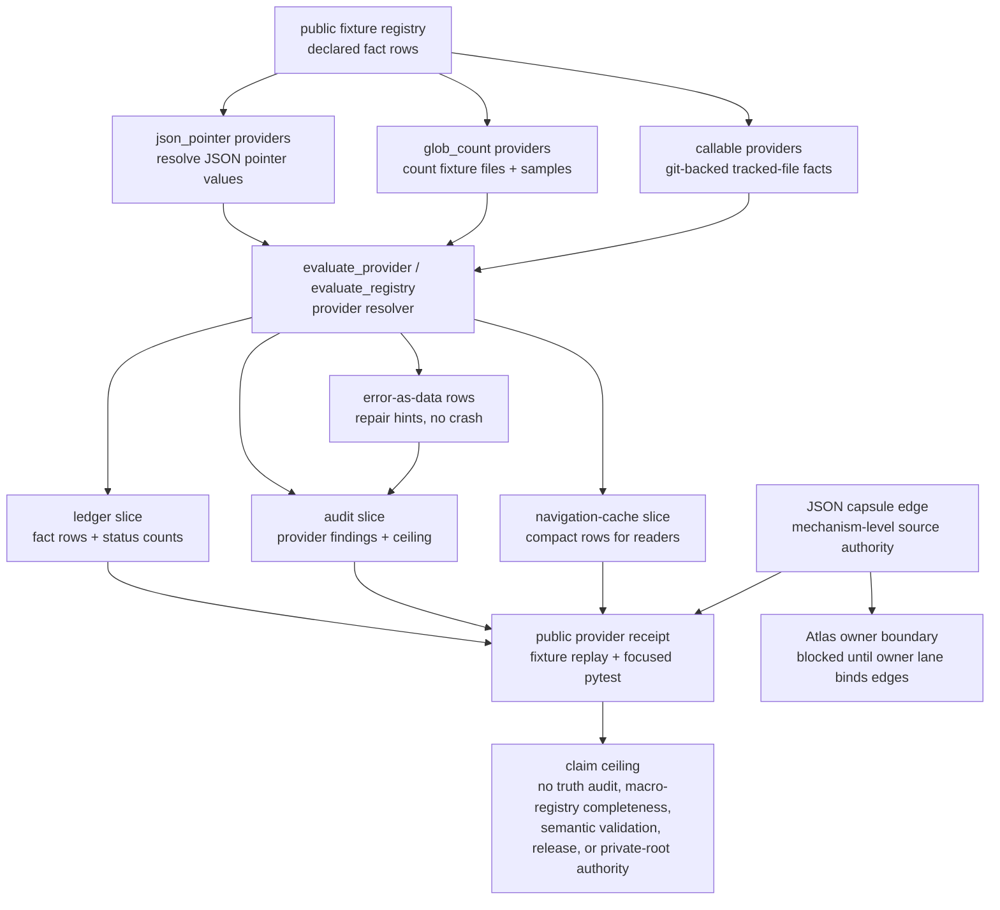

# Engine Room Derived Fact Provider Engine

This staged Engine Room capsule imports the provider side of the macro derived
fact hologram into Microcosm as a runnable public-safe refactor.

## Shape

The module is a staged provider engine over a public fixture registry. It takes
authored fact rows, resolves declared provider types against a supplied root,
and emits receipt slices for ledger, audit, and navigation-cache consumers.
The public body is deliberately small enough for readers to replay: JSON
pointer rows read values from JSON files, glob-count rows count matching
fixture files, and callable rows use the tracked git index for repo-state facts.

The important boundary is provider resolution, not truth adjudication. A clean
receipt means the declared rows resolved against the supplied root and the
receipt carried the expected lineage/accounting fields. It does not prove that
the represented doctrine is true, complete, fresh across the macro registry, or
ready for release.



## What It Demonstrates

- Authored fact registry rows resolve through JSON-pointer providers.
- Glob-count providers count matching public fixture files and preserve sample
  matches for auditability.
- Callable providers can shell through `git ls-files` to bind facts to tracked
  repo state instead of prose memory.
- Provider failures become error-as-data rows with repair hints rather than
  crashing the whole ledger.
- The output shape includes ledger, audit, and navigation-cache slices.

## Source-Open Body Floor

Readers should be able to inspect the public body through these local surfaces:

- `src/microcosm_core/engine_room/derived_fact_provider_engine.py` defines the
  provider resolver, callable map, error-as-data rows, receipt digests, and CLI.
- `tests/test_engine_room_derived_fact_provider_engine.py` checks JSON pointer
  escaping, glob-count samples, git-backed callables, provider failure rows,
  fixture replay, and the module CLI receipt.
- `fixtures/first_wave/engine_room_derived_fact_provider_engine/input` carries
  the replayable public registry cases.
- `core/fixture_manifests/engine_room_derived_fact_provider_engine.fixture_manifest.json`
  binds the fixture set as an inspectable artifact.
- `standards/std_microcosm_engine_room_derived_fact_provider_engine.json` names
  the source-to-target relation, required cases, validator command, and
  authority ceiling.

The macro source refs in the standard are lineage anchors for the public
refactor. They do not turn this Markdown page into source authority; the JSON
capsule row is the source authority, and this Markdown page is the reader
projection over that row.

## Reader Evidence Routing

- fixture CLI: inspect provider behavior over public fixture roots.
- focused pytest: inspect JSON pointer, glob-count, git-callable, error-row,
  fixture, and CLI contract coverage.
- paper-module coverage contract: verify that this slug explains its JSON
  capsule binding with an exact source ref and generated projection boundary.
- doctrine projection check: corpus/parity evidence only; it is not semantic
  fact-audit authority, or proof that macro facts are true.
- non-proof boundary: passing checks show the staged provider exercise is
  replayable and bounded by its authority ceiling. Any later mechanism/organ
  admission must land through its own lane; this paper module currently names a
  staged mechanism subject, not an accepted organ subject.

## Structured Lattice Bindings

- standard: `std_microcosm_engine_room_derived_fact_provider_engine`
- generated JSON row:
  `paper_modules/engine_room_derived_fact_provider_engine.json`
- current source authority:
  `paper_module_payload.source_authority: json_capsule`
- exact source ref:
  `core/paper_module_capsules.json::paper_modules[90:paper_module.engine_room_derived_fact_provider_engine]`
- generated subject/code state:
  mechanism subject
  `mechanism.engine_room_derived_fact_provider_engine.validates_public_derived_fact_provider_engine`;
  source loci
  `src/microcosm_core/engine_room/derived_fact_provider_engine.py` and
  `src/microcosm_core/engine_room/demo.py`
- generated relationship state:
  capsule-backed subject, code-locus, concept, principle, axiom, and dependency
  edges are available from the generated row.
- generated projection state:
  Mermaid `available_from_capsule_edges`; Atlas
  `blocked_until_organ_atlas_owner_lane_binds_edges`; Markdown
  `legacy_import_projection_until_roundtrip_builder`.
- Markdown projection:
  `paper_modules/engine_room_derived_fact_provider_engine.md`
- runtime locus:
  `src/microcosm_core/engine_room/derived_fact_provider_engine.py`
- focused validation:
  `tests/test_engine_room_derived_fact_provider_engine.py`
- fixture manifest:
  `core/fixture_manifests/engine_room_derived_fact_provider_engine.fixture_manifest.json`
- coverage-contract locus:
  `test_all_json_capsule_paper_modules_publish_minimum_binding_contract` in
  `tests/test_microcosm_paper_module_coverage_contract.py`

## Receipt Expectations

Expected closeout receipts for this JSON capsule-backed module are:

- focused pytest passes for JSON pointer, glob-count, git-callable, error-row,
  fixture, and CLI behavior
- fixture CLI emits JSON with `organ_id:
  engine_room_derived_fact_provider_engine` and `status: pass`
- paper-module coverage keeps the slug in the JSON capsule binding contract
- doctrine projection checks do not require a generated corpus update
- release-claim language stays bounded to provider resolution over public
  fixture roots, not doctrine truth, macro-registry completeness, semantic
  claim validation, or release authority

## Claim Ceiling

This is the fact-provider/resolver engine over public fixture roots. It is not
a doctrine truth auditor, not a full export of the macro fact registry, not
semantic claim validation, and not release authority. It is also not JSON
capsule authority by itself for `paper_module.engine_room_derived_fact_provider_engine`;
that authority lives in `core/paper_module_capsules.json`. A clean provider
receipt means the registered facts resolved against the supplied root, while
the generated Mermaid projection comes from capsule edges and the generated
Atlas projection remains blocked until the Atlas owner lane binds those edges.

## Prior Art Grounding

The organ is grounded in database and data-platform patterns where derived
facts are produced from declared sources, materialized for fast reads, and
carried with lineage or freshness metadata:

- [PostgreSQL materialized views](https://www.postgresql.org/docs/16/rules-materializedviews.html),
  where a stored relation is derived from a query and refreshed from source
  data.
- [OpenLineage](https://openlineage.io/) as an open lineage model for recording
  jobs, datasets, and run metadata across data systems.

Microcosm borrows the registered-provider and lineage-accounting pattern: fact
rows declare how they resolve, provider errors become data with repair hints,
and output is shaped for ledger, audit, and navigation-cache consumers. This
does not make the module a doctrine truth auditor or a semantic claim verifier.

## Public Exercise

```bash
PYTHONPATH=src python3 -m microcosm_core.engine_room.derived_fact_provider_engine evaluate-fixtures \
  --input fixtures/first_wave/engine_room_derived_fact_provider_engine/input \
  --json
```

## Validation Receipt Path

The reader-verifiable receipt is the focused pytest plus the paper-module
corpus parity check:

```bash
PYTHONPATH=microcosm-substrate/src ./repo-pytest microcosm-substrate/tests/test_engine_room_derived_fact_provider_engine.py -q
cd microcosm-substrate && PYTHONPATH=src ../repo-python scripts/build_doctrine_projection.py --check-paper-module-corpus
```

Passing these commands proves only that the public fixture behavior and JSON
capsule projection remain reproducible; it does not admit an organ, unblock the
Atlas owner lane, or authorize release.

## Public Site Availability Boundary

The public site may expose this page and its generated JSON capsule row as a
reader route. That availability is projection-only: generated site HTML,
object maps, search indexes, and content graphs must come from the existing
site builder reading source Markdown and Microcosm data, not from hand-authored
site output or release copy. Site visibility does not broaden the capsule into
accepted organ admission, Atlas release authority, private-root equivalence, or
release readiness.

## Public-Safe Body Handling

This page may name source paths, fixture ids, standards, tests, receipt paths,
counts, and digest-bearing manifests. It must not embed private macro bodies,
provider payloads, raw operator voice, browser/session state, or live
workspace state. If an exported bundle carries copied public-safe source
modules, those bodies stay in the bundle source-module area and are represented
in reader-facing receipts or cards only by summaries, booleans, counts,
anchors, and hashes.

## Reader Proof Boundary

Read this page as a public reader projection over a staged Engine Room
exercise. The generated JSON row now reports
`paper_module_payload.source_authority: json_capsule` with exact source ref
`core/paper_module_capsules.json::paper_modules[90:paper_module.engine_room_derived_fact_provider_engine]`.
The useful proof is still narrow: the capsule names a staged mechanism subject,
resolved source loci, public fixtures, the standard, and validation receipts.
It does not prove doctrine truth, macro-registry completeness, accepted organ
admission, whole-system correctness, private-root equivalence, aggregate
doctrine-lattice coverage, or release readiness.

## JSON Capsule Binding

The JSON capsule source authority is
`core/paper_module_capsules.json::paper_modules[90:paper_module.engine_room_derived_fact_provider_engine]`.
This Markdown is a reader projection over that capsule row, not the row itself.
The generated Mermaid projection is `available_from_capsule_edges`; the
generated Atlas projection is
`blocked_until_organ_atlas_owner_lane_binds_edges`. The authority ceiling stays
mechanism-level: validation receipts can show the public provider fixture and
focused pytest behavior, but they do not create accepted organ authority or
release authority.

## Subject Admission Audit

The current capsule row names a mechanism subject, not an organ subject:

- `mechanism.engine_room_derived_fact_provider_engine.validates_public_derived_fact_provider_engine`
  resolves through `core/mechanism_sources.json`.
- `core/organ_registry.json::implemented_organs` does not contain an accepted
  `engine_room_derived_fact_provider_engine` organ, and the capsule does not
  claim one.
- `paper_module.engine_room_demo` names this module as a staged dependency, but
  a downstream dependency edge is not subject admission for the dependency
  module itself.

That is why the proof boundary is mechanism-level. The admissible future
expansion is accepted organ admission or Atlas owner binding, not a Markdown
claim.

## Integration Status

`status=staged_capsule_pending_shared_registry_integration`: shared organ
registry, CLI, atlas, acceptance, package-data, and preflight rows are owned by
another active Microcosm lane at authoring time.
