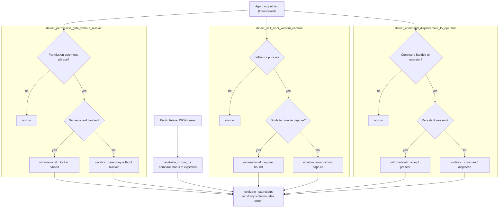

# Engine Room Egress Self-Compliance Gate

`engine_room_egress_self_compliance_gate` carries a public-safe refactor of the
macro egress compliance checks. It scans agent-output text for three failure
classes:

- permission ceremony without a named blocker
- self-error language without a durable Task Ledger/capture binding
- handing a safe command to the operator instead of reporting that it ran

Public exercise:

```bash
PYTHONPATH=src python3 -m microcosm_core.engine_room.egress_self_compliance_gate evaluate-fixtures \
  --input fixtures/first_wave/engine_room_egress_self_compliance_gate/input \
  --json
```

## Purpose

The single question this gate answers is narrow: does a line of agent output
ask the operator to do something the agent should have done itself, or excuse a
mistake without recording it? It exists because the failures it looks for are
the ones that read as good manners. Asking for permission, apologising for an
error, and offering the operator a command to run all look polite in isolation.
Each is also the exact shape of an agent quietly displacing work back onto the
human or letting a self-detected mistake evaporate into prose.

The design choice worth noting is that the gate treats each of those polite
phrases as a tripwire that is a violation by default, and then looks in the
same text for one specific legitimising signal. Permission ceremony is allowed
only if the text also names a real blocker, such as a destructive or
irreversible action, a secret, a publication boundary, or a concurrent-owner
conflict. Self-error language is allowed only if it binds to a durable capture,
such as a capture id or a Task Ledger reference. A handed-over command is
allowed only if the text also reports that the command was run. The polite
phrase is innocent only when accompanied by the evidence that makes it
honest.

This is deliberately phrase membership over the output text, not analysis of
what the agent actually did. The gate cannot tell whether a named blocker is
real or whether a capture id resolves; it only checks that the legitimising
language is present. That keeps the check small, fast, and inspectable, and it
is why the page is careful to say what the gate is not: it is not taint
analysis, not prompt-injection defence, not a sandbox, and not an
information-flow proof. It encodes one operating contract as an output filter
and stops there.

## Shape

The module is a staged Engine Room egress gate, not a general compliance
system. Its public body is the small runtime in
`src/microcosm_core/engine_room/egress_self_compliance_gate.py`, the red/green
fixture matrix under
`fixtures/first_wave/engine_room_egress_self_compliance_gate/input`, and the
focused test file that asserts the three declared detector classes.

The gate produces inspection receipts over agent-output text. A red receipt
means the output matched one of the declared failure classes without the
required repair binding; a green receipt means the narrow phrase-membership
policy did not detect that failure in the supplied text. Neither result proves
semantic compliance, privacy safety, sandbox isolation, or release fitness.



## Technical Mechanism

The runtime mechanism is intentionally small. `evaluate_text` lowercases the
candidate agent-output text, applies three detector functions, and emits a
body-free JSON receipt with source refs, anti-claims, a red/green status, and
per-detector rows. A detector row appears only when its tripwire phrase family
matches; the row becomes a violation when the matching text lacks the required
legitimizer phrase family.

The three detector families correspond exactly to the standard's required
negative cases. `detect_permission_gate_without_blocker` looks for permission
ceremony phrases and accepts them only when the same text names a blocker such
as destructive scope, secrets, a publication boundary, a remote push, a
concurrent-owner conflict, or validation failure. `detect_self_error_without_capture`
looks for self-error phrases and accepts them only when the same text binds the
mistake to a durable capture surface such as a CAP, WorkItem, Task Ledger row,
or quick-capture reference. `detect_command_displacement_to_operator` looks for
safe-command handoff phrases and accepts them only when the same text records
that the agent ran the command or reports an execution receipt.

`evaluate_fixture_dir` is the proof-consumer harness over this mechanism. It
loads the public JSON fixture cases, runs `evaluate_text` for each case,
compares the observed status with `expected_status`, and reports aggregate
`case_count`, `passed_case_count`, and `status`. The focused pytest file pins
one red and one green path for each detector family and verifies that the CLI
returns a JSON receipt with `organ_id:
engine_room_egress_self_compliance_gate` and `status: pass` for the fixture
matrix.

## Source-Open Body Floor

Readers should be able to inspect the public body without private-root access:

- `src/microcosm_core/engine_room/egress_self_compliance_gate.py` defines the
  detector phrases, claim ceiling, fixture evaluation, and JSON CLI.
- `tests/test_engine_room_egress_self_compliance_gate.py` exercises each red and
  green detector case and checks the module CLI receipt.
- `fixtures/first_wave/engine_room_egress_self_compliance_gate/input` carries
  the replayable fixture corpus.
- `core/fixture_manifests/engine_room_egress_self_compliance_gate.fixture_manifest.json`
  binds the fixture set as an inspectable public artifact.
- `standards/std_microcosm_engine_room_egress_self_compliance_gate.json` names
  the authority ceiling and the source-to-target relation.

The source refs in the standard are lineage anchors for the public refactor.
They do not grant this Markdown page source authority; the JSON capsule row is
the source authority, and this Markdown page is the reader projection over that
row.

## Governing Lattice Relation

This module sits in the Engine Room lattice as a staged egress-output gate. It
is downstream of the macro egress-compliance source refs and upstream of
`engine_room_demo`, which treats it as one public capsule in the composed Engine
Room demo. That dependency relation is evidence routing only: the demo can
consume the capsule's fixture receipt, but this module still remains
mechanism-level unless a separate accepted-organ lane promotes it.

The governing standard makes the authority boundary explicit:
`std_microcosm_engine_room_egress_self_compliance_gate` declares the source refs,
public target refs, required negative cases, validator command, and anti-claim.
The JSON capsule binding supplies the source authority for this Markdown
projection, while the paper-module coverage contract verifies that the Markdown
reader surface names the capsule source ref and projection boundary. Following
the repository axiom that JSON is contract and Markdown is projection, the
Markdown can explain the mechanism but cannot widen the standard, mutate the
capsule, promote the subject, or authorize public release.

## Reader Evidence Routing

- fixture CLI: inspect phrase-membership detector behavior over public fixture
  roots.
- focused pytest: inspect the detector matrix and CLI receipt contract.
- paper-module coverage contract: verify that this slug explains its JSON
  capsule binding with an exact source ref and generated projection boundary.
- doctrine projection check: corpus/parity evidence only; it is not accepted
  organ admission.
- non-proof boundary: passing receipts show the staged fixture exercise is
  replayable and that the authority ceiling stayed intact. They do not prove
  semantic compliance, taint analysis, sandboxing, prompt-injection defense,
  information-flow control, release readiness, JSON capsule authority, or
  accepted organ admission.

## Claim Ceiling

This module may claim that Microcosm has a staged public exercise for checking
three declared Engine Room egress-output failure classes against replayable
fixtures. The valid claim is bounded to phrase-membership policy over supplied
agent-output text, public fixture receipts, the focused pytest matrix, and the
JSON capsule binding coverage contract.

The module must not claim accepted organ resolution, release readiness,
private-root equivalence, semantic compliance, taint analysis, sandbox
enforcement, prompt-injection defense, information-flow control, provider
authority, source mutation authority, or aggregate doctrine-lattice coverage.
The current JSON capsule authority is mechanism-level and projection-bound.

## Limitations

The mechanism is a phrase-membership gate. It can miss a real egress failure
when the output avoids the configured tripwire phrases, and it can flag benign
text when a tripwire phrase appears in a different context. The implementation
does not parse intent, analyze data flow, prove sandbox isolation, inspect
provider payloads, or reason over hidden workspace state.

The fixture matrix is deliberately narrow. Passing fixtures show that the three
declared detector families and their red/green examples still execute through
the public CLI and focused tests; they do not show that every future agent
output is safe, that the macro hook behavior is equivalent, or that the public
refactor covers all egress compliance policy.

The authority boundary is also narrow. The standard and JSON capsule make this
a staged public capsule with mechanism-level authority. The module cannot
promote itself into an accepted organ, activate shared registry integration,
authorize generated projection edits, or claim release readiness. Any wider
claim requires a separate owner lane with validator, receipt, and registry
evidence.

## Structured Lattice Bindings

- standard: `std_microcosm_engine_room_egress_self_compliance_gate`
- generated JSON row:
  `paper_modules/engine_room_egress_self_compliance_gate.json`
- current source authority:
  `paper_module_payload.source_authority: json_capsule`
- exact source ref:
  `core/paper_module_capsules.json::paper_modules[90:paper_module.engine_room_egress_self_compliance_gate]`
- generated subject/code state:
  mechanism subject
  `mechanism.engine_room_egress_self_compliance_gate.validates_public_egress_self_compliance_gate`;
  source loci
  `src/microcosm_core/engine_room/egress_self_compliance_gate.py` and
  `src/microcosm_core/engine_room/demo.py`
- generated relationship state:
  capsule-backed subject, code-locus, concept, principle, axiom, and dependency
  edges are available from the generated row.
- generated projection state:
  Mermaid `available_from_capsule_edges`; Atlas
  `blocked_until_organ_atlas_owner_lane_binds_edges`; Markdown
  `legacy_import_projection_until_roundtrip_builder`.
- Markdown projection:
  `paper_modules/engine_room_egress_self_compliance_gate.md`
- runtime locus:
  `src/microcosm_core/engine_room/egress_self_compliance_gate.py`
- focused validation:
  `tests/test_engine_room_egress_self_compliance_gate.py`
- fixture manifest:
  `core/fixture_manifests/engine_room_egress_self_compliance_gate.fixture_manifest.json`
- coverage-contract locus:
  `test_all_json_capsule_paper_modules_publish_minimum_binding_contract` in
  `tests/test_microcosm_paper_module_coverage_contract.py`

## Receipt Expectations

Expected closeout receipts for this JSON capsule-backed module are:

- focused pytest passes for the detector matrix and CLI receipt
- fixture CLI emits JSON with `organ_id:
  engine_room_egress_self_compliance_gate` and `status: pass`
- paper-module coverage keeps the slug in the JSON capsule binding contract
- doctrine projection checks do not require a generated corpus update
- release-claim language remains bounded to phrase-membership policy and staged
  public exercise behavior

## Validation Receipt Path

The reader-verifiable receipt is the focused pytest plus the paper-module
corpus parity check:

```bash
PYTHONPATH=microcosm-substrate/src ./repo-pytest microcosm-substrate/tests/test_engine_room_egress_self_compliance_gate.py -q
cd microcosm-substrate && PYTHONPATH=src ../repo-python scripts/build_doctrine_projection.py --check-paper-module-corpus
```

Passing these commands proves only that the public fixture behavior and JSON
capsule projection remain reproducible; it does not admit an organ, unblock the
Atlas owner lane, or authorize release.

The fixture matrix includes red and green cases for each detector. The source
refs are `system/lib/egress_compliance.py` and the public-safe Stop-hook wiring
anchor `.claude/hooks/runtime_hook.py`.

Authority ceiling: this is explicit phrase-membership policy, not taint
analysis, prompt-injection defense, sandboxing, or information-flow control. It
does not authorize release or claim private-root equivalence.

## Public Site Availability Boundary

The public site may expose this page and its generated JSON capsule row as a
reader route. That availability is projection-only: generated site HTML,
object maps, search indexes, and content graphs must come from the existing
site builder reading source Markdown and Microcosm data, not from hand-authored
site output or release copy. Site visibility does not broaden the capsule into
accepted organ admission, Atlas release authority, private-root equivalence, or
release readiness.

## Public-Safe Body Handling

This page may name source paths, fixture ids, standards, tests, receipt paths,
counts, and digest-bearing manifests. It must not embed private macro bodies,
provider payloads, raw operator voice, browser/session state, or live
workspace state. If an exported bundle carries copied public-safe source
modules, those bodies stay in the bundle source-module area and are represented
in reader-facing receipts or cards only by summaries, booleans, counts,
anchors, and hashes.

## Reader Proof Boundary

Read this page as a public reader projection over a staged Engine Room
exercise. The generated JSON row now reports
`paper_module_payload.source_authority: json_capsule` with exact source ref
`core/paper_module_capsules.json::paper_modules[90:paper_module.engine_room_egress_self_compliance_gate]`.
The useful proof is still narrow: the capsule names a staged mechanism subject,
resolved source loci, public fixtures, the standard, and validation receipts.
It does not prove semantic compliance, taint analysis, sandbox enforcement,
prompt-injection defense, accepted organ admission, whole-system correctness,
aggregate doctrine-lattice coverage, or release readiness.

## JSON Capsule Binding

The JSON capsule source authority is
`core/paper_module_capsules.json::paper_modules[90:paper_module.engine_room_egress_self_compliance_gate]`.
This Markdown is a reader projection over that capsule row, not the row itself.
The generated Mermaid projection is `available_from_capsule_edges`; the
generated Atlas projection is
`blocked_until_organ_atlas_owner_lane_binds_edges`. The authority ceiling stays
mechanism-level: validation receipts can show the public egress-gate fixture
and focused pytest behavior, but they do not create accepted organ authority or
release authority.

## Subject Admission Audit

The current capsule row names a mechanism subject, not an organ subject:

- `mechanism.engine_room_egress_self_compliance_gate.validates_public_egress_self_compliance_gate`
  resolves through `core/mechanism_sources.json`.
- `core/organ_registry.json::implemented_organs` does not contain an accepted
  `engine_room_egress_self_compliance_gate` organ, and the capsule does not
  claim one.
- `paper_module.engine_room_demo` names this module as a staged dependency, but
  a downstream dependency edge is not subject admission for the dependency
  module itself.

That is why the proof boundary is mechanism-level. The admissible future
expansion is accepted organ admission or Atlas owner binding, not a Markdown
claim.

## Prior Art Grounding

The organ borrows from policy-as-code and output-gate traditions: make a policy
machine-readable, evaluate an artifact before it leaves a boundary, and return a
specific failure class instead of relying on prose judgment alone. Relevant
anchors include:

- [Open Policy Agent](https://www.openpolicyagent.org/docs/latest), a general
  policy engine that externalizes policy decisions from application code.
- [NIST SP 800-53 Rev. 5](https://doi.org/10.6028/NIST.SP.800-53r5), especially
  the broader audit, accountability, and information-output control tradition.

Microcosm narrows that pattern to explicit phrase-membership checks over
agent-output text. The gate is intentionally small: it catches declared
egress-failure classes and binds them to durable repair expectations; it does
not perform taint analysis, sandbox enforcement, prompt-injection defense, or
general information-flow control.
