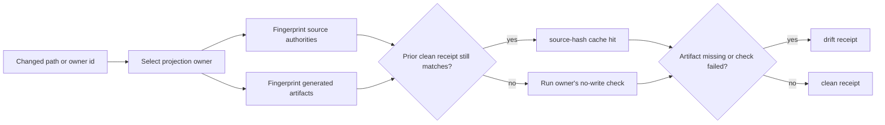

# Engine Room Generated Projection Drift Gate

This staged Engine Room capsule imports the generated-projection drift control
shape into Microcosm as a public-safe refactor.

## Purpose

A repository that commits generated files alongside their sources has a standing
problem: a generated artifact can quietly fall out of step with the source it
was built from, and nothing fails until a reader trusts a stale file. This
capsule answers one question. For a given set of changed paths, which generated
artifacts might now be out of date, and is the owner's own check still passing?

The unusual choice is owner routing rather than a global snapshot. Each
generated surface is modelled as a `ProjectionOwner` row that names its
artifacts, its source authorities, and a no-write check command that is treated
as the drift authority for that surface. A changed path is matched against those
patterns, so a small edit selects only the owners it could plausibly affect
instead of rerunning every builder in the repository. The check command itself,
not this gate, decides whether a surface is fresh. The gate's job is to route to
the right owner and record the evidence honestly.

Two properties keep that honest. The skip cache is deliberately strict: a prior
clean receipt is reused only when the source hash, the artifact hash, the check
command, and artifact presence all still match, so any drift in any of those
falls back to actually running the check. And a missing artifact counts as drift
on its own, even when the owner's check command would pass, so an absent
generated file cannot be laundered by a green command. The result is a freshness
signal for declared owners, not a claim that every generated surface in the wider
system is semantically correct.

## What It Demonstrates

- Projection owners declare artifacts, source authorities, no-write checks, and
  repair commands.
- Changed-path scoping selects the responsible owner instead of sweeping every
  generated surface.
- Source and artifact files are content-addressed with `sha256` fingerprints.
- Prior clean receipts skip repeat checks only when source hash, artifact hash,
  check command, and artifact presence still match.
- Missing artifacts drift even if an owner check command would otherwise pass.
- A planted artifact byte is rejected when the owner's check command detects the
  mismatch.

## Shape



The important property is owner routing, not global sweeping. A changed path
selects the relevant owner row, the owner row names the artifact/source
patterns and no-write check, and the receipt records why the owner was checked
or skipped. The gate can prove that a declared owner check was current for a
fixture root; it cannot prove every generated surface in the macro system is
semantically fresh.

## Claim Ceiling

This is an owner-routed generated projection drift gate over declared artifacts,
source authorities, clean-receipt fingerprints, and no-write check command
return codes. It is not semantic drift proof, not full macro registry
validation, not repair authority, and not release authority. The long-tail
macro registry must still be judged by each owner's real check command.

## Prior Art Grounding

The organ is grounded in reproducible-build and regression-testing practices:
declare source inputs, produce generated artifacts, compare content hashes, and
rerun the owner check when either source or artifact identity changes. Useful
prior-art anchors include:

- [Bazel hermeticity](https://bazel.build/concepts/hermeticity), especially the
  emphasis on declared inputs, source identity, repeatable actions, and cache
  validity.
- [pytest-regtest snapshot testing](https://pytest-regtest.readthedocs.io/en/stable/snapshots/),
  where recorded outputs are compared against reference outputs to detect
  unexpected changes.

Microcosm borrows the declared-input and artifact-fingerprint discipline, then
routes drift checks through the projection owner instead of treating all
generated files as one global snapshot. The receipt proves owner-check
freshness for declared artifacts; it is not semantic drift proof or release
authority.

## Structured Lattice Bindings

- source capsule:
  `core/paper_module_capsules.json::paper_modules[85:paper_module.engine_room_generated_projection_drift_gate]`.
- generated JSON row:
  `paper_modules/engine_room_generated_projection_drift_gate.json`.
- current source authority:
  `paper_module_payload.source_authority: json_capsule`.
- resolving mechanism subject:
  `mechanism.engine_room_generated_projection_drift_gate.validates_public_generated_projection_drift_gate`.
- generated mechanism row:
  `mechanisms/mechanism.engine_room_generated_projection_drift_gate.validates_public_generated_projection_drift_gate.json`.
- Markdown projection:
  `paper_modules/engine_room_generated_projection_drift_gate.md`.
- runtime:
  `src/microcosm_core/engine_room/generated_projection_drift_gate.py`.
- standard:
  `standards/std_microcosm_engine_room_generated_projection_drift_gate.json`.
- fixture manifest:
  `core/fixture_manifests/engine_room_generated_projection_drift_gate.fixture_manifest.json`.
- focused tests:
  `tests/test_engine_room_generated_projection_drift_gate.py`.
- source refs copied into the public refactor:
  `tools/meta/control/projection_drift.py` and
  `system/lib/generated_projection_registry.py`.

These bindings now close the paper-module required-subject gap through a
mechanism subject and capsule-backed code locus. They do not create an accepted
organ, package-data row, release approval, repair authority, private-root
equivalence, or semantic proof that every generated projection owner in the
source system is fresh.

## Reader Evidence Routing

Read `status: clean` as "all selected owner rows had required artifacts present
and either a current matching clean receipt or a passing no-write check." Do not
read it as proof that generated prose is semantically correct, that every macro
registry owner is valid, or that a repair command should run.

Read `source_hash_cache.hit_count` as bounded skip evidence: source hash,
artifact hash, artifact presence, and check command all matched a prior clean
receipt. If any of those change, the command path is the evidence lane again.

Read `status_reasons: ["artifact_missing"]` as drift even when a check command
would pass. The artifact presence check is part of the authority boundary; a
missing generated output cannot be laundered by a passing owner command.

## Public Exercise

```bash
PYTHONPATH=src python3 -m microcosm_core.engine_room.generated_projection_drift_gate evaluate-fixtures --input fixtures/first_wave/engine_room_generated_projection_drift_gate/input --json
```

The fixture manifest names two positive cases (`clean_owner`,
`scoped_changed_path`) and two negative cases (`planted_byte_detected`,
`missing_artifact`). The expected receipt is `status: pass`, `case_count: 4`,
and `passed_case_count: 4`.

## Validation Receipt Path

The reader-verifiable receipt is the focused pytest plus the paper-module
corpus parity check:

```bash
PYTHONPATH=microcosm-substrate/src ./repo-pytest microcosm-substrate/tests/test_engine_room_generated_projection_drift_gate.py -q --basetemp /tmp/microcosm-generated-projection-drift-gate
cd microcosm-substrate && PYTHONPATH=src python3 scripts/build_doctrine_projection.py --check-paper-module-corpus
```

Passing these commands proves that the public fixture behavior and
capsule-backed JSON projection remain reproducible. It does not prove semantic
freshness for all generated surfaces, does not run repair commands, and does
not authorize release.

## Public Site Availability Boundary

The public site exposes this module through generated site HTML, object maps,
search indexes, content graphs, source pages, and `llms.txt` entries produced
by `tools/meta/dissemination/build_microcosm_public_site.py`. That availability
is projection-only: the website reads the Microcosm source rows and Markdown,
but it is not a second source of truth and it does not authorize release.

## Public-Safe Body Handling

This page may name source paths, fixture ids, standards, tests, receipt paths,
counts, and digest-bearing manifests. It must not embed private macro bodies,
provider payloads, raw operator voice, browser/session state, or live
workspace state. If an exported bundle carries copied public-safe source
modules, those bodies stay in the bundle source-module area and are represented
in reader-facing receipts or cards only by summaries, booleans, counts,
anchors, and hashes.

## Reader Proof Boundary

Read this page as a public reader projection over a mechanism-backed Engine
Room exercise. The generated JSON row now reports
`paper_module_payload.source_authority: json_capsule`, and its Mermaid
projection is `available_from_capsule_edges`. The atlas-card projection remains
below accepted-organ authority because this capsule names a mechanism subject,
not an accepted organ. The useful proof is fixture behavior, source/code
binding, and public-safe projection availability; not release readiness or
whole-system correctness.

## JSON Capsule Binding

`core/paper_module_capsules.json::paper_modules[85:paper_module.engine_room_generated_projection_drift_gate]`
contains `paper_module.engine_room_generated_projection_drift_gate` with one
resolving subject:

```json
{"kind": "mechanism", "ref": "mechanism.engine_room_generated_projection_drift_gate.validates_public_generated_projection_drift_gate"}
```

The capsule also names the runtime locus
`src/microcosm_core/engine_room/generated_projection_drift_gate.py` and the
symbols that evaluate fixture cases, select owners, fingerprint sources and
artifacts, and emit bounded receipts. Generated files under
`paper_modules/`, `mechanisms/`, `atlas/`, and `sites/microcosm/` are
projections from that source authority.

This Markdown is a reader projection: JSON remains source authority, the
generated Mermaid projection and generated Atlas projection are projections
only, validation receipts are bounded evidence, and the authority ceiling and
proof boundary exclude release readiness and whole-system correctness.

## Subject Admission Audit

A resolving mechanism subject is now admitted; accepted-organ authority is not:

- `core/organ_registry.json::implemented_organs` does not contain an accepted
  `engine_room_generated_projection_drift_gate` organ.
- `core/mechanism_sources.json::mechanisms` contains
  `mechanism.engine_room_generated_projection_drift_gate.validates_public_generated_projection_drift_gate`.
- `standards/std_microcosm_engine_room_generated_projection_drift_gate.json::relationships.used_by_organs`
  is empty and its registry integration status is
  `inventory_only_registered_not_active_v2_promoted`.
- `paper_module.engine_room_demo` names this module as a staged dependency, and
  the mechanism subject now gives this dependency module its own capsule
  authority.

Further re-entry is organ admission or atlas/package-data integration, not
paper-module subject repair. Any such step must add real registry authority,
regenerate projections, and preserve the same claim ceiling.

## Receipt Expectations

A valid refresh or future organ admission should provide:

- a green fixture receipt with all four public fixture cases passing,
- a clean owner receipt for the selected path or owner id, or a drift receipt
  that names the exact failed owner and `status_reasons`,
- source/artifact fingerprints with missing artifact counts preserved,
- no-write check command return codes and hash-only stdout/stderr receipts,
- source-hash cache accounting when a prior clean receipt is used,
- JSON validity for the standard and fixture manifest,
- corpus readback showing this module's Mermaid status remains
  `available_from_capsule_edges` and required-subject gap membership remains
  false, and
- release-boundary confirmation that projection freshness remains separate from
  release, repair, and semantic-proof authority.

## Integration Status

`status=mechanism_backed_capsule_available_from_generated_site`: the mechanism
and paper-module capsule are source authority for this exercise, and the public
site builder exposes the material through existing generated feeds and pages.
Organ registry, package data, release, repair, and semantic-proof claims remain
out of scope.
