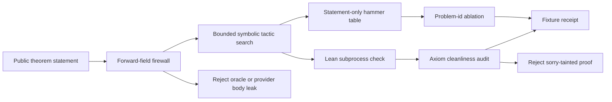

# Engine Room Lean Proof-Search Lab

This staged Engine Room capsule imports the macro prover-lab contour into a
runnable public-safe Lean fixture lab.

## Purpose

The hard problem with any proof-search tool is not finding a proof. It is
trusting that a reported success was earned rather than leaked or memorised. A
search loop can quietly copy the answer out of an oracle field, learn to map a
problem id to a stored tactic, or compile a file that secretly leans on `sorry`.
Each of those produces a green result that means nothing. This lab exists to
answer one question: when a tiny public theorem is reported solved, did the
search actually close it, and does the installed Lean kernel agree on clean
axioms?

The approach is to keep candidate generation cheap and untrusted, and to move
all authority to the kernel. Candidate tactic bodies are generated from the
shape of the statement alone (an `Or p q -> Or q p` goal draws an `Or.inl` /
`Or.inr` case split, an equality draws `rfl`, and so on), then each candidate is
written to a temporary `.lean` file and checked by a real `lean` subprocess. A
result counts only when the process exits zero and a `#print axioms` audit
reports the theorem depends on no axioms, with no `sorry` in the body. Generation
proposes; Lean decides.

What is unusual is how much of the lab is built to refuse false credit rather
than to score success. Three guards run alongside the search. A forward firewall
walks every input row and rejects it outright if it carries a `candidate_body`,
`oracle_body`, `repair_body`, `oracle_needed_premise_ids`, or `provider_text`
field, so the answer can never be smuggled in as a hint. A problem-id ablation
renames each theorem and its id, then checks that the policy picks the same
action and reaches the same outcome, which catches a policy that has secretly
learned the id instead of the goal. The axiom gate rejects `sorry`-tainted
candidates even when Lean compiles the file. The lab passes only when every
problem is genuinely closed, the firewall is clean, the ablation is stable, and
no axiom taint is found.

## Shape



The shape is a small public proof-search lab, not a prover product. It reads
tiny Lean theorem statements, rejects forward oracle/provider fields, tries
bounded symbolic tactic bodies, checks candidates with the installed Lean
kernel, records statement-only action scores, runs a problem-id ablation, and
rejects `sorry`-tainted outputs through a `#print axioms` gate.

## What It Demonstrates

- Tiny public theorem statements are solved by bounded symbolic candidate
  search and checked with the installed `lean` executable.
- Statement-only hammer rows compile tactic candidates without crediting
  adapter candidates or oracle repair bodies.
- The forward manifest rejects `candidate_body`, oracle, repair, and provider
  text fields before any solver result can count.
- A problem-id ablation renames ids and theorem names, then verifies the blind
  policy keeps the same action signature and success behavior.
- A `#print axioms` gate rejects `sorry`-tainted candidates even when Lean
  returns success for the file.

## Source-Open Body Floor

The source-open floor for this module is the staged Engine Room lab plus its
fixture and test surfaces:

- runtime: `src/microcosm_core/engine_room/lean_proof_search_lab.py`
- standard: `standards/std_microcosm_engine_room_lean_proof_search_lab.json`
- fixture manifest:
  `core/fixture_manifests/engine_room_lean_proof_search_lab.fixture_manifest.json`
- public fixtures:
  `fixtures/first_wave/engine_room_lean_proof_search_lab/input`
- focused tests: `tests/test_engine_room_lean_proof_search_lab.py`
- generated placeholder JSON row:
  `paper_modules/engine_room_lean_proof_search_lab.json`

That floor lets a reader replay the public fixture matrix and inspect the
firewall, symbolic candidate search, Lean check, ablation, and axiom audit. It
does not expose private macro prover run state, oracle repair bodies, provider
payloads, online-RL traces, or frontier-scale theorem-proving claims. It also
does not make this Markdown page source authority; the JSON capsule row is the
source authority, and this Markdown page is the reader projection over that
row.

## Prior Art Grounding

This organ is grounded in the interactive-theorem-proving pattern where proof
automation proposes small tactic scripts and the kernel remains the authority.
[Theorem Proving in Lean 4](https://lean-lang.org/theorem_proving_in_lean4/Tactics/)
is the direct precedent for tactic-structured proof construction, while the
Lean/mathlib ecosystem shows why small checked theorem statements, reusable
libraries, and tactic automation are treated as inspectable proof artifacts
rather than prose claims.

The statement-only candidate search is also adjacent to "hammer" workflows
such as Isabelle
[Sledgehammer](https://isabelle.in.tum.de/doc/sledgehammer.pdf): external or
bounded search can suggest proof steps, but the trusted proof assistant must
replay or check the result. Microcosm keeps the same separation at toy scale:
candidate generation is public fixture behavior; Lean execution and the
`#print axioms` audit decide what may count.

## Claim Ceiling

This is a bounded symbolic prover lab over tiny public fixtures. It is not a
neural theorem prover, not frontier-scale math automation, not online-RL bandit
search, and not an export of private macro prover run state. Easy goals are
handled by deterministic tactic templates and Lean itself. The JSON capsule
authority for `paper_module.engine_room_lean_proof_search_lab` lives in
`core/paper_module_capsules.json`; the generated Mermaid projection comes from
capsule edges and the generated Atlas projection remains blocked until the
Atlas owner lane binds those edges.

## Structured Lattice Bindings

- generated JSON row:
  `paper_modules/engine_room_lean_proof_search_lab.json`.
- current source authority:
  `paper_module_payload.source_authority: json_capsule`.
- exact source ref:
  `core/paper_module_capsules.json::paper_modules[91:paper_module.engine_room_lean_proof_search_lab]`.
- generated subject/code state:
  mechanism subject
  `mechanism.engine_room_lean_proof_search_lab.validates_public_lean_proof_search_lab`;
  source loci
  `src/microcosm_core/engine_room/lean_proof_search_lab.py` and
  `src/microcosm_core/engine_room/demo.py`.
- generated relationship state:
  capsule-backed subject, code-locus, concept, principle, axiom, and dependency
  edges are available from the generated row.
- generated projection state:
  Mermaid `available_from_capsule_edges`; Atlas
  `blocked_until_organ_atlas_owner_lane_binds_edges`; Markdown
  `legacy_import_projection_until_roundtrip_builder`.
- Markdown projection:
  `paper_modules/engine_room_lean_proof_search_lab.md`.
- staged runtime:
  `src/microcosm_core/engine_room/lean_proof_search_lab.py`.
- standard:
  `standards/std_microcosm_engine_room_lean_proof_search_lab.json`.
- fixture manifest:
  `core/fixture_manifests/engine_room_lean_proof_search_lab.fixture_manifest.json`.
- focused tests:
  `tests/test_engine_room_lean_proof_search_lab.py`.
- coverage contract loci:
  `ENGINE_ROOM_LEGACY_REENTRY_LOCI` and
  `ENGINE_ROOM_LEGACY_VALIDATION_TESTS` in
  `tests/test_microcosm_paper_module_coverage_contract.py`.

These bindings are reader evidence, not capsule authority. They point from the
Markdown page to the public runtime, fixture, standard, tests, and JSON capsule
row while keeping Atlas release blocked until the organ-atlas owner lane binds
edges.

## Public Exercise

```bash
PYTHONPATH=src python3 -m microcosm_core.engine_room.lean_proof_search_lab evaluate-fixtures \
  --input fixtures/first_wave/engine_room_lean_proof_search_lab/input \
  --json
```

## Validation Receipt Path

The reader-verifiable receipt is the focused pytest plus the paper-module
corpus parity check:

```bash
PYTHONPATH=microcosm-substrate/src ./repo-pytest microcosm-substrate/tests/test_engine_room_lean_proof_search_lab.py -q
cd microcosm-substrate && PYTHONPATH=src ../repo-python scripts/build_doctrine_projection.py --check-paper-module-corpus
```

Passing these commands proves only that the public fixture behavior and JSON
capsule projection remain reproducible; it does not admit an organ, unblock the
Atlas owner lane, or authorize release.

## Reader Evidence Routing

- positive symbolic fixture: two tiny public Lean statements were solved by
  bounded symbolic tactic search and checked by Lean.
- oracle-field failures: firewall evidence only. Forward `candidate_body`,
  `oracle_body`, `provider_text`, repair-body, and provider payload fields
  cannot enter the public solver path.
- memorized-policy failure: an ablation guard. It shows problem-id conditioning
  is rejected when renaming changes the action signature, not that all
  memorization risks are impossible.
- `sorry` fixture: an axiom-cleanliness gate. It proves the fixture rejects
  `sorry` taint even when Lean can compile a file, not that every future Lean
  import is globally axiom-free.
- non-proof boundary: these receipts do not prove frontier theorem proving,
  library-scale automation, online-RL search, private prover-run parity,
  release readiness, accepted organ admission, or Atlas release authority.

## Public Site Availability Boundary

The public site may expose this page and its generated JSON capsule row as a
reader route. That availability is projection-only: generated site HTML,
object maps, search indexes, and content graphs must come from the existing
site builder reading source Markdown and Microcosm data, not from hand-authored
site output or release copy. Site visibility does not broaden the capsule into
accepted organ admission, Atlas release authority, private-root equivalence, or
release readiness.

## Public-Safe Body Handling

This page may name source paths, fixture ids, standards, tests, receipt paths,
counts, and digest-bearing manifests. It must not embed private macro bodies,
provider payloads, raw operator voice, browser/session state, or live
workspace state. If an exported bundle carries copied public-safe source
modules, those bodies stay in the bundle source-module area and are represented
in reader-facing receipts or cards only by summaries, booleans, counts,
anchors, and hashes.

## Reader Proof Boundary

Read this page as a public reader projection over a staged Engine Room
exercise. The generated JSON row now reports
`paper_module_payload.source_authority: json_capsule` with exact source ref
`core/paper_module_capsules.json::paper_modules[91:paper_module.engine_room_lean_proof_search_lab]`.
The useful proof is still narrow: the capsule names a staged mechanism subject,
resolved source loci, public fixtures, the standard, and validation receipts.
It does not prove frontier theorem proving, library-scale automation, private
prover-run parity, accepted organ admission, whole-system correctness,
aggregate doctrine-lattice coverage, or release readiness.

## JSON Capsule Binding

The JSON capsule source authority is
`core/paper_module_capsules.json::paper_modules[91:paper_module.engine_room_lean_proof_search_lab]`.
This Markdown is a reader projection over that capsule row, not the row itself.
The generated Mermaid projection is `available_from_capsule_edges`; the
generated Atlas projection is
`blocked_until_organ_atlas_owner_lane_binds_edges`. The authority ceiling stays
mechanism-level: validation receipts can show the public Lean fixture and
focused pytest behavior, but they do not create accepted organ authority or
release authority.

## Subject Admission Audit

The current capsule row names a mechanism subject, not an organ subject:

- `mechanism.engine_room_lean_proof_search_lab.validates_public_lean_proof_search_lab`
  resolves through `core/mechanism_sources.json`.
- `core/organ_registry.json::implemented_organs` does not contain an accepted
  `engine_room_lean_proof_search_lab` organ, and the capsule does not claim
  one.
- `paper_module.engine_room_demo` names this module as a staged dependency, but
  a downstream dependency edge is not subject admission for the dependency
  module itself.

That is why the proof boundary is mechanism-level. The admissible future
expansion is accepted organ admission or Atlas owner binding, not a Markdown
claim.

## Receipt Expectations

A valid future capsule admission or refresh should provide:

- one positive fixture receipt for bounded symbolic Lean statement solving,
- negative fixture receipts for oracle/provider field leakage, problem-id
  memorization, and `sorry` or axiom taint,
- explicit pass/reject reasons for each fixture case,
- JSON validity for the standard and fixture manifest,
- focused pytest evidence that the public fixture matrix still passes and the
  CLI emits a JSON receipt, and
- paper-module corpus readback showing this module's Mermaid status remains
  `available_from_capsule_edges` and Atlas status remains
  `blocked_until_organ_atlas_owner_lane_binds_edges` unless the Atlas owner lane
  lands a binding change.

## Integration Status

`status=staged_capsule_pending_shared_registry_integration`: shared organ
registry, CLI, atlas, acceptance, package-data, and preflight rows are owned by
another active Microcosm lane at authoring time.
