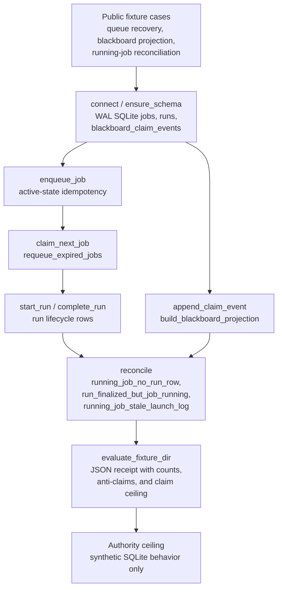

# Engine Room Metabolism Runtime

This staged Engine Room capsule imports the always-on metabolism runtime shape
into Microcosm as a public-safe synthetic SQLite capsule.

## Purpose

A long-running agent runtime keeps a durable record of work: jobs to do, leases
held by workers, runs in flight, and claims asserted on a shared blackboard.
That record drifts out of step with reality. A worker dies mid-run and its lease
never gets released. A run finishes but the job it belonged to is still marked
running. A launch log goes stale because nothing is writing to it. The question
this component answers is narrow: given the durable state alone, which rows are
now inconsistent, and which of those should a person look at before anything
touches them?

The interesting choice is what the reconciliation pass does not do. It reads the
jobs and runs tables, applies its rules, and emits findings tagged
`operator_review_required`. It does not auto-repair. An expired lease has a clean
recovery path, so `requeue_expired_jobs` moves it back to `recoverable` on its
own. But a running job with no run row, or a finished run whose job still reads
running, is ambiguous: the safe move is to surface it, not to guess. The
component draws that line deliberately and refuses to cross it.

The blackboard makes the same refusal. Claims are not edited or deleted in
place. An assertion is one event row; a contradiction, expiry, or supersession
is a separate event that points back at the assertion it invalidates. The active
view is then projected by replaying the event log and dropping any assertion an
invalidating event named. State is reconstructed from an append-only history
rather than mutated, so the reason a claim is no longer active stays on the
record.

This is a synthetic SQLite exercise, not the live runtime. It ships fixtures and
a real database file, exercises the queue, lease, projection, and reconciliation
paths, and emits a receipt. It does not carry the private macro database, dispatch
any worker or provider, or stand in for distributed-database behaviour.

## Shape

The module is a staged, synthetic runtime model over a local SQLite database.
It demonstrates durable queue state, lease recovery, blackboard claim-event
projection, and cold-start reconciliation findings without exporting or
operating the private macro runtime. The public body is intentionally small:
fixtures create jobs, claims, runs, launch logs, and blackboard events, then the
runtime emits receipts over those local artifacts.

The proof boundary is durable-state behavior, not live orchestration. A clean
receipt means the synthetic fixture exercised the declared queue, lease,
projection, and reconciliation cases. It does not prove provider execution,
agent dispatch, distributed database behavior, ambiguous automatic repair, or
release readiness.



## What It Demonstrates

- WAL-enabled SQLite schema for jobs, runs, and blackboard claim events.
- Idempotent job insertion through a partial unique index on `idempotency_key`
  scoped to the active states. A duplicate enqueue while the job is still live is
  rejected; once the job reaches a terminal state the key is free to re-enqueue.
- Lease claim and expired-claim recovery into `recoverable`: a claim carries an
  expiry, and `requeue_expired_jobs` returns any lapsed claim to the queue.
- Blackboard claim-event projection that removes contradicted assertions.
- Cold-start reconciliation findings for:
  - `running_job_no_run_row`
  - `run_finalized_but_job_running`
  - `running_job_stale_launch_log`

## Source-Open Body Floor

Readers should be able to inspect the public body through these local surfaces:

- `src/microcosm_core/engine_room/metabolism_runtime.py` defines the SQLite
  schema, job queue, lease claim/recovery, run lifecycle, blackboard projection,
  reconciliation rules, fixture evaluator, and CLI.
- `tests/test_engine_room_metabolism_runtime.py` checks WAL/idempotency,
  expired-claim recovery, contradicted blackboard assertions, each reconciliation
  finding, fixture replay, and the module CLI receipt.
- `fixtures/first_wave/engine_room_metabolism_runtime/input` carries the
  replayable public queue/reconciliation cases.
- `core/fixture_manifests/engine_room_metabolism_runtime.fixture_manifest.json`
  binds the fixture set as an inspectable artifact.
- `standards/std_microcosm_engine_room_metabolism_runtime.json` names the
  source-to-target relation, required positive and negative cases, validator
  command, and authority ceiling.

The macro source refs in the standard are lineage anchors for the public
refactor. They do not expose private runtime state, and they do not make this
Markdown page a private-runtime export or broader release authority. Source
authority for the paper-module row lives in the JSON capsule registry.

## Reader Evidence Routing

- fixture CLI: inspect synthetic SQLite runtime behavior over public fixture
  roots.
- focused pytest: inspect queue, lease recovery, blackboard projection,
  reconciliation findings, fixture replay, and CLI contract coverage.
- paper-module coverage contract: verify that this slug has left the Engine
  Room legacy re-entry set because its JSON capsule row now names source,
  subject, and code-locus evidence.
- doctrine projection check: corpus/parity evidence only; it is not
  private-runtime export, provider dispatch authority, accepted-organ
  admission, or proof that live macro metabolism state is healthy.
- non-proof boundary: passing checks show the synthetic SQLite exercise is
  replayable and bounded by its authority ceiling. Any later direct
  metabolism-runtime mechanism, accepted organ, or Atlas binding must land
  through its own owner lane and regenerate projection surfaces before this
  module can make those stronger claims.

## Structured Lattice Bindings

- standard: `std_microcosm_engine_room_metabolism_runtime`
- generated JSON row:
  `paper_modules/engine_room_metabolism_runtime.json`
- source authority:
  `core/paper_module_capsules.json::paper_modules[86:paper_module.engine_room_metabolism_runtime]`
  with `paper_module_payload.source_authority: json_capsule`
- generated subject/code state:
  component subject
  `mechanism.engine_room_demo.validates_public_engine_room_demo` plus resolved
  code loci `src/microcosm_core/engine_room/metabolism_runtime.py` and
  `src/microcosm_core/engine_room/demo.py`
- generated relationship state:
  capsule-derived subject, concept, principle, axiom, and code-locus edges,
  with only unnamed sibling/dependency edges retained as residual pressure
- generated projection state:
  Mermaid `available_from_capsule_edges`; Atlas
  `blocked_until_organ_atlas_owner_lane_binds_edges`; Markdown
  `legacy_import_projection_until_roundtrip_builder`
- legacy Markdown projection:
  `paper_modules/engine_room_metabolism_runtime.md`
- runtime locus:
  `src/microcosm_core/engine_room/metabolism_runtime.py`
- focused validation:
  `tests/test_engine_room_metabolism_runtime.py`
- fixture manifest:
  `core/fixture_manifests/engine_room_metabolism_runtime.fixture_manifest.json`
- coverage-contract locus:
  the capsule-backed exemption from `ENGINE_ROOM_LEGACY_REENTRY_LOCI` and
  `ENGINE_ROOM_LEGACY_VALIDATION_TESTS` in
  `tests/test_microcosm_paper_module_coverage_contract.py`

## Receipt Expectations

Expected closeout receipts for this capsule-backed module are:

- focused pytest passes for queue, lease recovery, blackboard projection,
  reconciliation findings, fixture replay, and CLI behavior
- fixture CLI emits JSON with `organ_id: engine_room_metabolism_runtime` and
  `status: pass`
- paper-module coverage keeps the slug out of the Engine Room legacy re-entry
  contract while preserving the focused source/test evidence route
- doctrine projection checks keep the generated JSON instance in parity with the
  capsule registry
- release-claim language stays bounded to synthetic SQLite behavior and does
  not claim live private runtime export, agent dispatch, provider execution,
  distributed database behavior, ambiguous auto-repair, or release authority

## Claim Ceiling

This is a synthetic SQLite capsule for durable queue, lease recovery,
blackboard claim-event projection, and cold-start reconciliation taxonomy. It
is not a live private runtime export, not an agent dispatcher, not provider
execution, not ambiguous auto-repair, and not a distributed database. Its JSON
capsule authority is limited to component evidence for the accepted Engine Room
demo mechanism and the relationships named in `core/paper_module_capsules.json`;
it does not claim a standalone metabolism-runtime mechanism, an accepted organ,
Atlas ownership, or release approval. It never ships the private
macro metabolism database, runtime status JSON, operator sessions, provider
state, or live logs.

## Prior Art Grounding

The organ is grounded in autonomic-computing and durable-runtime control loops:
observe work state, detect stale or inconsistent state, recover leases, and keep
the durable log separate from the acting dispatcher. Relevant anchors include:

- IBM's
  [autonomic-computing architecture](https://research.ibm.com/publications/autonomic-computing-architectural-approach-and-prototype)
  lineage, including the MAPE-K loop tradition that frames self-management as
  monitor, analyze, plan, execute, and knowledge.
- [SQLite write-ahead logging](https://www.sqlite.org/wal.html), where a local
  database uses a WAL file for transactional durability and concurrency
  behavior.
- Google's [SRE monitoring guidance](https://sre.google/sre-book/monitoring-distributed-systems/)
  as a practical lineage for separating symptoms, causes, and operational
  signals.

Microcosm borrows the self-management loop and durable local-state pattern, but
keeps the organ synthetic and public-safe: jobs, leases, blackboard assertions,
and cold-start findings are exercised without exporting private runtime state or
dispatching providers.

## Public Exercise

```bash
PYTHONPATH=src python3 -m microcosm_core.engine_room.metabolism_runtime evaluate-fixtures \
  --input fixtures/first_wave/engine_room_metabolism_runtime/input \
  --json
```

## Validation Receipt Path

The reader-verifiable receipt is the focused pytest plus the paper-module
corpus parity check:

```bash
PYTHONPATH=microcosm-substrate/src ./repo-pytest microcosm-substrate/tests/test_engine_room_metabolism_runtime.py -q
cd microcosm-substrate && PYTHONPATH=src ../repo-python scripts/build_doctrine_projection.py --check-paper-module-corpus
```

Passing these commands proves only that the public fixture behavior and
capsule-backed JSON projection remain reproducible; it does not prove live
private runtime export, provider dispatch, release readiness, or whole-system
correctness.

## Public Site Availability Boundary

The public site may expose this page and its generated capsule-backed JSON row as a
reader route. That availability is projection-only: generated site HTML,
object maps, search indexes, and content graphs must come from the existing
site builder reading source Markdown and Microcosm data, not from hand-authored
site output or release copy. Site visibility does not make this page a
standalone mechanism, an accepted organ, an Atlas owner binding, or release
approval.

## Public-Safe Body Handling

This page may name source paths, fixture ids, standards, tests, receipt paths,
counts, and digest-bearing manifests. It must not embed private macro bodies,
provider payloads, raw operator voice, browser/session state, or live
workspace state. If an exported bundle carries copied public-safe source
modules, those bodies stay in the bundle source-module area and are represented
in reader-facing receipts or cards only by summaries, booleans, counts,
anchors, and hashes.

## JSON Capsule Binding

This Markdown is a reader projection over the JSON capsule row at
`core/paper_module_capsules.json::paper_modules[86:paper_module.engine_room_metabolism_runtime]`.
The generated JSON instance reports
`paper_module_payload.source_authority: json_capsule` and
`source_authority: json_capsule`.

The capsule subject is
`mechanism.engine_room_demo.validates_public_engine_room_demo`. It binds this
module to the accepted Engine Room demo mechanism as component evidence, while
the direct `engine_room_demo` organ context stays in source loci and prose
rather than becoming a broad organ-subject claim. The generated Mermaid projection is
available through the capsule edge set. The generated Atlas projection uses
`organ_atlas.engine_room_metabolism_runtime` and remains
`blocked_until_organ_atlas_owner_lane_binds_edges` until the organ-atlas owner
binds that card.

The authority ceiling is narrow: this page and its JSON capsule prove a
public-safe synthetic SQLite fixture route for queue state, lease recovery,
blackboard projection, and reconciliation taxonomy. They do not prove live
private runtime export, provider execution, agent dispatch, distributed
database behavior, release readiness, private-root equivalence, or source
mutation authority. The proof boundary remains the focused fixture CLI, the
focused pytest validation receipts, and the paper-module corpus parity check.

## Integration Status

`status=json_capsule_active_atlas_binding_pending`: component capsule authority
and Mermaid/lattice walkability are active; a standalone metabolism-runtime
mechanism, accepted organ, Atlas card binding, package-data integration, and
release approval remain outside this paper-module reader page.
