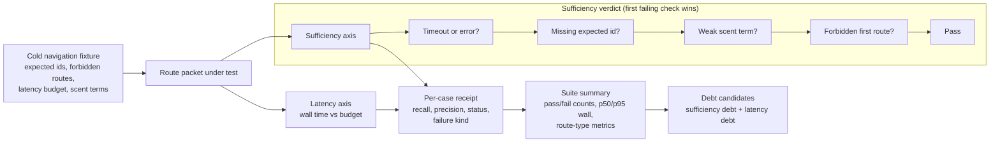

# Engine Room Navigation Fitness Benchmark

This staged Engine Room capsule imports the metric core of the macro
navigation-fitness harness into Microcosm as a runnable public-safe refactor.

## Purpose

When an agent is dropped cold into a large repository, the failure that costs
most is not a wrong answer. It is reaching for the wrong first command and
landing on the wrong rows. This benchmark exists to make that failure
measurable. It answers one question: given a cold task, did the route surface
point at the stable ids the task actually needed, or did it send the agent
somewhere plausible but wrong?

The unusual choice is that "correct" and "fast" are scored on separate axes. A
route packet can name every expected stable id and still be recorded as latency
debt because it ran over budget. A packet that comes back quickly can still
fail for a missing id, weak information scent, a forbidden first route, a
timeout, or an outright error. Most retrieval scores collapse those into one
number; this evaluator keeps them apart so that a slow-but-correct route and a
fast-but-wrong route are never confused, and each lands in its own repair
queue.

The benchmark is deliberately evaluative rather than generative. It reads
fixtures and pre-captured route packets, scores them, and emits receipts. It
does not call the live private kernel, validate embeddings, or claim to measure
navigation quality on tasks it has never seen.

## What It Demonstrates

- Cold-task fixtures name expected stable ids and forbidden first routes.
- Route packets are scored for recall, precision, forbidden-route hits, and
  scent terms.
- Latency budgets are tracked separately from sufficiency, so a packet can be
  correct but still produce latency debt.
- Benchmark summaries include p50/p95 wall time, route-type metrics, and debt
  candidates.

## Shape



The shape is intentionally evaluative, not generative. The benchmark reads
public fixture tasks and captured route packets, scores stable-id coverage,
forbidden first routes, scent terms, and latency, then emits a per-case and
suite-level receipt. It does not run the private macro kernel, inspect browser
or provider state, grade answer quality, mutate route registries, or authorize
publication.

## Technical Mechanism

The evaluator starts with a typed task record, not a free-form benchmark
prompt. `NavigationFitnessTask` fixes the task id, family, prompt, route type,
expected stable artifacts, forbidden first routes, latency budget, route role,
and scent terms. `task_from_mapping` converts each fixture row into that record
with conservative defaults, so missing fixture fields degrade to explicit
public-fixture defaults rather than hidden private context.

`evaluate_task` is the core predicate. It extracts selected artifacts from the
route packet through `_packet_artifacts`, including both flat
`selected_artifacts` rows and structured `selected_rows` entries. Expected
artifacts may use exact ids or prefix wildcards; `_match_expected` records found
and missing ids, then recall and precision are computed over the bounded packet.
The same predicate checks forbidden first routes against
`first_contact_command`, searches packet text for required scent terms, and
keeps latency status separate from sufficiency status. This separation is the
central mechanism: a packet can route to the right stable ids and still carry
latency debt, while a fast packet can still fail for missing ids, weak scent,
forbidden first-route use, timeout, or route error.

`evaluate_benchmark` lifts the per-task predicate to a suite receipt. It
aggregates pass/fail counts, p50/p95 wall-clock observations, route-type
metrics, and debt candidates. `_debt_candidates` deliberately emits only two
classes: sufficiency debt, which points to the missing id, weak scent, error,
timeout, or forbidden-route cause; and latency debt, which records wall time,
budget, and latency status without marking the route semantically wrong.

`evaluate_case` and `evaluate_fixture_dir` are the proof-consumer bridge. A
fixture file supplies an expected suite status, summary counts, and selected
per-task status expectations. The harness reruns the evaluator, compares the
observed receipt to those expectations, and reports `expectation_met` for each
case plus aggregate `case_count`, `passed_case_count`, and `status`. The CLI
`evaluate-fixtures --json` exposes that receipt without writing durable
projection outputs.

## Source-Open Body Floor

The source-open floor for this module is the runnable Engine Room refactor plus
its fixture and test surfaces:

- runtime: `src/microcosm_core/engine_room/navigation_fitness_benchmark.py`
- standard: `standards/std_microcosm_engine_room_navigation_fitness_benchmark.json`
- fixture manifest:
  `core/fixture_manifests/engine_room_navigation_fitness_benchmark.fixture_manifest.json`
- public fixtures:
  `fixtures/first_wave/engine_room_navigation_fitness_benchmark/input`
- focused tests: `tests/test_engine_room_navigation_fitness_benchmark.py`
- generated placeholder JSON row:
  `paper_modules/engine_room_navigation_fitness_benchmark.json`

That floor is enough for a reader to inspect the benchmark logic and replay the
public fixtures. It is not enough to claim private-root parity, live route-runner
coverage, accepted organ admission, or release readiness. It also does not make
this Markdown page source authority; the JSON capsule row is the source
authority, and this Markdown page is the reader projection over that row.

## Claim Ceiling

This is a curated route-packet benchmark evaluator over public fixtures. It is
not a live private `kernel.py` run, not an embedding benchmark, not a universal
navigation benchmark, and not release authority. The JSON capsule authority for
`paper_module.engine_room_navigation_fitness_benchmark` lives in
`core/paper_module_capsules.json`; the generated Mermaid projection comes from
capsule edges and the generated Atlas projection remains blocked until the
Atlas owner lane binds those edges. Live-kernel claims require route packets
captured from the real route runner.

## Prior Art Grounding

The organ borrows from information-retrieval evaluation and information-scent
research: define expected targets, score returned routes against relevance
criteria, penalize forbidden first moves, and keep latency separate from answer
quality. Useful anchors include:

- [TREC](https://trec.nist.gov/) as the benchmark tradition for retrieval runs,
  relevance judgments, precision, recall, and task-specific evaluation.
- Pirolli and Card's information-foraging/information-scent work, represented
  by the 1999 Psychological Review article
  [Information Foraging](https://cir.nii.ac.jp/crid/1363951795634897280?lang=en).

Microcosm applies those ideas to agent navigation packets rather than document
search. It measures whether the route surface points at the expected stable ids,
whether forbidden routes appear, whether useful scent terms are present, and
whether latency budgets are respected. It is not a universal benchmark or a
live-kernel proof.

## Structured Lattice Bindings

- generated JSON row:
  `paper_modules/engine_room_navigation_fitness_benchmark.json`.
- current source authority:
  `paper_module_payload.source_authority: json_capsule`.
- exact source ref:
  `core/paper_module_capsules.json::paper_modules[93:paper_module.engine_room_navigation_fitness_benchmark]`.
- generated subject/code state:
  mechanism subject
  `mechanism.engine_room_navigation_fitness_benchmark.validates_public_navigation_fitness_benchmark`;
  source loci
  `src/microcosm_core/engine_room/navigation_fitness_benchmark.py` and
  `src/microcosm_core/engine_room/demo.py`.
- generated relationship state:
  capsule-backed subject, code-locus, concept, principle, axiom, and dependency
  edges are available from the generated row.
- generated projection state:
  Mermaid `available_from_capsule_edges`; Atlas
  `blocked_until_organ_atlas_owner_lane_binds_edges`; Markdown
  `legacy_import_projection_until_roundtrip_builder`.
- Markdown projection:
  `paper_modules/engine_room_navigation_fitness_benchmark.md`.
- staged runtime:
  `src/microcosm_core/engine_room/navigation_fitness_benchmark.py`.
- standard:
  `standards/std_microcosm_engine_room_navigation_fitness_benchmark.json`.
- fixture manifest:
  `core/fixture_manifests/engine_room_navigation_fitness_benchmark.fixture_manifest.json`.
- focused tests:
  `tests/test_engine_room_navigation_fitness_benchmark.py`.
- coverage contract loci:
  `ENGINE_ROOM_LEGACY_REENTRY_LOCI` and
  `ENGINE_ROOM_LEGACY_VALIDATION_TESTS` in
  `tests/test_microcosm_paper_module_coverage_contract.py`.

These bindings are reader evidence, not capsule authority. The source locus,
standard, fixtures, and tests make the staged evaluator auditable, while the
generated JSON row keeps Atlas release blocked until the organ-atlas owner lane
binds edges.

## Reader Evidence Routing

- `sufficiency_status: pass`: the supplied route packet met this fixture's
  stable-id, forbidden-route, and scent requirements.
- `latency_status: fail`: latency debt only. The benchmark keeps latency
  separate from sufficiency so a route can be correct but still too slow for the
  configured budget.
- `debt_candidate_count`: a triage queue for route-surface improvement, not a
  routing-registry mutation or route deprecation command.
- non-proof boundary: these receipts do not prove live private `kernel.py`
  behavior, unseen-task navigation quality, embedding benchmark performance,
  release readiness, accepted organ admission, or Atlas release authority.

## Named Proof Consumers

The narrow proof consumer is
`tests/test_engine_room_navigation_fitness_benchmark.py`. It checks recall and
precision over expected artifacts, forbidden first-route detection, latency debt
as an axis separate from sufficiency, suite-level debt candidate counts, fixture
matrix parity, and CLI JSON emission for the public fixture root.

The public fixture matrix carries one positive case and three boundary cases:

- `heldout_paraphrase_pass` verifies two nonliteral cold tasks route to the
  expected stable ids, avoid banned first routes, satisfy scent terms, and stay
  under latency budgets.
- `adversarial_forbidden_route` verifies that finding the right stable id still
  fails when the first command uses a forbidden bespoke route.
- `missing_stable_id_negative` verifies that selecting a nearby route row does
  not satisfy the expected stable-id requirement.
- `latency_debt_negative` verifies that a sufficient route packet can still
  produce latency debt without being reclassified as a semantic route failure.

Together those consumers prove the evaluator's accounting contract, not live
navigation quality. They do not exercise private `kernel.py`, embeddings,
browser state, provider state, generated projection repair, or release
readiness.

## Public Exercise

```bash
PYTHONPATH=src python3 -m microcosm_core.engine_room.navigation_fitness_benchmark evaluate-fixtures \
  --input fixtures/first_wave/engine_room_navigation_fitness_benchmark/input \
  --json
```

## Validation Receipt Path

The reader-verifiable receipt is the focused pytest plus the paper-module
corpus parity check:

```bash
PYTHONPATH=microcosm-substrate/src ./repo-pytest microcosm-substrate/tests/test_engine_room_navigation_fitness_benchmark.py -q
cd microcosm-substrate && PYTHONPATH=src ../repo-python scripts/build_doctrine_projection.py --check-paper-module-corpus
```

Passing these commands proves only that the public fixture behavior and JSON
capsule projection remain reproducible; it does not admit an organ, unblock the
Atlas owner lane, or authorize release.

## Public Site Availability Boundary

The public site may expose this page and its generated JSON capsule row as a
reader route. That availability is projection-only: generated site HTML,
object maps, search indexes, and content graphs must come from the existing
site builder reading source Markdown and Microcosm data, not from hand-authored
site output or release copy. Site visibility does not broaden the capsule into
accepted organ admission, Atlas release authority, private-root equivalence, or
release readiness.

## Public-Safe Body Handling

This page may name source paths, fixture ids, standards, tests, receipt paths,
counts, and digest-bearing manifests. It must not embed private macro bodies,
provider payloads, raw operator voice, browser/session state, or live
workspace state. If an exported bundle carries copied public-safe source
modules, those bodies stay in the bundle source-module area and are represented
in reader-facing receipts or cards only by summaries, booleans, counts,
anchors, and hashes.

## Reader Proof Boundary

Read this page as a public reader projection over a staged Engine Room
exercise. The generated JSON row now reports
`paper_module_payload.source_authority: json_capsule` with exact source ref
`core/paper_module_capsules.json::paper_modules[93:paper_module.engine_room_navigation_fitness_benchmark]`.
The useful proof is still narrow: the capsule names a staged mechanism subject,
resolved source loci, public fixtures, the standard, and validation receipts.
It does not prove live private `kernel.py` behavior, unseen-task navigation
quality, accepted organ admission, whole-system correctness, aggregate
doctrine-lattice coverage, or release readiness.

## JSON Capsule Binding

The JSON capsule source authority is
`core/paper_module_capsules.json::paper_modules[93:paper_module.engine_room_navigation_fitness_benchmark]`.
This Markdown is a reader projection over that capsule row, not the row itself.
The generated Mermaid projection is `available_from_capsule_edges`; the
generated Atlas projection is
`blocked_until_organ_atlas_owner_lane_binds_edges`. The authority ceiling stays
mechanism-level: validation receipts can show the public navigation-benchmark
fixture and focused pytest behavior, but they do not create accepted organ
authority or release authority.

## Subject Admission Audit

The current capsule row names a mechanism subject, not an organ subject:

- `mechanism.engine_room_navigation_fitness_benchmark.validates_public_navigation_fitness_benchmark`
  resolves through `core/mechanism_sources.json`.
- `core/organ_registry.json::implemented_organs` does not contain an accepted
  `engine_room_navigation_fitness_benchmark` organ, and the capsule does not
  claim one.
- `paper_module.engine_room_demo` names this module as a staged dependency, but
  a downstream dependency edge is not subject admission for the dependency
  module itself.

That is why the proof boundary is mechanism-level. The admissible future
expansion is accepted organ admission or Atlas owner binding, not a Markdown
claim.

## Receipt Expectations

A valid future capsule admission or refresh should provide:

- fixture replay showing the positive heldout paraphrase case passes,
- negative fixture receipts for forbidden first routes, missing stable ids, and
  latency debt,
- summary counts for task total, sufficiency pass/fail, p50/p95 wall time, and
  debt candidates,
- JSON validity for the standard and fixture manifest,
- paper-module corpus readback showing this module's Mermaid status remains
  `available_from_capsule_edges` and Atlas status remains
  `blocked_until_organ_atlas_owner_lane_binds_edges` unless the Atlas owner lane
  lands a binding change, and
- release-boundary confirmation that benchmark pass/fail receipts remain
  navigation evidence, not proof correctness, public readiness, or release
  authority.

## Integration Status

`status=staged_capsule_pending_shared_registry_integration`: shared organ
registry, CLI, atlas, acceptance, package-data, and preflight rows are owned by
another active Microcosm lane at authoring time.
