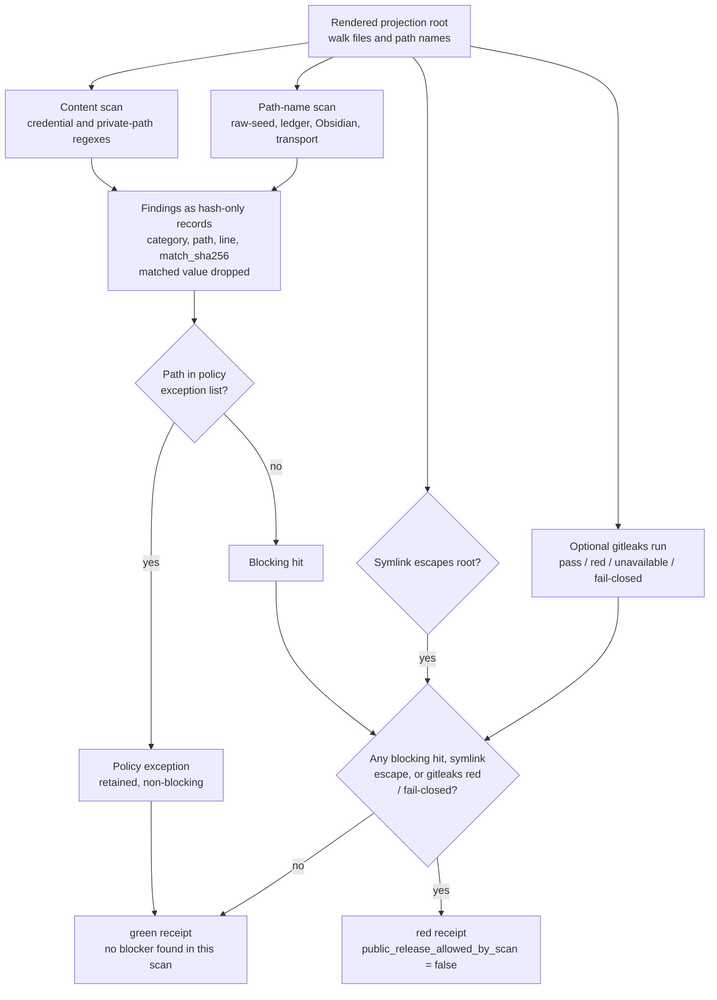

# Engine Room Public Projection Leak Gate

This staged Engine Room capsule imports the runnable core of the macro
projection leak scan into Microcosm as a public-safe refactor.

## Purpose

Before a rendered set of files is exposed to a public reader, someone has to
answer a narrow question: does this tree contain anything that should not leave
the private workspace? Credential-shaped strings, a private home path, a
provider-transport symbol, or a symlink that points outside the tree are all
ways for private material to ride along with an otherwise public projection.
This gate answers that one question over a directory of rendered files and
returns a `green` or `red` verdict.

The interesting part is what the gate does with what it finds. A secret scanner
that prints the secret it discovered into its own report has created a second
copy of the leak. This gate never does that. Every match is recorded by
category, path, line number, and a SHA-256 hash of the matched text, and the
matched value itself is dropped (`_hit` builds the record without it). The
verdict is auditable, the counts are honest, and the receipt is itself safe to
publish. A reviewer can confirm that a leak was found and where, without the
report becoming the thing that leaks.

The gate is deliberately small and deterministic. It reads files and path
names against a fixed set of regular expressions, treats a symlink that escapes
the root as a hard blocker, and folds an optional `gitleaks` run into the same
receipt. It does not parse the files, follow data flow, or reason about intent.
It is a data-loss-prevention boundary for one rendered tree, not a general
security scanner, and the page is careful to keep it framed that way.

## What It Demonstrates

- Content scans for credential-shaped strings and private host-bound path
  markers.
- Path scans for private raw-voice, task-history, prompt-history, Obsidian, and
  provider-transport path shapes.
- Policy-exception paths remain visible as hash-only hits while avoiding a
  blocking verdict.
- Symlink escapes are hard blockers with target hashes only.
- Optional gitleaks execution records pass, red, unavailable, or fail-closed
  status without copying findings into the receipt.

## Shape



The shape is intentionally narrow. The gate reads rendered public files, file
paths, policy-exception paths, symlinks, and optional gitleaks output; it emits
counts and hashed evidence. It does not ingest raw operator voice, private macro
bodies, provider payloads, cookies, account state, browser/HUD/cockpit state, or
recipient-send state.

## Technical Mechanism

The proof consumer is the runtime function
`scan_projection(root, policy_exception_paths, run_gitleaks_check,
require_gitleaks, gitleaks_binary)` in
`src/microcosm_core/engine_room/public_projection_leak_gate.py`. It first
resolves the supplied projection root and rejects a missing or non-directory
root. It then normalizes policy-exception paths against
`DEFAULT_POLICY_EXCEPTION_PATHS`, walks the rendered tree in stable path order,
skips declared cache/build directories and bytecode suffixes, and treats symlink
escapes as hard blockers while recording only the relative path and a hash of
the escaped target.

For each non-skipped path, `_scan_path` checks private-history, raw-voice,
Obsidian, and browser/provider transport path shapes. For each readable file,
`_scan_file` applies `CONTENT_PATTERNS` for credential-like strings, private
home paths, private Chrome profile paths, private Obsidian markers, provider
transport symbols, and browser debug ports. `_hit` stores the category,
pattern, relative path, optional line number, source kind, policy-exception
status, and `match_sha256`; it intentionally omits the matched value. The
receipt then splits hits into blocking and policy-exception sets, summarizes
category counts, attaches optional `run_gitleaks` status, and derives `green` or
`red` through `_overall_status`.

The focused fixture consumer is `evaluate_fixture_dir`, which materializes each
JSON fixture into a temporary projection root and checks its expected status.
`tests/test_engine_room_public_projection_leak_gate.py` exercises the same
mechanism through unit cases and CLI receipt output: clean projections stay
green, private home paths and key-shaped strings go red without raw value
leakage, policy-exception examples remain hash-only and non-blocking, required
missing gitleaks fails closed, and the five-case fixture matrix returns
`status: pass`.

## Governing Lattice Relation

The source authority for this paper-module projection is the JSON capsule row
`core/paper_module_capsules.json::paper_modules[80:paper_module.engine_room_public_projection_leak_gate]`,
projected into `paper_modules/engine_room_public_projection_leak_gate.json`.
That row names the mechanism subject
`mechanism.engine_room_public_projection_leak_gate.validates_public_projection_leak_gate`,
the code locus `src/microcosm_core/engine_room/public_projection_leak_gate.py`,
the governing concept `concept.import_projection_and_drift_control_bundle`, six
principle refs (`P-1`, `P-2`, `P-6`, `P-8`, `P-9`, `P-15`), five axiom refs
(`AX-1`, `AX-5`, `AX-7`, `AX-8`, `AX-11`), and the dependency on
`paper_module.engine_room_demo`.

The standard
`standards/std_microcosm_engine_room_public_projection_leak_gate.json` narrows
that lattice edge by declaring the staged-capsule authority boundary, the two
positive and three negative fixture classes, the public target refs, the
validator command, and the anti-claim that a green leak-gate receipt is not a
general security scanner, prompt-injection defense, sandbox, information-flow
proof, release authority, or private-root equivalence claim. The capsule also
records that Mermaid is available from capsule edges while the Atlas card stays
blocked until an organ/atlas owner binds a real organ surface; this Markdown is
therefore a reader projection over a mechanism row, not an accepted-organ
admission.

## Claim Ceiling

This is a DLP-style public projection gate. It is not a general security
scanner, not prompt-injection defense, not sandboxing, not an information-flow
proof, and not release authority.

## Limitations

This module is a deterministic projection scanner over the files it is given.
It does not prove that the supplied root is the complete public site, that a
builder selected the correct export set, or that a later publication step will
reuse the same artifacts. Regex- and path-pattern detection can miss encoded,
split, transformed, novel, or tool-specific secrets, and it can also flag benign
boundary examples when they are not routed through the explicit
policy-exception path list.

Optional gitleaks integration is receipt evidence only when the tool is
available or required by the caller. `gitleaks_status: unavailable` is not an
external scanner pass, and `public_release_allowed_by_scan: true` means only
that this gate found no blockers in this scan. Release approval, source-open
authority, accepted-organ status, aggregate doctrine-lattice coherence,
private-root equivalence, and whole-system security remain outside this proof
consumer.

## Prior Art Grounding

The organ is grounded in data-loss-prevention and secret-scanning practice:
scan artifacts before publication, detect credential-shaped strings and private
path markers, preserve enough evidence for triage, and avoid copying the
sensitive payload into the report. Relevant anchors include:

- NIST's [Data Loss Prevention](https://www.nist.gov/publications/data-loss-prevention)
  publication, which frames leakage prevention around sensitive data leaving an
  enterprise boundary.
- [GitHub secret scanning](https://docs.github.com/en/code-security/concepts/secret-security/about-secret-scanning),
  which raises alerts when credential-like material appears in repositories.
- [Gitleaks](https://github.com/gitleaks/gitleaks), a public scanner for
  hardcoded secrets in Git repositories and files.

Microcosm borrows the pre-publication leak-gate and secret-scanner shape, then
narrows it to public projection artifacts: credential-shaped content, private
path signatures, symlink escapes, policy exceptions, and optional gitleaks
status. It is not a full security scanner or information-flow proof.

## Structured Lattice Bindings

- generated JSON row:
  `paper_modules/engine_room_public_projection_leak_gate.json`.
- current source authority:
  `paper_module_payload.source_authority: json_capsule`.
- Markdown projection:
  `paper_modules/engine_room_public_projection_leak_gate.md`.
- staged runtime:
  `src/microcosm_core/engine_room/public_projection_leak_gate.py`.
- mechanism subject:
  `mechanism.engine_room_public_projection_leak_gate.validates_public_projection_leak_gate`.
- upstream paper-module dependency:
  `paper_module.engine_room_demo`, because the capsule source row binds the
  staged leak-gate runtime to Engine Room demo dependency evidence.
- standard:
  `standards/std_microcosm_engine_room_public_projection_leak_gate.json`.
- fixture manifest:
  `core/fixture_manifests/engine_room_public_projection_leak_gate.fixture_manifest.json`.
- focused tests:
  `tests/test_engine_room_public_projection_leak_gate.py`.
- macro source refs copied into the public refactor:
  `tools/meta/dissemination/projection_secret_scan.py` and
  `tools/meta/dissemination/portability_gate.py`.

These bindings are reader evidence for a narrow capsule authority row. The
source locus and standard make the staged mechanism auditable, while the capsule
registry now admits only a mechanism subject. No accepted organ subject, release
authority, private-root equivalence, or general security authority is implied.

## Reader Evidence Routing

Read `status: green` as "this scan did not find a blocking leak in the supplied
projection root." Do not read it as publication approval. The runtime's
`public_release_allowed_by_scan` field means the projection passed this one DLP
gate only; release authority, source-open authority, hosted-product authority,
proof-correctness authority, and private-root equivalence all remain false.

Read `policy_exception_count` as "the gate saw known boundary-document examples
and retained hash-only evidence without blocking." Do not read it as permission
to place private paths or credential-shaped payloads in arbitrary public files.

Read `gitleaks_status: unavailable` as an explicit optional-tool receipt, not a
green external scanner result. When `require_gitleaks` is true, missing gitleaks
fails closed.

## Public Exercise

```bash
PYTHONPATH=src python3 -m microcosm_core.engine_room.public_projection_leak_gate evaluate-fixtures --input fixtures/first_wave/engine_room_public_projection_leak_gate/input --json
```

The fixture manifest names two positive cases (`clean_projection`,
`policy_exception_hash_only`) and three negative cases (`planted_private_path`,
`planted_key_shape`, `path_pattern_blocked`). The expected receipt is
`status: pass`, `case_count: 5`, and `passed_case_count: 5`.

## Validation Receipt Path

The reader-verifiable receipt is the focused pytest plus the paper-module
corpus parity check:

```bash
PYTHONPATH=microcosm-substrate/src ./repo-pytest microcosm-substrate/tests/test_engine_room_public_projection_leak_gate.py -q --basetemp /tmp/microcosm-public-projection-leak-gate
cd microcosm-substrate && PYTHONPATH=src ../repo-python scripts/build_doctrine_projection.py --check-paper-module-corpus
```

Passing these commands proves only that the public fixture behavior and governed
paper-module projection remain reproducible; it does not create an accepted
organ, approve release, or prove whole-system public-safety.

## Public Site Availability Boundary

The public site may expose this page and its generated legacy JSON row as a
reader route. That availability is projection-only: generated site HTML,
object maps, search indexes, and content graphs must come from the existing
site builder reading source Markdown and Microcosm data, not from hand-authored
site output or release copy. Site visibility does not add accepted-organ
authority, close unrelated lattice gaps, or authorize release.

## Public-Safe Body Handling

This page may name source paths, fixture ids, standards, tests, receipt paths,
counts, and digest-bearing manifests. It must not embed private macro bodies,
provider payloads, raw operator voice, browser/session state, or live
workspace state. If an exported bundle carries copied public-safe source
modules, those bodies stay in the bundle source-module area and are represented
in reader-facing receipts or cards only by summaries, booleans, counts,
anchors, and hashes.

## Reader Proof Boundary

Read this page as a public reader projection over a staged Engine Room exercise
with a JSON capsule row. The generated JSON row now reports
`paper_module_payload.source_authority: json_capsule` and names the mechanism
subject. The useful proof here is still narrow: fixture behavior, hash-only
evidence handling, source locus, mechanism subject admission, and generated
projection parity. It does not claim an accepted organ, release authority, or a
general security boundary.

## JSON Capsule Binding

`core/paper_module_capsules.json` now contains
`paper_module.engine_room_public_projection_leak_gate` at
`core/paper_module_capsules.json::paper_modules[80:paper_module.engine_room_public_projection_leak_gate]`.
This Markdown is a reader projection; `source_authority: json_capsule` lives in
that capsule row. The capsule names one resolved mechanism subject,
`mechanism.engine_room_public_projection_leak_gate.validates_public_projection_leak_gate`,
and the resolved runtime locus
`src/microcosm_core/engine_room/public_projection_leak_gate.py`.

The staged runtime, standard, fixture manifest, focused tests, and Engine Room
demo dependency evidence are enough for this narrow capsule row and its
`depends_on: paper_module.engine_room_demo` edge. They do not create an accepted
organ subject, and the standard's `used_by_organs` list stays empty until an
organ-registry owner admits that separate authority.

The generated Mermaid projection is available from capsule edges. The generated Atlas projection is still blocked until an organ/atlas owner admits a real
surface. The proof boundary is the public fixture and hash-only leak-gate
receipt behavior, not release approval or whole-system security.

## JSON Capsule Boundary

This module is now a JSON-capsule-backed paper module for a mechanism subject,
not for an accepted organ. Its runnable source and tests make the staged
mechanism inspectable and mark the proof boundary. Re-entry for the remaining
organ/atlas slice is separate: after an organ-registry or atlas owner admits a
resolving organ subject, refresh the capsule row and regenerate with
`scripts/build_doctrine_projection.py --write-paper-module-corpus`, keeping
Mermaid and Atlas as generated projections.

## Subject Admission Audit

A capsule row needs a resolving subject before this page can leave
`blocked_required_subject_gap`. The live subject audit is now partially
positive:

- `core/organ_registry.json::implemented_organs` does not contain an accepted
  `engine_room_public_projection_leak_gate` organ.
- `core/mechanism_sources.json::mechanisms` contains
  `mechanism.engine_room_public_projection_leak_gate.validates_public_projection_leak_gate`.
- `standards/std_microcosm_engine_room_public_projection_leak_gate.json::relationships.used_by_organs`
  is empty and its registry integration status is
  `staged_capsule_pending_shared_registry_integration`.
- `paper_module.engine_room_demo` names this module as a staged dependency, but
  a downstream dependency edge is not accepted-organ admission for the
  dependency module itself.

That is why this page routes readers to the public fixture, source, standard,
test, mechanism, and generated capsule surfaces while keeping accepted-organ
authority false. The remaining admissible re-entry is a real organ row or atlas
binding, followed by a serialized capsule refresh and doctrine-projection
regeneration.

## Capsule Re-entry Packet

- source authority now:
  `core/paper_module_capsules.json::paper_module.engine_room_public_projection_leak_gate`
  is the JSON capsule row; `paper_modules/engine_room_public_projection_leak_gate.md`
  remains an authored Markdown projection.
- current generated projection status: Mermaid `available_from_capsule_edges`;
  Atlas `blocked_until_organ_atlas_owner_lane_binds_edges`.
- resolved source locus: `src/microcosm_core/engine_room/public_projection_leak_gate.py`.
- resolved mechanism subject:
  `mechanism.engine_room_public_projection_leak_gate.validates_public_projection_leak_gate`.
- missing authority edge: no accepted `organ` JSON instance currently resolves
  for `engine_room_public_projection_leak_gate`, so the capsule registry must not
  invent an organ subject yet.
- re-entry condition: after an organ admission or atlas binding lands, refresh
  `paper_module.engine_room_public_projection_leak_gate` in
  `core/paper_module_capsules.json`, run
  `scripts/build_doctrine_projection.py --write-paper-module-corpus`, and verify
  the generated instance keeps capsule-backed Mermaid while binding Atlas through
  the admitted organ surface.
- authority ceiling: this page can explain the staged public exercise and source
  locus; it cannot claim organ authority, release readiness, private-root
  equivalence, or aggregate doctrine-lattice coherence beyond the regenerated
  capsule and coverage projections.

## Receipt Expectations

A valid capsule refresh or future organ admission should provide:

- a green fixture receipt with all five public fixture cases passing,
- a scan receipt over the intended public projection root with no blocking hits,
- hash-only evidence for any matched path/content, with no raw secret or private
  path values copied into the receipt,
- explicit `gitleaks_status` and `required` fields when the optional tool is
  requested,
- JSON validity for the standard and fixture manifest,
- corpus readback showing this module's Mermaid and Atlas status either remains
  `blocked_required_subject_gap` or flips through a regenerated capsule-backed
  projection, and
- release-boundary confirmation that a green scan remains one gate, not release
  authority.

## Integration Status

`status=staged_capsule_pending_shared_registry_integration`: shared organ
registry, CLI, atlas, acceptance, package-data, and preflight rows are owned by
another active Microcosm lane at authoring time.
