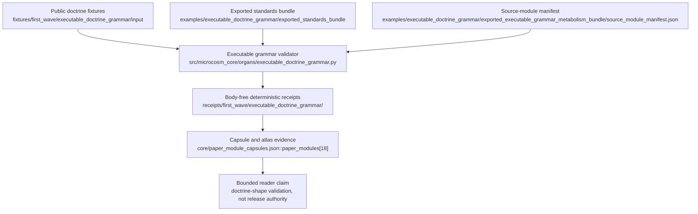

# Executable Doctrine Grammar

## Purpose

Doctrine in most systems is prose convention. A standard says a rule should hold,
a paper module says a section should be present, and nothing checks whether the
claim is actually true. This organ exists to make doctrine shape a thing a
program can pass or fail. It answers one question: does a standard row or a
paper-module fixture carry the structure that doctrine here requires, or is it
just text that looks the part?

What it checks is deliberately structural rather than semantic. A standard row
must declare a teleology, a governing standard, receipt expectations, and an
anti-claim. A paper module must carry the matching sections by heading. The
validator does not judge whether the prose is good. It judges whether the
load-bearing fields are present, so a row cannot quietly drop its receipt
expectations or its anti-claim and still pass.

The less obvious part is that the failures are first-class. Five negative cases
are part of the contract: a row missing its required fields, a prose-only
standard that tries to claim executable authority, a macro doctrine body copied
into a public fixture, a duplicate standard slug, and a grammar pass that
overclaims doctrine completeness. A run that does not observe each of these
classes is blocked, so the checker is held to demonstrating that it can reject,
not only that it can accept.

The organ also imports copied non-secret macro bodies, but only through a
source-module manifest with declared SHA-256 digests, and never inlines a body
into a receipt. The receipt reports refs, hashes, counts, and verdicts; the
bodies live in the bundle. The point is to make the doctrine shape checkable
without turning the public surface into an export of the private standards
engine.

## Teleology

`executable_doctrine_grammar` turns toy public standards and paper-module
fixtures into deterministic grammar receipts. It makes doctrine-shape claims
checkable while importing copied, non-secret macro bodies only through
source-module manifests, digests, and receipt boundaries.

## Shape



Read this module as an executable grammar path: public fixtures and exact
source-module manifests enter the organ runtime, receipts prove bounded
doctrine-shape checks, and the capsule/Atlas projection carries only that
bounded claim.

## Structured Lattice Bindings

- Paper capsule: `core/paper_module_capsules.json#paper_module.executable_doctrine_grammar`
- Mechanism: `core/mechanism_sources.json#mechanism.executable_doctrine_grammar.validates_public_doctrine_grammar_bundle`
- Governing standard: `standards/std_microcosm_executable_doctrine_grammar.json`
- Organ source locus: `src/microcosm_core/organs/executable_doctrine_grammar.py`
- Focused regression: `tests/test_executable_doctrine_grammar.py`
- Lattice regression: `tests/test_doctrine_lattice_runtime.py::test_executable_doctrine_grammar_population_resolves_required_edges`

The atlas row binds the same capsule, mechanism, and code-locus refs, so the
coverage projection can remove this organ from the paper-module, mechanism,
and code-locus deficit lists.

## JSON Capsule Binding

- Source row: `core/paper_module_capsules.json::paper_modules[18:paper_module.executable_doctrine_grammar]`
- `source_authority: json_capsule`
- This Markdown is a reader projection. The generated Mermaid projection is
  `available_from_capsule_edges`, and the generated Atlas projection is
  `linked_from_capsule_edges`; both are navigation projections derived from the
  capsule row rather than source authority.
- The proof boundary is the public standards and paper-module fixtures,
  executable-grammar specimen, standards registry, type-plane, lattice registry,
  Kind Atlas refs, deterministic grammar receipts, negative cases, and
  validation receipts.
- The authority ceiling excludes private macro doctrine completeness,
  publication authority, hosted-public readiness, provider calls, private-data
  equivalence, release authority, and whole-system correctness.

## Reader Evidence Routing

Reader evidence routes through the executable-grammar runtime, fixture inputs,
exported standards bundle, executable-grammar metabolism bundle, source-module
manifests, public receipts, and focused tests. The Mermaid diagram and Atlas
card are generated navigation projections; this page is the cold-reader
explanation of the proof boundary.

## Reader Proof Boundary

The proof boundary is public standards and paper-module fixtures, an
executable-grammar specimen, standards registry/type-plane rows, lattice
registry rows, Kind Atlas refs, deterministic grammar receipts, source-module
digest checks, negative cases, and validation receipts. It does not prove macro
doctrine completeness, hosted readiness, provider behavior, private-data
equivalence, release authority, or whole-system correctness.

## Public Site Availability Boundary

Public site copy may present this module as executable doctrine-shape
validation only when it keeps generated projection status, receipt refs,
anti-claims, and the doctrine-completeness exclusion visible. It must not
promote a grammar pass into publication approval, release readiness, or source
truth for the broader doctrine lattice.

## Public-Safe Body Handling

Public receipts may carry refs, hashes, counts, material classes, verdicts,
standard slugs, paper-module slugs, and negative-case outcomes. They must not
inline private macro doctrine bodies, provider payloads, account/session
material, raw seed, secrets, or copied source bodies outside the approved
non-secret bundle floor.

## Public Contract

The validator checks standard slugs, teleology, governing standard refs,
receipt expectations, anti-claims, paper-module sections, macro-body sentinels,
duplicate slug conflicts, prose-only authority claims, and doctrine-completeness
overclaims. It also validates the imported public executable-grammar specimen,
standards registry, standards type-plane, lattice registry, kind-atlas runtime,
and standards option-surface runtime as exact copied source modules.

## Prior Art Grounding

This organ is grounded in schema validation, parser generators, and executable
semantics traditions. [JSON Schema](https://json-schema.org/specification)
anchors the idea that document shape can be validated by a shared machine
contract, [Tree-sitter](https://github.com/tree-sitter/tree-sitter) shows the
practical value of generated grammars for inspectable source structure, and the
[K framework](https://kframework.org/) is a close reference point for turning
semantic rules into executable artifacts.

Microcosm borrows the executable-contract pattern: doctrine shape, receipt
expectations, duplicate slugs, imported source bodies, and anti-claims are
checked by a validator instead of left as prose convention. It does not claim
macro doctrine completeness or release readiness.

## First Commands

From `microcosm-substrate/`, a cold agent can prove the fixture path:

```bash
PYTHONPATH=src python3 -m microcosm_core.organs.executable_doctrine_grammar validate --input fixtures/first_wave/executable_doctrine_grammar/input --out receipts/first_wave/executable_doctrine_grammar --card
```

The exported public standards bundle uses the same organ with a narrower input:

```bash
PYTHONPATH=src python3 -m microcosm_core.organs.executable_doctrine_grammar validate-standards-bundle --input examples/executable_doctrine_grammar/exported_standards_bundle --out receipts/first_wave/executable_doctrine_grammar --card
```

The source-open macro-body floor is the executable-grammar metabolism bundle:

```bash
PYTHONPATH=src python3 -m microcosm_core.organs.executable_doctrine_grammar validate-executable-grammar-metabolism-bundle --input examples/executable_doctrine_grammar/exported_executable_grammar_metabolism_bundle --out receipts/first_wave/executable_doctrine_grammar --card
```

## Validation Receipt Path

Validate the reader projection from the repo root without mutating durable
receipt or generated projection surfaces:

```bash
./repo-pytest microcosm-substrate/tests/test_executable_doctrine_grammar.py -q --basetemp=/tmp/microcosm_executable_doctrine_grammar_pytest
./repo-python microcosm-substrate/scripts/build_doctrine_projection.py --check-paper-module-corpus
```

## Source-Backed Mechanism

The mechanism row
`mechanism.executable_doctrine_grammar.validates_public_doctrine_grammar_bundle`
points at `validate`, `validate_standards_bundle`,
`validate_executable_grammar_metabolism_bundle`,
`validate_source_module_imports`, `validate_standard_registry`,
`validate_paper_module_shape`, `result_card`, `EXPECTED_NEGATIVE_CASES`, and
`GRAMMAR_AUTHORITY_CEILING`.

Those symbols are the runnable floor:

- `validate` writes the fixture standards, paper-module, group-index, and
  acceptance receipts.
- `validate_standards_bundle` validates the exported public standards bundle
  and keeps receipt paths public-relative.
- `validate_executable_grammar_metabolism_bundle` validates the copied
  executable-grammar metabolism specimen, standards registry/type-plane,
  lattice registry, kind-atlas, and standards option-surface bodies.
- `validate_source_module_imports` requires
  `source_module_manifest.json`, `copied_non_secret_macro_body`,
  `exact_copy`, allowlisted source refs, body-in-receipt exclusion, and SHA-256
  digest matches.
- `result_card` compresses receipt evidence without duplicating body text.

## Receipt Expectations

The command emits standards validation, standards group index, paper-module
validation, and fixture acceptance receipts under
`receipts/first_wave/executable_doctrine_grammar/` and
`receipts/acceptance/first_wave/`. The exported executable-grammar metabolism
receipt reports source refs, copied-body counts, material classes, and SHA-256
digests; it does not duplicate imported body text.

Expected public receipt refs include:

- `receipts/first_wave/executable_doctrine_grammar/standards_validation_report.json`
- `receipts/first_wave/executable_doctrine_grammar/paper_module_validation_report.json`
- `receipts/first_wave/executable_doctrine_grammar/standards_group_index.json`
- `receipts/acceptance/first_wave/executable_doctrine_grammar_fixture_acceptance.json`
- `receipts/first_wave/executable_doctrine_grammar/exported_standards_bundle_validation_result.json`
- `receipts/first_wave/executable_doctrine_grammar/exported_executable_grammar_metabolism_bundle_validation_result.json`

## Negative Cases

The fixture must keep these failures executable rather than prose-only:

- `invalid_standard_and_module`: missing teleology, receipt expectations,
  governing standard, and anti-claim.
- `prose_standard_claims_runtime_authority`: prose cannot claim executable
  runtime authority.
- `macro_doctrine_body_copied_into_fixture`: macro doctrine body sentinels are
  rejected from public fixtures.
- `duplicate_standard_slug_conflict`: duplicate slugs are rejected
  deterministically.
- `grammar_index_pass_overclaims_doctrine_complete`: grammar pass is not
  doctrine-completeness authority.

## Source-Open Body Floor

`examples/executable_doctrine_grammar/exported_executable_grammar_metabolism_bundle/source_module_manifest.json`
declares 12 copied non-secret macro bodies. Receipts may report refs, hashes,
counts, classes, and verdicts, but `body_in_receipt=false` remains required.

The body-material classes are `public_macro_receipt_body`,
`public_macro_standard_body`, and `public_macro_tool_body`. The body set covers
the executable-grammar specimen README, board, and receipt; standards registry
and group-index standards; standard type-plane and core authority index;
lattice registry and standard; and the kind-atlas / standards option-surface
runtime tools.

## Anti-Claim

This module documents a public grammar fixture plus exact non-secret macro body
imports. It does not claim macro doctrine completeness, public release
readiness, hosted-public readiness, publication, recipient work, provider
calls, private-data equivalence, or whole-system correctness.

## Claim Ceiling

This paper module can claim an executable-doctrine grammar fixture with a
generated diagram view and an Atlas card. It can explain the public grammar
specimen, exact non-secret macro body imports, and body-free receipt boundary.

It cannot claim macro doctrine completeness, public release readiness,
hosted-public readiness, publication authority, recipient execution, provider
calls, private-data equivalence, source mutation, release approval, or
whole-system correctness. Higher claims must land in the JSON capsule and
generated projection before Markdown can narrate them.

## Atlas Binding

- `paper_module_ref`:
  `core/paper_module_capsules.json#paper_module.executable_doctrine_grammar`
- `mechanism_refs[].ref`:
  `mechanism.executable_doctrine_grammar.validates_public_doctrine_grammar_bundle`
- `code_loci[]`:
  `src/microcosm_core/organs/executable_doctrine_grammar.py` with the mechanism
  symbols named above.
