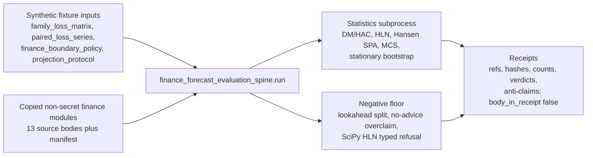

# Finance forecast evaluation spine

`finance_forecast_evaluation_spine` is a Crown Jewel import organ with real runnable substrate and a strict public authority ceiling. It consumes synthetic public fixtures, copied non-secret macro source bodies, and source manifests that verify sha256 digests, line counts, required anchors, secret-exclusion status, and receipt body omission.

What it proves: synthetic fixture forecast-evaluation statistics only; no investment advice, live market data, track record, or performance claim.

How to run it:

```bash
microcosm finance-forecast-evaluation-spine run --input fixtures/first_wave/finance_forecast_evaluation_spine/input --out receipts/first_wave/finance_forecast_evaluation_spine
```

Runtime bundle route:

```bash
python -m microcosm_core.organs.finance_forecast_evaluation_spine run-finance-forecast-bundle --input examples/finance_forecast_evaluation_spine/exported_finance_eval_bundle --out receipts/runtime_shell/demo_project/organs/finance_forecast_evaluation_spine
```

Negative cases covered by the fixture manifest: finance_hln_dependency_refusal, finance_leakage_lookahead_split, finance_no_advice_overclaim.

Source provenance is anchored by `examples/finance_forecast_evaluation_spine/exported_finance_eval_bundle/source_module_manifest.json` and receipts carry refs, digests, counts, verdicts, and anti-claims only.

## Shape



## JSON Capsule Binding

This binding section names the JSON capsule as the source authority; the
structured lattice details below are reader-facing projection context.

## Structured Lattice Bindings

- Source row: `core/paper_module_capsules.json::paper_modules[30:paper_module.finance_forecast_evaluation_spine]`
- Generated JSON instance: `paper_modules/finance_forecast_evaluation_spine.json`
- `source_authority: json_capsule`
- Subject edge: `paper_module.finance_forecast_evaluation_spine` explains organ `finance_forecast_evaluation_spine`.
- Runtime code locus: `src/microcosm_core/organs/finance_forecast_evaluation_spine.py` with `run` and `run_finance_forecast_bundle`.
- Standard: `standards/std_microcosm_finance_forecast_evaluation_spine.json`.
- Fixture manifest: `core/fixture_manifests/finance_forecast_evaluation_spine.fixture_manifest.json`.
- Focused tests: `tests/test_finance_forecast_evaluation_spine.py`.
- This Markdown is a reader projection. The generated Mermaid projection is
  `available_from_capsule_edges`, and the generated Atlas projection is
  `linked_from_capsule_edges`; both are navigation projections derived from the
  capsule row rather than source authority.
- The proof boundary is the synthetic market-shaped fixture, copied non-secret
  macro bodies, source manifest digests, forecast-statistic computations, typed
  refusal cases, secret-exclusion checks, and validation receipts.
- The generated JSON row still records selective concept/principle/axiom and
  sibling-module relations as residual pressure. That is an honest doctrine
  population boundary, not a failure of the finance runtime.
- The authority ceiling excludes investment or trading advice, live market data,
  track-record claims, performance claims, optimizer mutation, release
  authority, and treating SciPy absence as anything stronger than a typed
  refusal boundary.

## Technical Mechanism

The module is a deterministic forecast-evaluation harness around
`CrownJewelSpec`, not a finance product. The spec fixes four required fixture
inputs (`family_loss_matrix.json`, `paired_loss_series.json`,
`finance_boundary_policy.json`, and `projection_protocol.json`), names the
three required negative cases, binds the source manifest, and restricts the
source-open import to required anchors in `model_selection_stats.py`,
`spa_statistics.py`, `loss_differentials.py`, and `family_loss_matrix.py`.

At runtime, `run` delegates to `run_crown_jewel_organ` with `evaluate` and
`evaluate_negative_case`. `evaluate` loads the synthetic loss matrix, paired
loss series, and boundary policy, then calls `_evaluate_payloads`. That function
first enforces the policy and lookahead-split guards; if either boundary fails,
it returns a blocked receipt before any statistics subprocess can run. Only
after those guards pass does it run the copied statistics modules or, for the
exported bundle path, use `_standalone_exported_statistics_contract` so the
standalone public bundle does not depend on a live macro-root subprocess.

The statistical witness is therefore deliberately narrow: Reality Check,
Hansen-SPA, MCS, Diebold-Mariano/HAC, stationary bootstrap, and the HLN refusal
are receipt fields over the synthetic fixture. The same mechanism treats
`finance_hln_dependency_refusal` as a typed negative case when SciPy support is
absent, treats policy overclaims as `FINANCE_NO_ADVICE_OVERCLAIM`, treats
temporal leakage as `FINANCE_LOOKAHEAD_SPLIT_FORBIDDEN`, and keeps copied source
bodies out of receipts with `body_in_receipt: false`.

## Governing Lattice Relation

The generated JSON instance resolves six capsule-derived edges for this module:
it explains organ `finance_forecast_evaluation_spine`, explains mechanism
`mechanism.finance_forecast_evaluation_spine.validates_public_finance_forecast_evaluation_spine`,
is governed by concept `concept.research_and_science_replay_evidence_bundle`,
is governed by principle `P-8`, abides by `AX-7`, and cites the code locus
`src/microcosm_core/organs/finance_forecast_evaluation_spine.py`. Those edges
come from `core/paper_module_capsules.json::paper_modules[30:paper_module.finance_forecast_evaluation_spine]`
and the generated sidecar, not from this Markdown prose.

Mechanically, `P-8` and `AX-7` show up as refusal discipline: an admissible
statistic can pass, but advice-shaped policy flags, live-market authority,
leakage-prone time splits, source digest mismatch, and fake HLN p-values must
block. The concept edge keeps the module in the research/science replay-evidence
family, where proof value is a reproducible fixture and source-manifest witness
rather than a claim about markets.

## Reader Evidence Routing

Read the positive fixture as a small statistical witness, not as a market result.
The current receipt has `status: pass`, `sample_size: 40`, `candidate_count: 3`,
`reality_check.status: computed_bootstrap`, `spa.status: computed_bootstrap`,
`mcs.implemented: true`, `paired_loss.diebold_mariano.status:
computed_hac_normal_approximation`, and a five-replicate stationary-bootstrap
witness. Those fields show that the organ can exercise the copied forecast
evaluation code paths on public synthetic data.

Read the negative floor as equal evidence. The observed negative cases are
`finance_hln_dependency_refusal`, `finance_leakage_lookahead_split`, and
`finance_no_advice_overclaim`, with stable error codes
`FINANCE_HLN_TYPED_REFUSAL_REQUIRED`, `FINANCE_LOOKAHEAD_SPLIT_FORBIDDEN`, and
`FINANCE_NO_ADVICE_OVERCLAIM`. The HLN case refuses because SciPy is unavailable
for the t-distribution; that is the intended authority ceiling, not a missing
p-value to fill in by hand.

Read source-open evidence through the manifest, not through receipts. The source
bundle carries 13 copied non-secret finance modules; receipts carry references,
hashes, counts, verdicts, and anti-claims, and keep `body_in_receipt: false`.
The local claim therefore stays at "synthetic fixture forecast-evaluation
statistics and typed refusals." It does not become investment advice, live-market
data, a track record, performance proof, optimizer authorization, or release
authority.

## Forecast-Evaluation Discipline

This organ is evidence that the Microcosm can carry professional forecast
evaluation logic without pretending to carry market authority. The admissible
statistics include Diebold-Mariano loss-differential testing, the
Harvey-Leybourne-Newbold small-sample correction, Hansen's SPA test, a
Politis-Romano stationary bootstrap, Bartlett HAC long-run variance, and
purged/embargoed cross-validation in the Lopez de Prado style.

The important doctrine is refusal discipline. Horizons greater than or equal to
sample length, samples too small to estimate a statistic, leakage-prone splits,
missing SciPy support, and advice-shaped claims must return typed refusals
instead of crashes or meaningless numbers. Hansen-style recentering of poor or
irrelevant alternatives is part of the SPA contract because it is the boundary
between a useful superior-predictive-ability test and White Reality Check style
over-penalization.

Receipts should therefore distinguish "computed statistic" from "refused
because inadmissible." Both are successful validator outcomes when the fixture
asked for that behavior.

## Validation Receipt Path

Validate the reader projection from the repo root without mutating durable
receipt or generated projection surfaces:

```bash
PYTHONPATH=microcosm-substrate/src ./repo-pytest microcosm-substrate/tests/test_finance_forecast_evaluation_spine.py -q --basetemp=/tmp/microcosm_finance_forecast_evaluation_spine_pytest
./repo-python microcosm-substrate/scripts/build_doctrine_projection.py --check-paper-module-corpus
```

## Named Proof Consumers

- Runtime fixture consumer: `finance_forecast_evaluation_spine.run` over
  `fixtures/first_wave/finance_forecast_evaluation_spine/input` must produce
  `status: pass`, the three observed semantic negative cases, false
  advice/live-data/performance authority flags, and body-free source-manifest
  receipt material.
- Exported-bundle consumer:
  `run-finance-forecast-bundle` over
  `examples/finance_forecast_evaluation_spine/exported_finance_eval_bundle`
  must validate the 13 copied non-secret finance modules by digest and use the
  standalone statistics contract rather than a live macro subprocess.
- Focused pytest consumer:
  `tests/test_finance_forecast_evaluation_spine.py` must keep the positive
  statistical fixture, no-advice overclaim, live-market overclaim, lookahead
  split, semantic-negative-case, standalone-bundle, and digest-mismatch tests
  green.
- Corpus consumer:
  `scripts/build_doctrine_projection.py --check-paper-module-corpus` must keep
  the 98-module Microcosm paper-module corpus valid without hand-editing the
  generated JSON instance.
- Claim-ceiling consumer: any public or dissemination copy must preserve the
  local ceiling that this is synthetic fixture forecast-evaluation evidence,
  not investment advice, live data, performance proof, optimizer authorization,
  or release authority.

## Prior Art Grounding

This organ is grounded in forecast-evaluation statistics rather than trading
systems. The core anchors are the
[Diebold-Mariano test for comparing predictive accuracy](https://www.nber.org/papers/t0169),
the Harvey-Leybourne-Newbold small-sample correction for prediction-error tests
([DOI reference](https://doi.org/10.1016/S0169-2070%2896%2900719-4)),
Hansen's [test for superior predictive ability](https://ideas.repec.org/a/bes/jnlbes/v23y2005p365-380.html),
and proper-scoring-rule work such as
[Gneiting and Raftery](https://sites.stat.washington.edu/people/raftery/Research/PDF/Gneiting2007jasa.pdf).
The purged/embargoed split discipline also follows the financial ML concern
that temporal leakage can make backtests look stronger than they are.

Microcosm borrows the professional evaluation posture: compute admissible
statistics when the fixture supports them, return typed refusals when it does
not, and keep evaluation separate from advice, live market data, or performance
claims.

## Receipt Expectations

Run local verification from `microcosm-substrate/` and write ad hoc receipts to
`/tmp` unless you intentionally own the durable receipt lane:

```bash
PYTHONPATH=src python3 -m microcosm_core.organs.finance_forecast_evaluation_spine run --input fixtures/first_wave/finance_forecast_evaluation_spine/input --out /tmp/microcosm-finance-forecast-receipts --acceptance-out /tmp/microcosm-finance-forecast-acceptance.json
PYTHONPATH=src python3 -m microcosm_core.organs.finance_forecast_evaluation_spine run-finance-forecast-bundle --input examples/finance_forecast_evaluation_spine/exported_finance_eval_bundle --out /tmp/microcosm-finance-forecast-bundle-receipts
```

Inspect `/tmp/microcosm-finance-forecast-receipts/finance_forecast_evaluation_spine_result.json`
and `/tmp/microcosm-finance-forecast-bundle-receipts/exported_finance_forecast_evaluation_spine_bundle_validation_result.json`
after the commands finish. The expected positive receipt preserves
`status: pass`, all three observed negative case ids, false
advice/live-data/performance authority flags, and `body_in_receipt: false`. The
focused pytest receipt should keep all finance tests green, including the
no-advice overclaim, live-market-data overclaim, and source-module
digest-mismatch cases.

## Claim Ceiling

Finance forecast evaluation spine proves only synthetic market-shaped
forecast-evaluation fixture behavior, copied non-secret source manifest
integrity, body-free receipts, admissible statistic computation, and typed
refusals for inadmissible finance claims. A diagram view and atlas navigation
entry are generated for this module, but those navigation projections do not
expand the proof. This module is not investment or trading advice, uses no live
market data, proves no track record or performance claim, mutates no optimizer,
certifies no trading strategy, and treats SciPy absence as a typed HLN refusal
rather than a hidden statistical success.

## Public Site Availability Boundary

This module may be exposed through the Microcosm public site feed, search index,
object map, source-route page, and paper-module card surfaces as a public-safe
reader entry for capsule-backed finance forecast-evaluation evidence. The site
payload may reference the title, capsule id, generated JSON instance, Markdown
projection path, runtime organ id, mechanism id, fixture and exported-bundle
input classes, validation commands, anti-claims, and the exact authority ceiling
above.

Public-site exposure must not copy private macro-root bodies, raw operator
voice, provider payloads, account/session state, browser or HUD state, live
market data, credential-equivalent material, durable recipient-send state, or
finance receipt bodies. Receipts stay body-free and source-open evidence routes
through the exported source-module manifest, not through copied bodies embedded
in web payloads.

Availability on the website is therefore a navigation and evidence-routing
claim only: it says the public reader can find the existing finance
paper-module/capsule/organ/mechanism boundary and its validation route. It does
not authorize investment or trading advice, live market data, track-record or
performance claims, optimizer mutation, release or publication approval, hosted
product posture, private-root equivalence, or generated-site settlement while
source coupling remains dirty. Generated `sites/microcosm/*` outputs must still
come from the public-site builder after the source-coupling gate is clean.
