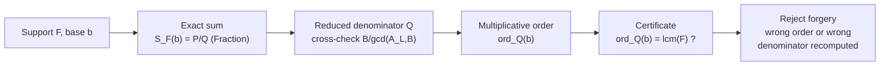

# Finite Erdos Denominator-Order Certificate Strike

`finite_erdos_denominator_certificate_strike` computes a finite number-theoretic
certificate in exact arithmetic and checks a sharp claim about it: for a finite
set of exponents `F` and a base `b`, the multiplicative order of `b` modulo the
reduced denominator equals the least common multiple of `F`.

## Purpose

The point is not to make a hard claim sound impressive; it is to compute a finite
object exactly and let a small checker decide it, so a reader can see precisely
where the proof boundary stops.

It surfaces the public `finite_denominator_order_certificate` capsule. It sums
`S_F(b) = sum_{n in F} 1/(b^n - 1) = P/Q` as an exact rational, reads the reduced
denominator `Q`, computes `ord_Q(b)` by repeated multiplication, and cross-checks
`Q` against the closed form `B / gcd(A_L, B)`. It then confirms `ord_Q(b) =
lcm(F)` on small cases, including one where a common prime cancels in the fraction
yet the certificate still holds. This is the finite identity behind the Erdos #257
period-noncollapse question — it is not a solution to the open problem.

## Shape



## JSON Capsule Binding

- source_ref:
  `core/paper_module_capsules.json::paper_modules[94:paper_module.finite_erdos_denominator_certificate_strike]`
- source_authority: json_capsule
- Projection role: This Markdown is a reader projection of the JSON capsule row,
  not the source authority. The generated Mermaid projection is
  `paper_module.finite_erdos_denominator_certificate_strike.mermaid` with status
  `available_from_capsule_edges`, and the generated Atlas projection is
  `organ_atlas.finite_erdos_denominator_certificate_strike` with status
  `linked_from_capsule_edges`.
- proof boundary: the capsule binds the accepted organ, the resolved mechanism
  row, the runtime locus, the surfaced engine-room capsule, and the governing
  concept, principle, and axiom edges; the generated JSON projection carries the
  exact resolved relationship edges.
- authority ceiling: this page can explain the bounded exact-arithmetic fixtures
  and the validation receipts, but it cannot become a proof of the infinite Erdos
  #257 problem, an oracle, prover, or provider result, a machine-checked proof, or
  release authority.

## Structured Lattice Bindings

The structured capsule row is
`core/paper_module_capsules.json#paper_module.finite_erdos_denominator_certificate_strike`.
It binds this Markdown projection to the organ, the resolved mechanism row
`mechanism.finite_erdos_denominator_certificate_strike.verifies_finite_denominator_order_certificate`,
the runtime locus
`src/microcosm_core/organs/finite_erdos_denominator_certificate_strike.py`, and
the surfaced capsule
`src/microcosm_core/engine_room/finite_denominator_order_certificate.py`. It
abides by axiom `AX-2` (a small checker decides claims over certificates) and
principle `P-3` (prefer a small, rerunnable verifier over narrative confidence).

Generated atlas docs remain builder-owned projections: refresh them with
`PYTHONPATH=src python3 scripts/build_organ_atlas.py --write` instead of editing
`ORGANS.md`, `ARCHITECTURE.md`, `AGENT_ROUTES.md`, or
`atlas/agent_task_routes.json` by hand.

## Reader Evidence Routing

The honest unit is "the checker recomputed and agreed," not "a theorem was
proved." Read the reducing case and the forgeries before trusting the identity:

- A safety/evals engineer should confirm the arithmetic is exact (`fractions`, no
  floats) and that the denominator is independently cross-checked against the
  closed form. The useful question is whether the certificate is recomputed, not
  asserted.
- A hiring reviewer should read `certificate_holds_after_reduction`, where a prime
  cancels yet the order still equals the lcm. The useful question is whether the
  positive case is non-trivial rather than hand-picked to be easy.
- A peer developer should run the two forgeries. The useful question is whether a
  wrong claimed order and a wrong claimed denominator are both caught by
  recomputation rather than by a stored expected answer.

## Validation

```bash
PYTHONPATH=src python3 -m microcosm_core.organs.finite_erdos_denominator_certificate_strike run --input fixtures/first_wave/finite_erdos_denominator_certificate_strike/input --out receipts/first_wave/finite_erdos_denominator_certificate_strike --acceptance-out receipts/acceptance/first_wave/finite_erdos_denominator_certificate_strike_fixture_acceptance.json
../repo-pytest microcosm-substrate/tests/test_finite_erdos_denominator_certificate_strike.py
```

The positive cases (`certificate_holds`, `certificate_holds_after_reduction`)
compute the certificate and confirm `ord_Q(b) = lcm(F)`, including the reducing
case. The negative cases are rejected by recomputation: `forged_order_rejected`
and `forged_denominator_rejected` submit a wrong claimed value and the runner
recomputes the truth and rejects it.

## Authority Ceiling

A green run shows that the finite certificate was computed exactly and that forged
certificates were rejected by recomputation. It does not prove the open infinite
Erdos #257 problem, is not an oracle, prover, or provider result, is not a
machine-checked proof of even the finite statement, and does not authorize
release, publication, provider calls, or source mutation.
