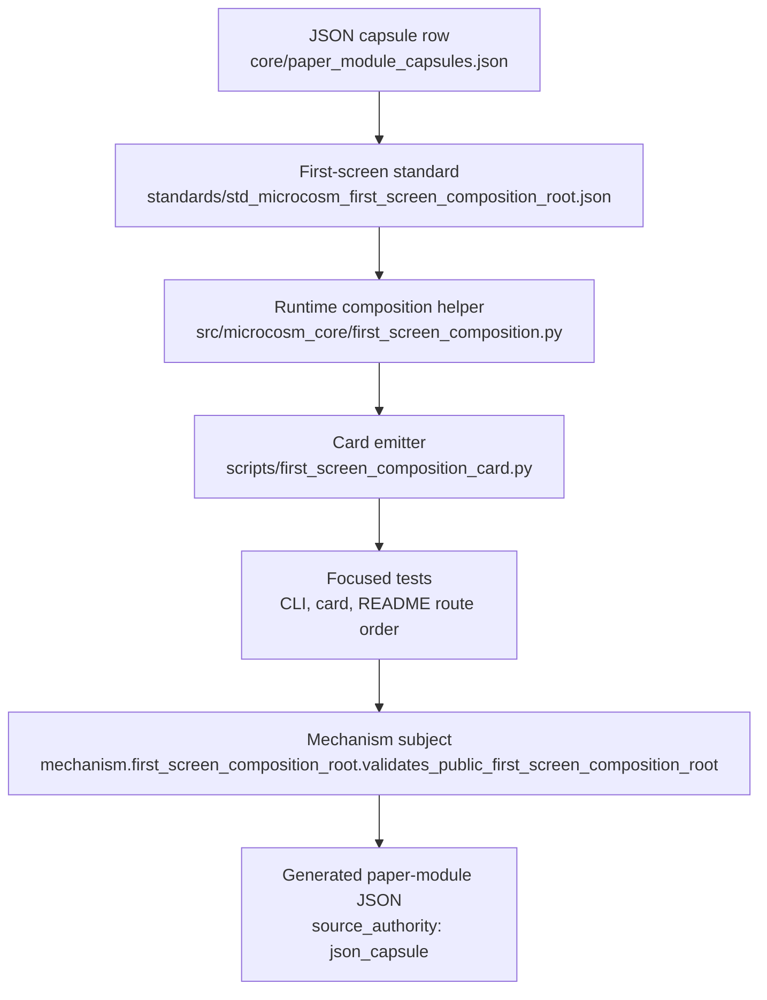

# First-Screen Composition Root

`first_screen_composition_root` is the contract for the one screen a cold
reader should see before choosing a deeper Microcosm route.

## Purpose

Microcosm already has the important deeper surfaces: route maps, workingness,
authority ceilings, standards, receipts, source-open body imports, and the
localhost observatory. The first-screen problem is not lack of depth. It is
that depth lands poorly when the first encounter is a long command inventory
or a raw JSON payload.

The composition root says what has to fit on one screen:

1. One shared terminal selector: `microcosm hello <project>`.
2. One shared behavior proof: `microcosm tour --card <project>`.
3. Three reader branch handles after that shared card: safety/evals engineer,
   hiring reviewer, and peer developer.
4. Evidence counts framed as accounting, not maturity or progress scores.
5. A runnable-to-structural join: the folder-local command is one visible
   exercise of a larger source-open substrate.
6. A doctrine-effect frame: concepts and mechanisms appear as public handles
   that prevent vague labels and feature prose before deeper standards are
   opened.
7. An omission receipt: the card names the deeper route map, receipts,
   standards, workingness, authority, and observatory drilldowns instead of
   copying them.
8. An authority ceiling that rejects release, hosted publication, provider
   calls, source mutation, private-data equivalence, score-based progress, and
   whole-system correctness.

## Shape



This is the paper-module shape behind the first screen: a governed one-screen
composition contract, one public helper, one card emitter, and focused tests.
The diagram is not a publication claim. It now binds a mechanism subject and
resolved code loci, while keeping accepted-organ authority, release approval,
hosted-publication readiness, provider calls, source mutation, score-based
progress, private-data equivalence, and whole-system correctness out of scope.

## Reader Proof Boundary

Read this page as a public reader projection over the JSON capsule row
`paper_module.first_screen_composition_root`. The generated JSON row reports
`paper_module_payload.source_authority: json_capsule`, names the first-screen
mechanism subject, and resolves the package helper plus CLI emitter code loci.
The useful proof here is still narrow: first-screen card composition, reader
branch routing, omission receipts, text projection, README entry order, and the
authority ceiling are reproducible from public source and tests. It does not
create an accepted organ, release approval, hosted-publication readiness,
provider-call authority, source-mutation authority, reader-success
certification, or whole-system correctness.

## JSON Capsule Binding

`core/paper_module_capsules.json` contains
`paper_module.first_screen_composition_root` as the source-authority capsule row.
This Markdown is a reader projection over that capsule row, not source
authority. The exact generated source ref is
`core/paper_module_capsules.json::paper_modules[94:paper_module.first_screen_composition_root]`.
The checked-in `paper_modules/first_screen_composition_root.json` sidecar is
generated from that capsule row; it is not hand-authored truth. The capsule names
the mechanism subject
`mechanism.first_screen_composition_root.validates_public_first_screen_composition_root`
and resolved code loci in `src/microcosm_core/first_screen_composition.py` and
`scripts/first_screen_composition_card.py`.
The generated Mermaid projection is
`paper_module.first_screen_composition_root.mermaid`; the generated Atlas projection
is linked as `organ_atlas.first_screen_composition_root`.

The first-screen standard, runtime composition helper, card emitter, and tests
therefore become capsule evidence for this mechanism-backed paper module. They
still do not create an accepted `first_screen_composition_root` organ, public
release authority, hosted-product authority, provider execution, or source
mutation authority.

## Structured Lattice Bindings

- Generated paper-module row:
  `paper_modules/first_screen_composition_root.json` is generated from the JSON
  capsule row and names `source_authority: json_capsule`.
- Mechanism subject:
  `mechanism.first_screen_composition_root.validates_public_first_screen_composition_root`.
- Governing standard:
  `standards/std_microcosm_first_screen_composition_root.json` is the source
  contract for the one-screen card, reader branches, omission receipt,
  validation shape, and authority ceiling.
- Entry route projection:
  `atlas/entry_packet.json::{local_first_screen_route,reader_first_screen_routes}`
  contains generated route handles consumed by readers. It is projection
  parity, not paper-module source authority.
- Runtime helper:
  `src/microcosm_core/first_screen_composition.py` is public composition logic
  for first-screen cards and a resolved capsule code locus.
- Card emitter:
  `scripts/first_screen_composition_card.py` is a CLI projection for JSON/text
  first-screen cards, bounded to public inputs and resolved as a capsule code
  locus.
- Focused tests:
  `tests/test_first_screen_composition_card.py`,
  `tests/test_cli_hello_first_screen.py`, and
  `tests/test_readme_first_screen_entry.py` are receipts for card shape, CLI
  entry, README route order, and overclaim tripwires.

The generated sidecar binds the mechanism subject, code loci, concept,
principle, and axiom refs named by the capsule. Any dependency or accepted-organ
edge not named in source JSON remains residual pressure; this page must not
infer those edges from Markdown prose.

## JSON Capsule Boundary

This paper module is now a JSON-capsule-backed row in the generated
paper-module corpus.

- Current authority: `paper_module_payload.source_authority` is
  `json_capsule`; the capsule names a mechanism subject and resolved code loci.
- Current proof: the first-screen composition contract makes reader entry,
  public commands, card slots, branch ids, omission receipts, text projections,
  README order, and tests inspectable.
- Re-entry: any future accepted-organ claim or dependency edge must land through
  its own source row and regenerate the corpus; it must not be inferred from this
  Markdown page.

This Markdown explains the proof boundary; it does not source publication
readiness, release approval, provider execution, private-data equivalence,
source mutation authority, reader-success certification, or aggregate
doctrine-lattice coverage.

## Public Site Availability Boundary

This module is public-safe to expose as a reader route because it describes the
first-screen composition contract, public commands, card slots, reader branches,
tests, standards, and authority ceilings without turning the first screen into
a release or hosted-publication claim. Website availability should come from
the existing Microcosm site builder reading this source page and generated
Microcosm data; generated site HTML, object maps, search indexes, content
graphs, and browser boards are projections, not source authority.

## Public-Safe Body Handling

This page may name command strings, reader branch ids, card slots, evidence
count labels, standard refs, runtime helper paths, emitter paths, tests,
README anchors, entry-packet refs, omission receipts, and authority ceilings.
It must not embed private runtime state, provider payloads, raw operator voice,
private source bodies, local workspace state, host/browser session material, or
marketing copy that implies release, hosted product status, or whole-system
correctness.

First-screen projections should keep evidence as public command refs, counts,
classes, omission receipts, branch handles, and anti-claims. Reader cards,
browser boards, generated site projections, and this Markdown must not copy
private payload bodies or inflate accounting fields into maturity scores.

## Reader Evidence Routing

- A safety/evals reader starts with the focused first-screen text card for
  `safety_evals_engineer`, then checks the authority ceiling, evidence
  accounting frame, and public-entry doc tests. The useful question is whether
  the card keeps local behavior proof separate from release, provider, and
  whole-system correctness claims.
- A hiring or review reader starts with the JSON card and the Reader Branches
  table. The useful question is whether one rerunnable local command, one
  shared proof card, and one branch route are enough to inspect the substrate
  without mistaking counts for maturity scores.
- A peer developer starts with `scripts/first_screen_composition_card.py`, then
  reads `src/microcosm_core/first_screen_composition.py` and the focused
  tests. The useful question is whether the command/card projection is
  reproducible from public inputs without reading private runtime state.

Generated entry-packet rows, browser boards, and site cards should point back
to these public commands, tests, and omission receipts. They do not become
source authority for the paper module and must not imply publication approval
or source mutation authority.

## Subject Admission Audit

A capsule row now resolves this paper module through a mechanism subject. The
live subject audit is bounded:

- `core/paper_module_capsules.json` contains the source-authority row
  `paper_module.first_screen_composition_root`.
- `core/organ_registry.json::implemented_organs` does not contain an accepted
  `first_screen_composition_root` organ.
- `core/mechanism_sources.json::mechanisms` contains
  `mechanism.first_screen_composition_root.validates_public_first_screen_composition_root`.
- `standards/std_microcosm_first_screen_composition_root.json::relationships.used_by_organs`
  names reader-entry consumers of the standard; those consumers are supporting
  context, not accepted-organ admission for this paper-module row.

That is why this page routes readers to the public first-screen command, card
emitter, standard, tests, and generated capsule sidecar while keeping accepted
organ authority false. The admissible re-entry for a stronger claim is a real
organ row or additional source-backed dependency relation, followed by
serialized doctrine-projection regeneration.

## Capsule Re-entry Packet

- current source authority: generated JSON reports
  `paper_module_payload.source_authority: json_capsule`.
- generated row source ref:
  `core/paper_module_capsules.json::paper_module.first_screen_composition_root`.
- current generated projection status: Mermaid and Atlas derive from capsule
  edges.
- resolved code loci: `src/microcosm_core/first_screen_composition.py` and
  `scripts/first_screen_composition_card.py`.
- missing authority edge: no accepted organ currently resolves
  `first_screen_composition_root`, so the capsule registry must not invent an
  organ subject.
- re-entry condition: after a real organ admission or additional source-backed
  dependency relation lands, refresh the capsule row, run
  `scripts/build_doctrine_projection.py --write-paper-module-corpus`, and verify
  the generated sidecar remains honest.
- authority ceiling: this Markdown provides mechanism-backed reader evidence
  only; it does not source publication readiness, release approval, provider
  execution, private-data equivalence, source mutation authority,
  reader-success certification, or aggregate doctrine-lattice coverage.

## Concrete One-Screen Artifact

The artifact is a terminal-sized card, not a second README. It should fit the
following order without requiring a reader to scroll through the full command
inventory:

- Claim frame:
  "Microcosm turns a folder into local routes, work, events, evidence, and
  explanations." This names the composition root without claiming release,
  hosted product status, or whole-system correctness.
- First action:
  `microcosm hello <project>` gives every reader the same first command before
  audience branching.
- Shared proof:
  `microcosm tour --card <project>` shows one local behavior proof that can be
  repeated from a clone.
- Evidence legend:
  Count, evidence class, proof surface, and anti-claim prevent honest counters
  from becoming maturity scores.
- Doctrine frame:
  Concepts and mechanisms as mistake-prevention handles let agents find
  `std_microcosm_concept` and `std_microcosm_mechanism` from entry instead of
  searching the standards tree.
- Structural join:
  "This run exercises one public organ inside a larger source-open substrate."
  This connects the local command to standards, receipts, body imports, and
  observatory routes.
- Reader rail:
  Safety/evals, hiring, and peer developer branch handles let each reader
  choose a next drilldown without changing authority.
- Exit rule:
  Stop when first action, shared proof, evidence legend, and one branch
  next-step are understood. This keeps the card from expanding into the
  long-form route map.

Any first-screen renderer may change wording, but not the order of those slots.
If a field needs more space than one screen, the renderer must replace the body
with a receipt, paper-module, standard, or observatory handle rather than
expanding the card.

## Evidence Accounting Frame

The first screen must explain honest counters before a reader sees them as
scores. Counts such as source-open body materials, rows with source imports,
verified macro imports, external subprocess witnesses, and algorithmic
projections are accounting fields. They answer "what kind of evidence is this
and where can I inspect it," not "how mature is the whole system."

That distinction is reader-visible:

- Small verified count:
  a narrow proof cell exists and carries higher authority. It does not mean the
  rest of the system is unimplemented.
- Large source-open material count:
  public imported body material is inspectable by path and receipt. It does not
  mean more bodies automatically produce stronger proof.
- Algorithmic projection count:
  a generated surface is present and needs source-coupling context. It does not
  make generated rows source authority.
- Rows with source imports:
  some organs expose copied body material through validators. It does not mean
  every organ has equal evidence depth.

Reader branches can choose different next evidence surfaces, but they inherit
the same accounting frame. A safety/evals reader should ask for authority and
failure-mode boundaries; a hiring reviewer should ask whether the counters are
traceable rather than inflated; a peer developer should ask which command lets
them reproduce the local evidence trail.

## Discipline Comparison Frame

The first screen must show rigor by naming the collapse it prevents. A compact
card is allowed to be small only because it keeps these separations visible:

- A status badge says "works":
  local behavior proof stays separate from release, proof, and correctness
  claims. The card names `microcosm tour --card <project>` plus the authority
  ceiling.
- Evidence totals look like progress:
  evidence classes stay attached to anti-claims and receipt refs. A reader can
  move from count to class to proof surface without inferring maturity.
- Governance reads like ceremony:
  each constraint is phrased as the mistake it blocks. The card says what would
  be overclaimed if the constraint were absent.
- Breadth looks diffuse:
  the local run is framed as one exercised organ inside the accepted runtime
  spine. The structural join points to spine, workingness, standards, receipts,
  and observatory drilldowns.

This comparison frame is not marketing copy. It is the rule that keeps the
first screen from sounding impressive while hiding the authority boundary that
made the compression possible.

## Observable Artifact Bridge

The first screen has two sibling projections: the terminal card and the compact
browser board. They are the same artifact in different media, not two separate
claims. The terminal card may be emitted by `microcosm hello <project>` or
`microcosm tour --card <project>`; the browser board may be emitted by a
first-screen or observatory compact endpoint. Both must show the same five
slots before linking to deeper drilldowns:

| Slot | Terminal card cue | Browser board cue |
|---|---|---|
| Open command | Exact command a reader can rerun. | Command label pinned above the board. |
| Local proof | Route/work/event/evidence chain summary. | The selected route and first causal edge. |
| Causal chain | Receipt or validator refs. | Event/evidence refs before graph expansion. |
| Evidence legend | Evidence class plus anti-claim. | Legend beside counts, not hidden in hover text. |
| Authority ceiling | Forbidden reads named in text. | Boundary band visible before any motion. |

The browser projection can make the first artifact more inspectable, but it
cannot become a marketing page. A screenshot or video is first-screen material
only when it preserves command, receipt, evidence class, anti-claim, and
authority ceiling in the frame.

## Reader Branches

The shared first command comes before branching. Reader branches select the
next inspection surface; they do not create audience-specific authority.

- Safety/evals engineer:
  `microcosm status --card <project>` plus authority and workingness drilldowns;
  evidence focus is classes, ceilings, body-copy boundaries, anti-claims,
  standards, and failure modes.
- Hiring reviewer:
  legibility scorecard plus compact tour card; evidence focus is whether it is
  real, local, bounded, and honest about what is not proven.
- Peer developer:
  compact tour card plus project observation drilldown; evidence focus is
  whether a clone can produce local `.microcosm/` state and inspect the
  route/work/event/evidence chain.

## Reader Selection Card

The machine-readable selector lives at
`atlas/entry_packet.json::reader_first_screen_routes.reader_selection_card`.
It is the public first-screen handoff between terminal prose and branch-specific
drilldowns:

```bash
microcosm hello --reader safety_evals_engineer <project>
microcosm hello --reader hiring_reviewer <project>
microcosm hello --reader peer_developer <project>
```

Those focused projections are allowed to hide the other two branches, but not
the shared behavior proof, evidence-accounting frame, runnable-to-structural
join, omission receipt, or authority ceiling. The selector should therefore be
read as a branch router, not a personalized success claim.

## Validation Shape

The standard is intentionally a composition contract, not a runtime authority.
When a runtime card consumes it, validation should check that the card has a
single terminal selector, one shared behavior proof, the three reader route
ids, the reader-selection card ref, evidence-accounting context, a
runnable-to-structural join, discipline comparison frame, observable artifact
bridge, concept and mechanism rows inside the doctrine-effect frame, omission
receipts, and the authority ceiling.

## Public Card Emitter

`scripts/first_screen_composition_card.py` projects this contract into a
public-root JSON card:

```bash
python3 scripts/first_screen_composition_card.py --project-label <project>
```

It can also emit the terminal-sized first screen directly:

```bash
python3 scripts/first_screen_composition_card.py --project-label <project> --format text
```

The text projection can focus one reader branch while preserving the same
shared first command, evidence-count frame, omission receipt, and authority
ceiling:

```bash
python3 scripts/first_screen_composition_card.py --project-label <project> --format text --reader safety_evals_engineer
```

`--reader all` remains the default. Focused reader projections are presentation
routes only: they reduce the first-screen branch set, but they do not create a
different claim frame or audience-specific authority.

The emitter is intentionally narrow. It does not import private runtime state
or source bodies. It loads this standard, emits the one shared command and
three branch handles, frames evidence counts as accounting, names the
runnable-to-structural join, and carries the standard's omission receipt and
authority ceiling.

## Validation Receipt Path

Reader-verifiable emitter commands, run from the `microcosm-substrate/` public
root:

```bash
PYTHONPATH=src ../repo-python scripts/first_screen_composition_card.py --project-label . --format json
PYTHONPATH=src ../repo-python scripts/first_screen_composition_card.py \
  --project-label . \
  --format text \
  --reader safety_evals_engineer
```

Focused test receipt, run from the repository root:

```bash
PYTHONPATH=microcosm-substrate/src ./repo-pytest \
  microcosm-substrate/tests/test_first_screen_composition_card.py \
  microcosm-substrate/tests/test_cli_hello_first_screen.py \
  microcosm-substrate/tests/test_readme_first_screen_entry.py \
  -q --basetemp /tmp/microcosm-first-screen-composition-tests
```

The emitter commands write no private state and print the public first-screen
receipt to stdout: the JSON card exposes the shared command, behavior proof,
evidence accounting frame, omission receipt, and authority ceiling; the focused
text command proves a reader branch can be compressed without changing the
claim frame. The focused tests verify the card schema, CLI first-screen output,
README entry contract, local-state receipt trail, overclaim tripwires, and
reader route menu.

This receipt path is reader-verifiable evidence only. It does not replace the
cold-reader route map, certify release readiness, mutate source or project
state, call providers, or aggregate doctrine-lattice coverage.

## Prior Art Grounding

The first-screen contract borrows from command-line usability practice rather
than inventing a new onboarding genre. The
[Command Line Interface Guidelines](https://clig.dev/) emphasize concise
default help, examples, discoverable next commands, clear exit behavior, and
machine-readable output where appropriate. Those patterns show up here as the
one shared command, terminal-sized card, rerunnable examples, and explicit
reader branches.

The compression rule is also grounded in progressive disclosure: the first
screen should reveal enough structure to orient a cold reader without dumping
the whole system. Nielsen Norman Group's
[progressive disclosure](https://www.nngroup.com/articles/progressive-disclosure/)
pattern is the relevant UX precedent, while
[W3C PROV](https://www.w3.org/TR/prov-overview/) informs the insistence that
evidence counts remain attached to provenance, receipt refs, and authority
boundaries instead of becoming freestanding success badges.

## Claim Ceiling

This module governs only the first-screen compression contract: one shared
terminal selector, one shared behavior-proof card, reader branch handles,
evidence accounting, omission receipts, and an authority ceiling visible before
deeper routes. It does not prove runtime correctness, replace the route map,
certify publication or release readiness, call providers, mutate source or
project state, make counts into maturity scores, or aggregate doctrine-lattice
coverage.

## Authority Ceiling

This module does not replace the cold-reader route map, standards-control lens,
workingness map, public reveal walkthrough, or observatory. It only governs the
compression boundary that lets those deeper surfaces land in the right order.
