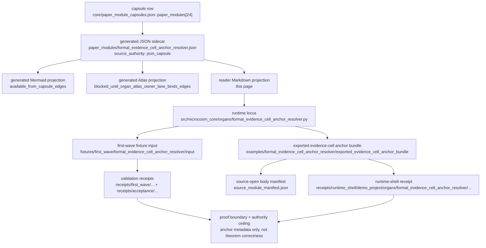

# Formal Evidence Cell Anchor Resolver

`formal_evidence_cell_anchor_resolver` makes Microcosm's formal-math evidence
claims inspectable without turning receipt summaries into proof authority. It
resolves paper-module claims to evidence-cell ids, checks source-anchor refs,
records machine-anchor classes, and enforces a claim-strength boundary before
any proof-language claim can pass. Its formal-math trace cell anchors the
real Ring2 verifier-trace repair receipts.

It is not a theorem prover. It does not execute Lean or Lake, expose proof
bodies, expose private source refs, call providers, or claim theorem
correctness. It emits real runtime receipts over the imported evidence-cell
substrate, carries digest-bearing Ring2 failure-taxonomy and graph-update
source refs, and uses secret-exclusion scanning only for credential-equivalent
or non-receipt body payloads.

## Purpose

Proof-adjacent prose is the easiest place for a claim to drift. A paper module
can write "this proves the theorem" or "this is certified" and a cold reader has
no cheap way to tell whether the words are backed by a checked artifact or by
nothing at all. This organ answers one question: when a claim uses proof
language, can the words be resolved to a specific piece of public evidence, and
does that evidence stay below theorem-correctness authority?

The mechanism is an evidence cell. A cell is a stable id that stands in for a
bundle of receipt-backed evidence: its source-anchor refs, a `machine_anchor_class`
that names what kind of machine artifact backs it, and the list of claim
strengths the cell is allowed to support. The policy
`proof_language_requires_machine_anchor` is the rule that makes the resolver
useful. A claim that uses proof language must name a cell, the cell must resolve
in the registry, and its source anchors must point at files that actually exist
on the public path. A claim that uses proof language but names no cell, or names
a cell that is not in the registry, lowers the run to a blocked status rather
than passing as green prose.

What is worth noticing is what the cell id buys. It is a compressed handle: one
short reference that a reader can follow back to the real receipts behind a
claim, instead of inlining proof bodies or trusting narrative. Two boundaries
sit on top of that handle. Claim strength is capped by the cell, so a claim
cannot assert more than its anchored evidence allows. And human approval is
refused as a substitute for a machine anchor, which keeps a sign-off from being
treated as proof.

## JSON Capsule Binding

Source authority for this reader page is `core/paper_module_capsules.json::paper_modules[24:paper_module.formal_evidence_cell_anchor_resolver]`; the generated instance is `paper_modules/formal_evidence_cell_anchor_resolver.json` with `source_authority: json_capsule`.

This Markdown is a reader projection over the capsule, not the authority plane. The generated Mermaid projection is `available_from_capsule_edges`, while the generated Atlas projection is `blocked_until_organ_atlas_owner_lane_binds_edges`; both statuses are builder-owned projections and do not expand the authority ceiling.

The proof boundary is evidence-cell anchor metadata and source-open runtime receipts only. A cold reader should not treat this page, Mermaid availability, Atlas status, or validation receipts as theorem correctness, proof-body import, private source-ref authority, human approval as proof authority, Lean/Lake execution, provider-call authority, publication approval, or release approval.

## Shape



Read the diagram left to right: the capsule and generated sidecar name the
relationships; the runtime validates fixture and bundle inputs; the receipts
show what passed; the authority ceiling prevents any of those surfaces from
becoming proof, release, provider, private-root, or theorem-correctness
authority.

## Reader Evidence Routing

A cold reader should inspect this module through these substrate surfaces, in
order:

1. Authority seed: `core/paper_module_capsules.json::paper_modules[24:paper_module.formal_evidence_cell_anchor_resolver]`.
   This is the capsule row that binds the Markdown projection, generated JSON,
   runtime locus, fixture, exported bundle, mechanism rows, and anti-claims.
2. Generated sidecar: `paper_modules/formal_evidence_cell_anchor_resolver.json`.
   Check `relationships.source_authority`, the 15 relationship edges, the
   `generated_projections` statuses, `unpopulated_selective_relations`, and
   the capsule-carried authority ceiling before trusting any prose summary.
3. Runtime locus: `src/microcosm_core/organs/formal_evidence_cell_anchor_resolver.py`.
   The relevant runtime symbols are `run`, `run_anchor_bundle`,
   `validate_source_module_manifest`, `_build_result`,
   `_source_module_summary_card`, `EXPECTED_NEGATIVE_CASES`,
   `AUTHORITY_CEILING`, `SOURCE_MODULE_MANIFEST_REF`, `BUNDLE_RESULT_NAME`,
   and `CARD_SCHEMA_VERSION`.
4. Fixture and exported bundle: `fixtures/first_wave/formal_evidence_cell_anchor_resolver/input`,
   `examples/formal_evidence_cell_anchor_resolver/exported_evidence_cell_anchor_bundle`,
   and `examples/formal_evidence_cell_anchor_resolver/exported_evidence_cell_anchor_bundle/source_module_manifest.json`.
   The first-wave fixture exercises negative cases and Ring2 receipt anchors;
   the exported bundle validates six source-open body modules by digest while
   keeping source bodies out of receipts.
5. Receipts: `receipts/first_wave/formal_evidence_cell_anchor_resolver/formal_evidence_cell_anchor_resolver_result.json`,
   `receipts/first_wave/formal_evidence_cell_anchor_resolver/evidence_cell_anchor_board.json`,
   `receipts/first_wave/formal_evidence_cell_anchor_resolver/formal_evidence_cell_anchor_resolver_validation_receipt.json`,
   `receipts/acceptance/first_wave/formal_evidence_cell_anchor_resolver_fixture_acceptance.json`,
   and `receipts/runtime_shell/demo_project/organs/formal_evidence_cell_anchor_resolver/exported_evidence_cell_anchor_bundle_validation_result.json`.
   These receipts report pass/fail state, body-free public refs, negative-case
   observations, and explicit `release_authorized=false`,
   `provider_calls_authorized=false`, `lean_lake_execution_authorized=false`,
   `formal_proof_authority=false`, and `theorem_correctness_authority=false`
   ceilings.
6. Focused checks: `tests/test_formal_evidence_cell_anchor_resolver.py`,
   `scripts/build_doctrine_projection.py --check-paper-module-corpus`, and the
   JSON-row proof query in the validation section below. Those checks validate
   the reader route and generated-row parity; they do not authorize publication
   or formal proof claims.

## Structured Lattice Bindings

The generated JSON row currently contributes 15 relationship edges: three
`paper_module.explains.organ_or_mechanism` edges, one
`paper_module.governed_by.concept` edge, five
`paper_module.governed_by.principle` edges, four
`paper_module.abides_by.axiom` edges, one sibling
`paper_module.depends_on.paper_module` edge, and one resolved
`paper_module.cites.code_locus` edge.

The Mermaid projection is `available_from_capsule_edges`; the Atlas projection remains `blocked_until_organ_atlas_owner_lane_binds_edges`. At this HEAD the generated row reports zero unresolved selective relations; future concept or dependency edges still belong in the JSON capsule row, not in Markdown prose.

## Governing Lattice Relation

The lattice edge is not just that this page "mentions" formal math evidence.
The generated sidecar binds the page to one organ, two mechanism rows,
`concept.formal_math_and_proof_witness_bundle`, `P-1`, `P-2`, `P-3`, `P-6`,
`P-8`, `AX-1`, `AX-2`, `AX-5`, `AX-7`, the sibling
`paper_module.formal_math_verifier_trace_repair_loop`, and the resolved runtime
source locus. That is the governing shape: proof-adjacent claims enter as
paper-claim rows, evidence-cell ids, source anchors, machine-anchor classes,
and copied source-module manifests; `_build_result` recomputes the pass or
blocked status from those lower-level artifacts; `_source_module_summary_card`
and `run_anchor_bundle` export compact, body-free evidence.

`P-1` and `AX-1` require a recomputed checker result rather than a label.
`P-2` and `AX-2` keep the claim ceiling at the strength of the resolver and its
certificates. `P-3` makes the small resolver/manifest checker the authority
surface instead of broad proof-language prose. `P-6`, `P-8`, `AX-5`, and `AX-7`
explain the blocked path: missing anchors, proof bodies, private source refs,
source-module digest drift, theorem-correctness language, or human approval as
proof authority must lower the status or return a refusal with evidence rather
than preserving a green reader claim.

The focused proof consumer is
`tests/test_formal_evidence_cell_anchor_resolver.py`. It asserts the fixture
path observes all seven expected negative cases, resolves three claims to three
evidence cells, records eight source anchors and three machine anchors, anchors
the verifier-trace row to Ring2 receipts, keeps formal-proof and
theorem-correctness authority false, validates the exported bundle with six
copied source modules, rejects theorem-correctness overclaims, rejects digest
and rehashed-body swaps, and keeps command-card receipts compact and body-free.
Those checks are the local mechanism witness for the lattice relation.

## Prior Art Grounding

This organ is grounded in provenance and proof-certificate work where claims
must point at checkable evidence rather than untyped narrative. The
[W3C PROV](https://www.w3.org/TR/prov-overview/) model is a general anchor for
linking entities, activities, and agents in an evidence graph, while
[Proof-Carrying Code](https://www.usenix.org/legacy/publications/library/proceedings/osdi96/full_papers/necula/html/node2.html)
and small-kernel proof assistants motivate separating a certificate or anchor
from the trusted checker that bounds its meaning.

Microcosm borrows the anchor-resolution pattern: proof-language claims must
name evidence-cell ids, source anchors, machine-anchor classes, and claim
strength limits. It does not turn metadata cells into theorem-correctness
authority.

## Runtime

- Organ runner: `python -m microcosm_core.organs.formal_evidence_cell_anchor_resolver run --input fixtures/first_wave/formal_evidence_cell_anchor_resolver/input --out receipts/first_wave/formal_evidence_cell_anchor_resolver`
- Exported bundle runner: `python -m microcosm_core.organs.formal_evidence_cell_anchor_resolver run-anchor-bundle --input examples/formal_evidence_cell_anchor_resolver/exported_evidence_cell_anchor_bundle --out receipts/runtime_shell/demo_project/organs/formal_evidence_cell_anchor_resolver`
- CLI: `microcosm formal-evidence-cell-anchor-resolver run-anchor-bundle --input examples/formal_evidence_cell_anchor_resolver/exported_evidence_cell_anchor_bundle --out receipts/runtime_shell/demo_project/organs/formal_evidence_cell_anchor_resolver`
- Standard: `standards/std_microcosm_formal_evidence_cell_anchor_resolver.json`
- Fixture manifest: `core/fixture_manifests/formal_evidence_cell_anchor_resolver.fixture_manifest.json`

## Source-Open Body Floor

The exported bundle carries a source-open body floor at
`examples/formal_evidence_cell_anchor_resolver/exported_evidence_cell_anchor_bundle/source_module_manifest.json`.
It imports the paper-module formal-evidence auditor, formal evidence-cell
registry builder, focused runtime tests, public formal-evidence registry state,
Erdos257 issue217 evidence-cell manifest, and the `std_paper_module`
formal-evidence-cell contract body. Receipts and workingness cards expose
digests and validation status, not body text, proof bodies, provider payloads,
private refs, oracle material, or theorem-correctness authority.

## What It Establishes As Evidence Routing

- Proof-language claims must resolve to a public evidence cell before this
  reader treats them as routed evidence.
- Evidence cells must carry source-anchor refs.
- Machine-anchor metadata is visible as metadata, not proof correctness.
- Claim strength is bounded by the resolved cell.
- Secret, credential-equivalent, or non-receipt body payloads must have explicit
  exclusion receipts.
- The verifier-trace cell is anchored to the first-wave
  `formal_math_verifier_trace_repair_loop` result, board, validation receipt,
  and Ring2 failure-taxonomy source digest.

## What It Refuses

- Unknown evidence-cell ids used as proof authority.
- Proof-language claims without evidence-cell ids.
- Proof bodies in public claim rows.
- Private source refs in public claim or cell rows.
- Human approval as proof authority.
- Theorem-correctness claims from metadata cells.
- Release, publication, secret export, or provider authority.

## Limitations

This module is a proof-adjacent evidence router, not a proof system. The
fixture proves a bounded resolver contract over three paper claims, three
evidence cells, seven declared negative-case classes, eight source anchors,
three machine anchors, and zero copied source modules in fixture mode. The
exported bundle proves the same public runtime shape over three claims, three
evidence cells, five source anchors, six copied source-open body modules, and
body-free receipts. These counts are the claim boundary, not a scale claim about
the formal-math corpus.

The source-module proof is digest and authority-ref parity for the six exported
body modules named by the bundle manifest. It does not prove that every macro
formal-math source file has been imported, that future source drift is absent,
or that copied body availability confers public release authority. A digest
match also does not authorize exporting proof bodies, private source refs,
provider payloads, oracle material, credentials, browser/HUD/cockpit state, or
raw operator voice.

The checker rejects unknown cells, missing source anchors, proof language
without cells, private refs, proof bodies, theorem-correctness overclaims, and
human approval as proof authority. That refusal coverage does not certify Lean
or Lake execution, theorem correctness, proof completeness, benchmark
performance, production readiness, or whole-system correctness. The generated
Atlas projection is still `blocked_until_organ_atlas_owner_lane_binds_edges`;
this Markdown page may explain that status but cannot repair it or upgrade it.

## Validation Receipt Path

Validate the reader projection from the repo root without mutating durable
receipt or generated projection surfaces:

```bash
./repo-pytest microcosm-substrate/tests/test_formal_evidence_cell_anchor_resolver.py -q --basetemp=/tmp/microcosm_formal_evidence_cell_anchor_resolver_pytest
./repo-python microcosm-substrate/scripts/build_doctrine_projection.py --check-paper-module-corpus
jq '{edge_count:(.relationships.edges|length), mermaid_status:.paper_module_payload.generated_projections.mermaid.status, atlas_status:.paper_module_payload.generated_projections.atlas_card.status, source_authority:.relationships.source_authority, unresolved_selective_relation_count:(.relationships.unpopulated_selective_relations|length)}' microcosm-substrate/paper_modules/formal_evidence_cell_anchor_resolver.json
```

Expected generated-row proof: `edge_count: 15`,
`mermaid_status: available_from_capsule_edges`,
`atlas_status: blocked_until_organ_atlas_owner_lane_binds_edges`,
`source_authority: json_capsule`, and
`unresolved_selective_relation_count: 0`.

## Receipt Expectations

A complete local receipt for this page includes the focused pytest, the paper-module corpus check, the generated-row proof above, and the runtime receipt paths listed below. It should preserve the Atlas blocked status as a projection gap until the organ-atlas owner lane binds it; this Markdown page may explain the gap but must not hand-edit the generated Atlas surface.

## Receipts

- `receipts/first_wave/formal_evidence_cell_anchor_resolver/formal_evidence_cell_anchor_resolver_result.json`
- `receipts/first_wave/formal_evidence_cell_anchor_resolver/evidence_cell_anchor_board.json`
- `receipts/first_wave/formal_evidence_cell_anchor_resolver/formal_evidence_cell_anchor_resolver_validation_receipt.json`
- `receipts/acceptance/first_wave/formal_evidence_cell_anchor_resolver_fixture_acceptance.json`

## Authority Ceiling

The authority boundary is evidence-cell anchor resolution backed by real runtime
receipts. The organ makes claim boundaries legible; it does not certify
mathematical truth.

## Claim Ceiling

This module supports only the reader-verifiable claim that public evidence-cell
anchor metadata can bind proof-language claims to receipt-backed cells and
exclude private bodies, proof bodies, provider payloads, oracle material, and
secret-equivalent refs. Its generated Mermaid/Atlas statuses and relationship
counts are JSON-capsule projections; they do not certify theorem correctness,
proof completeness, release readiness, publication approval, provider
authority, or whole-system correctness.
