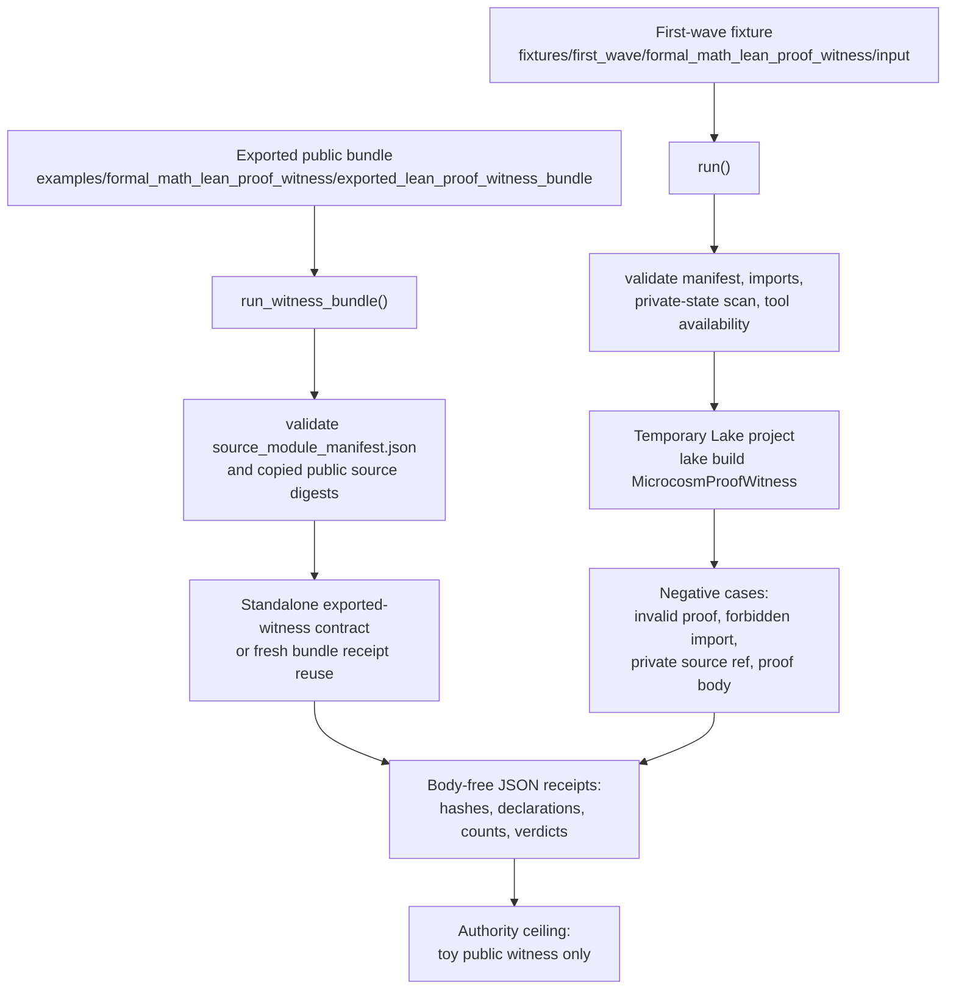

# Formal Math Lean Proof Witness

## Teleology

`formal_math_lean_proof_witness` is now the bounded public crossing from
formal-math readiness into an actual local Lean/Lake run. It exists so a cold
reader can see Microcosm compile a tiny synthetic proof witness with the
installed toolchain while the receipts stay redacted, public-relative, and
honest about the narrow authority boundary.

## JSON Capsule Binding

Source authority for this reader page is `core/paper_module_capsules.json::paper_modules[22:paper_module.formal_math_lean_proof_witness]`; the generated instance is `paper_modules/formal_math_lean_proof_witness.json` with `source_authority: json_capsule`.

This Markdown is a reader projection over the capsule, not the authority plane. The generated Mermaid projection is `available_from_capsule_edges`, while the generated Atlas projection is `blocked_until_organ_atlas_owner_lane_binds_edges`; both statuses are builder-owned projections and do not expand the authority ceiling.

The proof boundary is declared public toy Lean/Lake fixture receipts only. A cold reader should not treat this page, Mermaid availability, Atlas status, or validation receipts as Mathlib/Aesop/Batteries authority, general theorem correctness, private proof import, provider-call authority, benchmark performance, publication approval, release approval, source mutation authority, or whole-system correctness.

## Shape



## Structured Lattice Bindings

The generated JSON row currently contributes eight relationship edges: three
`paper_module.explains.organ_or_mechanism` edges, one
`paper_module.governed_by.concept` edge, one
`paper_module.governed_by.principle` edge, one `paper_module.abides_by.axiom`
edge, one `paper_module.depends_on.paper_module` edge, and one resolved
`paper_module.cites.code_locus` edge.

The Mermaid projection is `available_from_capsule_edges`; the Atlas projection remains `blocked_until_organ_atlas_owner_lane_binds_edges`. At this HEAD the generated row reports zero unresolved selective relations; future concept or dependency edges still belong in the JSON capsule row, not in Markdown prose.

Concrete substrate bindings:

- Capsule row: `core/paper_module_capsules.json::paper_modules[22:paper_module.formal_math_lean_proof_witness]`
- Generated JSON sidecar: `paper_modules/formal_math_lean_proof_witness.json`
- Runtime locus: `src/microcosm_core/organs/formal_math_lean_proof_witness.py`
- Resolved runtime symbols: `run`, `run_witness_bundle`, `validate_source_module_imports`, `_build_result`, `EXPECTED_NEGATIVE_CASES`, `AUTHORITY_CEILING`, and `SOURCE_MODULE_MANIFEST_NAME`
- Fixture input: `fixtures/first_wave/formal_math_lean_proof_witness/input`
- Exported bundle: `examples/formal_math_lean_proof_witness/exported_lean_proof_witness_bundle`
- Exported source-module manifest: `examples/formal_math_lean_proof_witness/exported_lean_proof_witness_bundle/source_module_manifest.json`
- Focused test surface: `tests/test_formal_math_lean_proof_witness.py`
- Corpus validator: `scripts/build_doctrine_projection.py --check-paper-module-corpus`

## Governing Lattice Relation

The capsule binds this module to
`concept.formal_math_and_proof_witness_bundle`: public proof-adjacent language
must pass through explicit witness artifacts before it becomes reader evidence.
Here the witness artifacts are the temporary Lake project copy, local Lean/Lake
tool probes, `lake build MicrocosmProofWitness`, source hashes, declaration
metadata, source-module manifest checks, negative-case observations, and
body-free receipts. The Markdown page explains that lattice; it does not
upgrade the generated JSON row, the local toolchain, or the copied source body
floor into theorem authority.

`P-3` is the governing principle edge for claim discipline. The mechanism rows
do not ask a reader to trust a proof story from prose; they route the claim
through `run`, `run_witness_bundle`, `validate_source_module_imports`,
`_build_result`, `EXPECTED_NEGATIVE_CASES`, `AUTHORITY_CEILING`, and
`SOURCE_MODULE_MANIFEST_NAME`. Those symbols are the mechanism's concrete
boundary: they decide which public source refs may be copied, which imports are
blocked, which negative cases count, and which receipt fields may be exposed.

`AX-2` supplies the hard law boundary. Public proof claims stay inside declared
fixture evidence, public-relative refs, source digests, declaration counts,
tool-return metadata, and negative-case verdicts. Proof bodies, provider
payloads, private source refs, stdout/stderr bodies, private macro-root
material, release decisions, and whole-system correctness remain outside the
module's authority even when the focused test and corpus check are green.

The dependency on `paper_module.corpus_readiness_mathlib_absence_gate` prevents
the most tempting overread. This witness intentionally rejects Mathlib, Aesop,
and Batteries imports until a different authority ceiling exists. A reader can
therefore interpret the module as a toy Lean/Lake execution cell upstream of
larger formal-math organs, not as evidence that Microcosm can certify
Mathlib-dependent theorem work.

## Reader Evidence Routing

Route capsule/currentness questions through `## JSON Capsule Binding`, the
capsule row, and the generated JSON sidecar. The expected generated-row evidence
is `source_authority: json_capsule`, `edge_count: 8`, Mermaid
`available_from_capsule_edges`, Atlas
`blocked_until_organ_atlas_owner_lane_binds_edges`, and zero unresolved
selective relations. That evidence proves reader wiring and source authority
placement, not theorem correctness.

Route runtime questions through the runtime locus and the two public input
surfaces. The first-wave fixture runs `run()` against the public Lake project and
checks the four expected negative cases. The exported bundle runs
`run_witness_bundle()` against copied public source modules, validates
`source_module_manifest.json`, and records digest/source-module status without
placing proof bodies in JSON receipts.

Route receipt and test questions through the required receipt paths, the focused
pytest, and the corpus check. The focused test asserts local Lake build success
for the tiny witness when Lean/Lake are available, eight compiled declarations,
four negative-case observations for the fixture, public-relative redacted
receipts, five exported source-module rows, source digest checks, body-free
receipt policy, and tamper-blocking behavior. Those validation receipts do not
authorize Mathlib-dependent proofs, provider calls, private proof import,
benchmark claims, release readiness, production readiness, publication, hosted
deployment, source mutation, or private-root equivalence.

## Public Contract

The organ copies `examples/formal_math_lean_proof_witness/exported_lean_proof_witness_bundle`
or the first-wave fixture Lake project into a temporary workspace and runs
`lake build`. The public receipt records tool availability, Lake build status,
source hashes, declaration names, line counts, negative-case coverage, and the
authority ceiling. It does not export proof bodies in JSON receipts.

The accepted witness scope is deliberately small:

- public synthetic Lean source is allowed;
- JSON manifests and receipts may not embed proof bodies;
- Mathlib, Aesop, and Batteries imports are rejected until a wider authority
  ceiling exists;
- private source refs, provider payloads, oracle proofs, and private macro run
  bodies remain outside the public root.

## Prior Art Grounding

This organ is grounded in the Lean proof-assistant lineage and the broader
small-kernel theorem-proving tradition. The
[Lean theorem prover system description](https://www.microsoft.com/en-us/research/publication/the-lean-theorem-prover-system-description/)
anchors the local Lean/Lake witness route, and the
[Lean mathematical library](https://arxiv.org/abs/1910.09336) shows why proof
authority depends on explicit imports, declarations, and checked environments.

Microcosm borrows the proof-witness discipline: a local toolchain run, source
hashes, declarations, negative cases, and body-free receipts must be visible
before Lean witness language is allowed. It does not claim Mathlib-dependent
proof authority or benchmark performance.

## Receipt Expectations

The owner command is:

```bash
PYTHONPATH=src python3 -m microcosm_core.organs.formal_math_lean_proof_witness run --input fixtures/first_wave/formal_math_lean_proof_witness/input --out receipts/first_wave/formal_math_lean_proof_witness
```

The runtime-shell bundle command is:

```bash
PYTHONPATH=src python3 -m microcosm_core.cli formal-math-lean-proof-witness run-witness-bundle --input examples/formal_math_lean_proof_witness/exported_lean_proof_witness_bundle --out receipts/runtime_shell/demo_project/organs/formal_math_lean_proof_witness
```

Required receipts include:

- `receipts/first_wave/formal_math_lean_proof_witness/formal_math_lean_proof_witness_result.json`
- `receipts/first_wave/formal_math_lean_proof_witness/lean_proof_witness_board.json`
- `receipts/first_wave/formal_math_lean_proof_witness/formal_math_lean_proof_witness_validation_receipt.json`
- `receipts/acceptance/first_wave/formal_math_lean_proof_witness_fixture_acceptance.json`

A complete local receipt also includes the focused pytest, the paper-module corpus check, and generated-row proof showing `edge_count: 8`, Mermaid `available_from_capsule_edges`, Atlas `blocked_until_organ_atlas_owner_lane_binds_edges`, `source_authority: json_capsule`, and zero unresolved selective relations.

## Validation Receipt Path

Validate the reader projection from the repo root without mutating durable
receipt or generated projection surfaces:

```bash
./repo-pytest microcosm-substrate/tests/test_formal_math_lean_proof_witness.py -q --basetemp=/tmp/microcosm_formal_math_lean_proof_witness_pytest
./repo-python microcosm-substrate/scripts/build_doctrine_projection.py --check-paper-module-corpus
jq '{edge_count:(.relationships.edges|length), mermaid_status:.paper_module_payload.generated_projections.mermaid.status, atlas_status:.paper_module_payload.generated_projections.atlas_card.status, source_authority:.relationships.source_authority, unresolved_selective_relation_count:(.relationships.unpopulated_selective_relations|length)}' microcosm-substrate/paper_modules/formal_math_lean_proof_witness.json
```

Expected generated-row proof: `edge_count: 8`,
`mermaid_status: available_from_capsule_edges`,
`atlas_status: blocked_until_organ_atlas_owner_lane_binds_edges`,
`source_authority: json_capsule`, and
`unresolved_selective_relation_count: 0`.

## Limitations

This module is a bounded public witness, not a formal-proof authority. Its
positive evidence is one declared toy Lean/Lake fixture, one exported public
witness bundle, five copied source-module body rows, local toolchain metadata,
eight compiled declarations when Lean/Lake are available, and four expected
negative-case observations. That evidence is enough to show the mechanism's
receipt discipline; it is not enough to prove arbitrary Lean goals, Mathlib
coverage, theorem correctness, benchmark performance, or private proof import
equivalence.

The copied-body floor is public but narrow. Receipts may cite source refs,
hashes, material classes, declaration names, counts, manifest verdicts,
tool-return summaries, and authority-ceiling fields. They may not embed proof
bodies, provider payloads, oracle answers, private source refs, raw command
output bodies, credentials, account/session state, or private macro-root
material. The source-open claim is therefore limited to the declared public
fixture and exported bundle body classes.

The focused regression validates the stated fixture and exported-bundle shape.
It checks streaming source scans, tool-version caching, temporary Lake project
reuse, Lake build behavior, public-relative redacted receipts, source-module
digest parity, standalone exported-bundle handling, tamper rejection, negative
case coverage, and the generated-row proof. It does not authorize future
fixture families, Atlas/site publication, source mutation, release, or a
larger formal-math proof claim without the owning builder and release lanes.

## Authority Ceiling

This module authorizes only a tiny public fixture witness compiled by local
Lean/Lake in a temporary workspace. It does not authorize Mathlib-dependent
proofs, provider calls, private proof import, benchmark performance claims,
release operations, hosted deployment, publication, recipient work,
secret export, or whole-system correctness.

## Claim Ceiling

This module supports only the reader-verifiable claim that a tiny public Lean
fixture witness can run in a temporary local workspace, emit body-free receipts,
and expose source hashes, declarations, and negative cases. It does not prove
Mathlib-dependent theorems, benchmark performance, provider outputs, private
proof imports, release readiness, hosted deployment, publication approval,
secret export safety, or whole-system correctness.
