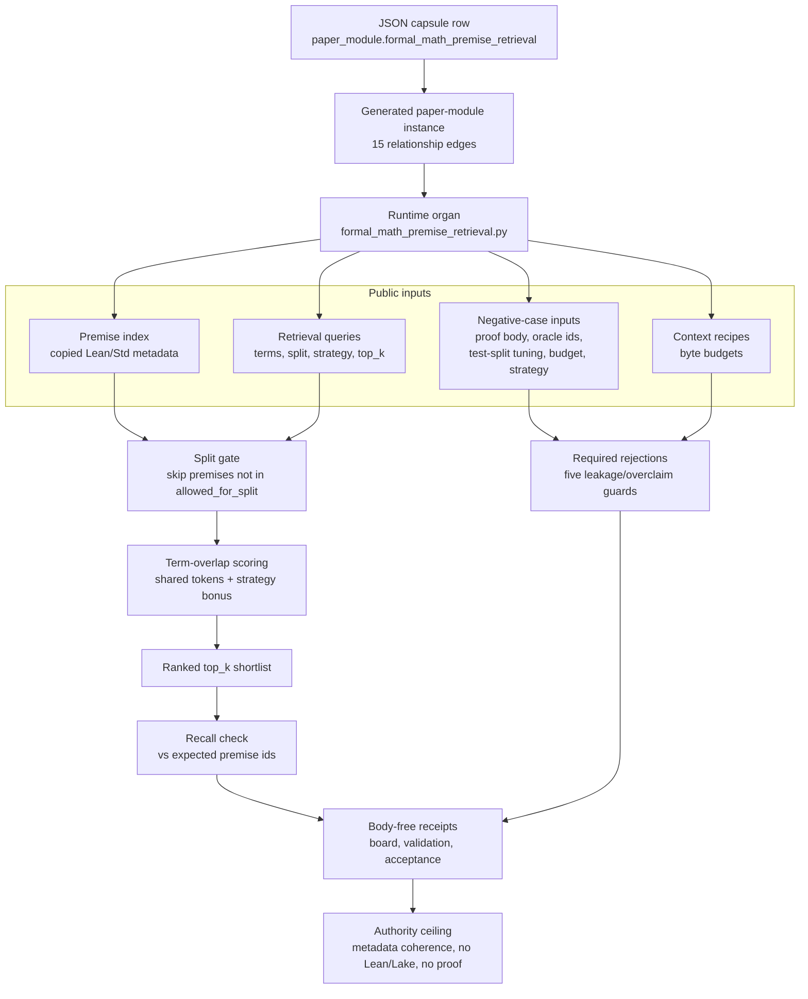

# Formal Math Premise Retrieval

`formal_math_premise_retrieval` is the source-available first real formal-math
import slice after the macro projection protocol. It turns the macro prover
lab's premise-index, term-scoring, context-budget, and strategy-selection
patterns into a runnable Microcosm organ.

It is still deliberately below proof authority. It validates:

- Lean/Std premise metadata;
- query term scoring across public premise ids, namespaces, declaration names,
  statement excerpts, and retrieval terms;
- split eligibility;
- context recipe budgets;
- public strategy ids;
- redacted receipts;
- negative cases.

It does not run Lean or Lake, call providers, expose proof bodies, expose
oracle-needed premise ids, tune on test split truth, claim theorem correctness,
or authorize release.

## Purpose

Before a model can attempt a formal proof, it has to find the right lemmas. A
Lean library holds thousands of theorems and definitions, and the useful ones
for a given goal are a handful. Premise selection is the step that narrows that
library down to candidates worth putting in front of a prover. This organ is the
smallest honest version of that step: it takes a query, scores every public
premise against it, and returns a ranked shortlist.

The single question it answers is narrow and checkable: given a copied catalogue
of public Lean/Std premise metadata, does a transparent term-scoring retrieval
return the premises a query should find, without ever touching a proof? Both
halves matter. The retrieval has to actually work, so each fixture query carries
the premise ids it is expected to surface and the run fails if the shortlist
misses them. And the boundary has to hold, so the same run refuses any input
that smuggles in a proof body, an oracle answer, or test-split truth.

What is unusual is the restraint. The retrieval index is not a learned
embedding model and the scoring is not a benchmark score. It is plain term
overlap over fields that a reader can inspect: premise ids, namespaces,
declaration names, statement excerpts, and retrieval terms. The interesting
claim is therefore not "this retrieves well" but "this retrieves over real,
copied Lean metadata and can be audited end to end, and the design forbids the
shortcuts that would make a premise-selection result look better than it is".

## JSON Capsule Binding

- Source row:
  `core/paper_module_capsules.json::paper_modules[25:paper_module.formal_math_premise_retrieval]`
- Generated instance: `paper_modules/formal_math_premise_retrieval.json` with
  `source_authority: json_capsule`
- Generated Mermaid projection: `available_from_capsule_edges`
- Generated Atlas projection: `blocked_until_organ_atlas_owner_lane_binds_edges`

This Markdown is a reader projection over the capsule, not the authority plane.
The generated Mermaid projection and generated Atlas projection are
builder-owned statuses. They do not expand the authority ceiling.

The proof boundary is copied public macro retrieval metadata and runtime
validation receipts only. A cold reader should not treat this page, Mermaid
availability, Atlas status, or validation receipts as theorem correctness,
proof-body import, oracle-needed premise authority, Mathlib authority, Lean/Lake
execution, provider-call authority, benchmark evidence, publication approval,
or release approval.

## Structured Lattice Bindings

The generated JSON row currently contributes 15 relationship edges:

- three `paper_module.explains.organ_or_mechanism` edges;
- one resolved `paper_module.cites.code_locus` edge;
- one sibling `paper_module.depends_on.paper_module` edge;
- one `paper_module.governed_by.concept` edge;
- five `paper_module.governed_by.principle` edges;
- four `paper_module.abides_by.axiom` edges.

The generated Mermaid projection is `available_from_capsule_edges`; the
generated Atlas projection remains
`blocked_until_organ_atlas_owner_lane_binds_edges`.

At this HEAD the generated row reports zero unresolved selective relations.
Future concept or dependency edges still belong in the JSON capsule row, not in
Markdown prose.

## Shape



Evidence/accounting:

- Capsule authority:
  `core/paper_module_capsules.json::paper_modules[25:paper_module.formal_math_premise_retrieval]`
  has `source_authority: json_capsule`, three `subjects`, one resolved
  `code_loci[0].path`, `depends_on` naming
  `paper_module.formal_math_lean_proof_witness`, and generated projection
  statuses for Markdown, Mermaid, and Atlas.
- Generated instance:
  `paper_modules/formal_math_premise_retrieval.json::paper_module_payload`
  repeats the capsule `authority_ceiling`, reports
  Mermaid status `available_from_capsule_edges`, and derives 15
  `relationships.edges` with
  `relationships.unpopulated_selective_relations: []`.
- Organ atlas:
  `core/organ_atlas.json::organs[9:formal_math_premise_retrieval]`
  classifies the organ in `family: formal_math_and_proof`, cites the runtime
  locus, and restates that retrieval metadata coherence is not Lean/Lake,
  provider, theorem-correctness, benchmark, or release authority.
- Mechanism rows:
  `core/mechanism_sources.json::mechanisms[27:mechanism.formal_math_premise_retrieval.validates_public_premise_retrieval_slice]`
  and
  `core/mechanism_sources.json::mechanisms[37:mechanism.formal_math_premise_retrieval.validates_public_premise_retrieval_projection]`
  point at `src/microcosm_core/organs/formal_math_premise_retrieval.py`
  and name first-wave, acceptance, and runtime-shell receipt refs.
- Runtime and tests:
  `src/microcosm_core/organs/formal_math_premise_retrieval.py` exposes
  `run`, `run_retrieval_bundle`, `EXPECTED_NEGATIVE_CASES`, and
  `AUTHORITY_CEILING`; `tests/test_formal_math_premise_retrieval.py`
  checks 11 premises, 4 queries, 44 considered candidates, five negative
  cases, body-free receipts, and compact runtime-shell cards.
- Receipts:
  `receipts/first_wave/formal_math_premise_retrieval/formal_math_premise_retrieval_result.json`
  records `status: pass`, 11 premises, 4 queries, 44 considered candidates,
  five observed negative cases, `missing_negative_cases: []`, and a
  secret-exclusion scan with `blocking_hit_count: 0`; the exported runtime
  receipt at
  `receipts/runtime_shell/demo_project/organs/formal_math_premise_retrieval/exported_premise_retrieval_bundle_validation_result.json`
  records `status: pass`, the same premise/query/candidate counts, no negative
  cases, and `secret_exclusion_scan.scanned_path_count: 11`.
- Standard ceiling:
  `standards/std_microcosm_formal_math_premise_retrieval.json::authority_ceiling`
  has `status: pass` while keeping `formal_proof_authority`,
  `lean_lake_authority`, `provider_authority`, and `release_authority` false.

## Runtime Surfaces

- Organ runner:
  `python -m microcosm_core.organs.formal_math_premise_retrieval run --input fixtures/first_wave/formal_math_premise_retrieval/input --out receipts/first_wave/formal_math_premise_retrieval`
- Exported bundle runner:
  `python -m microcosm_core.organs.formal_math_premise_retrieval run-retrieval-bundle --input examples/formal_math_premise_retrieval/exported_premise_retrieval_bundle --out receipts/runtime_shell/demo_project/organs/formal_math_premise_retrieval`
- CLI route: `microcosm formal-math-premise-retrieval run-retrieval-bundle`
- Standard: `standards/std_microcosm_formal_math_premise_retrieval.json`
- Fixture manifest: `core/fixture_manifests/formal_math_premise_retrieval.fixture_manifest.json`

## Public Claim

Microcosm can now show a real formal-math retrieval mechanism in miniature:

- a source-available Lean/Std premise index;
- public field-haystack term-scored queries;
- split-aware eligibility;
- context recipe ceilings;
- strategy gates;
- redacted validation receipts.

## How retrieval scoring works

Each premise row contributes five inspectable fields to the haystack: its
premise id, namespace, declaration name, statement excerpt, and a list of
retrieval terms. A query carries its own terms, a data split, an optional
strategy id, a context recipe, and the public premise ids it is expected to
return.

Scoring is term overlap, computed per query. Both the query and each premise are
tokenised into lowercase word counts. A premise is only considered if the
query's split appears in that premise's `allowed_for_split` list, which is how
test-split leakage is kept out at the structural level rather than by trust. For
each eligible premise the score is the summed minimum count of every shared
token across the five fields, so a term that appears in both the query and the
premise contributes as many points as the smaller of the two counts. A premise
that also carries the query's strategy id as a tag gets a single extra point.
The ranked list is sorted by score descending, ties broken by premise id, and
the top of that list up to the query's `top_k` is taken as the retrieval.

The retrieval is then graded against itself. Each query declares the public
premise ids it should surface, and the organ computes recall as the fraction of
those expected ids that actually landed in the shortlist. A query that declares
expectations but misses any of them blocks the run. In the first-wave fixture
this is eleven premises and four queries, scoring forty-four considered
candidates in total, and every query is expected to reach full recall.

The failure mode this guards against is a premise-selection result that looks
good because it cheated. The five negative-case inputs each encode one such
shortcut: a premise index that ships a proof body, a query that lists the oracle
premise ids it is "meant" to find, a query that tunes on test-split truth, a
context recipe that blows past the byte budget, and a query naming a strategy id
outside the allowed set. The run is required to observe all five rejections; if
any expected rejection is missing, the whole fixture is blocked rather than
passed. Recall over copied real metadata is the positive signal; the refusals
are what keep that signal honest.

## Prior Art Grounding

This organ is grounded in premise-selection and retrieval-augmented theorem
proving work. [LeanDojo](https://arxiv.org/abs/2306.15626) is the closest modern
anchor because it couples Lean interaction with retrieval-augmented premise
selection. Earlier theorem-proving environments such as
[HOList](https://arxiv.org/abs/1904.03241) and
[GamePad](https://arxiv.org/abs/1806.00608) also motivate extracting proof-state
or premise metadata for learning-assisted theorem proving.

Microcosm borrows the retrieval accounting pattern: premise ids, namespaces,
statement excerpts, retrieval terms, split eligibility, context budgets, and
strategy gates must be inspectable before premise-retrieval claims are admitted.
It does not run Lean/Lake or expose proof bodies.

## Negative Cases

- `premise_index_proof_body_forbidden`
- `query_oracle_ids_forbidden`
- `test_split_tuning_attempt`
- `context_recipe_budget_overflow`
- `unknown_strategy_id`

## Receipt Expectations

A complete local receipt includes:

- the focused pytest;
- the paper-module corpus check;
- generated-row proof with `edge_count: 15`;
- Mermaid `available_from_capsule_edges`;
- Atlas `blocked_until_organ_atlas_owner_lane_binds_edges`;
- `source_authority: json_capsule`;
- zero unresolved selective relations.

Runtime receipts may prove metadata coherence and leakage checks. They do not
become proof or Lean/Lake authority.

## Validation Receipt Path

Validate the reader projection from the repo root without mutating durable
receipt or generated projection surfaces:

```bash
./repo-pytest microcosm-substrate/tests/test_formal_math_premise_retrieval.py -q --basetemp=/tmp/microcosm_formal_math_premise_retrieval_pytest
./repo-python microcosm-substrate/scripts/build_doctrine_projection.py --check-paper-module-corpus
```

## Authority Ceiling

The organ proves only that public retrieval metadata is internally coherent and
leakage-checked. The deferred `formal_math_lean_proof_witness` boundary remains
unchanged.

## Claim Ceiling

This module supports only the reader-verifiable claim that public premise
metadata, retrieval terms, split eligibility, strategy gates, and redacted
receipts are coherent and leakage-checked. It does not run Lean or Lake, prove
theorem correctness, expose proof bodies, authorize oracle-needed premise ids,
tune on test split truth, call providers, approve publication, or expand the
deferred Lean proof-witness boundary.

## Reader Evidence Routing

- Start with the JSON Capsule Binding to identify the capsule row, generated
  instance, proof boundary, and authority ceiling.
- Use Structured Lattice Bindings for navigation; the generated JSON row is
  the authority for relationship counts and dependency state.
- Use Runtime Surfaces and Receipt Expectations when checking metadata
  coherence, redaction, leakage checks, and source-available bundle behavior.
- Use Negative Cases, Authority Ceiling, and Claim Ceiling together before
  admitting any formal-math public claim.

## Re-Entry Conditions

Re-enter this module when:

- `core/paper_module_capsules.json` changes the formal-math premise retrieval
  capsule row;
- `paper_modules/formal_math_premise_retrieval.json` changes edge count,
  projection status, source authority, or unresolved selective relation status;
- fixture inputs, source-module manifests, or runtime receipts change retrieval
  terms, context budget fields, strategy ids, redaction posture, or leakage
  checks;
- the fixture adds or removes a negative case;
- receipts make forbidden claims of Lean/Lake execution, proof-body import,
  theorem correctness, provider calls, benchmark authority, publication
  approval, or release approval.

On re-entry, patch the owning capsule, runner, fixture, source manifest, or
receipt lane first. Then rerun the focused tests and update this reader
projection only after the source-backed evidence is verified.
