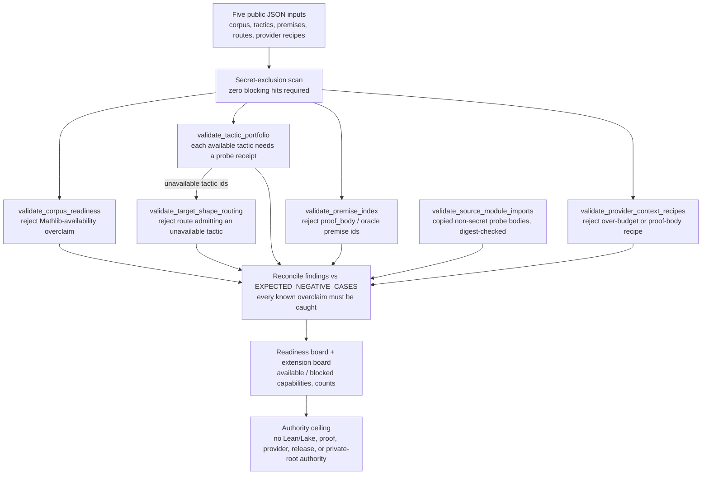

# Formal Math Readiness Gate

## Teleology

`formal_math_readiness_gate` is the public runtime cell that turns the formal
math slice from a deferred slogan into an executable boundary. It validates
synthetic readiness metadata for corpus availability, tactic probes, premise
indexes, target-shape routing, and provider context recipes before any future
Lean witness can claim authority.

The page should let a cold reader answer one question without rereading the
organ: what evidence has Microcosm actually validated, and where does that
evidence stop?

## Purpose

Formal-math tooling fails quietly when a library, tactic, or corpus is assumed
present rather than checked. A pipeline that routes a proof to `aesop` when
`aesop` is not actually available, or that treats a premise index as proof
evidence because it happens to carry a proof body, has already lost the boundary
between "ready to attempt" and "proven". This organ exists to make that boundary
explicit before any downstream proof work begins. It answers one question: which
declared formal-math inputs are well-formed and honest enough that a later proof
witness could safely consume them, and where exactly does that warrant stop?

The mechanism is a deterministic reducer over five public JSON inputs: corpus
readiness, tactic-portfolio availability, a premise index, target-shape routing,
and provider context recipes. It does not run Lean or Lake. Instead it reads
what those inputs declare and refuses the specific ways they can lie. A corpus
that claims Mathlib is available without a passing probe is rejected. A tactic
marked available without a probe receipt is rejected. A premise row carrying a
`proof_body` or `oracle_needed_premise_ids` field is rejected. A route that
admits a tactic the portfolio probe already marked unavailable is rejected. The
output is a readiness board, not theorem evidence.

The design choice worth noticing is that the gate proves its own discipline
through negative cases. Alongside the positive inputs, the fixture carries five
inputs that each commit a known overclaim, and the run passes only when every
one of those overclaims is caught and no unexpected finding appears. The gate is
therefore not merely asserting "we check Mathlib availability"; it is
demonstrating, on each run, that a falsified Mathlib claim is actually refused.
A second guard keeps the floor source-open without leaking: copied non-secret
prover probe bodies are verified by digest through a manifest, while proof
bodies, provider payloads, and private state stay out of the receipts entirely.

## JSON Capsule Binding

Source authority for this reader page is `core/paper_module_capsules.json::paper_modules[21:paper_module.formal_math_readiness_gate]`; the generated instance is `paper_modules/formal_math_readiness_gate.json` with `source_authority: json_capsule`.

This Markdown is a reader projection over the capsule, not the authority plane. The generated Mermaid projection is `available_from_capsule_edges`, while the generated Atlas projection is `blocked_until_organ_atlas_owner_lane_binds_edges`; both statuses are builder-owned projections and do not expand the authority ceiling.

The proof boundary is public readiness metadata, copied non-secret PROVER smoke-run readiness/probe artifacts, public organ source body floor, fixture receipts, and exported-bundle receipts only. A cold reader should not treat this page, Mermaid availability, Atlas status, or validation receipts as Lean/Lake execution, formal proof authority, theorem correctness, provider-call authority, private proof-body import, publication approval, or release approval.

## Shape



The diagram is the reader projection. The machine graph remains the generated
`paper_module.formal_math_readiness_gate.mermaid` projection derived from the
capsule row, not from this hand-authored Mermaid block.

## Reader Evidence Routing

Read this module in evidence order:

1. Start at `core/paper_module_capsules.json::paper_modules[21:paper_module.formal_math_readiness_gate]`. That row names the source authority, subjects, mechanism refs, code locus, Microcosm concept/principle/axiom refs, generated projection statuses, and the capsule authority ceiling.
2. Check the generated sidecar `paper_modules/formal_math_readiness_gate.json`. Its `relationships.edges` cite the capsule source refs and show the generated Mermaid status, Atlas status, `source_authority: json_capsule`, and unresolved selective-relation count.
3. Inspect the runtime locus `src/microcosm_core/organs/formal_math_readiness_gate.py`, especially `run`, `run_readiness_bundle`, `validate_source_module_imports`, `write_receipts`, `EXPECTED_NEGATIVE_CASES`, `AUTHORITY_CEILING`, and `SOURCE_MODULE_MANIFEST_NAME`.
4. Use fixture evidence for the gate behavior: `fixtures/first_wave/formal_math_readiness_gate/input`, `receipts/first_wave/formal_math_readiness_gate/readiness_gate_result.json`, `formal_math_readiness_board.json`, `formal_math_readiness_extension_board.json`, `formal_math_readiness_validation_receipt.json`, and `receipts/acceptance/first_wave/formal_math_readiness_gate_fixture_acceptance.json`.
5. Use exported-bundle evidence for source-open body-floor claims: `examples/formal_math_readiness_gate/exported_formal_math_readiness_bundle/source_module_manifest.json`, `bundle_manifest.json`, `source_artifacts/`, `source_body_floor/source_modules/`, and `receipts/runtime_shell/demo_project/organs/formal_math_readiness_gate/exported_formal_math_readiness_bundle_validation_result.json`.
6. Use `microcosm-substrate/tests/test_formal_math_readiness_gate.py` for the behavioral receipt boundary. The tests cover negative cases, exported bundle acceptance, source-module digest and target-ref mismatch rejection, bounded command-card output, source-body omission from receipts, secret-exclusion/public-relative receipt paths, and non-writing plan preview.

Do not route a proof claim through this page. It routes readiness evidence,
receipt integrity, and source-body-floor accounting only.

## Technical Mechanism

The runtime is a deterministic readiness reducer over declared public inputs.
`run()` evaluates the first-wave fixture directory with positive and negative
JSON cases enabled; `run_readiness_bundle()` evaluates the exported public
bundle without fixture-negative cases and requires the bundle source-module
manifest. Both entrypoints call `_build_result()`, so the fixture and exported
bundle receipts share one authority ceiling, one secret scan, one source-module
digest checker, and one readiness-board schema.

`_build_result()` first loads the five public input families:
`corpus_readiness.json`, `tactic_portfolio_availability.json`,
`premise_index.json`, `target_shape_tactic_routing.json`, and
`provider_context_recipes.json`. It then scans those inputs plus any declared
source artifacts through `secret_exclusion_scan.scan_paths`, using the public
Microcosm forbidden-class policy. The scan is not advisory: the result can pass
only when the scan has zero blocking hits, source-module imports pass, all
expected fixture-negative cases are observed, and no unexpected positive-case
findings remain.

The mechanism is split into six validators:

- `validate_corpus_readiness()` records Lean and Mathlib readiness metadata and
  adds `lean_std_synthetic_core:mathlib` to blocked capabilities when Mathlib is
  unavailable. A Mathlib availability claim without a passing probe becomes
  `MATHLIB_AVAILABILITY_OVERCLAIM`.
- `validate_tactic_portfolio()` separates available from unavailable tactics and
  requires every available tactic to carry a probe receipt. Synthetic probe
  labels are accepted only when `_tactic_probe_realness_evidence()` binds them
  to copied source modules or fixture-manifest source-open evidence.
- `validate_premise_index()` admits premise rows as metadata only. It counts
  premises, namespaces, retrieval terms, and split eligibility, but rejects
  `proof_body`, `ground_truth_proof`, `provider_output_body`, and
  `oracle_needed_premise_ids`.
- `validate_target_shape_routing()` intersects each route case's allowed tactics
  with the unavailable tactics emitted by the portfolio validator. Any overlap
  becomes `ROUTING_ALLOWS_UNAVAILABLE_TACTIC`, so routing cannot silently
  re-enable a tactic that the probe plane blocked.
- `validate_provider_context_recipes()` records byte budgets and deliverable
  shape while rejecting public recipes over 32,768 bytes or recipes that allow
  proof bodies or provider-body material.
- `validate_source_module_imports()` verifies the exported bundle's
  `source_module_manifest.json`, target refs, source refs, line counts, target
  digests, source digests, exact-copy rows, and the two permitted public-safe
  private-path rewrites. It reports digest/ref failures without placing copied
  source bodies in receipts.

After the validators run, `_merge_observed()` and `_merge_findings()` compare
observed fixture failures against `EXPECTED_NEGATIVE_CASES`. This is the local
claim ceiling: the fixture run must prove that the known overclaims are caught,
while the exported-bundle run must prove that the positive public bundle has no
unexpected findings. `_build_extension_board()` then projects the accepted
metadata into the extension board: selected pattern ids, namespace and split
counts, tactic availability counts, Mathlib-dependent unavailable tactics,
blocked route cases, provider budgets, source-body import counts, the authority
ceiling, and the anti-claim.

Receipt writing preserves the same boundary. `write_receipts()` emits the gate
result, readiness board, extension board, validation receipt, and acceptance
receipt for fixture mode. `run_readiness_bundle()` emits the exported-bundle
receipt. The focused test suite asserts the mechanism rather than just file
existence: it checks the five expected negative case ids, local Lean/Lake probe
metadata with Mathlib unavailable, six available tactics with `aesop` blocked,
eleven premises, five route cases, three provider recipes, thirteen verified
source artifacts, source/target digest mismatch rejection, target-ref mismatch
rejection, secret-exclusion/public-relative receipt paths, and receipt omission
of copied body text.

## Public Contract

The organ does not run Lean or Lake. It consumes public JSON fixtures and
exported bundles, records which capabilities are available or blocked, rejects
Mathlib availability overclaims, rejects unprobed tactics, rejects premise
rows that contain proof bodies, rejects routes that admit unavailable tactics,
and rejects provider recipes that exceed the public budget or allow proof
bodies.

The accepted result is a readiness board. That board can tell a later organ
what is safe to attempt, but it is not proof evidence, benchmark evidence, or
permission to execute a theorem prover.

## Prior Art Grounding

This organ is grounded in formal-math benchmark and environment-readiness work
where the presence of a library, tactic, or corpus is not enough by itself.
[miniF2F](https://arxiv.org/abs/2109.00110) motivates explicit benchmark split
discipline for formal mathematics, [LeanDojo](https://arxiv.org/abs/2306.15626)
motivates reproducible theorem-proving environments, and
[mathlib](https://arxiv.org/abs/1910.09336) makes the availability of library
imports a concrete precondition rather than a vague capability claim.

Microcosm borrows the readiness-gate pattern: corpus availability, Mathlib
probes, tactic probes, premise indexes, target-shape routing, and context
budgets must be checked before downstream proof or retrieval language is
allowed. It does not authorize Lean execution or proof authority.

## Source-Open Body Floor

The exported readiness bundle carries thirteen public-safe PROVER smoke-run
readiness/probe bodies under `source_artifacts`. They cover corpus readiness,
tactic-affordance probe metadata, Mathlib and trace probes, and the copied
portfolio-core Lean probes used to decide which tactics are blocked or
available. Two JSON rows are public-safe private-path rewrites; those rows
retain source and target digests plus the rewrite mode.

The bundle also carries an exact public organ-source copy for
`src/microcosm_core/organs/formal_math_readiness_gate.py` under
`source_body_floor/source_modules`. Generated `state/runs` Lean artifacts are
runnable readiness evidence, not source-body authority. Neither floor places
body text in receipts or workingness cards, and neither imports provider
payload bodies, account/session state, browser/HUD live access, recipient-send
state, credentials, private proof bodies, or oracle-needed premise ids.

The source-module manifest and bundle manifest are the right surfaces for
body-floor inspection. The validation receipts intentionally carry status,
digests, counts, and public-relative refs rather than copied source bodies.

Wave 011 adds the explicit extension board for the macro intake cell
`formal_math_readiness_extensions`. The board is still metadata-only, but it is
more useful than the older flat counts: it records the selected pattern ids
(`lean_std_toolchain_premise_index`, `tactic_portfolio_availability_probe`,
`target_shape_tactic_routing_gate`), the macro projection intake ref, public
target refs, validation refs, namespace and split coverage for the premise
index, tactic availability status counts, Mathlib-dependent unavailable
tactics, target-shape routing admissibility, and provider context budgets.

## Claim Ceiling

This module may claim that Microcosm has a public readiness gate for formal
math substrate preparation. The valid claim is bounded to corpus availability,
Mathlib and tactic probe metadata, premise-index coverage, target-shape tactic
routing, provider context budget checks, extension-board pattern ids, public
PROVER smoke-run source artifacts, an exact public organ-source body floor, and
fixture or exported-bundle receipts.

The module must not claim Lean/Lake execution, theorem proving, formal proof
authority, theorem correctness, Mathlib-dependent proof success, benchmark
performance, provider-call execution, private proof-body import, oracle-needed
premise disclosure, source mutation, publication approval, hosted deployment,
recipient work, secret export, or whole-system correctness. Its strongest
release-facing statement is readiness-boundary enforcement over public metadata
and copied non-secret source artifacts.

## Structured Lattice Bindings

- Paper module id: `paper_module.formal_math_readiness_gate`
- Capsule authority: `core/paper_module_capsules.json::paper_modules[21:paper_module.formal_math_readiness_gate]`
- Markdown projection: `paper_modules/formal_math_readiness_gate.md`
- Generated instance: `paper_modules/formal_math_readiness_gate.json`
- Organ id: `formal_math_readiness_gate`
- Runtime locus: `src/microcosm_core/organs/formal_math_readiness_gate.py`
- Primary mechanism: `mechanism.formal_math_readiness_gate.validates_public_formal_math_readiness_bundle`
- Boundary mechanism: `mechanism.formal_math_readiness_gate.validates_public_readiness_boundary`
- Concept ref: `concept.formal_math_and_proof_witness_bundle`
- Principle refs: `P-1`, `P-2`, `P-3`, `P-6`, `P-8`
- Axiom refs: `AX-1`, `AX-2`, `AX-5`, `AX-7`
- Depends on: `paper_module.formal_math_lean_proof_witness`
- Governing standard: `standards/std_microcosm_formal_math_readiness_gate.json`
- Fixture input: `fixtures/first_wave/formal_math_readiness_gate/input`
- Exported bundle: `examples/formal_math_readiness_gate/exported_formal_math_readiness_bundle`
- Source artifact floor: `examples/formal_math_readiness_gate/exported_formal_math_readiness_bundle/source_artifacts`
- Organ source body floor: `examples/formal_math_readiness_gate/exported_formal_math_readiness_bundle/source_body_floor/source_modules`
- Acceptance receipt: `receipts/acceptance/first_wave/formal_math_readiness_gate_fixture_acceptance.json`
- Extension board receipt: `receipts/first_wave/formal_math_readiness_gate/formal_math_readiness_extension_board.json`
- Deferred downstream witness: `formal_math_lean_proof_witness`

## Governing Lattice Relation

The capsule binds this module to `concept.formal_math_and_proof_witness_bundle`
because the organ is not a theorem prover; it is the membrane that decides
which public formal-math inputs are safe enough for a later proof witness to
consume. The governing mechanisms split that membrane in two. The
`validates_public_formal_math_readiness_bundle` mechanism names the positive
bundle path: `run`, `run_readiness_bundle`, `validate_source_module_imports`,
and `write_receipts` validate the declared corpus, tactic, premise, routing,
provider-budget, source-module-manifest, and source-body-floor evidence before
writing readiness boards. The `validates_public_readiness_boundary` mechanism
names the negative path: `validate_corpus_readiness`,
`validate_tactic_portfolio`, `validate_premise_index`,
`validate_target_shape_routing`, and `validate_provider_context_recipes` reject
the cases that would turn readiness metadata into proof authority.

The principle and axiom refs are therefore operational, not decorative. `P-1`,
`P-2`, and `P-3` are expressed by keeping the JSON capsule, generated sidecar,
runtime code locus, and receipts as separate authority classes. `P-6` and
`P-8` are expressed by the body-floor and secret-exclusion contracts: copied
non-secret PROVER probe bodies and the public organ source copy can be inspected
through digests and manifests, while private proof bodies, provider payload
bodies, and browser or account state stay outside the public floor. `AX-1`,
`AX-2`, `AX-5`, and `AX-7` are the local reason the downstream
`paper_module.formal_math_lean_proof_witness` remains a dependency rather than
an already-proven conclusion.

The generated lattice edge count is small on purpose: it proves that this page
is capsule-backed, source-bound, and connected to one deferred proof-witness
module. It does not prove that the deferred witness can run, that Mathlib is
available, or that the generated Atlas card is fully bound; the sidecar still
records the Atlas projection as blocked until the organ-atlas owner lane binds
those edges.

## Limitations

The runtime validates finite public fixtures and exported-bundle manifests. It
does not execute Lean or Lake, import Mathlib in the current environment, call a
provider, or check theorem statements. When the result reports blocked
capabilities such as `lean_std_synthetic_core:mathlib`, that is a readiness
boundary for downstream organs, not an invitation to route around the gate.

The copied source artifacts are source-open body-floor evidence only. Digest and
target-ref checks show that selected non-secret PROVER readiness/probe bodies
and the public organ source copy match their manifests; they do not authorize
source mutation, private macro-root export, proof-body disclosure, recipient
work, hosted deployment, or publication. Receipts intentionally carry counts,
digests, paths, negative-case coverage, and authority flags instead of copied
body text.

The negative cases are also finite. They cover the known overclaims encoded in
`EXPECTED_NEGATIVE_CASES`: Mathlib availability without a passing probe,
unprobed tactic availability, premise rows with proof bodies, target routes that
admit unavailable tactics, and provider recipes that exceed public budgets or
permit proof bodies. A new formal-math claim needs either a new source-backed
negative case here or a different proof consumer; this page should not be used
as a generic formal-proof claim surface.

## Runtime Surfaces

- `python -m microcosm_core.organs.formal_math_readiness_gate run --input fixtures/first_wave/formal_math_readiness_gate/input --out receipts/first_wave/formal_math_readiness_gate`
- `python -m microcosm_core.organs.formal_math_readiness_gate run-readiness-bundle --input examples/formal_math_readiness_gate/exported_formal_math_readiness_bundle --out receipts/runtime_shell/demo_project/organs/formal_math_readiness_gate`
- `python -m microcosm_core.organs.formal_math_readiness_gate plan --input fixtures/first_wave/formal_math_readiness_gate/input`
- `microcosm formal-math-readiness-gate run --input fixtures/first_wave/formal_math_readiness_gate/input --out receipts/first_wave/formal_math_readiness_gate`
- `microcosm formal-math-readiness-gate plan --input fixtures/first_wave/formal_math_readiness_gate/input`

## Validation Receipt Path

Validate the reader projection from the repo root without mutating durable
receipt or generated projection surfaces:

```bash
./repo-pytest microcosm-substrate/tests/test_formal_math_readiness_gate.py -q --basetemp=/tmp/microcosm_formal_math_readiness_gate_pytest
./repo-python microcosm-substrate/scripts/build_doctrine_projection.py --check-paper-module-corpus
jq '{edge_count:(.relationships.edges|length), mermaid_status:.paper_module_payload.generated_projections.mermaid.status, atlas_status:.paper_module_payload.generated_projections.atlas_card.status, source_authority:.relationships.source_authority, unresolved_selective_relation_count:(.relationships.unpopulated_selective_relations|length)}' microcosm-substrate/paper_modules/formal_math_readiness_gate.json
```

Expected generated-row proof: `edge_count: 15`,
`mermaid_status: available_from_capsule_edges`,
`atlas_status: blocked_until_organ_atlas_owner_lane_binds_edges`,
`source_authority: json_capsule`, and
`unresolved_selective_relation_count: 0`.

## Receipt Expectations

The fixture run emits:

- `receipts/first_wave/formal_math_readiness_gate/readiness_gate_result.json`
- `receipts/first_wave/formal_math_readiness_gate/formal_math_readiness_board.json`
- `receipts/first_wave/formal_math_readiness_gate/formal_math_readiness_extension_board.json`
- `receipts/first_wave/formal_math_readiness_gate/formal_math_readiness_validation_receipt.json`
- `receipts/acceptance/first_wave/formal_math_readiness_gate_fixture_acceptance.json`

The runtime-shell bundle run emits
`receipts/runtime_shell/demo_project/organs/formal_math_readiness_gate/exported_formal_math_readiness_bundle_validation_result.json`.

The focused test file `microcosm-substrate/tests/test_formal_math_readiness_gate.py`
is part of the receipt surface. It proves that the fixture accepts the expected
negative cases, that the exported bundle validates its copied source-module
manifest, that digest and target-ref mismatches block, that command-card output
stays bounded, and that receipts omit private paths, copied bodies, and matched
excerpts.

## Relationship To Lean Witness

`formal_math_lean_proof_witness` remains deferred. This gate makes the deferral
typed and testable: Mathlib is absent until a passing probe says otherwise,
unavailable tactics cannot be routed, premise indexes cannot carry proof or
oracle bodies, and provider recipes cannot smuggle proof-body deliverables.

## Anti-Claim

This module documents a public readiness gate only. It does not authorize
Lean/Lake execution, formal proof authority, Mathlib-dependent proof attempts,
provider calls, benchmark claims, public release, hosted deployment,
publication, recipient work, secret export, or whole-system
correctness. It also does not make private macro-root material, browser/HUD
state, account/session material, cookies, credentials, raw operator voice,
provider payload bodies, recipient-send state, or private proof bodies part of
the public Microcosm body floor.
