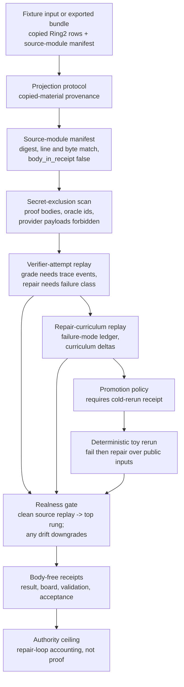

# Formal Math Verifier Trace Repair Loop

`formal_math_verifier_trace_repair_loop` is the source-available replay of a macro
proof-lab pattern over copied Ring2 run substrate: verifier feedback becomes a
teaching signal only after a trace grade, a repair action, a failure-mode ledger
append, a curriculum delta, and a cold rerun receipt.

It is deliberately not a Lean/Lake proof organ. It sits between the existing
readiness, premise retrieval, tactic routing, proof diagnostic, and Lean witness
surfaces so a cold reader can inspect real failure taxonomy, graph-update
candidates, and oracle-repair contrast rows without seeing proof bodies, oracle
premise ids, provider payload bodies, or private run logs.

## Purpose

A failed proof attempt is cheap to throw away and expensive to learn from. The
question this organ answers is narrow: can a verifier's failure be turned into a
reusable repair signal, on the public side, without that signal quietly inheriting
the authority of a real theorem prover? It exists because the interesting work in
a proof-repair loop is the bookkeeping, not the proving, and that bookkeeping is
where overclaim usually creeps in.

The design choice worth noticing is that the loop refuses to collapse its stages
into a single verdict. A verifier failure only counts as a teaching signal once it
carries a trace grade backed by trace events, a repair action named against the
verifier failure class it responds to, a failure-mode ledger append, a curriculum
delta, and a cold-rerun receipt. Each of those is a separate field, and promotion
is blocked until the cold-rerun receipt is present. The same separation keeps the
dangerous material out: proof bodies, oracle-needed premise ids, and provider
payload bodies are forbidden keys, so a row may name a failure class without ever
exposing the proof or the oracle answer that produced it.

The failure mode it guards against is stale copied rows pretending to be live
proof-lab evidence. The repair rows here are imported from a real Ring2 benchmark
run, so the temptation is to treat the copy as if the run were happening now. The
realness gate is the answer: it only reaches its top rung when every verifier
attempt and curriculum row replays cleanly against the imported source bodies, and
the focused tests deliberately perturb an oracle row, a manifest digest, an attempt
label, and a curriculum count so that any drift downgrades the verdict rather than
passing quietly. A single deterministic toy-theorem rerun is the one thing actually
executed here, and it is plain arithmetic over public inputs, not a Lean proof.

## JSON Capsule Binding

Source authority for this reader page is `core/paper_module_capsules.json::paper_modules[23:paper_module.formal_math_verifier_trace_repair_loop]`; the generated instance is `paper_modules/formal_math_verifier_trace_repair_loop.json` with `source_authority: json_capsule`.

This Markdown is a reader projection over the capsule, not the authority plane. The generated Mermaid projection is `available_from_capsule_edges`, and the generated Atlas projection is `linked_from_capsule_edges`; both statuses are builder-owned projections and do not expand the authority ceiling.

The proof boundary is copied non-secret Ring2 verifier-trace repair metadata, source-module digests, public fixture receipts, and one deterministic public toy-theorem rerun only. A cold reader should not treat this page, Mermaid availability, Atlas linkage, or validation receipts as Lean/Lake authority, theorem correctness, proof-body evidence, oracle premise authority, provider-call authority, publication approval, or release approval.

## Shape



## Technical Mechanism

The named mechanism
`mechanism.formal_math_verifier_trace_repair_loop.validates_public_verifier_trace_repair_bundle`
is a staged public verifier-repair validator, not a proof executor.
`_build_result` composes five checks over the fixture or exported bundle:
projection-protocol density, copied source-module manifest integrity, verifier
attempt replay, repair-curriculum replay, promotion policy, and one deterministic
toy-theorem repair rerun. The result is `pass` only when the projection protocol
has copied-material provenance, the secret scan has no blocking hits, source
modules pass when required, verifier attempts and curriculum rows replay against
their imported Ring2 source bodies, promotion requires a cold rerun reference,
and the toy rerun succeeds.

The exported-bundle path is intentionally stricter than the fixture path.
`validate_source_module_manifest` requires a public-safe source import class,
`body_in_receipt: false`, one row for each declared Ring2 source ref, matching
target digests, line counts, and byte counts, and a body-free
`source_open_body_imports` summary. `_validate_attempt_source_replay` then
dereferences the premise-run row, oracle-repair contrast row, and graph-update
candidate for each verifier attempt. Mismatches become typed findings such as
`VERIFIER_TRACE_SOURCE_REPLAY_MISMATCH`,
`VERIFIER_TRACE_ORACLE_REPLAY_MISMATCH`,
`VERIFIER_TRACE_COLD_RERUN_SOURCE_MISMATCH`, or
`VERIFIER_TRACE_CANDIDATE_REPLAY_MISMATCH`; curriculum-source mismatches are
checked separately by `validate_repair_curriculum`.

The realness gate is also mechanical. `_runtime_realness_evidence` reaches the
R4 state only for an exported bundle with verified source modules, at least 30
source replay checks, zero source replay mismatches, at least three attempts,
at least nine trace events, at least three failure modes, and a passing toy
rerun. The focused tests deliberately perturb the oracle source row, a manifest
digest, a verifier-attempt source label, and a curriculum source count; each
mutation blocks the verdict or downgrades the realness evidence instead of
letting stale copied rows masquerade as proof-lab evidence.

The proof consumer is
`tests/test_formal_math_verifier_trace_repair_loop.py`: it asserts five
attempts, 15 trace events, five repair actions, three cold-rerun promotions,
three toy-theorem failures repaired into four passing rerun inputs, seven
exported source modules, 37 source replay checks, compact-card omission and
fresh-receipt reuse, public-relative receipt paths, no private/body fields in
receipts, and exact public-safe source module copies. Those checks consume the
same fixture, bundle, source-module manifest, and mechanism row cited by this
page, so the evidence is executable replay accounting rather than a prose-only
description.

The governing lattice is deliberately narrow: the capsule binds the module to
`concept.formal_math_and_proof_witness_bundle`, principles `P-1`, `P-2`, `P-3`,
`P-6`, and `P-8`, axioms `AX-1`, `AX-2`, `AX-5`, and `AX-7`, and dependency
modules for the Lean standard premise index, tactic portfolio availability,
target-shape tactic routing, and formal-math premise retrieval. The standard
allows only copied Ring2 verifier-trace repair receipt schemas and body-free
public fields. It does not widen a passing replay into Lean/Lake authority,
theorem correctness, proof-body evidence, oracle premise authority, provider
authority, human-approval proof authority, publication approval, release
approval, or whole-system correctness.

Evidence/accounting:

- Capsule authority:
  `core/paper_module_capsules.json::paper_modules[23:paper_module.formal_math_verifier_trace_repair_loop]`
  sets `source_authority: json_capsule`, binds the organ, binds
  `mechanism.formal_math_verifier_trace_repair_loop.validates_public_verifier_trace_repair_bundle`,
  and resolves
  `src/microcosm_core/organs/formal_math_verifier_trace_repair_loop.py`.
- Generated instance:
  `paper_modules/formal_math_verifier_trace_repair_loop.json` reports
  `paper_module_payload.source_authority: json_capsule`, Mermaid
  `available_from_capsule_edges`, Atlas `linked_from_capsule_edges`, 17
  relationship edges, and resolved `paper_module.depends_on.paper_module` edges
  to the Lean standard premise index, tactic portfolio, target-shape routing,
  and formal-math premise retrieval modules named by the active standard.
- Runtime, fixture, and bundle:
  `src/microcosm_core/organs/formal_math_verifier_trace_repair_loop.py`
  exposes `run`, `run_loop_bundle`, `validate_source_module_manifest`,
  `_write_receipts`, `EXPECTED_NEGATIVE_CASES`, `AUTHORITY_CEILING`, and
  `SOURCE_MODULE_MANIFEST_REF`. The fixture input and exported bundle replay
  copied non-secret Ring2 verifier-trace repair metadata, source-module
  digests, failure classes, repair actions, promotion gates, and one
  deterministic public toy-theorem rerun.
- Receipt and test floor:
  `receipts/first_wave/formal_math_verifier_trace_repair_loop/formal_math_verifier_trace_repair_loop_result.json`,
  `verifier_trace_repair_board.json`,
  `formal_math_verifier_trace_repair_loop_validation_receipt.json`, and
  `receipts/acceptance/first_wave/formal_math_verifier_trace_repair_loop_fixture_acceptance.json`
  are body-free evidence. `tests/test_formal_math_verifier_trace_repair_loop.py`
  checks source-module manifest validation, negative cases, toy rerun evidence,
  and authority ceilings.
- Claim boundary:
  `standards/std_microcosm_formal_math_verifier_trace_repair_loop.json` and
  the generated sidecar limit this module to copied non-secret Ring2
  verifier-trace repair metadata, source-module digests, public fixture
  receipts, and deterministic toy rerun evidence. They do not authorize
  Lean/Lake authority, theorem correctness, proof bodies, oracle premise ids,
  provider calls, human approval as proof authority, release approval,
  publication approval, or whole-system correctness.

## Structured Lattice Bindings

The generated JSON row currently contributes 17 relationship edges: two
`paper_module.explains.organ_or_mechanism` edges, one
`paper_module.governed_by.concept` edge, five
`paper_module.governed_by.principle` edges, four
`paper_module.abides_by.axiom` edges, one resolved
`paper_module.cites.code_locus` edge, and four resolved
`paper_module.depends_on.paper_module` edges.

The Mermaid projection is `available_from_capsule_edges`; the Atlas projection is `linked_from_capsule_edges`. The active standard's `source_pattern_id_sample` names `lean_std_toolchain_premise_index`, `tactic_portfolio_availability_probe`, `target_shape_tactic_routing_gate`, and `formal_math_premise_retrieval`, so the capsule routes those sibling modules explicitly instead of leaving dependency pressure implicit.

## Reader Evidence Routing

Route capsule/currentness questions through `## JSON Capsule Binding` and the
generated-row query in `## Validation Receipt Path`: the required evidence is
`source_authority: json_capsule`, 17 generated relationship edges, no visible
unresolved selective relation, Mermaid availability from capsule edges, and Atlas
linkage from capsule edges. Those rows prove reader wiring, not theorem
correctness.

Route runtime and replay questions through `## Runtime`, `## Receipts`, and the
fixture/bundle paths in the validation command. The fixture runner, exported
bundle runner, CLI route, standard, and fixture manifest show how verifier-trace
repair accounting is replayed over copied public rows without importing proof
bodies, oracle-needed premise ids, provider payload bodies, or private logs.

Route claim-safety questions through `## What It Proves`, `## What It Refuses`,
`## Receipt Expectations`, and `## Claim Ceiling`. If the question is whether the
repair loop is still body-safe and receipt-backed, run the focused pytest and
paper-module corpus check before citing this page.

## Prior Art Grounding

This organ is grounded in interactive theorem-proving feedback loops and
learning environments where failed proof attempts become structured training or
repair signals. [GamePad](https://arxiv.org/abs/1806.00608) and
[HOList](https://arxiv.org/abs/1904.03241) both expose theorem-proving
interaction data for machine-learning experiments, while
[LeanDojo](https://arxiv.org/abs/2306.15626) reinforces the need to keep proof
assistant feedback, retrieval, and proof-state interaction reproducible.

Microcosm borrows the repair-loop accounting pattern: verifier events, grades,
failure classes, repair actions, curriculum deltas, and cold rerun receipts are
separate fields. It does not treat human or provider advice as proof
correctness.

## Runtime

- Organ runner: `python -m microcosm_core.organs.formal_math_verifier_trace_repair_loop run --input fixtures/first_wave/formal_math_verifier_trace_repair_loop/input --out receipts/first_wave/formal_math_verifier_trace_repair_loop`
- Exported bundle runner: `python -m microcosm_core.organs.formal_math_verifier_trace_repair_loop run-loop-bundle --input examples/formal_math_verifier_trace_repair_loop/exported_verifier_trace_repair_bundle --out receipts/runtime_shell/demo_project/organs/formal_math_verifier_trace_repair_loop`
- CLI: `microcosm formal-math-verifier-trace-repair-loop run-loop-bundle --input examples/formal_math_verifier_trace_repair_loop/exported_verifier_trace_repair_bundle --out receipts/runtime_shell/demo_project/organs/formal_math_verifier_trace_repair_loop`
- Standard: `standards/std_microcosm_formal_math_verifier_trace_repair_loop.json`
- Fixture manifest: `core/fixture_manifests/formal_math_verifier_trace_repair_loop.fixture_manifest.json`

## What It Proves

- A public verifier replay can require trace events before trace grades.
- Copied Ring2 failure rows can feed a repair curriculum without becoming proof
  authority.
- A repair action must name the verifier failure class it responds to.
- A failure-mode ledger update can be represented without proof bodies.
- Promotion requires a cold rerun receipt reference.
- Human or provider advice stays advisory until checker evidence exists.

## What It Refuses

- Proof bodies in public verifier traces.
- Oracle-needed premise ids in public inputs.
- Provider payload bodies in fixtures or receipts.
- Human approval as checker authority or theorem-quality evidence.
- Release, publication, secret export, or general theorem-proving claims.

## Receipt Expectations

A complete local receipt includes the focused pytest, the paper-module corpus check, generated-row proof showing `edge_count: 17`, Mermaid `available_from_capsule_edges`, Atlas `linked_from_capsule_edges`, `source_authority: json_capsule`, and zero unresolved selective relations, plus the runtime receipts listed below. The receipt validates repair-loop accounting over copied public rows only.

## Validation Receipt Path

Validate the reader projection from the repo root without mutating durable
receipt or generated projection surfaces:

```bash
./repo-pytest microcosm-substrate/tests/test_formal_math_verifier_trace_repair_loop.py -q --basetemp=/tmp/microcosm_formal_math_verifier_trace_repair_loop_pytest
./repo-python microcosm-substrate/scripts/build_doctrine_projection.py --check-paper-module-corpus
jq '{edge_count:(.relationships.edges|length), mermaid_status:.paper_module_payload.generated_projections.mermaid.status, atlas_status:.paper_module_payload.generated_projections.atlas_card.status, source_authority:.relationships.source_authority, unresolved_selective_relation_count:(.relationships.unpopulated_selective_relations|length)}' microcosm-substrate/paper_modules/formal_math_verifier_trace_repair_loop.json
```

Expected generated-row proof: `edge_count: 17`,
`mermaid_status: available_from_capsule_edges`,
`atlas_status: linked_from_capsule_edges`,
`source_authority: json_capsule`, and
`unresolved_selective_relation_count: 0`.

## Receipts

- `receipts/first_wave/formal_math_verifier_trace_repair_loop/formal_math_verifier_trace_repair_loop_result.json`
- `receipts/first_wave/formal_math_verifier_trace_repair_loop/verifier_trace_repair_board.json`
- `receipts/first_wave/formal_math_verifier_trace_repair_loop/formal_math_verifier_trace_repair_loop_validation_receipt.json`
- `receipts/acceptance/first_wave/formal_math_verifier_trace_repair_loop_fixture_acceptance.json`

## Authority Ceiling

The authority boundary is copied non-secret Ring2 verifier trace repair
public non-secret fields only. The organ demonstrates control-loop mechanics over real run
rows, not theorem correctness.

## Claim Ceiling

This module supports only the reader-verifiable claim that copied non-secret
Ring2 verifier rows can drive a public verifier-trace repair loop with
trace-event requirements, failure-class routing, promotion gates, and body-free
receipts. It does not prove theorem correctness, expose proof bodies, authorize
human or provider advice as proof authority, publish private run logs, approve
release, or certify whole-system correctness.
