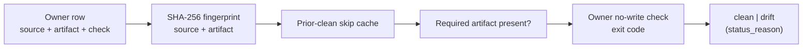

# Generated Projection Drift Runtime

`generated_projection_drift_runtime` is the gate that catches generated files
quietly drifting from their source — a hand-edited output, or a builder that has
stopped matching what it builds from.

## Purpose

Generated artifacts are supposed to be reproducible from their source. When they
are not, the drift is easy to miss. This organ models each generated artifact as
an owner with a source, an artifact, and a no-write check, and reports drift by
recomputation rather than by trust.

It surfaces the public `generated_projection_drift_gate` capsule. For each owner
it SHA-256-fingerprints the source authorities and the artifact files, consults a
prior-clean-receipt skip cache, enforces that the declared artifact is present,
and runs the owner's declared no-write check command — marking the owner clean
only on a zero return with the artifact present. It flags drift; it does not
repair files and does not regenerate anything.

## Shape



## JSON Capsule Binding

- source_ref:
  `core/paper_module_capsules.json::paper_modules[101:paper_module.generated_projection_drift_runtime]`
- source_authority: json_capsule
- Projection role: This Markdown is a reader projection of the JSON capsule row,
  not the source authority. The generated Mermaid projection is
  `paper_module.generated_projection_drift_runtime.mermaid` with status
  `available_from_capsule_edges`, and the generated Atlas projection is
  `organ_atlas.generated_projection_drift_runtime` with status
  `linked_from_capsule_edges`.
- proof boundary: the capsule binds the accepted organ, the resolved mechanism
  row, the runtime locus, the surfaced engine-room capsule, and the governing
  concept, principle, and axiom edges; the generated JSON projection carries the
  exact resolved relationship edges.
- authority ceiling: this page can explain the drift-gate fixtures and the
  validation receipts, but it cannot repair files, prove content-diff equivalence
  for every builder, validate the whole generated-projection registry, or grant
  release authority.

## Structured Lattice Bindings

The structured capsule row is
`core/paper_module_capsules.json#paper_module.generated_projection_drift_runtime`.
It binds this Markdown projection to the organ, the resolved mechanism row
`mechanism.generated_projection_drift_runtime.verifies_generated_projection_drift_gate`,
the runtime locus
`src/microcosm_core/organs/generated_projection_drift_runtime.py`, and the
surfaced capsule
`src/microcosm_core/engine_room/generated_projection_drift_gate.py`. It abides by
axiom `AX-2` (a small checker decides claims over certificates) and principle
`P-3` (prefer a small, rerunnable verifier over narrative confidence).

Generated atlas docs remain builder-owned projections: refresh them with
`PYTHONPATH=src python3 scripts/build_organ_atlas.py --write` instead of editing
`ORGANS.md`, `ARCHITECTURE.md`, `AGENT_ROUTES.md`, or
`atlas/agent_task_routes.json` by hand.

## Reader Evidence Routing

The honest unit is the per-owner drift verdict and its `status_reason`, not a
blanket "no drift":

- A safety/evals engineer should confirm the gate fingerprints both source and
  artifact and runs the owner's own no-write check. The useful question is whether
  drift is recomputed rather than assumed.
- A hiring reviewer should read the cache-hit positive. The useful question is
  whether the skip cache fires authentically — the baked fingerprints match the
  recomputed ones, so a deliberately failing check is genuinely skipped, not
  passed by coincidence.
- A peer developer should run the negatives. The useful question is whether a
  planted byte yields `check_command_failed` and a missing artifact yields
  `artifact_missing`, each from recomputation.

## Validation

```bash
PYTHONPATH=src python3 -m microcosm_core.organs.generated_projection_drift_runtime run --input fixtures/first_wave/generated_projection_drift_runtime/input --out receipts/first_wave/generated_projection_drift_runtime --acceptance-out receipts/acceptance/first_wave/generated_projection_drift_runtime_fixture_acceptance.json
```

The positive cases (`clean_command_owner`, `clean_source_hash_cache_hit`) pass a
clean no-write check and a genuine source-hash cache hit. The negative cases are
rejected by recomputation: `planted_byte_drift` reports `check_command_failed` and
`missing_artifact_drift` reports `artifact_missing`. The registry, ledger, and
runtime spine checks in `make test` exercise the organ's acceptance receipt.

## Authority Ceiling

A green run shows that the selected owners' no-write checks passed and required
artifacts were present over bounded fixtures. It does not repair files, does not
prove content-diff equivalence for every builder, does not validate the whole
generated-projection registry, and does not authorize release, publication,
provider calls, or source mutation.
