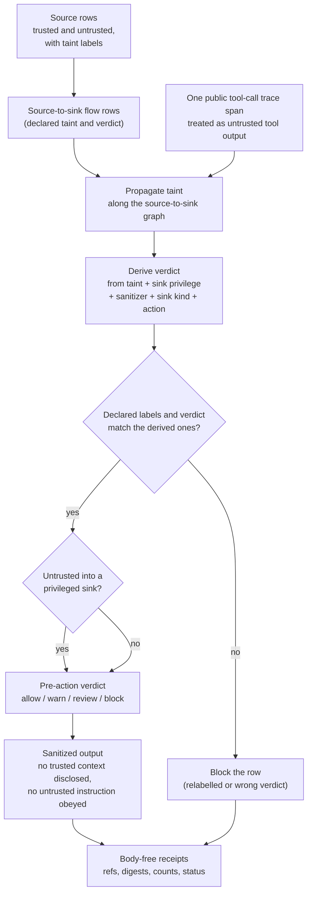

# Indirect Prompt-Injection Information-Flow Policy Replay

This validator-backed claim contract admits one narrow public claim: a
source-faithful public trace refactor separated trusted instructions from
untrusted web/tool/browser text before any privileged action or answer claim was
accepted.

The runnable contract requires source trust labels, taint labels, source-to-sink
flow rows, pre-action policy verdicts, sanitized-output receipts, cold replay,
secret-exclusion scan, negative cases, a public agent-execution trace, and an
explicit authority ceiling.

## Purpose

An agent that reads web pages, tool output, or retrieved documents takes in text
from sources it does not control. Indirect prompt injection is the case where
that untrusted text carries an instruction, and the agent acts on it as if the
operator had asked. This organ exists to make one specific safety property
checkable on a synthetic trace: untrusted text was kept separate from trusted
instructions, and no untrusted source reached a privileged action without being
gated first. It answers a single question. Did the trust boundary actually hold
through the flow, or only on paper?

The unusual part is that the validator does not trust the labels the fixture
declares. Each flow row claims a set of taint labels and a policy verdict, but
the runtime ignores those and recomputes both. It propagates taint along the
source-to-sink graph from the labelled sources, so a sink inherits the taint of
everything that fed it, and it derives the verdict from that propagated taint
plus the sink's privilege, the sanitizer state, the sink kind, and the proposed
action. If the declared taint or the declared verdict disagrees with the
recomputed one, the row is blocked. A flow cannot quietly relabel an untrusted
source as clean, or mark a dangerous action as `allow`, because the contradiction
is recomputed rather than read back.

That recomputation is the point. The failure mode it guards against is a trace
that looks safe because the labels were written to look safe. By deriving the
labels and verdicts from the graph itself, the contract catches the mislabelled
flow that a field-by-field check would wave through. To stay honest about live
behaviour, it also takes one generated public tool-call trace span and pushes it
through the same machinery as untrusted tool output, so the runtime is seen to
treat tool output as data until a policy gate reviews it, never as instruction
authority.

## Cold-Reader Path

```bash
microcosm indirect-prompt-injection-information-flow-policy-replay run-prompt-injection-bundle \
  --input examples/indirect_prompt_injection_information_flow_policy_replay/exported_prompt_injection_flow_bundle \
  --out receipts/runtime_shell/demo_project/organs/indirect_prompt_injection_information_flow_policy_replay
```

Primary receipt:
`receipts/runtime_shell/demo_project/organs/indirect_prompt_injection_information_flow_policy_replay/exported_prompt_injection_flow_bundle_validation_result.json`

First-wave fixture receipt:
`receipts/first_wave/indirect_prompt_injection_information_flow_policy_replay/indirect_prompt_injection_information_flow_policy_replay_validation_receipt.json`

## JSON Capsule Binding

- Source authority:
  `core/paper_module_capsules.json::paper_modules[38:paper_module.indirect_prompt_injection_information_flow_policy_replay]`
  with `source_authority: json_capsule`.
- Generated instance:
  `paper_modules/indirect_prompt_injection_information_flow_policy_replay.json`.
- This Markdown is a reader projection. The generated Mermaid projection is
  `available_from_capsule_edges`; the generated Atlas projection is
  `linked_from_capsule_edges`. The flow-policy wiring remains capsule-owned
  and builder-projected.
- The authority ceiling is the source-faithful prompt-injection
  information-flow replay boundary over body-free rows.
- The proof boundary is restricted to source trust labels, taint labels,
  source-to-sink flows, pre-action verdict refs, sanitized-output refs, cold
  replay, negative cases, secret-exclusion checks, and validation receipts. It
  does not establish a general prompt-injection defense, live account safety,
  provider or tool behavior, hidden-message handling in production, source
  mutation, publication, or release authority.

## Reader Proof Boundary

The proof boundary is the JSON capsule row plus the generated relationship row,
not the Markdown story or the embedded Mermaid sketch below. This page may
explain the capsule-backed path through organ, mechanism, runtime source,
bundle, manifests, receipts, and negative cases; it cannot infer dependency
edges, expand the capsule, or claim live prompt-injection protection.

Current generated-row proof: `edge_count: 7`,
`unresolved_selective_relation_count: 1`, Mermaid
`available_from_capsule_edges`, and Atlas `linked_from_capsule_edges`.
The remaining unresolved selective relation is an honest dependency residual;
it should stay residual until the capsule owner lane names a resolvable
dependency edge.

## Public Site Availability Boundary

This Markdown edit is not a public-site or Atlas regeneration. Generated site,
Mermaid, Atlas, and corpus projections remain builder-owned outputs over the
capsule row. If the public docs lag this section, the fix is a controlled
projection refresh by the owning lane, not a hand edit to generated assets.

## Public-Safe Body Handling

The page may cite body-free receipts, public trace span refs, source-module
manifest rows, and copied non-secret target paths. It must not embed raw prompt
bodies, hidden system-message bodies, account material, credentials, provider
payloads, browser/HUD state, raw tool output bodies, or live-access material.
Receipts carry refs, digests, counts, and validation status, not source bodies.

## Shape



The module's shape is a public information-flow replay, not a live
prompt-injection defense. This page points at the mechanism and runtime organ;
the runtime validates source trust labels, taint propagation, privileged sink
gates, pre-action verdicts, sanitized outputs, cold replay, public trace spans,
source-module digest anchors, negative cases, and body-free receipts.

## Governing Lattice Relation

The generated JSON instance gives this page a specific admission lattice, not a
loose security story. Seven resolved edges bind the reader projection to the
`indirect_prompt_injection_information_flow_policy_replay` organ,
`mechanism.indirect_prompt_injection_information_flow_policy_replay.validates_public_indirect_prompt_injection_information_flow_policy_replay`,
`concept.agent_reliability_and_safety_validator_bundle`, `P-9`, `P-14`,
`AX-8`, and the runtime code locus
`src/microcosm_core/organs/indirect_prompt_injection_information_flow_policy_replay.py`.
The only unresolved selective relation is the dependency edge; it remains a
residual because the capsule does not name a sibling paper-module dependency.

The governing law is provenance propagation and non-interference. `P-9`
requires every source, fixture, receipt, public-copy, provider-shape, or
private-boundary crossing to carry provenance class and claim ceiling. `P-14`
requires byte or row basis and provenance to travel together. `AX-8` requires
data labels to propagate along flows, with untrusted labels entering privileged
sinks only through declared transforms that satisfy the sink policy.

The runtime implements that lattice in `_build_result`: it loads the projection
protocol, source documents, information-flow graph, policy verdicts, sanitized
outputs, cold replay rows, public trace spans, source-module manifest, and
secret-exclusion policy before status is admitted. `validate_source_documents`
rejects untrusted instruction authority, `validate_information_flow_graph`
derives taint labels and policy verdicts instead of trusting hand-written rows,
`_live_tool_call_trace_promotion` treats generated public tool-call trace spans
as untrusted tool output, and `_write_receipts`/`result_card` keep public
receipts body-free. The focused proof consumer is
`tests/test_indirect_prompt_injection_information_flow_policy_replay.py`, which
checks fixture and exported-bundle modes, taint/verdict derivation, negative
cases, source-module digest boundaries, exact copied macro-body imports, card
redaction, fresh receipt reuse, public trace spans, and fixture-manifest binding
to the body-open refactor.

## Technical Mechanism

The runtime mechanism is an evidence compiler plus an information-flow
validator. `run` loads the first-wave fixture with negative cases enabled;
`run_prompt_injection_bundle` loads the exported public bundle and leaves the
fixture-only negative cases out. Both routes call `_build_result`, which loads
the projection protocol, injection policy, source-document rows, flow graph,
policy verdict rows, sanitized outputs, cold replay rows, public trace, copied
source-module manifest, and secret-exclusion policy before it writes any
receipt.

The source and flow validators separate instruction authority from untrusted
data before claim admission. `validate_source_documents` requires every source
row to carry source id, trust label, channel, body ref, taint labels,
instruction-authority flag, body redaction, synthetic-fixture status, and no raw
or real-account body export; untrusted sources cannot carry instruction
authority. `validate_information_flow_graph` joins each flow to its source row,
derives taint labels through `_taint_propagation_receipt`, derives the expected
policy verdict from propagated taint, sink kind, sink privilege, sanitizer state,
and proposed action, and rejects hand-written taint or verdict drift.

Policy and output validation then bind the pre-action membrane. The injection
policy must name allow, warn, block, and review verdicts; require the source,
flow, verdict, and output field floors; and deny real accounts, raw prompt
bodies, credentials, tool-output authority, hidden-message promotion, live tool
calls, general robustness claims, and release. `validate_policy_verdicts`
requires verdicts to join to flows, precede action, cite rules, stay redacted,
and match the derived flow verdict. `validate_sanitized_outputs` requires output
refs to join to flows, disclose no trusted context, obey no untrusted
instruction, and avoid external action on blocked flows.

Replay and trace validation keep the public claim body-free. `validate_cold_replay`
requires replay commands and receipt refs to reproduce each verdict and
sanitized output without trusted-context disclosure. The organ uses
`build_public_prompt_injection_trace` to build five public trace spans, then
`_live_tool_call_trace_promotion` promotes one generated public tool-call trace
span back through the same taint-graph machinery as an untrusted tool-output
source. That promotion is evidence that the runtime treats tool output as data
until a policy gate reviews it, not as instruction authority.

The copied-source floor is checked independently. `_source_module_manifest_result`
requires the exported bundle's `source_module_manifest.json` to classify copied
material as non-secret macro body material, keep body text out of receipts,
match declared module counts, resolve `path` and `target_ref` to the same copied
body, stream SHA-256 digests over each target, and verify required anchors.
`_source_open_body_import_summary` exposes only body ids, classes, manifest refs,
counts, and ceiling flags; the copied bodies remain under `source_modules/`.

The receipt mechanism is intentionally small. `_write_receipts` writes first-wave
result, board, validation, and acceptance receipts for fixture mode, while
exported-bundle mode writes the bundle validation result. `result_card` emits a
compact command card and omits findings, secret-scan details, authority ceiling
bodies, anti-claim text, source refs, target refs, public trace spans, source
rows, flow rows, verdict rows, sanitized output rows, cold replay rows, board
rows, and copied source-module bodies. The card preserves counts, status,
negative-case coverage, trace span count, body-floor status, and receipt refs.

The lattice binding is the capsule row
`paper_module.indirect_prompt_injection_information_flow_policy_replay`, the
mechanism row
`mechanism.indirect_prompt_injection_information_flow_policy_replay.validates_public_indirect_prompt_injection_information_flow_policy_replay`,
principles `P-9` and `P-14`, axiom `AX-8`, and
`concept.agent_reliability_and_safety_validator_bundle`. Those refs are used as
an admission-control lattice: source-labelled public evidence may enter the
claim surface, while untrusted instruction authority, private bodies, provider
payloads, live account material, source mutation, and release claims remain out
of scope.

## Input Contract

- `projection_protocol.json`: source-available projection statement and omitted private material.
- `injection_policy.json`: required source, flow, verdict, and output fields plus authority denials.
- `source_documents.json`: synthetic trusted and untrusted sources with trust labels and taint labels.
- `information_flow_graph.json`: source-to-sink flow rows before claim admission.
- `policy_verdicts.json`: allow, warn, block, and review verdicts before synthetic action.
- `sanitized_outputs.json`: output refs proving no trusted context disclosure and no untrusted instruction obedience.
- `cold_replay.json`: rerunnable command and receipt refs that reproduce verdicts and sanitized state.

## Public Trace Refactor

The product evidence is no longer the fixture verdict fields alone. The organ
uses `microcosm_core.macro_tools.agent_execution_trace::build_public_prompt_injection_trace`
to emit body-free spans over the public source, flow, verdict, output, and replay
refs. That builder is a Microcosm refactor of the macro
`system/lib/agent_execution_trace.py` span model, so the accepted receipt can
show sequence, authority, audit, coverage, and digest mechanics without copying
real accounts, prompt bodies, provider payloads, or live tool material.

## Reader Evidence Routing

- Capsule route:
  `core/paper_module_capsules.json::paper_modules[38:paper_module.indirect_prompt_injection_information_flow_policy_replay]`
  is the JSON authority row; a Mermaid diagram and an Atlas card are generated
  for this module from that row.
- Mechanism route:
  `core/mechanism_sources.json::mechanism.indirect_prompt_injection_information_flow_policy_replay.validates_public_indirect_prompt_injection_information_flow_policy_replay`
  binds the code locus, fixture refs, exported bundle refs, receipt refs,
  validator commands, focused regression, and guardrails.
- Runtime route:
  `src/microcosm_core/organs/indirect_prompt_injection_information_flow_policy_replay.py`
  owns `run`, `run_prompt_injection_bundle`, `_build_result`,
  `_write_receipts`, `result_card`, `EXPECTED_NEGATIVE_CASES`, and
  `AUTHORITY_CEILING`.
- Exported-bundle route:
  `examples/indirect_prompt_injection_information_flow_policy_replay/exported_prompt_injection_flow_bundle`
  contains `bundle_manifest.json`, `projection_protocol.json`,
  `injection_policy.json`, `source_documents.json`,
  `information_flow_graph.json`, `policy_verdicts.json`,
  `sanitized_outputs.json`, `cold_replay.json`, and
  `source_module_manifest.json`.
- Source-module route: `source_module_manifest.json` records five copied
  non-secret public macro bodies: the extracted-pattern ledger row, high-novelty
  reconstruction receipt, agent execution trace runtime, agent execution trace
  standard, and strict JSON helper. Receipts carry refs, digests, counts, and
  status only; source body text stays in the bundle's `source_modules/` tree.
- Focused-test route:
  `tests/test_indirect_prompt_injection_information_flow_policy_replay.py`
  verifies negative cases, public-relative redacted receipts, exported-bundle
  runtime shape, source-module digest and target-ref failures, exact copied
  source bodies, card receipt reuse, and public trace span construction.

## Structured Lattice Bindings

- `source_authority`: `json_capsule`
- `paper_module_id`:
  `paper_module.indirect_prompt_injection_information_flow_policy_replay`
- `reader_projection`:
  `microcosm-substrate/paper_modules/indirect_prompt_injection_information_flow_policy_replay.md`
- `generated_projection`:
  `microcosm-substrate/paper_modules/indirect_prompt_injection_information_flow_policy_replay.json`
- `organ_id`: `indirect_prompt_injection_information_flow_policy_replay`
- `mechanism_id`:
  `mechanism.indirect_prompt_injection_information_flow_policy_replay.validates_public_indirect_prompt_injection_information_flow_policy_replay`
- `runtime_locus`:
  `src/microcosm_core/organs/indirect_prompt_injection_information_flow_policy_replay.py`
- `fixture_input_locus`:
  `fixtures/first_wave/indirect_prompt_injection_information_flow_policy_replay/input`
- `exported_bundle`:
  `examples/indirect_prompt_injection_information_flow_policy_replay/exported_prompt_injection_flow_bundle`
- `receipt_loci`:
  `receipts/acceptance/first_wave/indirect_prompt_injection_information_flow_policy_replay_fixture_acceptance.json`,
  `receipts/first_wave/indirect_prompt_injection_information_flow_policy_replay/indirect_prompt_injection_information_flow_policy_replay_result.json`,
  `receipts/first_wave/indirect_prompt_injection_information_flow_policy_replay/indirect_prompt_injection_information_flow_policy_replay_board.json`,
  `receipts/first_wave/indirect_prompt_injection_information_flow_policy_replay/indirect_prompt_injection_information_flow_policy_replay_validation_receipt.json`,
  and
  `receipts/runtime_shell/demo_project/organs/indirect_prompt_injection_information_flow_policy_replay/exported_prompt_injection_flow_bundle_validation_result.json`
- `source_open_body_floor`: five copied non-secret public source bodies, all
  digest-checked and body-excluded from receipts.
- `runtime_evidence_floor`:
  - five source documents
  - three untrusted sources and two trusted sources
  - five source-to-sink flows
  - five pre-action verdicts
  - one allow, one warn, two blocks, and one review
  - five sanitized outputs
  - five cold replay passes
  - five public trace spans
  - one public tool-call trace input promoted through the taint graph
- `negative_case_floor`:
  - real account material
  - secret exfiltration
  - raw prompt body export
  - tool output as instruction authority
  - hidden system-message promotion
  - credential exfiltration
  - final-answer-only success
  - ungated untrusted flow into a privileged sink
- `projection_status`: a Mermaid diagram and an Atlas card are generated for
  this module; this Markdown is the human-readable page for that module.

## Receipt Expectations

A valid first-wave receipt exposes:

- input mode
- source rows and information-flow rows
- policy verdict rows and sanitized output rows
- cold replay rows
- taint propagation status and taint path count
- derived mismatch counts and verdict counts
- blocked-without-external-action count
- disclosure and obedience counts
- observed and missing negative cases
- typed error codes
- secret-exclusion scan status
- public trace status and span count
- live input promotion status
- source-module manifest status
- authority ceiling and anti-claim
- public-relative receipt paths

A valid exported-bundle receipt may show `expected_negative_cases: []` because
the exported bundle is the public trace refactor bundle; the first-wave fixture
and focused tests remain the negative-case authority. It should still show:

- `input_mode: exported_prompt_injection_flow_bundle`
- bundle id
  `indirect_prompt_injection_information_flow_policy_replay_public_trace_refactor_bundle`
- five source documents
- five information flows
- two blocks and one review
- five cold replay passes
- five public trace spans
- one live input promotion
- five verified source modules
- body material status `copied_non_secret_prompt_injection_macro_body_landed`

A valid receipt omits real account material, raw email or document bodies, raw
prompt bodies, raw system prompts, credentials, secret values, provider
payloads, raw tool output bodies, hidden system-message bodies, account
identifiers, browser/HUD live access, recipient-send state, source body text,
and benchmark robustness claims. It may claim public prompt-injection
information-flow replay over synthetic body-free rows; it may not claim general
prompt-injection robustness, live account safety, live tool behavior, provider
behavior, hidden-message handling in production, source mutation, publication,
release authority, or complete security.

## Prior Art Grounding

This organ is grounded in the prompt-injection and information-flow-control
literature. The prompt-injection side follows the threat shape described by
Greshake et al. in
[Not what you've signed up for](https://arxiv.org/abs/2302.12173), the agentic
evaluation framing in
[AgentDojo](https://arxiv.org/abs/2406.13352), and later data-leakage
benchmarks over tool-calling agents such as
[Simple Prompt Injection Attacks Can Leak Personal Data](https://arxiv.org/abs/2506.01055).
The policy mechanism borrows from dynamic information-flow / taint-tracking
ideas, including
[Permissive Information-Flow Analysis for Large Language Models](https://arxiv.org/abs/2410.03055).

Microcosm does not claim a general prompt-injection defense. It preserves the
prior-art control-plane lesson: untrusted content must be labelled as data,
source-to-sink flows must be visible before privileged action, and sanitized
outputs need receipts. The local organ turns that lesson into a body-free replay
contract with explicit anti-claims and negative cases.

## Source-Open Body Floor

The exported bundle carries exact copied non-secret macro bodies under
`source_modules/ai_workflow/`, governed by
`source_module_manifest.json`. The imported bodies are:

- `state/microcosm_portfolio/extracted_patterns_ledger.jsonl`
- `state/microcosm_portfolio/reconstruction/high_novelty_substrate_gap_scout_v1.json`
- `system/lib/agent_execution_trace.py`
- `codex/standards/std_agent_execution_trace.json`
- `system/lib/strict_json.py`

The manifest records source refs, target refs, hashes, material classes, and
required anchors. Receipts and cards expose refs, counts, and validation status
only; they do not embed ledger, reconstruction, prompt, account, credential,
browser/HUD, provider payload, or live-access bodies.

## Limitations

The replay is intentionally small and synthetic. Fixture mode covers five
source documents, three untrusted and two trusted source labels, five
source-to-sink flows, five pre-action verdicts, five sanitized outputs, five
cold replay passes, five public trace spans, one generated public tool-call
trace promoted through the taint graph, five copied non-secret macro bodies,
and eight negative cases. Exported-bundle mode validates the public bundle,
source-module manifest, trace spans, and body-free receipt shape, but it does
not carry the fixture-only negative-case payloads.

Those counts are proof boundaries, not scale claims. They show that this local
validator recomputes source trust, taint propagation, pre-action verdicts,
sanitized output constraints, cold replay, source-module digest anchors, and
body-free receipt shape over declared public inputs. They do not estimate attack
coverage, compare defenses, score a benchmark, certify hidden-message handling
in production, or demonstrate live email, browser, account, tool, or provider
behavior.

The source-open body floor is also narrow. The manifest proves byte parity and
declared anchors for the five copied non-secret macro bodies in the exported
bundle. It does not authorize private macro-root export, raw prompt or system
body export, credential-bearing material, source mutation, publication, hosting,
release approval, complete security, or product readiness.

## Claim Ceiling

This module supports only the public claim that the replay exposes and checks a
prompt-injection information-flow policy over source trust labels, taint labels,
source-to-sink flow rows, pre-action policy verdict refs, sanitized-output refs,
cold replay refs, public trace spans, live public tool-call trace taint
promotion, copied source-module digests, negative-case receipts,
secret-exclusion checks, and body-free authority ceilings.

The copied source-module digest row proves byte parity for the named macro
body only; it does not widen the replay into live source authority.

It does not claim general prompt-injection robustness, live account safety,
live tool or provider behavior, raw prompt/system/tool body export,
credential-bearing account data, hidden-message production handling, benchmark
security or performance, source mutation authority, publication authority,
hosting authority, release approval, complete security, or product-progress
authority.

## Negative Cases

The validator rejects real account material, secret or trusted-context
exfiltration, raw prompt body export, untrusted tool output treated as
instruction authority, hidden system-message promotion, credential exfiltration,
final-answer-only success, and ungated untrusted flow into a privileged sink.

These are falsification fixtures. They are part of the contract, not examples of
live exploit traffic.

## Authority Ceiling

Passing receipts prove only that this public trace refactor satisfies the named
prompt-injection information-flow contract over body-free rows. They do not
prove general prompt-injection robustness, benchmark performance, live account
safety, provider behavior, tool behavior, hidden-message handling in a real
system, source mutation authority, publication authority, or release operations.

## Validation Receipt Path

Run the first-wave fixture validator from the repo root and write its receipt
outside the repo working tree:

```bash
cd microcosm-substrate && PYTHONPATH=src ../repo-python -m microcosm_core.organs.indirect_prompt_injection_information_flow_policy_replay run --input fixtures/first_wave/indirect_prompt_injection_information_flow_policy_replay/input --out /tmp/indirect_prompt_injection_flow_receipt --acceptance-out /tmp/indirect_prompt_injection_flow_acceptance.json --card > /tmp/indirect_prompt_injection_flow_card.json
```

Then run the exported bundle validator:

```bash
cd microcosm-substrate && PYTHONPATH=src ../repo-python -m microcosm_core.organs.indirect_prompt_injection_information_flow_policy_replay run-prompt-injection-bundle --input examples/indirect_prompt_injection_information_flow_policy_replay/exported_prompt_injection_flow_bundle --out /tmp/indirect_prompt_injection_flow_bundle_receipt --card > /tmp/indirect_prompt_injection_flow_bundle_card.json
```

The focused regression test and corpus projection checks are:

```bash
cd microcosm-substrate && PYTHONPATH=src ../repo-python -m pytest -p no:cacheprovider tests/test_indirect_prompt_injection_information_flow_policy_replay.py -q
cd microcosm-substrate && PYTHONPATH=src ../repo-python scripts/build_doctrine_projection.py --check-paper-module-corpus
```

The receipt path proves synthetic information-flow replay and body omission,
not general prompt-injection robustness or live account safety.

## Named Proof Consumers

The named proof consumer is
`tests/test_indirect_prompt_injection_information_flow_policy_replay.py`. It
checks first-wave negative-case coverage, five sources, three untrusted and two
trusted source labels, five information flows, derived taint paths, derived
policy verdicts, allow/warn/block/review counts, blocked-without-external-action
counts, sanitized-output non-disclosure, cold replay, authority ceiling flags,
public trace spans, public tool-call trace promotion through taint propagation,
public-relative redacted receipts, exported-bundle validation, source-module
digest mismatch rejection, target-ref/path mismatch rejection, partial digest
mismatch rejection, manifest body-text boundary rejection, streaming source-module
digests, exact copied macro body imports, fresh `--card` receipt reuse, public
trace construction, and fixture-manifest binding to the body-open refactor.

The runtime proof consumers are the two module commands in the Validation
Receipt Path: fixture mode via
`indirect_prompt_injection_information_flow_policy_replay run`, and exported
bundle mode via
`indirect_prompt_injection_information_flow_policy_replay run-prompt-injection-bundle`.
Fixture mode must observe all eight negative cases and write body-free result,
board, validation, and acceptance receipts. Bundle mode must validate the public
bundle shape, source-module manifest, public trace spans, and body-free exported
bundle receipt.

The corpus proof consumer is
`scripts/build_doctrine_projection.py --check-paper-module-corpus`. It checks
that the Markdown/capsule-backed paper-module corpus remains reproducible after
this reader projection edit. It is a corpus check only; it does not refresh
generated Mermaid, Atlas, site, verifier, or capsule state.
