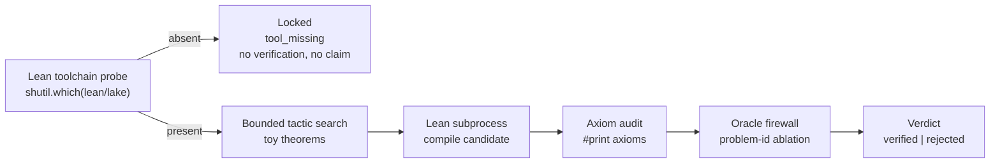

# Lean Proof-Search Lab Runtime

`lean_proof_search_lab_runtime` searches small Lean theorems for a proof, checks
each candidate with the Lean toolchain that is actually installed, and refuses to
claim anything when that toolchain is absent.

## Purpose

A proof-search demo is easy to fake: print a tactic, assert success, ship a green
badge. This organ answers a narrower, harder question — did a real checker accept
this proof, and can a reader tell whether the checker even ran?

It surfaces the public `lean_proof_search_lab` capsule. Over a bounded set of toy
theorems it runs a depth-limited tactic search, hands each candidate to the
`lean`/`lake` subprocess, and reads `#print axioms` on what comes back. A
candidate is accepted only when Lean itself compiles it with a clean axiom set.
The interesting part is the third terminal state: when Lean is not on the path,
the run does not pass and does not fail — it reports `locked`, performs no
verification, and makes no proof claim. Missing Lean is an honest unlock state,
not a silent green and not a failure.

## Shape



## JSON Capsule Binding

- source_ref:
  `core/paper_module_capsules.json::paper_modules[102:paper_module.lean_proof_search_lab_runtime]`
- source_authority: json_capsule
- Projection role: This Markdown is a reader projection of the JSON capsule row,
  not the source authority. The generated Mermaid projection is
  `paper_module.lean_proof_search_lab_runtime.mermaid` with status
  `available_from_capsule_edges`, and the generated Atlas projection is
  `organ_atlas.lean_proof_search_lab_runtime` with status
  `linked_from_capsule_edges`.
- proof boundary: the capsule binds the accepted organ, the resolved mechanism
  row, the runtime locus, the surfaced engine-room capsule, and the governing
  concept, principle, and axiom edges; the generated JSON projection carries the
  exact resolved relationship edges.
- authority ceiling: this page can explain the bounded proof-search fixtures, the
  locked/verified/rejected receipt states, and the validation receipts, but it
  cannot become neural theorem proving, a general proof-correctness oracle, a
  claim about open mathematics, or release authority.

## Structured Lattice Bindings

The structured capsule row is
`core/paper_module_capsules.json#paper_module.lean_proof_search_lab_runtime`. It
binds this Markdown projection to the organ, the resolved mechanism row
`mechanism.lean_proof_search_lab_runtime.verifies_lean_proof_search_lab`, the
runtime locus `src/microcosm_core/organs/lean_proof_search_lab_runtime.py`, and
the surfaced capsule
`src/microcosm_core/engine_room/lean_proof_search_lab.py`. It abides by axiom
`AX-2` (a small checker decides claims over certificates) and principle `P-3`
(prefer a small, rerunnable verifier over narrative confidence).

Generated atlas docs remain builder-owned projections: refresh them with
`PYTHONPATH=src python3 scripts/build_organ_atlas.py --write` instead of editing
`ORGANS.md`, `ARCHITECTURE.md`, `AGENT_ROUTES.md`, or
`atlas/agent_task_routes.json` by hand.

## Reader Evidence Routing

The honest unit here is not "proofs found" but "did the checker run, and what did
it decide." Read the receipt's `tool_state` before its `status`:

- A safety/evals engineer should read `tool_state` first
  (`tool_present_and_verified`, `tool_present_but_failed`, or `tool_missing`).
  The useful question is whether a green result is backed by a real Lean run, and
  whether the locked state is reported honestly when Lean is absent.
- A hiring reviewer should read the positive and the four negative cases. The
  useful question is whether the rejections come from recomputation — Lean
  actually catching the defect — rather than from a hard-coded expected answer.
- A peer developer should run the organ locally with and without Lean on the
  path. The useful question is whether the same command yields a verified
  witness when Lean is present and a claimless locked receipt when it is not.

## Validation

```bash
PYTHONPATH=src python3 -m microcosm_core.organs.lean_proof_search_lab_runtime run --input fixtures/first_wave/lean_proof_search_lab_runtime/input --out receipts/first_wave/lean_proof_search_lab_runtime --acceptance-out receipts/acceptance/first_wave/lean_proof_search_lab_runtime_fixture_acceptance.json
../repo-pytest microcosm-substrate/tests/test_lean_proof_search_lab_runtime.py
```

The positive case (`positive_symbolic_lab_pass`) is accepted only when Lean
proves the toy theorems and the axiom audit is clean. The four negative cases are
rejected by recomputation, each by a distinct guard: a forwarded oracle field and
a nested oracle field trip the oracle firewall, a `sorry`/axiom proof trips the
axiom-taint check, and a memorised policy trips problem-id ablation. The focused
test also asserts the locked path: with Lean removed from the environment the run
reports `tool_missing`, performs no verification, and never reads as a pass.

## Authority Ceiling

A green run shows that the installed Lean toolchain accepted bounded toy proofs
and that the firewall, axiom audit, and ablation rejected the planted defects. It
does not prove open mathematical results, does not perform neural or automated
theorem proving at scale, is not a general proof-correctness oracle, and does not
authorize release, publication, provider calls, or source mutation. A `locked`
receipt asserts nothing at all beyond "Lean was not available to check this."
