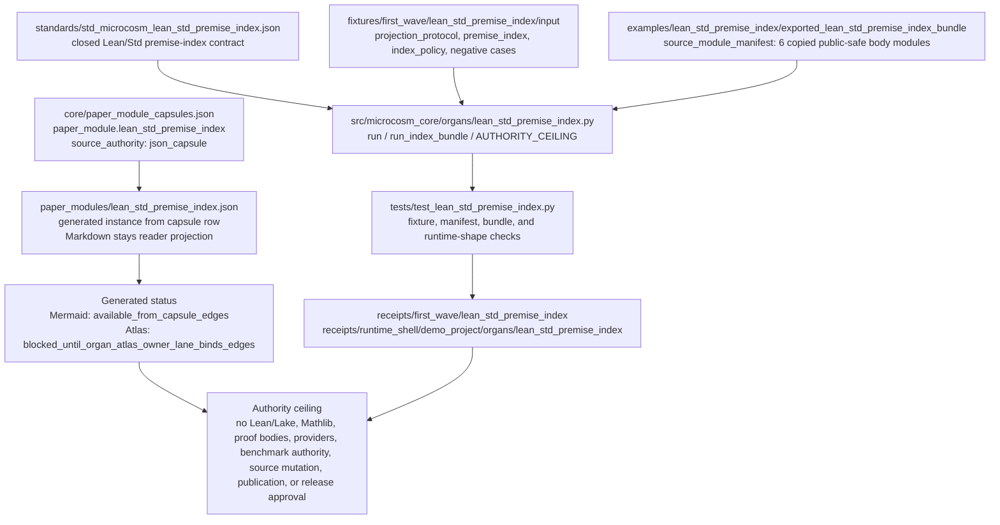

# Lean/Std Premise Index

`lean_std_premise_index` is the closed public premise-index lane for the
formal-math slice. It validates premise metadata and selected Ring2
premise-retrieval macro receipt bodies that a cold reader can inspect without
importing Mathlib, exposing proof bodies, or relying on private macro run
state.

## Purpose

A premise index is the catalogue a theorem-proving system reads before it tries
to prove anything: a list of the named lemmas and definitions it is allowed to
cite, with enough metadata to retrieve the relevant ones. This organ answers a
narrower question. Given that such an index already exists inside a private
Ring2 benchmark run, can a cold reader inspect its public shape and be sure that
what they are reading is a faithful copy of the real thing, and not a separate
hand-written stand-in?

The answer rests on one design choice that is worth noticing. The validator does
not just describe eleven premise rows; it opens the declared source artifact
from the Ring2 premise-retrieval run, recomputes its SHA-256, and checks every
public row against the matching source row by `premise_id`. The only permitted
difference is a path rewrite: a raw Lean toolchain path becomes a public
`lean-toolchain://.../Init/...` reference, so the reader sees where a lemma lives
in the standard library without seeing a private filesystem. If the public
catalogue ever drifts from the source it claims to copy, the digest or the
row-signature comparison fails and the receipt is blocked.

The interesting tension is the line between a useful index and a leaked answer
key. A premise index for a benchmark is one edit away from telling a solver
exactly which lemmas it needs. So the same pass that admits names, namespaces,
retrieval terms, and train/dev/test eligibility rejects the things that would
turn the catalogue into proof authority: Mathlib references, proof bodies, the
oracle-needed premise ids that name the answer, and any flag that authorises
tuning on the test split. The catalogue stays inspectable precisely because
those are kept out.

## Shape

This module is a cold-reader map from a JSON capsule and copied public
Lean/Std premise artifacts into body-free validation receipts. The readable
path is capsule -> generated instance/status -> runtime validator -> fixtures
and exported source bundle -> tests and receipts -> authority ceiling; none of
those projections expands the closed-index boundary.



## Technical Mechanism

The mechanism is a two-entry validator over copied public artifacts, not a
proof engine. `run` reads the first-wave fixture inputs, opens the declared
macro premise-index source artifact, verifies the declared `source_sha256`,
normalizes Lean toolchain paths into `lean-toolchain://.../Init/...` public
refs, compares every public row against the source row signature, and then
checks the protocol, policy, copied-material contract, namespace coverage,
split coverage, negative cases, secret exclusion scan, and authority ceiling
before writing body-free result, board, validation, and acceptance receipts.
`run_index_bundle` applies the same public boundary to the exported bundle and
requires the source-module manifest to verify six copied body-material files by
source ref, target ref, digest, line count, byte count, and source-to-target
equivalence while keeping body text out of receipts.

The proof consumer is therefore concrete and local:
`tests/test_lean_std_premise_index.py` asserts that the validator observes all
five negative cases, imports the real Ring2 premise-index source artifact,
rejects digest, row-count, row-signature, source-ref, source-module digest, and
rehash-body-swap mutations, and validates the runtime-shell bundle shape. The
positive fixture carries 11 premise rows across `Nat`, `Bool`, `List`, and
`Iff`; the source-open body floor carries one normalized Lean/Std premise index
plus five public-safe Ring2 macro receipt or pattern bodies. This is evidence
of a bounded public premise catalog and copied-source manifest, not evidence of
Lean theorem correctness.

The governing lattice is source-backed through the capsule-generated instance:
`paper_module.lean_std_premise_index` explains the
`lean_std_premise_index` organ and the two
`mechanism.lean_std_premise_index.*` mechanisms, is governed by
`concept.formal_math_and_proof_witness_bundle`, cites
`P-1`, `P-2`, `P-3`, `P-6`, and `P-8`, abides by `AX-1`, `AX-2`, `AX-5`, and
`AX-7`, and depends only on
`paper_module.formal_math_premise_retrieval`. Those edges explain why this page
is a reader projection over a closed evidence membrane: JSON/capsule/source
rows define the relation, the runtime validator checks copied public evidence,
and the claim ceiling prevents the metadata layer from being mistaken for
Mathlib, Lean/Lake, provider, benchmark, release, or theorem-proof authority.

## JSON Capsule Binding

- Source row:
  `core/paper_module_capsules.json::paper_modules[26:paper_module.lean_std_premise_index]`
- Generated instance: `paper_modules/lean_std_premise_index.json`
- Source authority: `json_capsule`
- Generated Mermaid projection: `available_from_capsule_edges`
- Generated Atlas projection: `blocked_until_organ_atlas_owner_lane_binds_edges`

This Markdown is a reader projection over the capsule, not the authority plane.
The generated Mermaid projection and generated Atlas projection are
builder-owned statuses. They do not expand the authority ceiling.

The proof boundary is copied public Lean/Std descriptor index and Ring2
premise-retrieval macro receipts only. A cold reader should not treat this page,
Mermaid availability, Atlas status, or validation receipts as Lean/Lake
execution, Mathlib authority, proof-body import, oracle-needed premise
authority, provider-call authority, benchmark evidence, publication approval,
or release approval.

## Structured Lattice Bindings

The generated JSON row currently contributes 15 relationship edges:

- three `paper_module.explains.organ_or_mechanism` edges;
- one resolved `paper_module.cites.code_locus` edge;
- one `paper_module.governed_by.concept` edge;
- five `paper_module.governed_by.principle` edges;
- four `paper_module.abides_by.axiom` edges;
- one resolved `paper_module.depends_on.paper_module` edge to
  `paper_module.formal_math_premise_retrieval`.

The generated Mermaid projection is `available_from_capsule_edges`; the
generated Atlas projection remains
`blocked_until_organ_atlas_owner_lane_binds_edges`.

The `depends_on` edge is sourced from the Lean/Std standard's
`source_pattern_id_sample`, where the premise-index lane names
`formal_math_premise_retrieval` as the supporting retrieval pattern. No broader
formal-math dependency is implied by that single source row.

## Runtime Route

```bash
PYTHONPATH=src python3 -m microcosm_core.organs.lean_std_premise_index run \
  --input fixtures/first_wave/lean_std_premise_index/input \
  --out receipts/first_wave/lean_std_premise_index \
  --acceptance-out receipts/acceptance/first_wave/lean_std_premise_index_fixture_acceptance.json

PYTHONPATH=src python3 -m microcosm_core.cli lean-std-premise-index run-index-bundle \
  --input examples/lean_std_premise_index/exported_lean_std_premise_index_bundle \
  --out receipts/runtime_shell/demo_project/organs/lean_std_premise_index
```

## Inputs

- `projection_protocol.json` records source pattern ids, macro source refs,
  public replacement refs, projection receipts, omitted material, and copy
  policy.
- `premise_index.json` carries public metadata rows: premise id, declaration
  name, namespace, `Init/` source ref, retrieval terms, and split eligibility.
- `index_policy.json` keeps the closed-index authority ceiling explicit.
- `source_module_manifest.json` records six source-open body imports: the
  normalized Lean/Std premise index plus five exact public-safe bodies from the
  formal-math premise-retrieval pipeline (macro receipts and graph-pattern
  bodies) under `source_modules/`.

## Prior Art Grounding

This organ is grounded in formal-library indexing and premise-selection work.
The [Lean mathematical library](https://arxiv.org/abs/1910.09336) anchors the
library-as-corpus side, while [LeanDojo](https://arxiv.org/abs/2306.15626) and
[HOList](https://arxiv.org/abs/1904.03241) anchor the need for premise metadata,
retrieval splits, and theorem-proving environments that can be inspected by
learning systems.

Microcosm borrows the closed-index discipline: premise ids, declaration names,
namespaces, source refs, retrieval terms, split eligibility, and source-module
digests are public metadata, while proof bodies and oracle-needed ids remain
outside the public boundary. It does not import Mathlib or prove theorems.

## Negative Cases

The fixture rejects:

- Mathlib premise refs;
- proof-body leakage;
- oracle-needed premise ids;
- test-split tuning authority;
- namespace rows without `Init/` source refs.

These are stable negative cases because the index is intended to be useful
without becoming proof authority.

## Authority Ceiling

This lane is public-safe body only. It does not:

- run Lean or Lake;
- import Mathlib;
- expose proof bodies;
- expose oracle-needed premise ids;
- tune on test split truth;
- call providers;
- certify theorem validity;
- authorize public release;
- claim secret export.

## Claim Ceiling

This module supports only the reader-verifiable claim that public Lean/Std
premise metadata, source refs, retrieval terms, split eligibility, and copied
source-module digests can be indexed without exposing proof bodies or
oracle-needed ids. It does not run Lean or Lake, import Mathlib, prove theorem
correctness, tune on test split truth, call providers, authorize release, or
certify secret-export safety.

## Receipt Expectations

A complete local receipt includes:

- the focused pytest;
- the paper-module corpus check;
- generated-row proof with `edge_count: 15`;
- Mermaid `available_from_capsule_edges`;
- Atlas `blocked_until_organ_atlas_owner_lane_binds_edges`;
- `source_authority: json_capsule`;
- zero unresolved selective relations for this module;
- the fixture and runtime-shell receipts below.

## Validation Receipt Path

Validate the reader projection from the repo root without mutating durable
receipt or generated projection surfaces:

```bash
./repo-pytest microcosm-substrate/tests/test_lean_std_premise_index.py -q --basetemp=/tmp/microcosm_lean_std_premise_index_pytest
./repo-python microcosm-substrate/scripts/build_doctrine_projection.py --check-paper-module-corpus
```

## Receipts

The validator emits:

- `lean_std_premise_index_result.json`;
- `lean_std_premise_index_board.json`;
- `lean_std_premise_index_validation_receipt.json`;
- an acceptance receipt under `receipts/acceptance/first_wave/`.

Runtime-shell execution emits
`exported_lean_std_premise_index_bundle_validation_result.json` after checking
the source-module manifest, target file digests, line counts, byte counts, and
secret-exclusion boundary.

## Reader Evidence Routing

- Start with the JSON Capsule Binding to identify the source row, generated
  instance, and authority ceiling.
- Use Structured Lattice Bindings only as navigation evidence; the resolved
  dependency edge points to the premise-retrieval module and does not expand the
  closed-index proof boundary.
- Use Inputs and Receipts when checking whether public metadata, copied body
  manifests, and runtime-shell validation stayed body-safe.
- Use Negative Cases and Authority Ceiling together when deciding whether a
  proposed public claim exceeds the closed-index boundary.

## Re-Entry Conditions

Re-enter this module when:

- `core/paper_module_capsules.json` changes the Lean/Std capsule row;
- `paper_modules/lean_std_premise_index.json` changes edge count, projection
  status, source authority, or unresolved selective relation status;
- `source_module_manifest.json` changes copied module refs, digests, line
  counts, byte counts, or body-in-receipt posture;
- the fixture adds or removes a negative case;
- receipts claim Lean/Lake execution, Mathlib import, proof-body import,
  provider calls, benchmark authority, publication approval, or release
  approval.

On re-entry, patch the owning capsule, runner, fixture, source manifest, or
receipt lane first. Then rerun the focused tests and update this reader
projection only after the source-backed evidence is verified.
