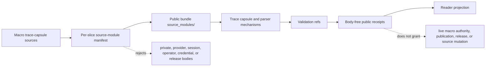

# Macro Projection Import Protocol

`macro_projection_import_protocol` is the source-available membrane for bringing
macro substrate into Microcosm. It exists because Microcosm should be dense and
alive without becoming a dump of private source bodies, operator context,
provider payloads, or release material.

The organ validates a projection packet with four public claims:

- non-secret macro bodies are copied or source-faithfully refactored only when
  the target file, digest, provenance, validation refs, and body-free receipt
  contract verify;
- private material is omitted with explicit omission receipts;
- public runtime refs are fixtures, standards, paper modules, exported bundles,
  copied body targets, and receipt refs;
- authority stays capped below release, publication, private-root equivalence,
  and live macro source authority.

## JSON Capsule Binding

- source_ref:
  `core/paper_module_capsules.json::paper_modules[19:paper_module.macro_projection_import_protocol]`
- source_authority: json_capsule
- Projection role: This Markdown is a reader projection of the JSON capsule
  row, not the source authority. The generated Mermaid projection is
  `paper_module.macro_projection_import_protocol.mermaid` with status
  `available_from_capsule_edges`, and the generated Atlas projection is
  `organ_atlas.macro_projection_import_protocol` with status
  `linked_from_capsule_edges`.
- proof boundary: the capsule binds the accepted organ, resolved mechanism row,
  runtime source locus, seven dependency edges, concept/principle/axiom
  governance refs, and 15 generated relationship edges. New edges still belong
  in the JSON capsule owner lane, not in Markdown prose.
- authority ceiling: this page can explain public-safe macro projection import
  validation, per-slice manifests, omitted-material receipts, body-free receipt
  policy, and validation receipts, but it cannot authorize live macro source
  authority, release, publication, secret export, source mutation, or a broader
  proof boundary.

## Reader Proof Boundary

The proof boundary is the JSON capsule row and generated relationship
projection, not the explanatory Markdown. The page can guide a cold reader from
the capsule to the accepted organ, mechanism row, runtime source locus,
dependency edges, manifests, exported bundles, and receipts; it cannot create
new capsule edges or make a release/publication claim.

Current generated-row proof: `edge_count: 15`,
`unresolved_selective_relation_count: 0`, Mermaid
`available_from_capsule_edges`, and Atlas `linked_from_capsule_edges`.
That proof is about public-safe import protocol evidence only; it is not live
macro source authority, private-root equivalence, source mutation permission,
provider execution, Lean/Lake execution, or whole-system correctness.
Proof consumers validate an import-accounting contract: source refs, public
target refs, digest relations, per-slice manifests, validation refs, omission
receipts, body-free receipt policy, intake status fields, and negative-case
rejection. They do not validate semantic correctness of the imported macro
subsystem, completeness of the private root, release readiness, provider or
Lean execution, source mutation permission, or whole-system correctness.

## Public Site Availability Boundary

This Markdown change does not regenerate a public site, Atlas page, Mermaid
projection, exported docs bundle, or intake board. Public surfaces remain
builder-owned projections over the capsule and receipt state. If a hosted page
or Atlas card lags this text, the generated projection is stale; this file is
not permission to hand-edit those generated outputs.

## Public-Safe Body Handling

Body-floor evidence belongs in per-slice manifests, copied public-safe targets,
source refs, digest refs, and body-free receipts. This page may name those
surfaces, but it must not inline private raw seed, operator thread content,
provider payload bodies, credentials, account/session state, release material,
or other omitted source bodies.
A passing secret-exclusion scan is a declared-input regression gate, not a
complete credential audit or proof that no private material exists anywhere. It
supports only the claim that the named fixture or bundle omitted the forbidden
material classes recognized by the protocol and kept receipt bodies body-free.

## Shape

The protocol is the membrane between macro source and public Microcosm
evidence. It reads projection cells, classifies the requested import, verifies
source/target refs and digest relations, applies the secret-exclusion boundary,
and emits body-free receipts that a public reader can replay without gaining
live macro authority.

Its shape is deliberately two-level:

- fixture and exported-bundle commands validate whole projection packets,
  negative cases, omitted-material receipts, and the intake/status board;
- source-module manifests bind each imported slice to source refs, target refs,
  digest relation, body-import class, validation refs, and claim ceilings.

That split keeps the organ usable as a source-open body floor while preventing
the paper module from becoming a static copy-count ledger. Counts, status
totals, and current body-import floors live in receipts and runtime status
surfaces.

## Runtime Shape

Run the fixture:

```bash
PYTHONPATH=src python3 -m microcosm_core.organs.macro_projection_import_protocol run --input fixtures/first_wave/macro_projection_import_protocol/input --out receipts/first_wave/macro_projection_import_protocol
```

Run the exported bundle:

```bash
PYTHONPATH=src python3 -m microcosm_core.organs.macro_projection_import_protocol run-projection-bundle --input examples/macro_projection_import_protocol/exported_projection_import_bundle --out receipts/runtime_shell/demo_project/organs/macro_projection_import_protocol
```

Preview the next import slice without writing receipts:

```bash
PYTHONPATH=src python3 -m microcosm_core.organs.macro_projection_import_protocol plan --input examples/macro_projection_import_protocol/exported_projection_import_bundle
```

The public CLI also exposes the same validator through:

```bash
microcosm macro-projection-import-protocol run-projection-bundle --input examples/macro_projection_import_protocol/exported_projection_import_bundle --out receipts/runtime_shell/demo_project/organs/macro_projection_import_protocol
microcosm macro-projection-import-protocol plan --input examples/macro_projection_import_protocol/exported_projection_import_bundle
microcosm intake
```

The `plan` action emits `macro_projection_import_intake_preview_v1`. It does
not write receipts. It scores each proposed projection cell before import:
source refs, public target refs, validation refs, selected pattern ids, copy
policy, authority ceiling, omitted material, secret-exclusion scan count,
verified body-import status, and ready/blocked status.

Exact-copy is a relation, not the whole protocol. Rows declared as exact-copy
prove byte-identical source and target digests and may be maintained by the
exact-copy refresh actuator. Rows declared as source-faithful public edits or
refactors prove the macro source digest and the improved public target digest
separately, cite the rewrite or symbol mapping, and are maintained by their
own validator/test lane. This is the lane for public-safety redaction,
dependency trimming, Microcosm-standard compliance, or runnable local cleanup.

It also self-hosts the intake cell state machine. Every projection cell carries
`projection_status`, `cell_state`, `action_required`, status reason, landed
evidence refs, and a next runtime surface. The board totals those fields as
status counts plus an open-actionable count so future passes can distinguish a
ready but unlanded cell from a verified public runtime import, self-hosted
protocol, or runtime bridge that is already consumed.

`microcosm intake` is the runtime bridge over that plan. It writes
`receipts/runtime_shell/intake_bridge/runtime_reveal_import_bridge.json`,
links the projection cells to the spine and reveal commands, and projects the
same statuses into the first-run bridge. Current landed statuses are:
`public_runtime_import_landed` for `formal_math_readiness_extensions`,
`self_hosted_status_protocol_landed` for `projection_protocol_self_host`, and
`runtime_bridge_landed` for `runtime_reveal_import_bridge`. These statuses do
not raise authority above public metadata, fixture shape, and receipt refs.

`microcosm status` and `microcosm spine` also expose the computed
`macro_body_import_floor`. Treat that value as a receipt-backed floor, not a
stable prose constant: the current authority lives in
`receipts/acceptance/first_wave/macro_projection_import_protocol_fixture_acceptance.json`
and the first-wave runtime receipts under
`receipts/first_wave/macro_projection_import_protocol/`. Cold readers should
inspect `public_safe_body_import_count`, `public_safe_body_import_status`,
`projection_status_counts`, `open_actionable_cell_count`, and
`secret_exclusion_scan` there instead of trusting an old markdown count. The
floor is still not a release signal or private-root equivalence claim.

## Source-Open Body Floor

The public body floor is the set of source refs that passed the protocol's
classification and digest checks as public-safe copies or source-faithful
public refactors. Exact-copy rows are refreshed by
`refresh-exact-copy-source-modules`; source-faithful edit rows stay with their
own validator/test lane because their target body is intentionally public
cleanup, normalization, or path redaction rather than byte identity.

The bundle body floor is never inferred from prose. A reader should inspect:

- `examples/macro_projection_import_protocol/exported_projection_import_bundle/*_source_module_manifest.json`
  for per-slice source-to-target relations;
- the copied targets under
  `examples/macro_projection_import_protocol/exported_projection_import_bundle/source_modules/`;
- `receipts/first_wave/macro_projection_import_protocol/projection_import_intake_board.json`
  for cell state, open actions, and landed evidence refs;
- `receipts/acceptance/first_wave/macro_projection_import_protocol_fixture_acceptance.json`
  for the accepted public authority receipt.

## Trace-Capsule Source-Body Import

The trace-capsule slice is the current proof-grade example of a source-body
import. Its source-module manifest is
`examples/macro_projection_import_protocol/exported_projection_import_bundle/trace_capsule_source_module_manifest.json`;
the projection cell is
`trace_capsule_prompt_edit_capture_source_modules_import`. The cell imports four
public-safe macro source bodies into the bundle:

- `tools/meta/observability/cli_prompt_trace.py` ->
  `source_modules/tools/meta/observability/cli_prompt_trace.py`;
- `system/server/tests/test_cli_prompt_trace_capsule.py` ->
  `source_modules/system/server/tests/test_cli_prompt_trace_capsule.py`;
- `tools/agent_trace_structurer/parser.mjs` ->
  `source_modules/tools/agent_trace_structurer/parser.mjs`;
- `tools/agent_trace_structurer/parser.test.mjs` ->
  `source_modules/tools/agent_trace_structurer/parser.test.mjs`.

The manifest is the body-floor receipt for this slice. It records
`module_count: 4`, `body_copied: true`, `body_in_receipt: false`,
`sha256_match: true`, line counts, byte counts, required anchors, source refs,
target refs, and the shared `copied_non_secret_macro_body` classification. That
means the public bundle carries the source bodies, while runtime receipts carry
paths, hashes, counts, anchors, and validation refs without duplicating the
bodies.



The imported Python side supplies the trace-capsule runtime surface:
`cli_prompt_trace.py` reads selected source files, rejects binary paths,
supports line-range and symbol selection, redacts selected excerpt text, and
emits numbered source lines with schema metadata. Its companion test module
proves terminal validation semantics, repeated prompt interning, source excerpt
priority, and closeout-report behavior. The imported JavaScript side supplies
the Agent Trace Structurer surface: `parser.mjs` preserves `source_text` as the
exact copied string, treats `source_lines` and indexes as deterministic
navigation projections, and builds lossless attachment clips where exact text is
reconstructed from `source_segments[].text`. `parser.test.mjs` proves embedded
file artifact indexing, Codex trace shape, final-message extraction, AIW thread
classification, and bounded export behavior.

This is a mechanism/evidence claim, not a release claim. The slice proves that
these four named, non-secret source bodies were imported into the public bundle
with manifest-backed digest and anchor checks, and that the parser and trace
capsule behavior have public fixture coverage. It does not prove that live
provider logs, browser/HUD state, account/session state, credentials, raw
operator thread bodies, recipient-send material, or future trace-capsule bodies
are public-safe or exported.

Those artifacts are the source-open floor. The receipt bodies stay body-free,
and private raw seed, operator thread content, provider payload bodies,
credentials, account/session state, and release or recipient material remain
outside the public bundle.

## Claim Ceiling

This module can claim that the protocol validates public-safe projection cells,
per-slice manifests, copied or source-faithful target bodies, omission receipts,
negative cases, and body-free receipt policy. It can also claim that accepted
receipts expose current `public_safe_body_import_count`,
`public_safe_body_import_status`, `projection_status_counts`,
`open_actionable_cell_count`, and `secret_exclusion_scan` fields.

It cannot claim that Microcosm is release-ready, equivalent to the private
root, free of all private material, or authorized to publish. It also cannot
raise an exact-copy refresh into permission to rewrite source-faithful public
refactors, mutate live macro source, call providers, run Lean/Lake, or export
operator/session bodies. Any stronger claim must come from the owning receipt,
standard, or release gate.

Anti-claim: metadata, provenance, public runtime refs, copied-body presence,
green fixture receipts, digest refs, and intake status counts are bounded import
evidence only. They are not release approval, publication approval, private-root
equivalence, live source authority, semantic truth, complete secret-scan
coverage, provider execution, Lean/Lake execution, or whole-system correctness.

## Structured Lattice Bindings

- Paper-module capsule:
  `core/paper_module_capsules.json#paper_module.macro_projection_import_protocol`.
- Governing standard:
  `standards/std_microcosm_macro_projection_import_protocol.json`.
- Accepted organ: `core/organ_registry.json#macro_projection_import_protocol`.
- Mechanism:
  `core/mechanism_sources.json#mechanism.macro_projection_import_protocol.validates_public_macro_projection_imports`.
- Runtime source: `src/microcosm_core/organs/macro_projection_import_protocol.py`.
- Focused regression: `tests/test_macro_projection_import_protocol.py`.
- Current public receipts:
  `receipts/first_wave/macro_projection_import_protocol/` and
  `receipts/acceptance/first_wave/macro_projection_import_protocol_fixture_acceptance.json`.
- Exported bundle:
  `examples/macro_projection_import_protocol/exported_projection_import_bundle/`.

The JSON capsule remains the relationship authority for this page. Markdown
edits can improve the reader projection, but new concept, principle, mechanism,
or dependency edges must be added through the capsule/standard owner lane and
then validated through doctrine projection checks.

## Evidence Binding

The organ's current public authority is the accepted organ row in
`core/organ_registry.json` plus the acceptance receipt
`receipts/acceptance/first_wave/macro_projection_import_protocol_fixture_acceptance.json`.
The JSON paper-module capsule is
`core/paper_module_capsules.json#paper_module.macro_projection_import_protocol`,
and the resolved mechanism row is
`core/mechanism_sources.json#mechanism.macro_projection_import_protocol.validates_public_macro_projection_imports`.
The runtime source locus is
`src/microcosm_core/organs/macro_projection_import_protocol.py`, with focused
regression coverage in `tests/test_macro_projection_import_protocol.py`.

The exported bundle does not have a single catch-all source-module manifest.
It carries one `*_source_module_manifest.json` file per imported slice under
`examples/macro_projection_import_protocol/exported_projection_import_bundle/`,
plus copied public-safe targets under that bundle's `source_modules/` tree.
That per-slice manifest shape is part of the evidence: it lets each imported
route, tool, standard, receipt, proof, or runtime body keep its own source ref,
target ref, digest relation, validation refs, and claim ceiling.

The first command for the fixture lane is:

```bash
PYTHONPATH=src python3 -m microcosm_core.organs.macro_projection_import_protocol run --input fixtures/first_wave/macro_projection_import_protocol/input --out receipts/first_wave/macro_projection_import_protocol
```

## Reader Evidence Routing

Use this order when checking the module:

1. Read the JSON capsule and standard to confirm the paper-module binding,
   authority ceiling, source-module manifest contract, and receipt fields.
2. Run the fixture command to validate projection cells and negative cases
   against temporary receipts.
3. Run the exported-bundle command to validate the public bundle and copied
   source-module surfaces.
4. Inspect the source-module manifests for exact-copy versus source-faithful
   edit relations before deciding which refresh lane applies.
5. Run the focused regression and paper-module corpus checks before landing a
   markdown or manifest update.

If a manifest is dry but a bundle-level validator still fails, check whether a
bundle manifest carries its own expected digest or line-count rows. Do not
infer that all companion manifest surfaces were refreshed just because an
exact-copy source-module dry run is clean.

## Receipt Expectations

A valid receipt names the protocol id, source refs, public runtime refs,
public-safe body imports, body-import verification, validation refs, authority
ceiling, projection/intake boards, source-module manifest refs,
source-to-target relation, source-module digest status, `body_in_receipt=false`
policy, runtime severance status, next best lane, anti-claim,
secret-exclusion scan, and negative-case coverage.

Closeout evidence for this page should include the fixture run, exported bundle
run or plan preview, focused pytest, paper-module coverage contract, release
claim language gate when wording changed, and doctrine projection check. If a
new projection cell lands, refresh the appropriate receipt first and update
markdown only where the receipt contract changed.

## Validation Receipt Path

From `microcosm-substrate/`, reproduce this page's proof boundary with
temporary receipts:

```bash
PYTHONPATH=src ../repo-python -m microcosm_core.organs.macro_projection_import_protocol run --input fixtures/first_wave/macro_projection_import_protocol/input --out /tmp/microcosm-macro-projection-import-protocol
PYTHONPATH=src ../repo-python -m microcosm_core.organs.macro_projection_import_protocol run-projection-bundle --input examples/macro_projection_import_protocol/exported_projection_import_bundle --out /tmp/microcosm-macro-projection-import-bundle
../repo-pytest microcosm-substrate/tests/test_macro_projection_import_protocol.py -q
../repo-pytest microcosm-substrate/tests/test_doctrine_lattice_runtime.py::test_macro_projection_import_protocol_population_has_capsule_and_mechanism_source -q
PYTHONPATH=src ../repo-python scripts/build_doctrine_projection.py --check-paper-module-corpus
```

These checks validate public-safe projection cells, per-slice manifests,
omitted-material receipts, and body-free receipt policy only. A diagram view
is generated for this module and an atlas card is linked. The checks do not
authorize live macro source authority, secret export, release, publication,
source mutation, provider or Lean/Lake execution, or whole-system correctness.

Re-enter this module when a new projection cell lands, a source-module manifest
is refreshed, or a receipt count changes. The repair route is to rerun the
organ validator, refresh the first-wave and acceptance receipts, and update the
standard or paper module only where the receipt contract changed. Do not raise
the authority ceiling from documentation edits.

## Prior Art Grounding

The import membrane follows established provenance and software-supply-chain
patterns: copied or refactored artifacts need source refs, target refs,
digests, validation refs, omission records, and a claim boundary. The closest
public anchors are [W3C PROV](https://www.w3.org/TR/prov-overview/) for
describing entity/activity/agent provenance, the
[SLSA specification](https://slsa.dev/spec/) for artifact integrity and
provenance in software supply chains, and
[in-toto](https://in-toto.io/) for linking supply-chain steps through signed
metadata.

Microcosm applies those patterns to a public/private projection boundary
rather than to release attestation. The per-slice source-module manifests,
secret-exclusion scans, body-free receipts, and omission receipts are inspired
by that provenance lineage, but they remain a local validator contract for
public Microcosm fixtures and exported bundles.

## Negative Cases

The validator intentionally rejects:

- private body import requests;
- omitted macro material without omission receipt refs;
- authority upgrades into live macro source authority;
- projection cells without validation refs;
- release, publication, recipient-work, or secret-export claims.

## Authority Ceiling

This paper module explains a public projection protocol. It does not authorize
release, hosted deployment, publication, recipient work, provider calls,
Lean/Lake execution, secret export, private source-body export, or
whole-system correctness.
