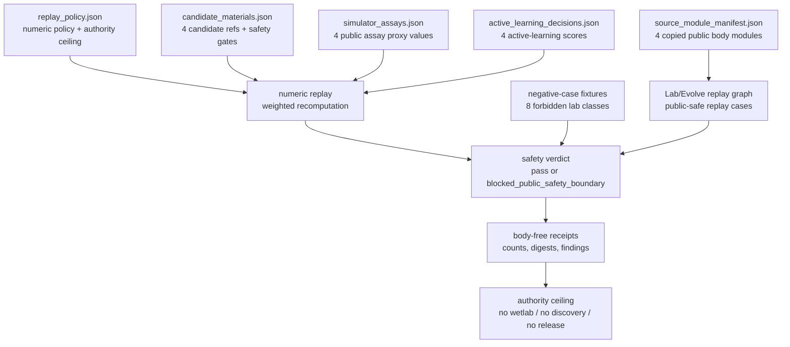

# Materials Chemistry Closed-Loop Lab-Safety Replay

## Abstract

`materials_chemistry_closed_loop_lab_safety_replay` is a public, simulator-only
replay validator for materials-lab language. It does not claim a material
discovery, a wetlab protocol, a robot loop, or a benchmark. It checks whether a
closed-loop-lab shaped public fixture has enough evidence to be talked about at
all: candidate material refs, safety-screen refs, simulator-only assay rows,
active-learning decisions, a Lab/Evolve replay graph, source-module manifest
digests, negative-case refusals, body-free receipts, and an explicit authority
ceiling.

The technical claim is a numeric verdict proof boundary. A passing run must
recompute the selected candidate from score-backed fixture rows rather than
trusting a declared label. The baseline fixture contains four candidates and
selects `mat_polymer_membrane_001` with score `0.917`; perturbation tests prove
that stale labels, missing score rows, out-of-range scores, and safety-gate
failures block the verdict.

## Mechanism

The runtime locus is
`src/microcosm_core/organs/materials_chemistry_closed_loop_lab_safety_replay.py`.
The relevant entrypoints are `run` for first-wave fixture validation and
`run_lab_bundle` for exported-bundle validation. The validator loads a replay
policy, candidate rows, experiment DAG rows, simulator assays, active-learning
decisions, optional source-module manifests, and eight forbidden negative-case
fixtures.

The acceptance rule is deliberately small:

1. Positive rows must link candidates, experiments, assays, safety screens,
   active-learning decisions, failure taxonomy refs, and cold replay refs.
2. Negative cases must be observed and refused.
3. Numeric replay must recompute the selected candidate from public numbers.
4. Source-module imports must verify copied non-secret bodies without putting
   bodies into receipts.
5. The safety verdict must remain inside the simulator-only authority ceiling.



## JSON Capsule Binding

- Capsule row:
  `core/paper_module_capsules.json::paper_modules[6:paper_module.materials_chemistry_closed_loop_lab_safety_replay]`
- `source_authority: json_capsule`
- This Markdown is a reader projection for the capsule-backed Microcosm paper
  module. It can explain the organ and its proof boundary, but it cannot create
  source authority, subject edges, runtime correctness, or release authority.
- The generated Mermaid projection is
  `paper_module.materials_chemistry_closed_loop_lab_safety_replay.mermaid` with
  status `available_from_capsule_edges`.
- The generated Atlas projection is
  `organ_atlas.materials_chemistry_closed_loop_lab_safety_replay` with current
  status `blocked_until_organ_atlas_owner_lane_binds_edges`; that status belongs
  to the atlas owner lane, not to this Markdown page.
- The proof boundary is the runtime, focused tests, capsule row, generated JSON
  instance, and validation receipts together. Markdown prose is not a second
  truth.
- The authority ceiling is the capsule ceiling: copied public Lab/Evolve
  macro/control/receipt/standard bodies, body-free simulator-only fixture
  receipts, runtime bundle receipts, and artifact safety/refusal validation
  only.
- The validation receipts must stay body-free and must point to source modules,
  fixture rows, digests, counts, and finding codes rather than embedding private
  or provider material.

## Structured Lattice Bindings

- Organ:
  `materials_chemistry_closed_loop_lab_safety_replay`
- Mechanism:
  `mechanism.materials_chemistry_closed_loop_lab_safety_replay.validates_public_materials_lab_safety_replay`
- Runtime:
  `src/microcosm_core/organs/materials_chemistry_closed_loop_lab_safety_replay.py`
  with `run`, `run_lab_bundle`, `_source_module_manifest_result`,
  `_source_open_body_import_summary`, `_build_result`, `_freshness_basis`,
  `EXPECTED_NEGATIVE_CASES`, and `AUTHORITY_CEILING`
- Concept:
  `concept.research_and_science_replay_evidence_bundle`
- Principles:
  `P-1`, `P-2`, `P-3`, `P-6`, `P-8`, `P-15`
- Axioms:
  `AX-1`, `AX-2`, `AX-5`, `AX-7`
- Dependency modules:
  `paper_module.research_replication_rubric_artifact_replay`,
  `paper_module.world_model_projection_drift_control_room`, and
  `paper_module.macro_projection_import_protocol`

The generated JSON instance
`paper_modules/materials_chemistry_closed_loop_lab_safety_replay.json` resolves
the organ, mechanism, concept, principle, axiom, dependency-module, and
code-locus edges from the capsule. Its selective-relation gap list is empty.

## Numeric Assay And Verdict Evidence

The replay policy declares:

- selection rule:
  `max_weighted_public_assay_active_learning_and_safety_gate_score`
- minimum safety gate: `0.70`
- expected selected candidate: `mat_polymer_membrane_001`
- weighted score:
  `0.45 * public_assay_proxy_value + 0.35 * public_active_learning_score + 0.20 * public_safety_gate_score`

The source fixture binds four score-backed rows:

| Candidate | Safety gate | Assay proxy | Active-learning | Weighted score | Decision / action |
|---|---:|---:|---:|---:|---|
| `mat_polymer_membrane_001` | `0.94` | `0.92` | `0.90` | `0.917` | `decision_membrane_001` / `simulate_assay` |
| `mat_solid_electrolyte_002` | `0.91` | `0.84` | `0.81` | `0.8445` | `decision_electrolyte_002` / `update_surrogate_model` |
| `mat_catalyst_support_003` | `0.85` | `0.78` | `0.74` | `0.780` | `decision_support_003` / `choose_next_simulation` |
| `mat_sorbent_surface_004` | `0.88` | `0.70` | `0.66` | `0.722` | `decision_sorbent_004` / `screen_candidate` |

The focused regression
`test_materials_chemistry_numeric_replay_recomputes_verdict_from_fixture_numbers`
proves the pass case: status `pass`, `verified_numeric_row_count == 4`,
selected candidate `mat_polymer_membrane_001`, selected decision
`decision_membrane_001`, selected next action `simulate_assay`, score `0.917`,
realness rung `R3`, and verdict basis
`recomputed_from_public_assay_active_learning_and_safety_gate_fixture_numbers`.

The verifier does not use expected labels for selection. Expected labels are
checked only after the selected row is recomputed from candidate, assay, and
decision content.

## Test Matrix

| Class | Evidence | Expected verdict |
|---|---|---|
| Real-good fixture | Baseline first-wave fixture with four candidate, assay, and decision rows | `public_safe_simulator_replay_accepted`; numeric replay `pass`; selected candidate `mat_polymer_membrane_001`; score `0.917` |
| Real-good source body floor | Exported bundle manifest with four copied modules and zero manifest findings | `source_module_manifest_status: pass`; `verified_module_count: 4`; receipts remain body-free; current checked-in bundle still needs refreshed numeric rows before it is a full exported-bundle pass |
| Real-bad lab safety | Controlled/bioactive targets, hazardous synthesis flags, mismatched safety refs, robot command, credentials, private notebooks, or discovery claims | `blocked_public_safety_boundary` with the relevant `MATERIALS_*_FORBIDDEN` or positive-linkage finding |
| Real-bad numeric missingness | Score-backed rows removed while numeric policy is active | `MATERIALS_NUMERIC_REPLAY_POLICY_REQUIRES_SCORE_BACKED_ROWS`; `verified_numeric_row_count: 0` |
| Real-bad numeric required | Numeric policy removed and score rows absent | `MATERIALS_NUMERIC_REPLAY_REQUIRED`; realness rung `blocked` |
| Real-bad stale label | Policy declares `mat_catalyst_support_003` while recomputation selects `mat_polymer_membrane_001` | `MATERIALS_NUMERIC_REPLAY_EXPECTED_LABEL_STALE` |
| Real-bad score range | Safety, assay, or active-learning score outside `[0, 1]` | `MATERIALS_NUMERIC_REPLAY_SCORE_OUT_OF_RANGE` |
| Perturbation, low safety gate | Membrane safety gate lowered to `0.52` | Computed pick moves to `mat_solid_electrolyte_002`, verdict blocks, and findings include stale label plus `MATERIALS_NUMERIC_REPLAY_SAFETY_GATE_FAILED` |
| Perturbation, moved valid pick | Sorbent raised to safety `0.93`, assay `0.98`, active learning `0.98`, and policy expectation updated | Numeric replay passes, selected candidate `mat_sorbent_surface_004`, selected action `screen_candidate`, score `0.970` |
| Perturbation, moved pick without expectation update | Exported bundle recomputes sorbent as the winner while policy still expects membrane | Source manifest stays `pass`, but numeric replay blocks with `MATERIALS_NUMERIC_REPLAY_EXPECTED_LABEL_STALE` |

These cases are source/test-backed by
`tests/test_materials_chemistry_closed_loop_lab_safety_replay.py`. Fresh local
first-wave receipt output is the authority for current numeric replay; older
archived first-wave receipts and the checked-in exported bundle predate the
numeric replay rows and should not be read as the numeric proof. The exported
bundle numeric-refresh residual is captured at
`cap_quick_materials_chemistry_closed_loop_lab_safe_51d56594f137`.

## Source-Open Body Floor

The exported bundle at
`examples/materials_chemistry_closed_loop_lab_safety_replay/exported_materials_lab_safety_bundle`
contains a `source_module_manifest.json` with four copied non-secret bodies:

| Module id | Material class | Role |
|---|---|---|
| `materials_lab_evolve_failure_replay_specimen_body_import` | `public_macro_tool_body` | deterministic replay graph construction, failure classification, restart-point selection, source-capsule hashing, and receipt boundaries |
| `materials_lab_evolve_replay_graph_body_import` | `public_macro_control_plane_body` | replay graph body, restart points, source capsules, global teachings, and public claim boundary |
| `materials_lab_evolve_receipt_body_import` | `public_macro_receipt_body` | replay receipt body proving the macro evidence shape without moving private material into receipts |
| `laboratory_standard_body_import` | `public_standard_body` | public laboratory standard floor for the replay |

The bundle validator checks `module_count: 4`, `verified_module_count: 4`,
`source_module_manifest_status: pass`, body-free receipt policy, and zero source
module findings. The current checked-in exported bundle is still a source-body
floor, not the final numeric exported-bundle proof: `run_lab_bundle` requires
refreshed score-backed numeric rows before it can pass as a full exported-bundle
verdict. Focused tests inject those rows to prove the exported-bundle numeric
path. The remaining bundle/receipt refresh is captured at
`cap_quick_materials_chemistry_closed_loop_lab_safe_51d56594f137`.

The validator also records the blocked source-open boundary for
`codex/doctrine/paper_modules/lab_oracle_evolve_pipeline.md`: that macro paper
module cannot be imported as an exact body while raw operator-anchor language
remains in scope.

## Validation

Run the current runtime proof from the Microcosm root:

```bash
cd microcosm-substrate
PYTHONPATH=src ../repo-python -m microcosm_core.organs.materials_chemistry_closed_loop_lab_safety_replay run --input fixtures/first_wave/materials_chemistry_closed_loop_lab_safety_replay/input --out /tmp/microcosm_materials_chemistry_lab_safety_first_wave --acceptance-out /tmp/microcosm_materials_chemistry_lab_safety_acceptance.json
```

Inspect the exported source-body bundle. Until the exported fixture is refreshed
with score-backed numeric rows, this command may return a blocked numeric
verdict while still proving the manifest/body-floor boundary:

```bash
cd microcosm-substrate
PYTHONPATH=src ../repo-python -m microcosm_core.organs.materials_chemistry_closed_loop_lab_safety_replay run-lab-bundle --input examples/materials_chemistry_closed_loop_lab_safety_replay/exported_materials_lab_safety_bundle --out /tmp/microcosm_materials_chemistry_lab_safety_bundle
```

Run the focused regression suite:

```bash
cd microcosm-substrate
PYTHONPATH=src ../repo-pytest tests/test_materials_chemistry_closed_loop_lab_safety_replay.py -q
```

Run the focused paper-module corpus check without regenerating shared
projections:

```bash
cd microcosm-substrate
PYTHONPATH=src ../repo-python scripts/build_doctrine_projection.py --check-paper-module-corpus
```

This lane intentionally does not run `scripts/build_doctrine_projection.py
--write`; generated projections, atlas cards, and shared capsule surfaces belong
to their owner lanes.

## Evidence Routes

- Markdown reader projection:
  `paper_modules/materials_chemistry_closed_loop_lab_safety_replay.md`
- JSON capsule:
  `core/paper_module_capsules.json::paper_module.materials_chemistry_closed_loop_lab_safety_replay`
- Generated JSON instance:
  `paper_modules/materials_chemistry_closed_loop_lab_safety_replay.json`
- Mechanism source:
  `core/mechanism_sources.json::mechanism.materials_chemistry_closed_loop_lab_safety_replay.validates_public_materials_lab_safety_replay`
- Runtime:
  `src/microcosm_core/organs/materials_chemistry_closed_loop_lab_safety_replay.py`
- Domain standard:
  `standards/std_microcosm_materials_chemistry_closed_loop_lab_safety_replay.json`
- Paper-module standard:
  `standards/std_microcosm_paper_module.json`
- Fixture input:
  `fixtures/first_wave/materials_chemistry_closed_loop_lab_safety_replay/input`
- Exported bundle:
  `examples/materials_chemistry_closed_loop_lab_safety_replay/exported_materials_lab_safety_bundle`
- Focused tests:
  `tests/test_materials_chemistry_closed_loop_lab_safety_replay.py`

## Limitations

This module is a replay validator, not a laboratory. It does not synthesize
materials, provide wetlab instructions, control robots, rank real compounds,
validate live assay data, authorize provider calls, or establish a discovery
benchmark. Fixture numbers are public replay coordinates for a safety-gated
contract; they are not experimental measurements.

The validator can prove local consistency across fixture rows, exported
source-module manifests, replay graph records, negative-case checks, sentinel
scans, numeric recomputation, and body-free receipts. It cannot prove chemical
safety, regulatory suitability, lab readiness, deployment readiness, public-site
freshness, publication approval, or release authority.

## Authority Ceiling

This module may claim that Microcosm has a public, source-faithful,
simulator-only replay contract that checks candidate refs, safety-screen refs,
simulator-only assay rows, active-learning decisions, numeric replay,
failure-taxonomy refs, cold replay refs, replay cases, source capsule hashes,
copied source-module digests, negative-case receipts, body-free receipt policy,
and authority ceilings.

It must not claim wetlab operation, material synthesis, robot control,
hazardous synthesis guidance, reagent quantities, controlled or bioactive
targeting, live assay data, private lab notebook export, live credentials,
provider execution, material discovery, benchmark performance, safety
certification, publication, hosting, release approval, source mutation, or
product-progress authority.
