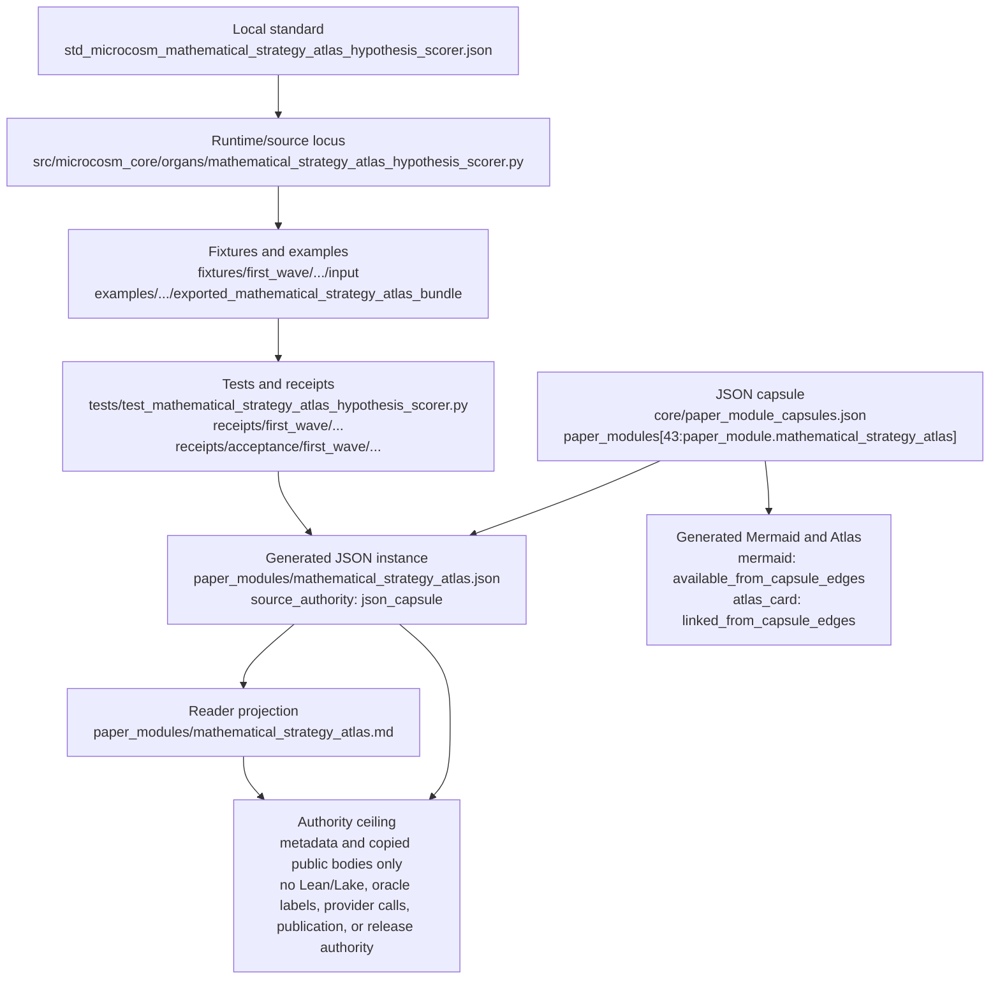

# Mathematical Strategy Atlas

`mathematical_strategy_atlas_hypothesis_scorer` is the public pre-oracle
strategy layer for Microcosm formal-math work. It turns problem feature tags
into an explicit strategy hypothesis before premise retrieval or proof
execution, then records the result as redacted receipts.

The point is not to prove anything. The point is to make the first
mathematical move inspectable: an `iff_goal` shape selects `iff_split`, a
recursive list shape selects `recursive_data_induction`, arithmetic
normalization selects the arithmetic lens, and unmapped shapes become a typed
`STRATEGY_SELECTION_MISS` instead of a hidden failure mode.

The current body-floor import carries eight copied non-secret macro bodies:
the prover graph benchmark harness, the provider receipt reducer, their
strategy-boundary regression tests, the compute-provider strategy
classification standard, and three public runtime artifacts from
`PROVER_PROVIDER_CONTEXT_SWEEP_20260510_v0` (`strategy_cards.json`,
`strategy_hypothesis_set.json`, and `prover_skill_atlas.json`). They live in
`source_artifacts/` under both the first-wave fixture input and the exported
runtime bundle; receipts carry refs, counts, hashes, anchors, and verdicts
instead of body text.

## JSON Capsule Binding

Source authority for this reader page is `core/paper_module_capsules.json::paper_modules[43:paper_module.mathematical_strategy_atlas]`; the generated instance is `paper_modules/mathematical_strategy_atlas.json` with `source_authority: json_capsule`.

This Markdown is a reader projection over the capsule, not the authority plane. The generated Mermaid projection is `available_from_capsule_edges`, and the generated Atlas projection is `linked_from_capsule_edges`; both statuses are builder-owned projections and do not expand the authority ceiling.

The proof boundary is copied public strategy metadata, public macro tool bodies, and public fixture/exported-bundle receipts only. A cold reader should not treat this page, Mermaid availability, Atlas linkage, or validation receipts as Lean/Lake execution, theorem correctness, oracle-label visibility, provider-call authority, benchmark performance, publication approval, or release approval.

## Shape

The shape of this module is a capsule-backed reader projection: the source row
`core/paper_module_capsules.json::paper_modules[43:paper_module.mathematical_strategy_atlas]`
is the authority capsule, `paper_modules/mathematical_strategy_atlas.json` is
the generated JSON instance, and this Markdown page is a cold-reader
projection. The local organ standard, when changing runtime behavior or the
claim envelope, is
`standards/std_microcosm_mathematical_strategy_atlas_hypothesis_scorer.json`;
the general paper-module contract remains
`standards/std_microcosm_paper_module.json`.



The generated instance currently exposes 19 concrete
`relationships.edges`: two subject edges for the organ and mechanism, one
governing concept edge, six principle edges, six axiom edges, three sibling
paper-module dependency edges, and one resolved code-locus edge into
`src/microcosm_core/organs/mathematical_strategy_atlas_hypothesis_scorer.py`.
`relationships.unpopulated_selective_relations` is empty, so the module-level
unresolved selective-relation count available from this instance is `0`.

Runtime evidence enters through the fixture input
`fixtures/first_wave/mathematical_strategy_atlas_hypothesis_scorer/input`,
the exported bundle
`examples/mathematical_strategy_atlas_hypothesis_scorer/exported_mathematical_strategy_atlas_bundle`,
and their copied `source_artifacts/` / `source_module_manifest.json` bundles.
The focused test file is
`tests/test_mathematical_strategy_atlas_hypothesis_scorer.py`; receipts include
`receipts/first_wave/mathematical_strategy_atlas_hypothesis_scorer/mathematical_strategy_atlas_result.json`,
`mathematical_strategy_atlas_board.json`,
`mathematical_strategy_atlas_validation_receipt.json`,
`receipts/acceptance/first_wave/mathematical_strategy_atlas_hypothesis_scorer_fixture_acceptance.json`,
and runtime-shell exported-bundle validation receipts. Those receipts show
fixture/bundle pass status, eight copied public source artifacts, expected
negative-case coverage, and the same authority ceiling; they do not raise this
page above reader projection.

The honest ceiling is narrow by design: this module can say that public
pre-oracle strategy hypotheses, retrieval-lens metadata, copied public macro
tool/standard/runtime bodies, source-artifact digests, and negative cases are
inspectable. It cannot say that Lean or Lake ran, that a theorem was proved,
that oracle labels or provider payloads are visible, that benchmark
performance is certified, that publication is approved, that release is
approved, or that the private root has been made public-safe.

## Structured Lattice Bindings

The generated JSON row currently contributes 19 relationship edges:

- Two `paper_module.explains.organ_or_mechanism` edges for the organ and
  mechanism subjects.
- One `paper_module.governed_by.concept` edge.
- One resolved `paper_module.cites.code_locus` edge.
- Six `paper_module.governed_by.principle` edges.
- Six `paper_module.abides_by.axiom` edges.
- Three sibling `paper_module.depends_on.paper_module` edges.

The Mermaid projection is `available_from_capsule_edges`; the Atlas projection
is `linked_from_capsule_edges`. At this HEAD the generated row reports zero
unresolved selective relations; future concept or dependency edges still belong
in the JSON capsule row, not in Markdown prose.

## Reader Evidence Routing

Read this module as a pre-oracle strategy-hypothesis audit, not as a proof result.
The primary reader path is:

- Start with `strategy_atlas.json`, `problem_features.json`, and
  `hypothesis_cases.json` to see how public feature tags select a strategy id
  before retrieval or proof execution.
- Check `source_module_manifest.json` and the copied `source_artifacts/` bodies
  to verify that the imported macro bodies are non-secret public tool/runtime
  bodies with exact digests, required anchors, and body-floor receipts.
- Inspect the fixture and exported-bundle receipts to confirm that strategy ids,
  retrieval-term effects, oracle-label exclusion, source-card consistency, and
  negative cases are checked without exposing proof bodies or provider payloads.
- Use the generated JSON sidecar only for structural lattice proof: it confirms
  capsule-backed subjects, code loci, doctrine refs, and dependency edges; it
  does not prove the scorer's correctness or any theorem.

## Public Inputs

- `strategy_atlas.json` defines the known strategy enum, match features, and
  retrieval-term additions.
- `problem_features.json` carries synthetic public problem features with
  oracle labels hidden.
- `hypothesis_cases.json` validates deterministic pre-oracle strategy scoring.
- `source_module_manifest.json` binds copied macro body files to exact source
  refs, SHA-256 digests, byte counts, line counts, material classes, and
  required anchors.
- Negative cases reject unknown strategy ids, proof bodies, oracle labels,
  post-oracle strategy selection, and release/proof/provider overclaims.

## Receipts

The organ emits:

- `mathematical_strategy_atlas_result.json`
- `mathematical_strategy_atlas_board.json`
- `mathematical_strategy_atlas_validation_receipt.json`
- `mathematical_strategy_atlas_hypothesis_scorer_fixture_acceptance.json`

Runtime-shell exported bundle validation writes
`exported_mathematical_strategy_atlas_bundle_validation_result.json`.

## Receipt Expectations

A complete local receipt should bind four layers:

- Focused organ pytest for strategy selection, source-module import checks,
  exported-bundle validation, negative cases, and redacted receipt shape.
- Runtime receipt files from the fixture command and exported-bundle command
  when those commands are run locally.
- Paper-module corpus validation from
  `build_doctrine_projection.py --check-paper-module-corpus`.
- Generated-row proof from `paper_modules/mathematical_strategy_atlas.json`
  showing 19 edges, Mermaid `available_from_capsule_edges`, Atlas
  `linked_from_capsule_edges`, `source_authority: json_capsule`, and zero
  unresolved selective relations.

## Validation Receipt Path

Run from `microcosm-substrate`:

```bash
PYTHONPATH=src ../repo-python -m microcosm_core.organs.mathematical_strategy_atlas_hypothesis_scorer run \
  --input fixtures/first_wave/mathematical_strategy_atlas_hypothesis_scorer/input \
  --out /tmp/microcosm-mathematical-strategy-atlas-hypothesis-scorer/fixture \
  --card
PYTHONPATH=src ../repo-python -m microcosm_core.organs.mathematical_strategy_atlas_hypothesis_scorer run-strategy-bundle \
  --input examples/mathematical_strategy_atlas_hypothesis_scorer/exported_mathematical_strategy_atlas_bundle \
  --out /tmp/microcosm-mathematical-strategy-atlas-hypothesis-scorer/bundle \
  --card
PYTHONPATH=src ../repo-python -m pytest -p no:cacheprovider tests/test_mathematical_strategy_atlas_hypothesis_scorer.py -q
PYTHONPATH=src ../repo-python scripts/build_doctrine_projection.py --check-paper-module-corpus
```

A green receipt proves only pre-oracle strategy-hypothesis metadata, copied
public macro tool bodies, source artifact digests, and negative-case
enforcement; it does not run Lean or Lake, prove theorem correctness, reveal
oracle labels, export proof bodies, call providers, certify benchmark
performance, authorize publication, or authorize release.

## Re-Entry Conditions

Re-enter through the JSON capsule lane only if the module needs new subjects,
doctrine refs, dependency edges, or code loci. In that case, edit
`core/paper_module_capsules.json` under an exclusive projection-owner session
and regenerate the governed JSON/Atlas/Mermaid surfaces with the builder.

Re-enter through the Markdown-only lane when the capsule and sidecar already
agree but reader evidence, receipt routing, or authority-ceiling prose needs
sharpening. That lane owns only `paper_modules/mathematical_strategy_atlas.md`
and must preserve the `## JSON Capsule Binding` heading plus the generated
projection statuses named above.

## Prior Art Grounding

The strategy atlas is grounded in the formal-methods practice of separating
problem-shape classification from proof execution. Lean's tactic model, as
introduced in
[Theorem Proving in Lean 4](https://lean-lang.org/theorem_proving_in_lean4/Tactics/),
gives the immediate precedent: proof work is often organized around tactics
chosen for a goal shape, while the kernel checks the final proof state. The
[mathlib overview](https://leanprover-community.github.io/mathlib-overview.html)
also motivates explicit retrieval terms and domain tags because a large formal
library is navigated by topic, structure, and reusable theorem families.

The atlas is also adjacent to hammer-style premise and method selection, such
as Isabelle
[Sledgehammer](https://isabelle.in.tum.de/doc/sledgehammer.pdf), where a
front-end tool searches for useful facts or proof methods before replay. This
module keeps the pattern pre-oracle and metadata-only: it records why a first
strategy hypothesis was selected, not whether the proof can be completed.

## Authority Ceiling

The atlas is metadata and strategy-hypothesis machinery only. It does not run
Lean or Lake, claim theorem correctness, reveal oracle strategy labels, expose
proof bodies, call providers, tune on test answers, authorize release, or make
Mathlib-dependent proof claims. The copied runtime artifacts are public
strategy traces, not oracle labels, provider payloads, or proof bodies.

## Claim Ceiling

This module supports only the reader-verifiable claim that public
strategy-hypothesis metadata, copied macro tool bodies, source artifact
digests, and negative cases can be checked before oracle labels or proof
execution. It does not run Lean or Lake, prove theorem correctness, reveal
oracle labels, expose proof bodies, call providers, certify benchmark
performance, authorize publication, authorize release, or make Mathlib-dependent
proof claims.
