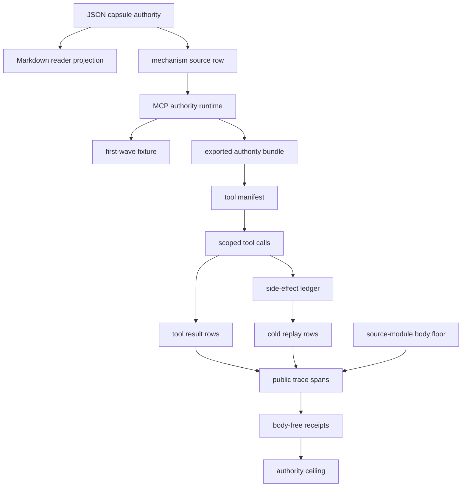

# MCP Tool Authority Replay

This module is the public Microcosm projection of a tool-authority claim
contract. It is a synthetic MCP-like replay fixture, not a live MCP account
test, provider call, credential-handling certification, benchmark security
result, or release claim.

The fixture models three public tools: a readonly docs lookup, a write-capable
ticket update, and an untrusted result source. The claim is admitted only when
tool manifest scope refs, call argument hashes, approval token refs, side-effect
ledger refs, rollback receipts, untrusted-output instruction/data splits, cold
replay receipts, negative cases, and authority ceilings line up.

## Purpose

When an agent uses tools through a protocol like MCP, the sentence "the agent
used the tool safely" is cheap to write and hard to back. This organ answers one
question: given a recorded tool-use trace, does the evidence actually support the
authority the trace claims, or is the safety language unearned? It exists so that
tool-authority claims have to be replayed against metadata before prose is
allowed to call them safe.

The approach is to treat a tool call as a small transaction that must show its
working. Each call cites a narrow capability scope, an argument hash, and, if it
writes, an approval token, a side-effect ledger entry, and a rollback receipt.
Those references are not taken on trust: the side-effect ledger and the cold
replay rows are cross-checked against the accepted call rows by call id, so a
rollback receipt that no call refers to, or a write that skips approval, is
caught rather than waved through. The point is that a reference string is not
authority until something downstream resolves it.

Two failure modes are worth naming because they are specific to tool-using
agents. The first is the confused deputy: a call that asks for a scope wider than
its task needs (`*`, `account_full_access`) is rejected before it runs, so a tool
cannot quietly borrow more authority than it was granted. The second is
tool-output-as-instruction, the prompt-injection shape where text returned by an
untrusted tool is obeyed as a command. Here untrusted output must stay data and
cite an instruction/data split; a row that lets output become instruction is one
of the eight negative cases the fixture is built to catch.

This is deliberately a synthetic replay, not a live test. The organ never opens
an MCP account, calls a provider, or handles a credential. It reads only public
metadata and digests, and it keeps every payload, result body, and credential
out of the receipts it writes. What it offers is narrow and honest: a way to
check that a tool-authority story is internally consistent and body-free, not a
certificate that any real tool integration is secure.

## JSON Capsule Binding

- Source authority: `core/paper_module_capsules.json::paper_modules[39:paper_module.mcp_tool_authority_replay]` with `source_authority: json_capsule`; the generated instance is `paper_modules/mcp_tool_authority_replay.json`.
- This Markdown is a reader projection. The generated Mermaid projection is `available_from_capsule_edges`; the generated Atlas projection is `linked_from_capsule_edges`, so tool-authority edges are read from the capsule rather than inferred from prose.
- The authority ceiling is the synthetic MCP-like tool-authority replay fixture boundary. The proof boundary is restricted to scope refs, argument hashes, approval refs, side-effect ledger refs, rollback receipts, instruction/data split refs, cold replay, negative cases, and validation receipts; it does not establish live MCP account safety, credential-handling certification, provider behavior, benchmark security, source mutation, publication, or release authority.

## Reader Proof Boundary

The proof boundary is the JSON capsule row plus the generated relationship row,
not the Markdown story or the embedded Mermaid sketch below. This page may
explain the capsule-backed path through organ, mechanism, runtime source,
bundle, manifests, receipts, authority scopes, side effects, rollback refs, and
negative cases; it cannot infer dependency edges, expand the capsule, or claim
live MCP account safety.

Current generated-row proof: `edge_count: 7`,
`unresolved_selective_relation_count: 1`, Mermaid
`available_from_capsule_edges`, and Atlas `linked_from_capsule_edges`.
The remaining unresolved selective relation is an honest dependency residual;
it should stay residual until the capsule owner lane names a resolvable
dependency edge.

## Public Site Availability Boundary

This Markdown edit is not a public-site or Atlas regeneration. Generated site,
Mermaid, Atlas, and corpus projections remain builder-owned outputs over the
capsule row. If a hosted page or Atlas card lags this reader boundary, the fix
is a controlled projection refresh by the owning lane, not a hand edit to
generated assets.

## Public-Safe Body Handling

The page may cite body-free receipts, public trace span refs, source-module
manifest rows, and copied non-secret target paths. It must not embed live MCP
account records, credentials, token values, provider payloads, raw tool
payloads, raw tool results, browser/HUD state, recipient-send state, or source
body text inside receipts or prose proof.

## Shape



The module's shape is a public tool-authority replay, not a live MCP security
claim. A capsule-backed reader projection points at the mechanism and runtime
organ; the runtime validates tool classes, capability scopes, call metadata,
approval refs, side-effect and rollback refs, untrusted-output data boundaries,
cold replay, public trace spans, source-module digest anchors, negative cases,
and body-free receipts.

## Technical Mechanism

The replay is a fail-closed authority lattice over a synthetic MCP-like tool
story. `_build_result` loads the fixture or exported bundle, runs
`load_forbidden_classes` and `scan_paths` over input JSON and copied source
modules, then validates each contract plane separately: projection protocol,
tool policy, tool manifest, tool calls, tool results, side-effect ledger, cold
replay rows, public trace spans, and source-module manifest rows. The final
status is `pass` only when every sub-validator passes, no expected negative case
is missing, the secret scan has zero blocking hits, and the source-module floor
is either present when required or explicitly not required for the first-wave
fixture.

Tool authority is checked before prose can turn it into evidence. Manifest rows
define the declared tool ids and allowed tool classes. `validate_tool_calls`
then rejects undeclared tool ids, overbroad scopes, missing argument hashes,
hidden credential export, live account access, unapproved side effects,
tool-output-as-instruction, final-answer-only grading, and unredacted payload
export. Write-capable calls must carry approval token refs, side-effect ledger
refs, and rollback receipt refs; untrusted-result calls must keep instruction
and data boundaries explicit. `validate_side_effect_ledger` and
`validate_cold_replay` make those refs observable instead of leaving them as
decorative strings.

The exported-bundle path adds a body-floor check without moving bodies into
receipts. `_source_module_manifest_result` streams digest verification over each
copied non-secret macro source module, checks required anchors, requires
`body_in_receipt: false`, and reports a body-free source-open import summary.
`build_public_mcp_tool_authority_trace` contributes three public trace spans
for the tool calls; `_body_import_verification` binds that public refactor back
to the macro source and Microcosm target digests. `_write_receipts` emits the
result, board, validation receipt, and acceptance receipt for fixture runs, and
`result_card` deliberately exposes counts, status bits, digest freshness, and
omission receipts rather than tool rows or source bodies.

The mechanism is intentionally narrower than a tool-use security benchmark. It
accepts only public metadata and digest evidence, and it treats every generated
projection as a receipt over source rows rather than as source authority.

## Governing Lattice Relation

The paper-module capsule binds this reader projection to the
`mcp_tool_authority_replay` organ and to
`mechanism.mcp_tool_authority_replay.validates_public_mcp_tool_authority_replay`.
The capsule row declares `concept.agent_reliability_and_safety_validator_bundle`,
principles `P-4` and `P-16`, and axiom `AX-3` as the governing lattice. The
generated organ row repeats the paper and mechanism links and adds an
organ-level `P-18` relation; that organ relation is useful context but does not
expand the paper-module capsule's declared authority.

`P-4` and `AX-3` are the local authority rule: a tool handle, credential-shaped
string, role name, or trusted-session label is not proof of authority. The
runtime must derive authority from dereferenced manifest policy, capability
scope refs, approval refs, side-effect refs, rollback refs, cold replay refs,
and public trace spans. `P-16` supplies the transaction boundary: a
write-capable tool call is admissible only when the call is scoped, the
side-effect is ledgered, rollback evidence is present, and the receipt says
which authority ceiling still holds.

The mechanism row deliberately leaves sibling/upstream mechanism relations as
residual pressure. That residual is part of the claim ceiling: this module can
show a public replay lattice for synthetic MCP-like tool authority, but it does
not infer neighbouring mechanisms from prose, certify live MCP security, or
promote generated Mermaid, Atlas, site, or corpus projections into source
authority.

## Public Mechanics

- Every tool call must bind to a narrow capability scope ref before admission.
- Write-capable calls require approval token refs, side-effect ledger refs, and
  rollback receipt refs.
- Untrusted tool output is data, not instruction, and must cite an
  instruction/data split ref.
- Call arguments, tool outputs, account refs, and result bodies stay redacted or
  metadata-only.
- Overbroad scopes, hidden credential export, tool-output-as-instruction,
  unapproved side effects, live account access, final-answer-only grading,
  missing rollback receipts, and unredacted tool payloads are expected
  falsification fixtures.

## Reader Evidence Routing

- Capsule route:
  `core/paper_module_capsules.json::paper_modules[39:paper_module.mcp_tool_authority_replay]`
  is the JSON authority row; a diagram view and an atlas card are generated for
  this module from the capsule row.
- Mechanism route:
  `core/mechanism_sources.json::mechanism.mcp_tool_authority_replay.validates_public_mcp_tool_authority_replay`
  binds the code locus, fixture refs, exported bundle refs, receipt refs,
  validator commands, focused regression, and guardrails.
- Runtime route:
  `src/microcosm_core/organs/mcp_tool_authority_replay.py` owns `run`,
  `run_tool_authority_bundle`, `_build_result`, `_write_receipts`,
  `result_card`, `EXPECTED_NEGATIVE_CASES`, and `AUTHORITY_CEILING`.
- Exported-bundle route:
  `examples/mcp_tool_authority_replay/exported_mcp_tool_authority_bundle`
  contains `bundle_manifest.json`, `projection_protocol.json`,
  `tool_policy.json`, `tool_manifest.json`, `tool_calls.json`,
  `tool_results.json`, `side_effect_ledger.json`, `cold_replay.json`, and
  `source_module_manifest.json`.
- Source-module route: `source_module_manifest.json` records seven copied
  non-secret public macro body rows, while the exported source-open body summary
  exposes at least six body materials. The floor includes high-novelty and
  extracted-pattern evidence, agent execution trace runtime and standard bodies,
  route-readiness standard material, mission-transaction preflight control-plane
  material, and the strict JSON helper. Receipts carry refs, digests, counts,
  and status only.
- Focused-test route: `tests/test_mcp_tool_authority_replay.py` verifies
  negative cases, public-relative redacted receipts, exported-bundle runtime
  shape, source-module digest failures, exact copied source bodies, card receipt
  reuse, and public trace span construction.

## Named Proof Consumers

- First-wave fixture consumer:
  `PYTHONPATH=src ../repo-python -m microcosm_core.organs.mcp_tool_authority_replay run --input fixtures/first_wave/mcp_tool_authority_replay/input --out /tmp/microcosm-mcp-tool-authority-replay/fixture --acceptance-out /tmp/microcosm-mcp-tool-authority-replay/acceptance.json --card`
  consumes the fixture route, expected negative cases, secret scan, public trace
  construction, authority ceiling, body-free receipt writer, and command-card
  omission contract.
- Exported-bundle consumer:
  `PYTHONPATH=src ../repo-python -m microcosm_core.organs.mcp_tool_authority_replay run-tool-authority-bundle --input examples/mcp_tool_authority_replay/exported_mcp_tool_authority_bundle --out /tmp/microcosm-mcp-tool-authority-replay/bundle --card`
  consumes the public bundle, source-module manifest, copied body-floor digest
  checks, public trace spans, body-free exported-bundle receipt, and fresh card
  reuse path.
- Focused regression consumer:
  `PYTHONPATH=src ../repo-python -m pytest -p no:cacheprovider tests/test_mcp_tool_authority_replay.py -q`
  pins the negative-case matrix, undeclared-tool rejection, redacted/public
  receipt paths, source-module digest mismatch failures, exact copied source
  bodies, public trace span coverage, and card omission behavior.
- Corpus consumer:
  `PYTHONPATH=src ../repo-python scripts/build_doctrine_projection.py --check-paper-module-corpus`
  checks that the Markdown reader projection, JSON capsule, and generated
  paper-module sidecar remain in parity. This check does not authorize
  hand-editing generated projections; it is a read-only receipt for this
  Markdown slice.

## Structured Lattice Bindings

- `source_authority`: `json_capsule`
- `paper_module_id`: `paper_module.mcp_tool_authority_replay`
- `reader_projection`:
  `microcosm-substrate/paper_modules/mcp_tool_authority_replay.md`
- `generated_projection`:
  `microcosm-substrate/paper_modules/mcp_tool_authority_replay.json`
- `organ_id`: `mcp_tool_authority_replay`
- `mechanism_id`:
  `mechanism.mcp_tool_authority_replay.validates_public_mcp_tool_authority_replay`
- `runtime_locus`: `src/microcosm_core/organs/mcp_tool_authority_replay.py`
- `fixture_input_locus`: `fixtures/first_wave/mcp_tool_authority_replay/input`
- `exported_bundle`:
  `examples/mcp_tool_authority_replay/exported_mcp_tool_authority_bundle`
- `receipt_loci`:
  `receipts/acceptance/first_wave/mcp_tool_authority_replay_fixture_acceptance.json`,
  `receipts/first_wave/mcp_tool_authority_replay/mcp_tool_authority_replay_result.json`,
  `receipts/first_wave/mcp_tool_authority_replay/mcp_tool_authority_replay_board.json`,
  `receipts/first_wave/mcp_tool_authority_replay/mcp_tool_authority_replay_validation_receipt.json`,
  and
  `receipts/runtime_shell/demo_project/organs/mcp_tool_authority_replay/exported_mcp_tool_authority_bundle_validation_result.json`
- `source_open_body_floor`: seven manifest module rows, at least six exported
  body materials, all copied as non-secret macro bodies and body-excluded from
  receipts.
- `runtime_evidence_floor`: three tool metadata rows, three call rows, one
  readonly lookup, one write side-effect, one untrusted-result tool, one
  approved side effect, one rollback receipt, one untrusted-output data
  boundary, three cold replay passes, and three public trace spans.
- `negative_case_floor`: overbroad scope, hidden credential export,
  tool-output-as-instruction, unapproved side effect, live account access,
  final-answer-only grading, missing rollback receipt, and unredacted tool
  payload export.
- `projection_status`: generated Mermaid and Atlas are available from capsule
  edges, while this Markdown remains the reader projection rather than the
  generated source authority.

## Receipt Expectations

A valid first-wave receipt exposes tool count, tool classes, call count,
write-side-effect count, approved-side-effect count, untrusted-result count,
output-instruction-ignored count, rollback receipt count, cold replay pass
count, observed negative cases, missing negative cases, typed error codes,
authority ceiling, anti-claim, and public-relative receipt paths.

A valid exported-bundle receipt may show `expected_negative_cases: []` because
the exported bundle is the public trace refactor bundle; the first-wave fixture
and focused tests remain the negative-case authority. It should still show
`input_mode: exported_mcp_tool_authority_bundle`, bundle id
`mcp_tool_authority_public_trace_refactor`, three tools, three calls, one
approved side effect, one ignored untrusted-output instruction attempt, three
cold replay passes, at least six copied body materials, source-module manifest
status `pass`, public trace status `pass`, and public trace span count `3`.

A valid receipt omits live MCP account records, credentials, secret values,
token values, provider payloads, raw tool payloads, raw tool results, private
account ids, browser/HUD live access, recipient-send state, source body text,
and benchmark security claims. It may claim synthetic public MCP tool-authority
replay over body-free metadata rows; it may not claim live MCP account safety,
credential-handling certification, live tool behavior, provider behavior,
source mutation, benchmark safety, publication, release authority, or complete
security.

## Validation Receipt Path

Run the first-wave fixture into disposable receipts from the Microcosm root:

```bash
cd microcosm-substrate
PYTHONPATH=src ../repo-python -m microcosm_core.organs.mcp_tool_authority_replay run --input fixtures/first_wave/mcp_tool_authority_replay/input --out /tmp/microcosm_mcp_tool_authority_first_wave --acceptance-out /tmp/microcosm_mcp_tool_authority_acceptance.json
```

Run the exported bundle through the same organ:

```bash
cd microcosm-substrate
PYTHONPATH=src ../repo-python -m microcosm_core.organs.mcp_tool_authority_replay run-tool-authority-bundle --input examples/mcp_tool_authority_replay/exported_mcp_tool_authority_bundle --out /tmp/microcosm_mcp_tool_authority_bundle
```

Then validate the reader projection and generated row:

```bash
cd microcosm-substrate
PYTHONPATH=src ../repo-python -m pytest -p no:cacheprovider tests/test_mcp_tool_authority_replay.py -q
PYTHONPATH=src ../repo-python scripts/build_doctrine_projection.py --check-paper-module-corpus
```

## Claim Ceiling

This module may claim only that a synthetic public MCP-like replay preserved
tool-authority boundaries over metadata rows: capability scopes, argument
hashes, approval refs, side-effect refs, rollback refs, instruction/data split
refs, cold replay refs, source-module digests, negative cases, and body-free
validation receipts.

It must not claim live MCP account safety, credential-handling certification,
live tool behavior, provider behavior, benchmark security, source mutation,
publication approval, complete security, or release authority.

## Prior Art Grounding

This organ is grounded in capability security, least privilege, and current MCP
authorization guidance. The classic security lineage is Saltzer and Schroeder's
[Protection of Information in Computer Systems](https://www.cs.virginia.edu/~evans/cs551/saltzer/)
and Hardy's
[Confused Deputy](https://web.cs.wpi.edu/~cs557/f14/papers/confused_deputy-hardy.pdf):
authority should be narrow, mediated, and bound to the object/action being
requested. The MCP-specific lineage is the official
[MCP authorization](https://modelcontextprotocol.io/specification/2025-06-18/basic/authorization)
and
[security best practices](https://modelcontextprotocol.io/specification/2025-06-18/basic/security_best_practices)
guidance, especially least-privilege scopes and token audience boundaries.

Microcosm does not claim live MCP security or account certification. It borrows
the prior-art authority shape and makes it replayable: every public tool story
must expose capability scope refs, approval refs, side-effect refs, rollback
refs, instruction/data split refs, and anti-claims before write authority is
treated as evidence.

## Source-Open Body Floor

The exported bundle carries copied non-secret macro bodies under
`source_modules/`, governed by `source_module_manifest.json`. The manifest
records source refs, target refs, hashes, material classes, required anchors,
and receipt body exclusions for:

- `state/microcosm_portfolio/reconstruction/high_novelty_substrate_gap_scout_v1.json`
- `state/microcosm_portfolio/extracted_patterns_ledger.jsonl`
- `system/lib/agent_execution_trace.py`
- `codex/standards/std_agent_execution_trace.json`
- `codex/standards/std_extracted_pattern_route_readiness.json`
- `tools/meta/control/mission_transaction_preflight.py`
- `system/lib/strict_json.py`

The floor is source-open body evidence, not live-account or provider authority.
Receipts and command cards expose refs, digest status, counts, and verdicts
only; they do not embed copied source bodies or private/live payload material.

## Anti-Claim

This module does not access live MCP accounts, export credentials or provider
payloads, obey tool output as instruction, run live tools, mutate source, claim
benchmark safety, publish results, or authorize release.
