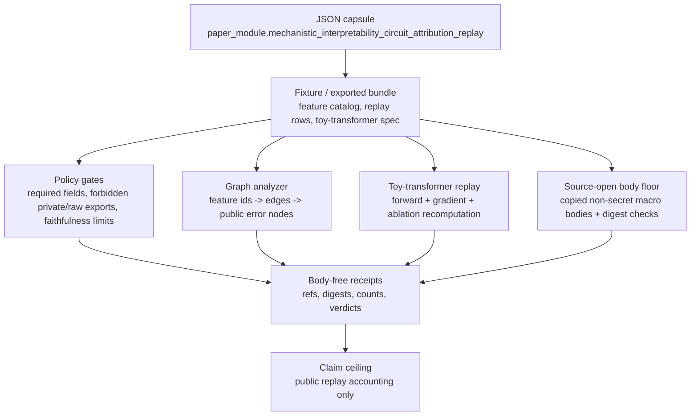

# Mechanistic Interpretability Circuit Attribution Replay

## Abstract

`mechanistic_interpretability_circuit_attribution_replay` is a public
Microcosm organ that validates whether circuit-attribution claims are safe to
represent as receipt evidence. It is not a model-transparency product and does
not inspect a live provider model. The organ checks a fixture and exported
bundle for machine-readable feature graph rows, causal-intervention references,
faithfulness limits, source-module digest evidence, negative cases, and a small
input-coupled toy-transformer replay.

The technical proof is deliberately modest. A replay passes only when its
declared circuit-attribution story agrees with recomputed toy-transformer
forward, gradient, and ablation winners; when graph evidence is traversable from
public sparse features to public error nodes; when public receipts omit private
or raw bodies; and when the source-open body floor is backed by copied,
non-secret macro source modules with matching digests. A stale declared top
feature is disconfirmed by perturbing the input fixture while leaving the old
claim in place.

## Problem Statement

Interpretability prose is easy to overclaim: a feature name can sound like
transparency, a graph screenshot can sound like a circuit, and a local fixture
can sound like model access. This module makes the public claim smaller and more
testable. It asks: before Microcosm lets a circuit-attribution story become
public evidence, can the story survive a deterministic replay membrane that
checks structure, causality refs, source provenance, and explicit anti-claims?

The answer is local and receipt-scoped. Microcosm may claim public
circuit-attribution replay accounting for this fixture and exported bundle. It
may not claim live model internals, private weights, raw activations,
proprietary prompts, hidden reasoning, provider behavior, benchmark scores,
publication readiness, hosting, release authority, or whole-system
interpretability correctness.

The technical contribution is therefore an accounting membrane, not a new
interpretability algorithm. The membrane turns an interpretability-shaped
fixture into a pass/fail public receipt by requiring all claim-bearing rows to
cross four gates:

| Gate | Accepts | Rejects |
|---|---|---|
| Replay schema | Feature ids, graph rows, causal refs, sufficiency and faithfulness limits, contradiction refs, cold-replay refs, target refs, and body-free receipt flags. | Missing required fields, unverifiable feature labels, screenshot-only graph evidence, transparency claims without causal-intervention refs, and faithfulness claims without limits. |
| Graph traversal | Machine-readable nodes and edges with a path from declared sparse features to public error nodes. | Disconnected edges and decorative constant-delta edge-weight sequences. |
| Toy recomputation | Fixture-coupled forward, gradient, ablation, weight digest, and declared-winner comparison. | Internal default toy specs, stale declared winners, or uncoupled cached receipts. |
| Source/body boundary | Copied non-secret macro bodies with digest, class, anchor, and body-free receipt checks. | Private weights, raw activations, proprietary prompt bodies, hidden reasoning, provider payloads, body text in receipts, and release authority. |

## Authority And Evidence Boundary

- Source authority:
  `core/paper_module_capsules.json::paper_modules[52:paper_module.mechanistic_interpretability_circuit_attribution_replay]`
  with `source_authority: json_capsule`.
- Reader projection:
  `paper_modules/mechanistic_interpretability_circuit_attribution_replay.md`.
- Generated instance:
  `paper_modules/mechanistic_interpretability_circuit_attribution_replay.json`.
- Runtime:
  `src/microcosm_core/organs/mechanistic_interpretability_circuit_attribution_replay.py`.
- Focused tests:
  `tests/test_mechanistic_interpretability_circuit_attribution_replay.py`.
- Governing standard:
  `standards/std_microcosm_mechanistic_interpretability_circuit_attribution_replay.json`.

This Markdown is a human-readable paper projection. The capsule JSON binds the
organ, mechanism, source locus, generated Mermaid status
`available_from_capsule_edges`, and Atlas status `linked_from_capsule_edges`.
The runtime, fixtures, tests, receipts, and manifests are the technical evidence
for the claims below.

## Technical Mechanism



The organ has four coupled checks:

1. Replay policy validation: each positive row must carry toy prompt refs,
   sparse feature ids, machine-readable graph nodes and edges,
   replacement-model approximation scores, causal inhibition and injection refs,
   causal-intervention receipt refs, sufficiency labels, faithfulness limits,
   contradiction-case refs, cold-replay refs, target refs, and
   `body_in_receipt: false`.
2. Graph analysis: `_graph_analysis_for_replay` verifies that graph edges
   resolve to declared nodes and that at least one path exists from the row's
   sparse feature ids to a public error node. `_weight_sequence_analysis`
   rejects simple decorative arithmetic edge-weight sequences across replay
   rows.
3. Toy-transformer replay: `_toy_transformer_attribution_runtime` recomputes a
   pure-Python two-layer toy transformer from fixture-provided `token_ids`,
   `embeddings`, `layer1`, `layer2`, and `target_logit_index`, then compares the
   recomputed top attribution and ablation features against declared winners.
4. Source/body boundary: `_source_module_manifest_result`,
   `_source_open_body_import_summary`, `scan_paths`, `_write_receipts`, and
   `result_card` verify copied non-secret source bodies while keeping receipt
   payloads body-free and public-safe.

## Implementation Contract

| Runtime locus | Role in the mechanism | Evidence surface |
|---|---|---|
| `run` | First-wave fixture validator. It loads the public input directory, negative cases, source-module manifest, secret-exclusion policy, and acceptance output. | `tests/test_mechanistic_interpretability_circuit_attribution_replay.py::test_mechanistic_interpretability_circuit_attribution_replay_observes_negative_cases` |
| `run_attribution_bundle` | Exported-bundle validator for the runtime-shell and public demo path. It uses the same replay gates without requiring first-wave negative-case files. | `test_mechanistic_interpretability_exported_bundle_validates_runtime_shape` |
| `_replay_policy_findings` | Row-level policy checker for required fields and forbidden interpretability overclaims. | Negative fixtures in `fixtures/.../input/*` and `EXPECTED_NEGATIVE_CASES` |
| `_graph_analysis_for_replay` / `_weight_sequence_analysis` | Circuit-graph shape checks: resolvable nodes/edges, feature-to-error paths, and non-decorative weights. | `test_mechanistic_interpretability_rejects_disconnected_graph_edges` and `test_mechanistic_interpretability_rejects_decorative_weight_sequences` |
| `_toy_transformer_attribution_runtime` | Pure-Python recomputation harness for target logit, attribution scores, ablation deltas, declared winners, and fixture digest. | Toy runtime, stale-claim, perturbation, and cache-reuse tests |
| `_source_module_manifest_result` / `_source_open_body_import_summary` | Source-open body floor: copied non-secret macro body checks with digest, class, anchor, and body-free receipt constraints. | Source-module exact-import and body-text rejection tests |
| `_write_receipts` / `result_card` | Public output membrane. Receipts and cards carry refs, digests, counts, omitted-payload flags, and authority ceilings rather than source bodies or private state. | Receipt-boundary and card-reuse tests |

## Toy-Transformer Attribution Mechanism

The toy-transformer runtime is intentionally small enough to audit. The fixture
in `fixtures/first_wave/mechanistic_interpretability_circuit_attribution_replay/input/attribution_replays.json`
declares:

- `token_ids`: `[0, 1, 2]`
- a three-row embedding table over two dimensions
- a two-by-three first layer
- a three-by-two second layer
- `target_logit_index`: `1`
- expected top feature by attribution and ablation:
  `toy_hidden_feature_1`

The runtime computes token embeddings, averages them into a context vector,
applies the first layer, applies a ReLU hidden activation, applies the second
layer, and reads the target logit. It then computes activation-gradient scores
for the hidden features and ablates each hidden feature to measure output delta.
The fixture currently produces target logit `0.044176`; both attribution and
ablation select `toy_hidden_feature_1`.

The important point is not that this is a serious transformer. It is a
deterministic proof harness for the public replay claim. The receipt can say the
declared top feature agrees with recomputation only because the verifier
recomputes from input fields and compares the result. The receipt also records a
weight digest so cached or exported bundle cards can prove which fixture basis
they are coupled to.

## Discriminating Tests

The proof is strongest where it distinguishes a real coupling from a plausible
but stale story. The focused tests exercise those distinctions directly:

| Test | Fixture move | Expected verdict | Why it matters |
|---|---|---|---|
| `test_mechanistic_interpretability_toy_transformer_input_perturbation_moves_verdict` | Changes `layer2[0][1]` to `-0.5` and updates declared winners to `toy_hidden_feature_0`. | Passes with target logit `-0.116939`; both attribution and ablation move to `toy_hidden_feature_0`. | The receipt follows changed input when declaration and recomputation remain coupled. |
| `test_mechanistic_interpretability_input_perturbation_rejects_stale_claims` | Applies the same perturbation but leaves declared winners at `toy_hidden_feature_1`. | Blocks with `INTERPRETABILITY_TOY_TRANSFORMER_DECLARED_TOP_FEATURE_MISMATCH`. | The verifier disconfirms stale interpretability claims instead of trusting old fixture prose. |
| `test_mechanistic_interpretability_rejects_internal_default_toy_runtime` | Removes `toy_transformer_runtime` from the exported bundle. | Blocks with `INTERPRETABILITY_TOY_TRANSFORMER_FIXTURE_SPEC_REQUIRED`. | The public proof must be input-coupled, not backed by an internal default. |
| `test_mechanistic_interpretability_bundle_card_rejects_uncoupled_cached_receipt` | Edits a cached receipt so `input_coupled_fixture` and `input_coupled_verdict` are false. | Refuses cached reuse and rebuilds a fresh receipt. | The command-card path is a freshness optimization, not permission to reuse uncoupled evidence. |
| `test_mechanistic_interpretability_rejects_decorative_weight_sequences` | Rewrites graph-edge weights into simple arithmetic sequences. | Blocks as suspected decorative graph evidence. | Machine-readable graph rows still need anti-fabrication checks. |
| `test_mechanistic_interpretability_rejects_disconnected_graph_edges` | Breaks an edge path to a declared public error node. | Blocks with zero path count for the affected row. | A circuit-shaped graph must be traversable, not merely present. |
| `test_mechanistic_interpretability_source_modules_reject_body_text_in_receipt` | Marks source body text as present in receipt material. | Blocks the source/body import. | Source-open evidence remains body-free at receipt boundaries. |

## Evidence Contract

| Evidence class | Local authority | What it proves | What it does not prove |
|---|---|---|---|
| Capsule binding | `core/paper_module_capsules.json` row 52 | The paper module, organ, mechanism, source locus, and generated projection statuses are linked. | Markdown is not promoted to source authority. |
| Replay rows | `fixtures/.../input/attribution_replays.json` and exported bundle mirror | Six public replay rows with feature ids, graph edges, causal refs, faithfulness limits, contradiction refs, cold replay refs, and body-free target refs. | The refs are fixture/accounting evidence, not live model internals. |
| Feature catalog | `fixtures/.../input/feature_catalog.json` | Six public sparse-feature summary ids with labels and no private weights or activation dumps. | It does not disclose trained-model features or raw activations. |
| Toy runtime | `_toy_transformer_attribution_runtime` and focused tests | Forward, gradient, ablation, digest, and stale-declaration checks are recomputed from the input fixture. | The toy runtime is not a general interpretability method. |
| Graph analysis | `_graph_analysis_for_replay` and `_weight_sequence_analysis` | Graph rows are machine-readable, traversable, and not decorative constant-delta weight sequences. | It does not validate a real neural circuit. |
| Source-open body floor | `source_module_manifest.json` plus `source_modules/` | Eleven copied non-secret macro bodies have digest/anchor/material-class checks. | Bodies are not copied into receipts and do not authorize private/live export. |
| Receipt set | `receipts/first_wave/...`, `receipts/acceptance/...`, runtime-shell lens | Public outputs carry refs, digests, counts, verdicts, omitted-payload flags, and authority ceilings. | Receipts do not publish private model data or release authority. |

## Reader Evidence Routing

The proof consumer for this reader slice is the focused interpretability replay
suite plus the paper-module corpus parity check. The table below is the route a
rank/projection reader should follow before trusting any claim in this module:

| Reader question | Source surface | Focused proof consumer | Claim ceiling |
|---|---|---|---|
| Is this module bound to a real organ and mechanism? | `core/paper_module_capsules.json::paper_module.mechanistic_interpretability_circuit_attribution_replay` and `paper_modules/mechanistic_interpretability_circuit_attribution_replay.json` | `scripts/build_doctrine_projection.py --check-paper-module-corpus` | Proves capsule/sidecar parity only; Markdown remains a reader projection. |
| Does the replay recompute the attribution claim? | `_toy_transformer_attribution_runtime` over fixture-provided `token_ids`, weights, and `target_logit_index` | `test_mechanistic_interpretability_toy_transformer_runtime_computes_attribution`, perturbation, and stale-claim tests | Proves fixture-local recomputation, not a general interpretability method. |
| Are graph rows actual circuit evidence rather than screenshots? | `_graph_analysis_for_replay` and `_weight_sequence_analysis` over declared graph nodes, edges, and public error nodes | disconnected-graph and decorative-weight regression tests | Proves machine-readable traversability and anti-decoration checks, not a real neural circuit. |
| Do source-open bodies stay out of receipts? | `source_module_manifest.json`, copied `source_modules/`, `_source_module_manifest_result`, and `_write_receipts` | source-module exact-import and body-text-in-receipt rejection tests | Proves copied non-secret body floor and body-free receipts, not private/live export authority. |
| Where does a reader start when projections disagree? | Capsule row, generated JSON instance, runtime source, focused tests, then receipts | corpus check and focused pytest together | Generated Mermaid, Atlas, and site surfaces are owner-lane projections; this Markdown edit does not regenerate them. |

## Failure Modes And Limitations

- Missing required replay fields block with
  `INTERPRETABILITY_REPLAY_FIELD_REQUIRED`.
- Feature names without catalog-backed ids block with
  `INTERPRETABILITY_FEATURE_NAME_UNVERIFIABLE`.
- Graph screenshots or disconnected graph rows block because machine-readable
  edges and traversable paths are required.
- Transparency language without a causal-intervention receipt blocks with
  `INTERPRETABILITY_INTERVENTION_RECEIPT_REQUIRED`.
- Faithfulness language without explicit limits blocks with
  `INTERPRETABILITY_FAITHFULNESS_REQUIRES_LIMITS`.
- Private model weights, raw activation dumps, proprietary prompt exports,
  hidden chain-of-thought exports, provider payload bodies, and release
  authority are forbidden public outputs.
- Decorative graph-weight sequences block as suspected fabrication.
- Stale declared toy-transformer winners block when recomputation selects a
  different top feature.
- The proof is fixture-local. It verifies a public replay membrane and copied
  source evidence; it does not certify real-world model faithfulness.

## Relation To Interpretability Literature

The module borrows its accounting shape from the transformer-circuits and
mechanistic-interpretability tradition: circuits should be graph-structured,
features should be identifiable, causal language should be backed by
interventions, and faithfulness language should be bounded. Useful prior-art
anchors include Anthropic's transformer-circuits framing, causal scrubbing, and
SAE/sparse-feature circuit work.

Microcosm does not reproduce those methods. The local contribution is a public
replay boundary around an interpretability-shaped claim: machine-readable edges
instead of screenshots, causal-intervention refs instead of bare transparency
language, fixture recomputation instead of stale row trust, and explicit
anti-claims before a claim becomes public evidence.

## Relation To Microcosm Concepts, Mechanisms, And Principles

The capsule binds this module to:

- `concept.research_and_science_replay_evidence_bundle`
- `mechanism.mechanistic_interpretability_circuit_attribution_replay.validates_public_mechanistic_interpretability_circuit_attribution_replay`
- principles `P-2`, `P-4`, `P-8`, and `P-9`
- axioms `AX-3`, `AX-5`, `AX-7`, and `AX-8`

The practical reading is:

- `P-2`: claim language stays below the strength of the checker.
- `P-4`: public proof routes through receipts and explicit evidence refs.
- `P-8`: failed preconditions are typed refusals, not vague warnings.
- `P-9`: provenance crosses from fixture, macro source, and receipt without
  upgrading authority.
- `AX-3`: dereferenced proof and policy refs matter more than prose labels.
- `AX-5`: status fails closed across all required parts.
- `AX-7`: partial computation returns a typed refusal.
- `AX-8`: public fixture and copied-source labels propagate without becoming
  private model access.

## Named Proof Consumers

Run from `microcosm-substrate`:

```bash
PYTHONPATH=src ../repo-python -m microcosm_core.organs.mechanistic_interpretability_circuit_attribution_replay run \
  --input fixtures/first_wave/mechanistic_interpretability_circuit_attribution_replay/input \
  --out /tmp/microcosm-mechanistic-interpretability-circuit-attribution-replay/fixture \
  --acceptance-out /tmp/microcosm-mechanistic-interpretability-circuit-attribution-replay/acceptance.json \
  --card
```

This consumes the first-wave fixture, negative cases, source-module mirror,
secret scan, toy-transformer replay, and receipt writer.

```bash
PYTHONPATH=src ../repo-python -m microcosm_core.organs.mechanistic_interpretability_circuit_attribution_replay run-attribution-bundle \
  --input examples/mechanistic_interpretability_circuit_attribution_replay/exported_circuit_attribution_bundle \
  --out /tmp/microcosm-mechanistic-interpretability-circuit-attribution-replay/bundle \
  --card
```

This consumes the exported circuit-attribution bundle, copied body floor,
digest checks, body-free receipts, command-card omission contract, and
runtime-shell validation shape.

```bash
PYTHONPATH=src ../repo-python -m pytest -p no:cacheprovider tests/test_mechanistic_interpretability_circuit_attribution_replay.py -q
PYTHONPATH=src ../repo-python scripts/build_doctrine_projection.py --check-paper-module-corpus
```

The focused regression pins recomputation, stale-row rejection, graph and
source-body gates, card receipt reuse, and body-text exclusions. The corpus
check keeps this Markdown reader projection in parity with the capsule and
generated sidecar. This edit intentionally does not regenerate generated
Microcosm projections.

## Source-Open Body Floor

The source-open body floor is declared in:

- `examples/mechanistic_interpretability_circuit_attribution_replay/exported_circuit_attribution_bundle/source_module_manifest.json`
- `fixtures/first_wave/mechanistic_interpretability_circuit_attribution_replay/input/source_module_manifest.json`

The manifest covers copied non-secret macro bodies: Oracle attribution maps,
pattern-ledger rows, high-novelty scout records, organ projection IR,
projection readiness code, mission transaction preflight code, execution trace
code, strict JSON code, and trace/readiness standards. The runtime verifies
classification, material class, body-copied status, body-not-in-receipt status,
target digest, source/target digest agreement, line count when the source is
available, and required anchors.

The body floor excludes private model weights, raw activations, proprietary
prompts, hidden reasoning, provider payloads, account/session state, browser or
HUD state, credential material, private macro-root material, publication,
hosting, and release authority.

## Claim Ceiling

This module may claim:

- public, cold-replayable circuit-attribution accounting for the named fixture
  and exported bundle;
- feature ids tied to machine-readable graph edges and traversable public
  error-node paths;
- causal-intervention receipt refs and faithfulness-limit refs are required
  before transparency or faithfulness language passes;
- the toy-transformer declaration is input-coupled to recomputed forward,
  gradient, and ablation evidence;
- stale toy-transformer declarations are rejected by focused tests;
- copied non-secret macro source bodies are verified by manifest and digest
  checks while receipts remain body-free.

It may not claim:

- live model access or provider calls;
- private weights, raw activation tensors/dumps, proprietary prompts, hidden
  chain-of-thought, hidden reasoning, or provider payload export;
- real model-transparency product status;
- benchmark score authority;
- publication, hosted-product readiness, release approval, or recipient-send
  authority;
- whole-system interpretability correctness.

## Reader Route

A cold reader should inspect in this order:

1. `core/paper_module_capsules.json` row 52 for authority and projection
   binding.
2. `paper_modules/mechanistic_interpretability_circuit_attribution_replay.json`
   for generated relationship edges.
3. `src/microcosm_core/organs/mechanistic_interpretability_circuit_attribution_replay.py`
   for runtime logic.
4. `tests/test_mechanistic_interpretability_circuit_attribution_replay.py` for
   the stale-row, perturbation, graph, source-body, and receipt-boundary proof.
5. `fixtures/first_wave/mechanistic_interpretability_circuit_attribution_replay/input`
   for the fixture.
6. `examples/mechanistic_interpretability_circuit_attribution_replay/exported_circuit_attribution_bundle`
   for the public bundle.
7. `receipts/first_wave/mechanistic_interpretability_circuit_attribution_replay`
   and `receipts/runtime_shell/public_mechanistic_interpretability_circuit_attribution_replay_lens.json`
   for body-free public receipt evidence.

## Re-Entry Conditions

- If the capsule, generated sidecar, runtime source, fixture manifest, source
  module manifest, acceptance receipt, or focused test changes, refresh this
  paper projection from those authorities.
- If the generated Mermaid, Atlas card, or relationship edge count changes,
  update generated surfaces through their owner lane, not by hand-editing this
  Markdown or sidecar JSON.
- If public copy is promoted toward a release surface, rerun release-boundary
  hygiene and preserve the explicit non-claims for live model access, private
  data export, hosting, publication, provider behavior, and release authority.
