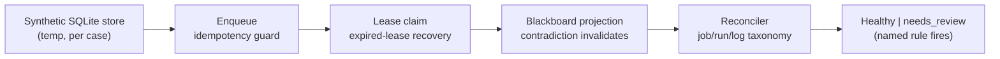

# Metabolism Queue Reconciliation

`metabolism_queue_reconciliation` is a runnable model of a durable job queue. It
stands up a synthetic SQLite store, hands out work on a lease, recovers it when
the lease expires, and then runs a consistency check that flags impossible
job/run/log states for review.

## Purpose

A queue that silently drifts into contradictory state — a job marked running with
no run row, a run finalised while its job still says running — is hard to trust.
This organ makes that reconciliation explicit and checkable over a bounded store.

It surfaces the public `metabolism_runtime` capsule. Each case creates a temporary
SQLite store, exercises enqueue idempotency, a lease claim and expired-lease
recovery, and a blackboard claim-event projection where a contradiction
invalidates an assertion, then runs a cold-start reconciler over the job/run/log
triple. The store is synthetic and torn down per case: it never touches the live
private queue and never auto-repairs ambiguous state — it flags it.

## Shape



## JSON Capsule Binding

- source_ref:
  `core/paper_module_capsules.json::paper_modules[96:paper_module.metabolism_queue_reconciliation]`
- source_authority: json_capsule
- Projection role: This Markdown is a reader projection of the JSON capsule row,
  not the source authority. The generated Mermaid projection is
  `paper_module.metabolism_queue_reconciliation.mermaid` with status
  `available_from_capsule_edges`, and the generated Atlas projection is
  `organ_atlas.metabolism_queue_reconciliation` with status
  `linked_from_capsule_edges`.
- proof boundary: the capsule binds the accepted organ, the resolved mechanism
  row, the runtime locus, the surfaced engine-room capsule, and the governing
  concept, principle, and axiom edges; the generated JSON projection carries the
  exact resolved relationship edges.
- authority ceiling: this page can explain the synthetic-queue reconciliation
  fixtures and the validation receipts, but it cannot ship the live private
  metabolism database, dispatch agents, auto-repair runtime state, become a
  distributed database, or grant release authority.

## Structured Lattice Bindings

The structured capsule row is
`core/paper_module_capsules.json#paper_module.metabolism_queue_reconciliation`. It
binds this Markdown projection to the organ, the resolved mechanism row
`mechanism.metabolism_queue_reconciliation.verifies_metabolism_runtime`, the
runtime locus
`src/microcosm_core/organs/metabolism_queue_reconciliation.py`, and the surfaced
capsule `src/microcosm_core/engine_room/metabolism_runtime.py`. It abides by axiom
`AX-2` (a small checker decides claims over certificates) and principle `P-3`
(prefer a small, rerunnable verifier over narrative confidence).

Generated atlas docs remain builder-owned projections: refresh them with
`PYTHONPATH=src python3 scripts/build_organ_atlas.py --write` instead of editing
`ORGANS.md`, `ARCHITECTURE.md`, `AGENT_ROUTES.md`, or
`atlas/agent_task_routes.json` by hand.

## Reader Evidence Routing

The honest unit is the reconciliation rule, not "queue healthy." Read the planted
inconsistencies before trusting the reconciler:

- A safety/evals engineer should confirm the reconciler derives its verdict from
  the actual job/run/log rows. The useful question is whether a contradictory
  store is flagged `needs_review` with a named rule rather than passed.
- A hiring reviewer should read the two negative cases. The useful question is
  whether `running_job_no_run_row` and `run_finalized_but_job_running` are caught
  by recomputation, and whether the organ flags rather than silently repairs.
- A peer developer should run the fixtures. The useful question is whether the
  whole exercise stays inside a temporary store and asserts nothing about the live
  private runtime.

## Validation

```bash
PYTHONPATH=src python3 -m microcosm_core.organs.metabolism_queue_reconciliation run --input fixtures/first_wave/metabolism_queue_reconciliation/input --out receipts/first_wave/metabolism_queue_reconciliation --acceptance-out receipts/acceptance/first_wave/metabolism_queue_reconciliation_fixture_acceptance.json
```

The positive cases (`queue_lease_recovery_ok`, `blackboard_projection_ok`)
recover an expired lease and project a contradicted claim to zero active claims.
The negative cases are rejected by recomputation: `running_job_no_run_row_rejected`
and `finalized_run_running_job_rejected` each force an inconsistent store and the
reconciler fires the matching review rule. The registry, ledger, and runtime spine
checks in `make test` exercise the organ's acceptance receipt.

## Authority Ceiling

A green run shows that the synthetic queue and reconciler behaved as specified on
bounded cases. It does not export the live private metabolism database or
scheduler, does not dispatch agents, does not auto-repair ambiguous state, is not
a distributed database, and does not authorize release, publication, provider
calls, or source mutation.
