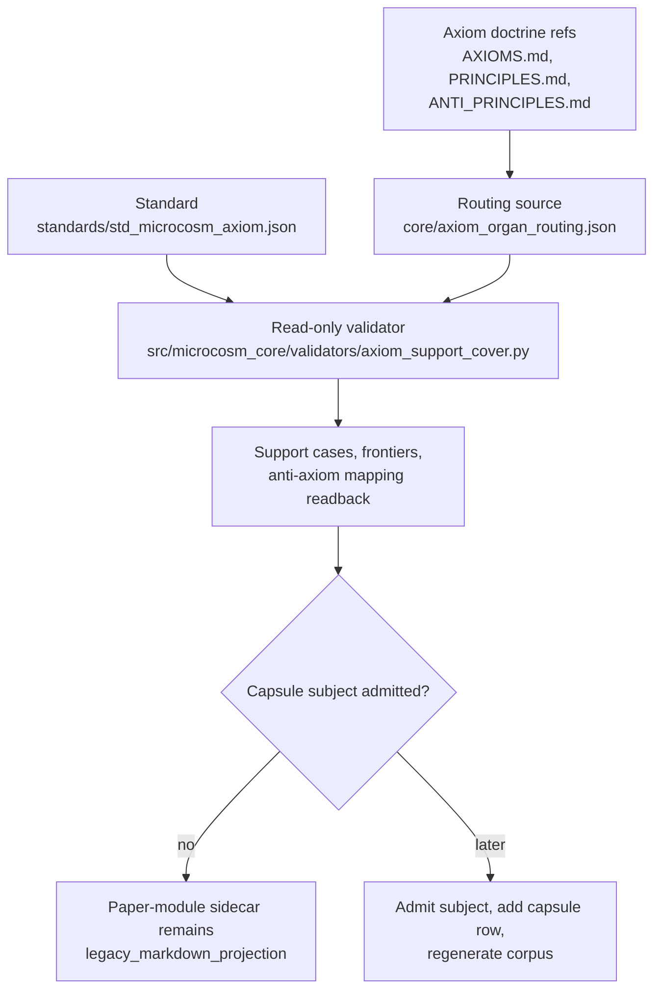

# Microcosm Axiom Substrate

## Teleology

Microcosm axioms compress the public substrate's recurring formal commitments
into checkable clauses. The goal is not philosophical decoration; the goal is a
routing layer where each axiom expands into principles, organs, receipts,
negative cases, witness surfaces, and layer debt.

## Governing Standard

This paper module is governed by `executable_doctrine_grammar` and the
Microcosm axiom/principle surfaces:

- `AXIOMS.md`
- `PRINCIPLES.md`
- `ANTI_PRINCIPLES.md`
- `RELEASE_DISCIPLINE.md`
- `core/axiom_organ_routing.json`
- `core/organ_evidence_classes.json`
- `standards/std_microcosm_axiom.json`
- `src/microcosm_core/validators/axiom_support_cover.py`

## Executable Support Surface

`validator.microcosm.axiom_support_cover` is the read-only executable surface
for the current AX-1/AX-8 pilot. It compiles `support_cases`,
`support_frontiers`, `principle_support_index`,
`anti_axiom_rejection_mappings`, and `strong_gate_summary` from source routing,
standard grammar, receipts, witness surfaces, and evidence-class registries. Its
output is a projection below source authority: it may expose pressure and
bounded overlap, but it does not mutate axioms, certify `strong`, or authorize
release.

## Shape



The shape makes the axiom substrate inspectable without converting pressure
into proof. Doctrine refs, routing JSON, the axiom standard, validator output,
and focused tests can show support/frontier structure; they cannot certify a
strong gate, promote candidate law, source Mermaid edges, or authorize release
until a resolving capsule row exists.

## Anti-Axiom Rejection Mapping

`std_microcosm_axiom.json::axiom_payload_contract.anti_axiom_rejection_contract`
separates positive support from rejection of a named anti-axiom. A first-wave
organ receipt with complete negative-case coverage is admissible evidence
material, not a per-obligation rejection by itself. The evaluator therefore maps
receipt-observed negative families to each obligation slice with a
`mapping_relation` such as `unmapped`, `illustrative_only`, or
`partial_overlap`, while keeping `mapping_verified: false` unless a
source-owned mapping row declares exact or subsuming rejection.

The current AX-8 mapping is intentionally non-uniform: O1 remains `unmapped`
because endpoint/organ receipt coverage does not prove general
source->transform->sink propagation; O2 is only `partial_overlap` against
sink-policy evidence; O3 is only `illustrative_only` until endpoint-label
assertion rejection is declared against that obligation. This is the
no-laundering floor: `organ_receipt_coverage_present` can never be promoted
directly into `exact_obligation_rejection`.

Those AX-8 relations now live as source-owned, non-certifying rows in
`core/axiom_organ_routing.json::rows[AX-8].anti_axiom_rejection_mappings[]`.
The evaluator consumes those rows before any legacy inferred fallback and still
recomputes receipt material from disk. The rows close hidden-code-schema drift;
they do not close rejection, remove layer debt, or upgrade any obligation to
`strong`.

## Reader Proof Boundary

Read this page as a public reader projection over a legacy Microcosm
paper-module row. The generated JSON row still reports
`paper_module_payload.source_authority: legacy_markdown_projection`, so its
Mermaid and Atlas projections must remain `blocked_required_subject_gap` until
a resolved organ or mechanism subject is admitted and the capsule registry is
regenerated. The useful proof here is narrower: the page names the current
source locus, the generated row source ref, and the exact re-entry condition
without claiming JSON capsule authority.

## JSON Capsule Binding

There is no JSON capsule row in `core/paper_module_capsules.json` for
`paper_module.microcosm_axiom_substrate` at this boundary. The checked-in
`paper_modules/microcosm_axiom_substrate.json` row is a governed projection
seeded from the legacy Markdown path, not source authority; it keeps
`paper_module_payload.source_authority: legacy_markdown_projection`, empty
`subjects`, and generated Mermaid/Atlas statuses of
`blocked_required_subject_gap`.

The current binding is therefore negative and useful: it tells a reader exactly
what is not proved. A future capsule may cite the axiom-routing owner, accepted
subject rows, resolved code loci, and Microcosm doctrine ids, but this Markdown
cannot create those edges by prose.

## Structured Lattice Bindings

- Generated paper-module row:
  `paper_modules/microcosm_axiom_substrate.json` is legacy Markdown inventory
  with no capsule authority, no subjects, and residual required-subject
  pressure.
- Axiom doctrine surfaces:
  `AXIOMS.md`, `PRINCIPLES.md`, `ANTI_PRINCIPLES.md`, and
  `RELEASE_DISCIPLINE.md` are reader-facing doctrine references for the axiom
  proof boundary. They do not become paper-module edges without a capsule row.
- Axiom routing source:
  `core/axiom_organ_routing.json` owns support/frontier rows for axiom evidence
  and anti-axiom rejection mappings.
- Evidence classes:
  `core/organ_evidence_classes.json` is the evidence-strength vocabulary used
  by the support-cover reader frame.
- Governing standard:
  `standards/std_microcosm_axiom.json` is the contract for axiom payloads,
  support claims, anti-axiom rejection mappings, and strong-gate pressure.
- Validator locus:
  `src/microcosm_core/validators/axiom_support_cover.py` is a read-only
  evaluator that projects support cases and strong-gate pressure. It is reader
  evidence, not a capsule `code_loci` edge yet.

The generated sidecar currently binds no structured lattice subjects:
`paper_module_payload.source_row.subjects: []`,
`paper_module_payload.source_row.code_loci: []`, and `relationships.edges: []`.
It retains six unpopulated selective relations as residuals. Mermaid and Atlas
remain `blocked_required_subject_gap`, and Markdown remains
`legacy_markdown_projection_not_generated_from_json`.

Unresolved concept, principle, axiom, dependency, organ, mechanism, and capsule
code-locus edges remain residual pressure until source JSON names real targets
that resolve in the Microcosm corpus.

## JSON Capsule Boundary

This paper module remains a legacy Markdown projection in the generated
paper-module corpus.

- Current authority: `paper_module_payload.source_authority` remains
  `legacy_markdown_projection`, and the sidecar keeps Mermaid/Atlas edges
  blocked by the required-subject gap.
- Current proof: axiom routing rows, the support-cover validator, and focused
  tests make the substrate inspectable to readers, but this Markdown is not a
  JSON-capsule-backed source row yet.
- Re-entry: after the axiom-routing owner lands the required accepted subject
  rows and any named code loci resolve, add a real row to
  `core/paper_module_capsules.json` and regenerate with
  `scripts/build_doctrine_projection.py --write-paper-module-corpus`.

Until that re-entry lands, this Markdown explains the proof boundary; it does
not source Mermaid edges, Atlas cards, axiom promotion, strong-gate
certification, release claims, source mutation authority, or aggregate
doctrine-lattice coverage.

## Public Site Availability Boundary

This module is public-safe to expose as a reader route because it describes
axiom-routing doctrine, standards, validator paths, routing JSON refs, tests,
support-frontier status, and authority ceilings without promoting candidate law
or certifying a strong gate. Website availability should come from the existing
Microcosm site builder reading this source page and generated Microcosm data;
generated site HTML, object maps, search indexes, and content graphs are
projections, not source authority.

## Public-Safe Body Handling

This page may name axiom/principle docs, routing JSON paths, evidence-class
registries, standards, validator loci, focused tests, receipt commands,
support-frontier fields, anti-axiom mapping statuses, and authority ceilings.
It must not embed private source bodies, raw operator voice, provider payloads,
secret-bearing evidence, private workspace state, generated proof artifacts
outside their receipt refs, or prose that promotes candidate law, proves axioms
in Lean, certifies a strong gate, or authorizes release.

Reader cards, receipts, generated site projections, and this Markdown should
represent axiom evidence by refs, mapping statuses, booleans, summaries,
negative-case names, and explicit ceilings rather than by duplicating private
payloads or laundering evidence pressure into proof authority.

## Reader Evidence Routing

- A doctrine reader starts with `AXIOMS.md`, `PRINCIPLES.md`,
  `ANTI_PRINCIPLES.md`, and `core/axiom_organ_routing.json`. The useful
  question is which source rows claim support, frontier pressure, and
  anti-axiom mapping status, not whether this page proves the axioms.
- A validator reader runs `microcosm_core.validators.axiom_support_cover` and
  opens `tests/test_axiom_organ_routing.py` plus
  `tests/test_axiom_support_cover.py`. The useful question is whether support
  cases, support frontiers, negative-case evidence, and AX-8 rejection mapping
  readback are computed from public source.
- A release-boundary reader starts with the Authority Ceiling and anti-claim
  text before reading generated docs or site cards. The useful question is
  whether candidate law, Lean proof, strong-gate certification, release
  authority, and aggregate lattice coverage stay outside this Markdown.

Generated projections may summarize axiom evidence only by source refs,
mapping statuses, booleans, summaries, and receipt paths. Any stronger claim
belongs in source-owner rows plus validator receipts, not in this legacy
paper-module projection.

## Proof-Consumer Readback

This module's proof-consumer value is a narrow evidence-accounting readback:
named validators and tests consume public source refs, fixture-visible routing
rows, counts, verdict fields, and anti-claims so a reader can see where axiom
support is computed and where it is capped. These consumers do not expand the
authority ceiling, admit a capsule subject, certify `strong`, promote candidate
law, prove axioms in Lean, source Mermaid or Atlas edges, authorize release, or
mutate source authority.

- `validator.microcosm.axiom_support_cover` consumes
  `core/axiom_organ_routing.json`, `core/organ_evidence_classes.json`,
  `core/organ_registry.json`, and `standards/std_microcosm_axiom.json`, then
  emits `support_cases`, `support_frontiers`,
  `anti_axiom_rejection_mappings`, `strong_gate_summary`,
  `truth_calculus_summary`, `principle_support_index`, and
  `candidate_axiom_pressure`. Its own `authority_posture` remains
  `read_only_evaluator_projection_not_source_of_record`.
- `tests/test_axiom_organ_routing.py` consumes the routing registry plus
  `AXIOMS.md`, `PRINCIPLES.md`, `ANTI_PRINCIPLES.md`,
  `core/organ_registry.json`, and public source text to check that routed
  axioms, principles, anti-principles, witness refs, negative-case codes, and
  source-owned anti-axiom rejection mappings resolve without laundering organ
  receipt coverage into exact obligation rejection.
- `tests/test_axiom_support_cover.py` consumes the evaluator output and checks
  the proof-consumer floor: AX-1's hand-stamped `strong` label is not echoed,
  AX-8 stays capped by layer debt, principles inherit bounded support without
  becoming witnesses, candidate pressure routes to sharpening or witness debt,
  and rejection-mapping debt routes to receipt-level per-obligation evidence.
- `src/microcosm_core/doctrine_lattice.py::build_axiom_instance_from_routing_row`
  consumes routing rows into public axiom JSON instances with a
  `microcosm_axiom_substrate_reciprocity_v1` contract. That readback names how
  law constrains substrate and how substrate can refine support-frontier
  evidence, while explicitly keeping witness organs and negative cases as
  support-calculation inputs rather than support claims.
- `tests/test_doctrine_lattice_runtime.py` consumes generated axiom instances
  only to verify that reciprocity contract and routing-derived fields survive
  projection. It does not treat generated graph, health, Markdown, or Atlas
  output as source evidence.
- `tests/test_microcosm_paper_module_coverage_contract.py` consumes this
  Markdown as a legacy re-entry lane by requiring the axiom-support validator
  locus for `paper_module.microcosm_axiom_substrate` and by preserving the
  paper-module coverage authority ceiling against release permission, proof
  correctness, source truth, or candidate-axiom authority.

The readback condition is intentionally modest: if those consumers still derive
bounded support, negative-case and rejection-mapping pressure, source-ref
resolution, and authority ceilings from public source, this page remains useful
reader evidence. If a consumer starts treating generated projection output as
source evidence, or treats coverage pressure as proof correctness, the correct
repair is in the source owner or validator lane, not in stronger prose here.

## Subject Admission Audit

A future capsule row needs a resolving paper-module subject before this page
can leave `blocked_required_subject_gap`. The live subject audit is negative:

- `core/paper_module_capsules.json` does not contain a source-authority row for
  `paper_module.microcosm_axiom_substrate`; dependency refs from other paper
  modules are not source authority for this paper-module row.
- `core/organ_registry.json::implemented_organs` does not contain an accepted
  `microcosm_axiom_substrate` organ.
- `core/mechanism_sources.json::mechanisms` does not contain a
  `mechanism.microcosm_axiom_substrate.*` row.
- `standards/std_microcosm_axiom.json::relationships.used_by_organs` may name
  consumers of the axiom standard, but those consumers are not a resolving
  subject for the paper-module row itself.

That is why this page routes readers to the public axiom docs, routing JSON,
validator, standard, and tests without flipping capsule authority. The
admissible re-entry is a real paper-module capsule row with a resolved organ or
mechanism subject, followed by serialized doctrine-projection regeneration.

## Source Authority Re-entry Guard

The blocker for this module is not missing explanatory prose. It is missing an
admitted capsule subject. `AXIOMS.md`, `PRINCIPLES.md`,
`ANTI_PRINCIPLES.md`, `core/axiom_organ_routing.json`,
`standards/std_microcosm_axiom.json`, and
`src/microcosm_core/validators/axiom_support_cover.py` are real reader evidence,
but none of them is a resolving `organ` or `mechanism` subject for
`paper_module.microcosm_axiom_substrate`.

The next capsule pass must therefore keep the admission order strict:

1. land the source-owner row that admits a real organ or mechanism subject for
   the axiom substrate boundary;
2. add `paper_module.microcosm_axiom_substrate` to
   `core/paper_module_capsules.json` with resolved `subjects`, resolved
   `code_loci`, existing axiom/principle/concept refs, and the same anti-claim
   ceiling;
3. regenerate the paper-module corpus and doctrine-lattice aggregate surfaces
   from source authority;
4. prove `required_subject_gap_ids` no longer includes this module and that
   Mermaid/Atlas moved from `blocked_required_subject_gap` only because the
   source row exists.

Until those conditions are true, this Markdown remains a public-safe reader
route over axiom support evidence, not source authority for generated lattice
edges. Generated site availability follows the same source-coupling boundary:
the website may expose this source page through the existing builder, but
generated site files should only be regenerated and committed after all dirty
source inputs are clean or owned and the public-site builder plus secret scan
pass under claim.

## Capsule Re-entry Packet

- current source authority: generated JSON still reports
  `paper_module_payload.source_authority: legacy_markdown_projection`.
- generated row source ref:
  `paper_modules/microcosm_axiom_substrate.md`.
- current generated projection status: Mermaid `blocked_required_subject_gap`;
  Atlas `blocked_required_subject_gap`.
- resolved code locus:
  `src/microcosm_core/validators/axiom_support_cover.py`.
- missing authority edge: no accepted organ or mechanism subject currently
  resolves this paper-module id, so the capsule registry must not invent a
  subject row yet.
- re-entry condition: after the axiom-routing owner admits the required subject,
  append `paper_module.microcosm_axiom_substrate` to
  `core/paper_module_capsules.json`, run
  `scripts/build_doctrine_projection.py --write-paper-module-corpus`, and
  verify Mermaid and Atlas leave the required-subject-gap state.
- authority ceiling: until that JSON row and owner projections land, this
  Markdown provides reader evidence only; it does not source Mermaid edges,
  Atlas cards, axiom promotion, strong-gate certification, release claims,
  source mutation authority, or aggregate doctrine-lattice coverage.

## Claim Ceiling

This module proves only that the axiom-support boundary is inspectable through
public doctrine refs, routing rows, evidence-class vocabulary, validator loci,
support-frontier receipts, and anti-axiom mapping statuses. A diagram view and
navigation-atlas card for this module are not yet generated because the module
has not been admitted through the standard subject-resolution path; it does not
create capsule authority, promote candidate law, prove axioms in Lean, certify
the support-cover strong gate, close rejection obligations, authorize publication
or release, mutate source authority, or stand alone as a complete coverage
claim.

## Authority Ceiling

This module is a reader instrument for a staged paper-module boundary. It does
not generate diagram views or navigation-atlas cards, create or amend
`core/paper_module_capsules.json`, certify the support-cover strong gate,
promote candidate law, prove axioms in Lean, authorize publication or release,
mutate source authority, or stand alone as a complete coverage claim.
Those effects require source-owner rows, builder regeneration, and
their own validation receipts.

## Receipt Expectations

A valid update should provide:

- a paper-module structural read coverage receipt,
- JSON validation for `core/axiom_organ_routing.json`,
- route parity between `AXIOMS.md`, `PRINCIPLES.md`, `ANTI_PRINCIPLES.md`, and
  the routing registry,
- parity between `anti_principle.guards.axiom` lattice intent and
  `core/axiom_organ_routing.json::rows[].anti_principle_ids`,
- existence checks for every witness organ and non-organ witness surface named,
- evidence that every negative-case code named in the routing registry exists in
  public source, fixtures, tests, or standards,
- focused tests for the axiom routing registry,
- focused tests for `validator.microcosm.axiom_support_cover`,
- evaluator readback showing `anti_axiom_rejection_mappings` and
  `strong_gate_summary` for AX-8,
- confirmation that generated docs/projections were regenerated or deliberately
  left untouched with a re-entry condition.

## Validation Receipt Path

Reader-verifiable evaluator command, run from the `microcosm-substrate/`
public root:

```bash
PYTHONPATH=src ../repo-python \
  -m microcosm_core.validators.axiom_support_cover \
  --root . \
  --out /tmp/microcosm-axiom-support-cover-vrp.json
```

Focused test receipt, run from the repository root:

```bash
PYTHONPATH=microcosm-substrate/src ./repo-pytest \
  microcosm-substrate/tests/test_axiom_organ_routing.py \
  microcosm-substrate/tests/test_axiom_support_cover.py \
  -q --basetemp /tmp/microcosm-axiom-substrate-tests
```

The evaluator command writes a read-only support-cover receipt that reports
support cases, support frontiers, anti-axiom rejection mappings, principle
support inheritance, and strong-gate pressure without mutating law. The focused
tests verify routing-schema parity, witness refs, negative-case evidence,
AX-8 rejection mapping readback, and the rule that receipt coverage is not
laundered into exact obligation rejection.

This receipt path is reader-verifiable evidence only. It does not prove axioms
in Lean, certify a strong gate, promote candidate law, authorize release, or
mutate source authority.

## Prior Art Grounding

The axiom substrate draws from two older patterns: formal assumptions should be
inspectable, and machine-readable schemas should make support claims testable.
Lean's proof environment gives the immediate formal-methods analogue through
its axiom-audit practice: a theorem can be checked, then separately inspected
for assumptions through commands such as `#print axioms`. Microcosm adapts
that spirit to doctrine by making each axiom expand into witness surfaces,
negative cases, routing rows, and support-frontier status instead of treating
the axiom prose as self-certifying.

The JSON-controlled side of the module is grounded in
[JSON Schema](https://json-schema.org/), which frames schemas as a way to
define validation rules, document shared structure, and improve
interoperability. The provenance side is adjacent to
[W3C PROV](https://www.w3.org/TR/prov-overview/): support rows, witness refs,
and anti-axiom mappings are evidence links with bounded meaning, not proof of
whole-system completeness.

## Anti-Claim

This module does not prove the axioms in Lean, does not claim whole-system
completeness, does not claim all paper modules were semantically exhausted by
the first write, and does not grant release authority. It is a routing and
derivation surface whose claims are bounded by the witness strengths recorded in
`core/axiom_organ_routing.json`.
