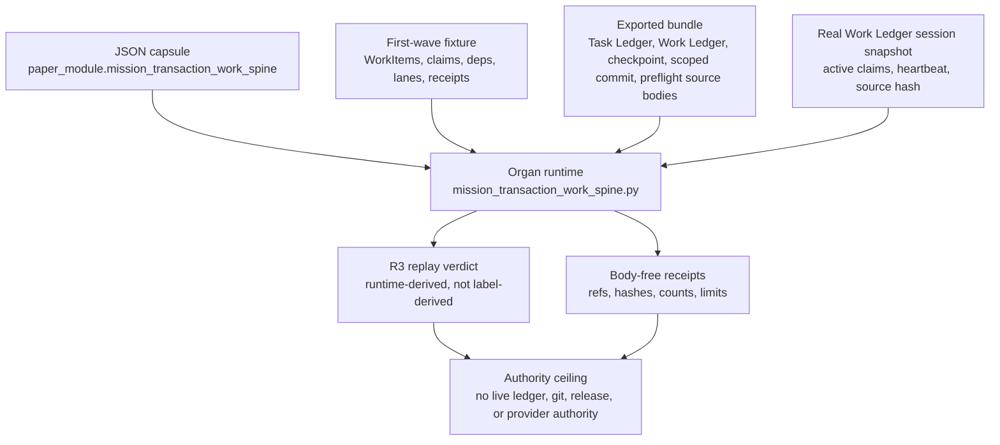

# Mission Transaction Work Spine

## Purpose

This organ exists because the riskiest moment in agentic code work is the one
that feels safest: the agent runs a few checks, sees no errors, and concludes
that its work is finished and committed. Those are different facts. A clean
preflight describes the state of the checks. It says nothing about whether a
competing claim already owns the same path, whether the branch has moved under
the agent, or whether the commit ever actually landed. The single question this
module answers is narrow and concrete: what evidence has to hold before a unit
of work is allowed to land, and is that evidence checkable rather than asserted?

The interesting design choice is that the module refuses to trust its own
declared verdicts. Most fixtures pass when their inputs carry the right labels.
Here the validator imports a copied, public-safe copy of the live Work Ledger
runtime, rebuilds an active-claims snapshot from a sanitised session payload,
and re-derives the pass-or-block decision from that recomputation rather than
from any label baked into the fixture. It then perturbs the input one field at a
time: a same-path claim conflict, a stale expected-parent hash, a checkpoint
lane mutated into an unauthorised broad commit. A genuine check has to break
under each of those and stay clear under harmless ones, such as a claim on an
unrelated path. That asymmetry, not the bare pass, is the claim.

The result is deliberately bounded. A pass means the public fixture, the
exported source bodies, and the negative cases together preserve the
work-landing contract and that its discriminating tests still discriminate. It
does not touch the live Task Ledger, the live Work Ledger, or Git, and it grants
no authority to commit, checkpoint broadly, back up, or release.

## Abstract

`mission_transaction_work_spine` is the public Microcosm paper module for
work-landing discipline. Its telos is to make the boundary between "a check
looked clean" and "work is actually allowed to land" inspectable as source,
fixture, receipt, and test evidence rather than as chat confidence or status
arithmetic.

The organ validates a fixed public mission-transaction bundle: WorkItem rows,
Work Ledger path claims, dependency unlocks, transaction plans, receipt drains,
closeout projections, scoped mutation policy, checkpoint-lane decisions, copied
non-secret control-plane source modules, and body-free receipts. Its current
R3 proof is the real Work Ledger session snapshot replay: the validator rebuilds
a public-safe active-claims snapshot from copied Work Ledger runtime code,
checks the declared snapshot hash, binds a real session heartbeat and claim set,
and proves that same-path, stale-parent, and bad landing-row perturbations move
the verdict while disjoint/equal-parent perturbations do not.

The result is intentionally narrow. A pass means the public fixture and exported
bundle preserve the mission-transaction contract, its source-open body floor,
and its negative cases. It does not mutate Task Ledger, Work Ledger, or Git; it
does not certify arbitrary live closeout; and it does not grant broad checkpoint,
backup, release, publication, provider, or whole-system authority.

## Problem

Agentic code work fails most often at transaction boundaries, not at isolated
syntax checks. Common false positives include:

- treating a clean preflight as a landed commit;
- ignoring a competing Work Ledger claim on the same path;
- accepting a claim whose expected parent no longer matches the repository;
- marking a downstream WorkItem ready without hard-dependency evidence;
- reading a dirty tree as a blocker for scoped commits while allowing broad
  staging without explicit operator authorization;
- writing receipts that smuggle private ledger or provider bodies into a public
  artifact.

The module turns those failures into a deterministic replay. A cold reader can
inspect which public rows are projections, which copied source bodies implement
the checks, which negative cases must be observed, and which authority claims
remain forbidden even when every validator passes.

## Shape



This Mermaid diagram is the reader flow. The generated lattice Mermaid remains
`available_from_capsule_edges`, and the generated Atlas card remains
`linked_from_capsule_edges`; both are derived from capsule and doctrine-lattice
rows, not from this prose.

## Technical Mechanism

The organ exposes two validator paths.

The first-wave fixture command validates the local replay fixture and writes the
canonical receipt set:

```bash
PYTHONPATH=src python3 -m microcosm_core.organs.mission_transaction_work_spine run \
  --input fixtures/first_wave/mission_transaction_work_spine/input \
  --out receipts/first_wave/mission_transaction_work_spine
```

That path loads public fixture rows, validates dependency unlocks, claim
preflight, scoped receipt authority, private-marker rejection, preflight
overclaim rejection, checkpoint lane policy, and the real active-claims
snapshot. The R3 branch calls the copied Work Ledger runtime to rebuild an
active-claims snapshot from the public-safe `runtime_status` payload, compares
the declared `source_snapshot_hash` to the recomputed snapshot hash, and derives
`public_safe_real_work_ledger_session_snapshot_replay` only when runtime
evidence, mutation tests, source-hash binding, session binding, and public-safe
source refs all pass.

The exported-bundle command validates source-open import and bundle replay:

```bash
PYTHONPATH=src python3 -m microcosm_core.organs.mission_transaction_work_spine \
  validate-mission-transaction-bundle \
  --input examples/mission_transaction_work_spine/exported_mission_transaction_bundle \
  --out receipts/first_wave/mission_transaction_work_spine
```

That path checks copied non-secret Task Ledger, Work Ledger, checkpoint,
scoped-commit, and mission-preflight source modules by manifest, digest, anchor
strings, secret-exclusion scan, and `body_in_receipt: false`. It also requires
the real Work Ledger snapshot in the mission bundle. Commit `da97bc6394`
(`Require real Work Ledger snapshot in mission bundle`) landed the snapshot as a
required bundle input; later source/test commits recomputed the snapshot verdict
and bound the R3 claim to runtime evidence.

## Prior Art Grounding

This organ is the mission-transaction member of Microcosm's local work-landing
family. Its closest sibling is `durable_agent_work_landing_replay`, which checks
recorded landing rows, validation-before-commit ordering, HEAD movement,
blocker capture, and Work Ledger closeout evidence without performing live Git
work. `mission_transaction_work_spine` narrows that pattern to the transaction
preflight and Work Ledger seed-speed membrane: same-path claim conflicts,
expected-parent mismatches, checkpoint-lane selection, dependency unlocks,
receipt drains, and session finalization posture.

It also supplies a source-import anchor used by adjacent public organs such as
`concurrency_mission_control` and `macro_projection_import_protocol`. Those
links are structural evidence routes, not runtime invocation or release
authority. The prior-art claim is therefore local and source-bounded: this paper
module inherits the work-landing accounting shape, then tests the particular
mission-transaction and Work Ledger session-snapshot boundary.

## Data And Evidence Contract

The public evidence bundle is composed of source refs, hashes, rows, and
receipts. The source bodies live only in the exported bundle's `source_modules/`
tree; receipts carry refs, counts, hashes, verdicts, and ceilings, not private
or live control-plane bodies.

- JSON capsule: `core/paper_module_capsules.json::paper_modules[20:paper_module.mission_transaction_work_spine]`
- Runtime locus: `src/microcosm_core/organs/mission_transaction_work_spine.py`
- Fixture input: `fixtures/first_wave/mission_transaction_work_spine/input`
- Exported bundle: `examples/mission_transaction_work_spine/exported_mission_transaction_bundle`
- Real snapshot: `examples/mission_transaction_work_spine/exported_mission_transaction_bundle/real_work_ledger_active_claims_snapshot.json`
- Fixture manifest: `core/fixture_manifests/mission_transaction_work_spine.fixture_manifest.json`
- Mechanism row: `mechanism.mission_transaction_work_spine.validates_public_mission_transaction_bundle`
- Standard: `standards/std_microcosm_mission_transaction_work_spine.json`

The receipt floor includes preflight, dependency blocked, work landing attempt,
claim preflight, scoped mutation, checkpoint lane, closeout projection,
dependency unlock scheduler, reconcile plan, and exported-bundle validation
receipts. The fields must preserve schema and organ ids, validator id, command,
status, observed and missing negative cases, error codes, anti-claim,
secret-exclusion status, public work-landing status, body-import status,
`body_in_receipt: false`, authority ceiling, and receipt paths.

## Discriminating Tests

The positive claim is not "the fixture passes." The positive claim is that the
fixture accepts real-good evidence and rejects targeted perturbations.

- Real-good case: the real active-claims snapshot passes with R3
  `public_safe_real_work_ledger_session_snapshot_replay`, a public-safe
  `state/work_ledger/active_claims_snapshot.json` source ref, a matching source
  hash, a bound session heartbeat, and five source-session claims.
- Same-path perturbation: adding a competing claim on the requested path blocks
  preflight through `work_ledger_runtime.active_claim_collisions_for_paths` and
  emits `SAME_PATH_CLAIM_CONFLICT`.
- Parent perturbation: changing the expected parent for a real claim blocks with
  `EXPECTED_PARENT_MISMATCH`; changing it back to the current parent clears.
- Disjoint perturbation: adding a claim on a disjoint path does not create a
  collision for the requested path, so the public preflight remains pass.
- Landing-row perturbation: mutating the checkpoint lane into an unauthorized
  broad checkpoint blocks with the checkpoint-lane violation floor.
- Private-body perturbation: a fixture row that carries live private Task Ledger
  body material is rejected, while source bodies copied into the public bundle
  remain outside receipts.
- Overclaim perturbation: a clean preflight cannot claim that work is already
  landed.
- Dependency perturbations: dangling dependency refs and ready rows with
  incomplete hard dependencies remain blockers.

Focused regression coverage lives in
`microcosm-substrate/tests/test_mission_transaction_work_spine.py`. The R3 tests
assert that the verdict is re-derived from runtime evidence, expected labels are
not sufficient, source hashes are bound, mutated or stale snapshots are
rejected, clear perturbations move the verdict, and `body_in_receipt` is false.

## JSON Capsule Binding

- Source row:
  `core/paper_module_capsules.json::paper_modules[20:paper_module.mission_transaction_work_spine]`
- `source_authority: json_capsule`
- This Markdown is a reader projection. The generated Mermaid projection is
  `available_from_capsule_edges`, and the generated Atlas projection is
  `linked_from_capsule_edges`; both are navigation projections derived from
  capsule edges.
- The proof boundary is the public fixture, exported mission-transaction bundle,
  copied non-secret control-plane source modules, real Work Ledger session
  snapshot replay, discriminating perturbation tests, and validation receipts.
- The authority ceiling is the capsule ceiling: public fixture and
  exported-bundle receipts only; no live Task Ledger mutation, live Work Ledger
  mutation, live git mutation, private backup execution, broad checkpoint
  authorization, release approval, publication approval, or whole-system
  correctness.

## Structured Lattice Bindings

- Organ: `mission_transaction_work_spine`, accepted as a real-substrate capsule
  with evidence class `algorithmic_projection`.
- Mechanism:
  `mechanism.mission_transaction_work_spine.validates_public_mission_transaction_bundle`.
- Concept: `concept.work_landing_and_continuity_control_bundle`, the
  transaction-scoped work landing and continuity evidence bundle.
- Capsule law edges: `P-10`, `P-16`, and `AX-9`.
- Organ/mechanism relation edges: `P-17` and `P-18` also govern the mechanism
  and concept in source doctrine rows, but they are not capsule principle refs in
  this paper module.
- Code locus: `src/microcosm_core/organs/mission_transaction_work_spine.py`
  resolves `run`, `run_mission_transaction_bundle`,
  `validate_task_ledger_source_import`, `validate_work_ledger_source_import`,
  `validate_checkpoint_source_import`, `validate_mission_control_source_import`,
  `validate_claim_preflight`, `validate_checkpoint_lane_policy`, and
  `write_receipts`.
- Residual: sibling `depends_on` paper-module edges remain selective until a
  source row names them.

The governing law shape is AX-9: transactional effects must declare their
effect boundary, enforce parent/CAS evidence, and respect single-writer claims.
P-10 supplies the compensation rule, P-16 binds authority to transaction scope,
P-17 anchors graph mutations to unique source rows, and P-18 requires fan-in
before activation. The paper module cites those relations only where the
Microcosm source rows already carry them.

## Reader Evidence Routing

Read this module as an evidence-accounting paper, not as a live controller.

1. Start at the JSON capsule to confirm paper-module authority, subject ids,
   code locus, law refs, generated Mermaid projection status, and generated
   Atlas projection status.
2. Open the mechanism row and standard to see the required bundle fields:
   workitems, claim table, dependency graph, transaction plan, receipt drain,
   closeout projection, scoped mutation policy, checkpoint lane policy, copied
   source imports, body import verification, anti-claim, and authority ceiling.
3. Inspect the real active-claims snapshot to see the public-safe source ref,
   source hash, snapshot time, source session id, owned paths, checkpoint lane
   case, runtime session, and body-free posture.
4. Read the focused tests to verify R3 is runtime-derived: same-path conflicts,
   stale parents, landing-row violations, disjoint paths, and equal-parent
   mutations are all discriminated.
5. Treat generated JSON, generated Mermaid, Atlas, public-site docs, and
   receipts as projections or validator outputs. If they drift, use their owner
   builders or validator commands; do not hand-edit generated surfaces.

## Claim Ceiling

This module may claim that public fixture rows, copied non-secret control source
bodies, a real Work Ledger session snapshot replay, discriminating negative
cases, body-free receipts, and focused tests preserve the mission-transaction
work spine at R3. That is a replay and evidence-shape claim.

This module may not claim live Task Ledger authority, live Work Ledger
authority, live Git mutation, broad checkpoint authorization, private backup
execution, current repository closeout, source mutation authority, provider
behavior, browser/HUD state, release approval, publication approval,
hosted-product readiness, or whole-system correctness.

## Validation Receipt Path

For this Markdown-only paper-module update, use non-mutating checks from repo
root:

```bash
./repo-pytest microcosm-substrate/tests/test_mission_transaction_work_spine.py \
  -q \
  --basetemp=/tmp/microcosm_mission_transaction_work_spine_pytest
./repo-python microcosm-substrate/scripts/build_doctrine_projection.py --check-paper-module-corpus
```

For a source, capsule, or projection landing, run the owner lane from
`microcosm-substrate`:

```bash
PYTHONPATH=src python3 scripts/build_doctrine_projection.py --check-paper-module-corpus
PYTHONPATH=src python3 scripts/build_doctrine_projection.py --check
```

Do not run `--write` from this Markdown-only lane. This pass owns only the
reader projection, not generated lattice assets.

## Limits And Non-Claims

The module's useful claim is compact: public fixture rows, copied non-secret
control source bodies, a real Work Ledger session snapshot replay, discriminating
negative cases, body-free receipts, and focused tests preserve the
mission-transaction work spine at R3.

It may not claim live Task Ledger authority, live Work Ledger authority, live Git
mutation, broad checkpoint authorization, private backup execution, current
repository closeout, source mutation authority, provider behavior, browser/HUD
state, release approval, publication approval, hosted-product readiness, or
whole-system correctness.
