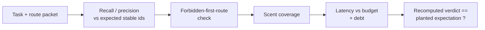

# Navigation Fitness Benchmark

`navigation_fitness_benchmark` scores how well a navigation system found the right
thing. Each case pairs a task (what was wanted, which items count, which first
routes are off-limits, how fast it should be) with the route packet a router
actually returned, and recomputes the verdict.

## Purpose

A navigation score is easy to inflate and easy to read as either failure or
marketing. This organ recomputes recall, precision, forbidden-first-route, scent
coverage, and latency from the packet, and accepts a case only when the
recomputation matches what the case claims will happen.

It surfaces the public `navigation_fitness_benchmark` capsule. Over bounded
route-packet fixtures it computes recall and precision against the expected stable
ids, checks the first-contact command against a forbidden list, scores scent-term
coverage, derives a latency verdict against a per-task budget, and collects
sufficiency and latency debt. A case passes only when the recomputed verdict
agrees with its planted expectation — so a packet that claims success it did not
earn is rejected.

## Shape



## JSON Capsule Binding

- source_ref:
  `core/paper_module_capsules.json::paper_modules[98:paper_module.navigation_fitness_benchmark]`
- source_authority: json_capsule
- Projection role: This Markdown is a reader projection of the JSON capsule row,
  not the source authority. The generated Mermaid projection is
  `paper_module.navigation_fitness_benchmark.mermaid` with status
  `available_from_capsule_edges`, and the generated Atlas projection is
  `organ_atlas.navigation_fitness_benchmark` with status
  `linked_from_capsule_edges`.
- proof boundary: the capsule binds the accepted organ, the resolved mechanism
  row, the runtime locus, the surfaced engine-room capsule, and the governing
  concept, principle, and axiom edges; the generated JSON projection carries the
  exact resolved relationship edges.
- authority ceiling: this page can explain the route-packet benchmark fixtures and
  the validation receipts, but it cannot become a live private-kernel run, an
  embedding benchmark, a universal navigation score, or release authority.

## Structured Lattice Bindings

The structured capsule row is
`core/paper_module_capsules.json#paper_module.navigation_fitness_benchmark`. It
binds this Markdown projection to the organ, the resolved mechanism row
`mechanism.navigation_fitness_benchmark.verifies_navigation_fitness_benchmark`,
the runtime locus
`src/microcosm_core/organs/navigation_fitness_benchmark.py`, and the surfaced
capsule `src/microcosm_core/engine_room/navigation_fitness_benchmark.py`. It
abides by axiom `AX-2` (a small checker decides claims over certificates) and
principle `P-3` (prefer a small, rerunnable verifier over narrative confidence).

Generated atlas docs remain builder-owned projections: refresh them with
`PYTHONPATH=src python3 scripts/build_organ_atlas.py --write` instead of editing
`ORGANS.md`, `ARCHITECTURE.md`, `AGENT_ROUTES.md`, or
`atlas/agent_task_routes.json` by hand.

## Reader Evidence Routing

The honest unit is "recomputation matched the expectation," not a headline score.
Read the debt-bearing positive and the rejected packets:

- A safety/evals engineer should confirm recall, precision, forbidden-route, and
  latency are recomputed from the packet. The useful question is whether a packet
  that claims a pass it did not earn is rejected.
- A hiring reviewer should read `latency_debt_pass`, which is accepted while
  carrying an honest latency debt. The useful question is whether the organ
  accepts truthful debt rather than only zero-debt packets.
- A peer developer should run the negatives. The useful question is whether a
  missing stable id and a forbidden first route are both caught because the
  recomputation contradicts the planted "it passed" claim.

## Validation

```bash
PYTHONPATH=src python3 -m microcosm_core.organs.navigation_fitness_benchmark run --input fixtures/first_wave/navigation_fitness_benchmark/input --out receipts/first_wave/navigation_fitness_benchmark --acceptance-out receipts/acceptance/first_wave/navigation_fitness_benchmark_fixture_acceptance.json
```

The positive cases (`clean_fanout_pass`, `latency_debt_pass`) match their planted
expectations, including one that anticipates an honest latency debt. The negative
cases are rejected by recomputation: `missing_stable_id_rejected` and
`forbidden_first_route_rejected` recompute a failing verdict that contradicts the
packet's false "it passed" expectation. The registry, ledger, and runtime spine
checks in `make test` exercise the organ's acceptance receipt.

## Authority Ceiling

A green run shows that the curated route-packet cases recomputed as expected —
positives accepted, negatives rejected by recomputation. It does not establish
live private-kernel navigation quality, embedding quality, a universal benchmark,
or production readiness, and it does not authorize release, publication, provider
calls, or source mutation.
