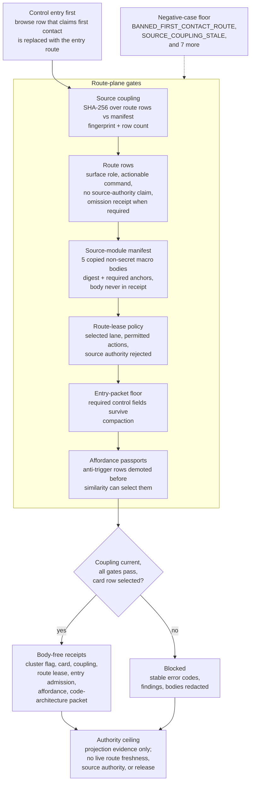

# Navigation Hologram Route Plane

## Purpose

A large codebase has a recurring failure: the agent or reader that lands in it
starts from whatever browse surface is nearest to hand, treats that surface as
the authority, and acts on a stale or partial view. The route plane exists to
make the first move legible and to stop a browse row from being mistaken for
the thing it describes. It answers one question: given a control entry, what is
the safe ordered path into the browsable route projections, and what proof says
that path is wired rather than asserted?

The unusual part is that the organ never asserts a route is correct from prose.
It treats every browse row as a projection and demands a coupling receipt before
that projection is allowed any authority. Source coupling is a plain SHA-256 over
the route rows: the manifest carries an expected fingerprint and an expected row
count, and if either disagrees with the rows on disk the projection is denied
current authority. A route summary that claims to be current while its coupling
is stale is rejected outright. This is the same discipline a navigation index
needs in any system that regenerates its own views: the view is only as
trustworthy as the fingerprint that ties it to its source.

The other half of the design is what it refuses to do. First contact must begin
at the control entry, not at a drilldown projection, so a request that tries to
start from a browse row is replaced with the entry route. Compaction of the
entry packet may not drop a required control field. An affordance row whose
passport carries an anti-trigger is demoted before similarity search can ever
select it. None of these are stylistic preferences; each is a named negative
case the fixture must keep catching, so the route plane is defined as much by
the eight things it blocks as by the path it permits.

## Teleology

The navigation route plane gives a public clone a typed way to move from a
control entry to browseable route projections without treating browse rows as
authority.

## Public Contract

The organ runs in two modes against the same checks. The fixture mode loads a
set of synthetic inputs, builds a toy option-surface from the rows (a
cluster-flag summary plus one selected card), and then runs the negative-case
validators that prove each guard still fires. The exported-bundle mode runs the
same kind of checks against a real copied bundle: it validates the route rows,
the source-coupling fingerprint, the source-module manifest, the route-lease
policy, the entry-packet floor, the affordance passports, and the
code-architecture projection packet, and only reports a pass when the secret
scan is clean, a card row is selected, and every component validator passes.

The source-coupling gate is the spine. It hashes the route rows with SHA-256 and
compares that against the fingerprint and row count declared in the manifest; a
mismatch denies the projection any current authority, and a summary that claims
current authority while coupling is stale is recorded as an overclaim. The
source-module manifest names five exact copies of non-secret macro route and
control bodies. Each is checked by digest and by required navigation anchors, and
each must declare that its body is copied but never written into the receipt, so
the evidence is reproducible without exposing the source text.

## Shape



## Source-Backed Doctrine Packet

- `core/organ_registry.json::implemented_organs[navigation_hologram_route_plane]`
  is the accepted organ authority. It records status
  `accepted_current_authority`, evidence class `semantic_validator`, evidence
  strength rank `5`, claim ceiling `validates declared public contract only`,
  and validator command `python -m microcosm_core.organs.navigation_hologram_route_plane run --input fixtures/first_wave/navigation_hologram_route_plane/input --out receipts/first_wave/navigation_hologram_route_plane`.

- `core/organ_atlas.json::organs[navigation_hologram_route_plane]` gives the
  cold-reader gloss: control entry comes first, browse rows stay projections,
  eight route-plane negative cases are detected, exact copied non-secret
  navigation source modules validate, and receipts omit body text.

- `standards/std_microcosm_navigation_hologram_route_plane.json` governs the
  standard authority boundary
  `public_navigation_route_plane_runtime_and_copied_source_body_validator_not_live_source_authority`.
  It requires route rows, option-surface contracts, source coupling,
  source-module manifests, route leases, entry-packet floors, affordance
  passports, code-architecture packets, body-import verification, authority
  ceiling, and anti-claim.

- `src/microcosm_core/organs/navigation_hologram_route_plane.py` is the runtime
  source for fixture validation, route-plane bundle validation,
  secret-exclusion scan, route-lease checks, entry-admission floor checks,
  affordance-passport demotion, code-architecture packet receipts, and
  source-module digest/anchor validation.

- `core/fixture_manifests/navigation_hologram_route_plane.fixture_manifest.json`
  binds fixture expectations: `body_copied_material_count=5`,
  `body_material_status=copied_non_secret_macro_route_substrate_with_provenance`,
  `body_in_receipt=false`, and negative cases tied to stable error codes.

- `examples/navigation_hologram_route_plane/exported_route_plane_bundle/source_module_manifest.json`
  names five exact copied non-secret macro route-control bodies:
  `navigation_route_plane_intervention_source_body_import`,
  `navigation_route_plane_context_pack_source_body_import`,
  `navigation_route_plane_entry_packet_source_body_import`,
  `navigation_route_plane_option_surface_source_body_import`, and
  `navigation_route_plane_navigation_contract_source_body_import`.

- `tests/test_navigation_hologram_route_plane.py` is the regression floor for
  fixture receipts, exact macro-source digest matches, source-module anchors,
  public-safe receipt redaction, exported bundle validation, digest-mismatch
  rejection, and this source-backed paper-module packet.

- `receipts/first_wave/navigation_hologram_route_plane/*.json` carries public
  receipts for cluster/card output, source coupling, route lease,
  entry-payload admission, affordance-passport selection, code-architecture
  packet, and exported bundle validation.

Source-module body floor:

| Module id | Macro source | Public copied target |
| --- | --- | --- |
| `navigation_route_plane_intervention_source_body_import` | `system/lib/navigation_route_intervention.py` | `examples/navigation_hologram_route_plane/exported_route_plane_bundle/source_modules/system/lib/navigation_route_intervention.py` |
| `navigation_route_plane_context_pack_source_body_import` | `system/lib/navigation_context_pack.py` | `examples/navigation_hologram_route_plane/exported_route_plane_bundle/source_modules/system/lib/navigation_context_pack.py` |
| `navigation_route_plane_entry_packet_source_body_import` | `system/lib/kernel/commands/comprehension_snapshot.py` | `examples/navigation_hologram_route_plane/exported_route_plane_bundle/source_modules/system/lib/kernel/commands/comprehension_snapshot.py` |
| `navigation_route_plane_option_surface_source_body_import` | `system/lib/standard_option_surface.py` | `examples/navigation_hologram_route_plane/exported_route_plane_bundle/source_modules/system/lib/standard_option_surface.py` |
| `navigation_route_plane_navigation_contract_source_body_import` | `codex/standards/std_navigation_contract.json` | `examples/navigation_hologram_route_plane/exported_route_plane_bundle/source_modules/codex/standards/std_navigation_contract.json` |

Registry receipt refs:

- `receipts/first_wave/navigation_hologram_route_plane/affordance_passport_selection_receipt.json`
- `receipts/first_wave/navigation_hologram_route_plane/code_architecture_projection_packet_receipt.json`
- `receipts/first_wave/navigation_hologram_route_plane/entry_payload_admission_receipt.json`
- `receipts/first_wave/navigation_hologram_route_plane/route_lease.json`
- `receipts/first_wave/navigation_hologram_route_plane/source_coupling_result.json`
- `receipts/first_wave/navigation_hologram_route_plane/toy_kind_card.json`
- `receipts/first_wave/navigation_hologram_route_plane/toy_kind_cluster_flag.json`

First command from `microcosm-substrate/`:

```bash
PYTHONPATH=src python3 -m microcosm_core.organs.navigation_hologram_route_plane run --input fixtures/first_wave/navigation_hologram_route_plane/input --out receipts/first_wave/navigation_hologram_route_plane
```

Runtime bundle command from `microcosm-substrate/`:

```bash
PYTHONPATH=src python3 -m microcosm_core.organs.navigation_hologram_route_plane validate-route-plane-bundle --input examples/navigation_hologram_route_plane/exported_route_plane_bundle --out receipts/runtime_shell/demo_project/organs/navigation_hologram_route_plane
```

Standard-declared runtime bundle validator:
`python -m microcosm_core.organs.navigation_hologram_route_plane validate-route-plane-bundle --input examples/navigation_hologram_route_plane/exported_route_plane_bundle --out receipts/runtime_shell/demo_project/organs/navigation_hologram_route_plane`.

Atlas claim ceiling restated: It validates only the declared public toy route-plane contract and its regression fixtures (plus exact copied non-secret navigation source modules in the bundle path); it does not prove live route freshness, grant source authority, authorize any later organ, run any provider/live-kernel call, or certify the whole wave.

The negative-case floor is part of the doctrine, not incidental test trivia.
Across the eight negative cases, the fixture must keep detecting these stable
error codes (one case carries two codes, so the list runs to nine):

- `BANNED_FIRST_CONTACT_ROUTE`
- `SOURCE_COUPLING_STALE`
- `MISSING_OMISSION_RECEIPT`
- `ATLAS_PROJECTION_NOT_CONTROL_ENTRY`
- `ROUTE_CARD_PRIVATE_BODY_LEAK`
- `ROUTE_SUMMARY_OVERCLAIMS_FRESHNESS`
- `DUPLICATE_ROUTE_ID_CONFLICT`
- `ENTRY_ADMISSION_CONTROL_FLOOR_DROPPED`
- `AFFORDANCE_PASSPORT_ANTITRIGGER_IGNORED`

## Authority Ceiling

This module can be cited as evidence that the public fixture and exported
route-plane bundle validate their declared contract. It does not prove live
route freshness, grant live macro-kernel authority, authorize source mutation,
authorize provider calls, export account/session state, expose browser/HUD live access,
authorize recipient work, authorize publication or release, prove whole-system
correctness, or certify private-root equivalence.

## Claim Ceiling

This module may claim public fixture evidence that the route-plane rows,
exported bundle, copied non-secret navigation source modules, source manifests,
negative cases, and validation receipts agree on the declared public route-plane
contract. It may also claim that the generated JSON row resolves the accepted
organ subject, resolved mechanism subject, runtime source locus, governed
concept, and the full set of declared principles, axioms, dependency modules,
and relationship bindings.

This module may not claim live route freshness, live macro-kernel authority,
provider or browser/HUD access, source mutation authority, recipient work
authorization, hosted-public readiness, release approval, publication approval,
private-root equivalence, implementation correctness beyond the listed
witnesses, or whole-system correctness.

## JSON Capsule Boundary

The JSON capsule row is the source authority for this page; this Markdown is a
reader projection over that row. The generated instance is
`paper_modules/navigation_hologram_route_plane.json`, and the legacy reader
page is `paper_modules/navigation_hologram_route_plane.md`. Readers should
follow the capsule row's `legacy_markdown_projection` field and the generated
JSON instance rather than treating this prose as an edge authority.

The capsule resolves the accepted organ subject, the mechanism subject, the
runtime source locus, nine governing principles, six governing axioms, and four
sibling paper-module dependencies, plus the governed concept
`concept.architecture_and_navigation_route_contract_bundle`. There are no
unresolved selective relations in the generated row.

## Structured Lattice Bindings

| Binding | Source |
|---|---|
| Capsule authority | `core/paper_module_capsules.json::paper_modules[1:paper_module.navigation_hologram_route_plane]` |
| Generated instance | `paper_modules/navigation_hologram_route_plane.json` |
| Reader projection | `paper_modules/navigation_hologram_route_plane.md` |
| Organ subject | `navigation_hologram_route_plane` |
| Mechanism subject | `mechanism.navigation_hologram_route_plane.validates_public_route_plane_bundle` |
| Runtime locus | `src/microcosm_core/organs/navigation_hologram_route_plane.py` |
| Governing principles | `P-1`, `P-2`, `P-3`, `P-5`, `P-6`, `P-8`, `P-9`, `P-12`, `P-15` |
| Governing axioms | `AX-1`, `AX-4`, `AX-5`, `AX-7`, `AX-8`, `AX-11` |
| Dependency modules | `paper_module.cold_reader_route_map`, `paper_module.agent_route_observability_runtime`, `paper_module.routing_anti_patterns_registry`, `paper_module.pattern_binding_contract` |
| Generated Mermaid | `paper_module.navigation_hologram_route_plane.mermaid` is `available_from_capsule_edges` |
| Generated Atlas card | `organ_atlas.navigation_hologram_route_plane` is `linked_from_capsule_edges` |
| Residual relations | None in the generated row. |

The generated instance currently carries twenty-three relationship edges: two
explained subjects, nine governing principles, six governing axioms, four
sibling paper-module dependencies, one governed concept, and one resolved code
locus. That edge set is the source-backed lattice boundary for this reader page.

## Reader Evidence Routing

Reader evidence starts at the generated JSON instance, then routes through the
route-plane runtime, fixture manifest, source-module manifest, public receipts,
and focused regression. The browse rows, Mermaid diagram, and Atlas card are
derived projections; they are not control-entry or source authority.

## Reader Proof Boundary

The proof boundary is the public route-plane fixture and exported source-body
bundle: option-surface rows, source-coupling gates, route leases,
entry-payload admission, affordance-passport selection, omission receipts,
source-module digest checks, negative cases, and validation receipts. It does
not grant live route freshness, source mutation, provider/live-kernel
execution, later-organ authorization, release, or whole-wave certification.

## Public Site Availability Boundary

A public site may show this module as route-plane proof only when it preserves
the first-contact rule and labels browse rows as projections. Site copy must
expose the generated card payload, route ids, source refs, source-module
manifest refs, digests, anchors, negative-case floor, omission receipts,
validation receipt refs, and authority ceilings as public-safe projection
material.

The source inputs for website availability are the capsule row, this reader
projection, and `paper_modules/navigation_hologram_route_plane.json`.
`tools/meta/dissemination/build_microcosm_public_site.py` owns the generated
public-site projections. `content-graph.json`, `object-map.json`, search index
rows, `llms.txt`, and HTML pages are routeability projections, not source
authority. Do not hand-edit generated site outputs to make this module visible;
refresh through the existing builder when site ownership is safe.

Site copy must not present Atlas rows, Mermaid edges, route summaries, or copied
source-body checks as live control authority, release permission, provider or
browser/HUD access, live macro-kernel authority, source mutation authority,
private-root equivalence, hosted-public readiness, publication approval, or
whole-system correctness.

## Public-Safe Body Handling

Public receipts may expose route ids, source refs, manifest refs, digests,
anchors, status fields, error codes, and omission receipts. They must not expose
private route bodies, raw seed, provider payloads, live account/session state,
browser/HUD state, secrets, or copied body text beyond the approved non-secret
bundle targets.

## Validation Receipt Path

From `microcosm-substrate/`, reproduce this page's proof boundary with
temporary receipts:

```bash
PYTHONPATH=src ../repo-python -m microcosm_core.organs.navigation_hologram_route_plane run --input fixtures/first_wave/navigation_hologram_route_plane/input --out /tmp/microcosm-navigation-hologram-route-plane
PYTHONPATH=src ../repo-python -m microcosm_core.organs.navigation_hologram_route_plane validate-route-plane-bundle --input examples/navigation_hologram_route_plane/exported_route_plane_bundle --out /tmp/microcosm-navigation-hologram-route-plane-bundle
../repo-pytest microcosm-substrate/tests/test_navigation_hologram_route_plane.py
PYTHONPATH=src ../repo-python scripts/build_doctrine_projection.py --check-paper-module-corpus
```

These checks validate the public fixture and exported route-plane bundle only;
they do not grant live route freshness, source authority, provider/live-kernel
execution, later-organ authorization, release approval, or whole-wave
certification.

## Re-entry Conditions

- If `core/doctrine_lattice_coverage.json` still reports
  `navigation_hologram_route_plane` as missing `paper_module_ref`,
  `mechanism_ref`, or `code_loci`, do not count this prose packet as closing
  those registry/atlas joins. Clear those edges through the organ registry or
  atlas owner lane after its current owner releases it.
- If any source-module manifest row, copied source digest, required anchor,
  fixture negative case, validator command, receipt field floor, standard
  authority boundary, or body-in-receipt policy changes, refresh this module
  and the focused regression in the same patch.
- If a public entry or visual board cites this organ, its first-screen card
  must show command, route-plane source-module manifest, evidence class,
  authority ceiling, negative-case floor, receipt refs, and anti-claim before
  deeper narrative.

## Receipt Expectations

The public command emits preflight, cluster, card, source-coupling,
route-lease, entry-admission, affordance-selection, and code-architecture
packet receipts.

## Prior Art Grounding

The route plane is grounded in information-architecture and graph-navigation
patterns. The first-contact rule follows the same usability pressure as
[progressive disclosure](https://www.nngroup.com/articles/progressive-disclosure/):
show the control entry and immediate affordances before deeper browse rows.
The CLI-facing surface is also informed by the
[Command Line Interface Guidelines](https://clig.dev/), especially the emphasis
on discoverable commands, examples, and clear next actions.

The graph side maps to established directed-graph tooling. NetworkX documents
[topological sorting](https://networkx.org/documentation/stable/reference/algorithms/generated/networkx.algorithms.dag.topological_sort.html)
as an ordering over dependency edges, and graph-ranking algorithms such as
[PageRank](https://networkx.org/documentation/stable/reference/algorithms/generated/networkx.algorithms.link_analysis.pagerank_alg.pagerank.html)
show the older pattern of computing route salience from graph structure.
Microcosm keeps those ideas below authority: route cards, leases, and browse
rows are projections unless source-coupling and entry-admission receipts agree.

## Anti-Claim

This module documents a public route-plane fixture and exported source-body
bundle. It does not certify live corpus freshness, later public organs, release
operations, provider/account/session access, private root equivalence,
whole-system correctness, or secret export.

## JSON Capsule Binding

- Capsule row: `paper_module.navigation_hologram_route_plane` in `core/paper_module_capsules.json::paper_modules[1:paper_module.navigation_hologram_route_plane]`.
- source_authority: json_capsule
- This Markdown is a reader projection; the JSON capsule is source authority for subjects, code loci, doctrine refs, and generated projection state.
- The generated Mermaid projection is `available_from_capsule_edges`; the generated Atlas projection is `linked_from_capsule_edges`.
- The proof boundary is the local fixture and exported route-plane bundle
  receipts named above, not live route freshness, provider execution,
  later-organ authorization, release, or whole-wave certification.
- authority ceiling: Public fixture and exported-bundle receipts only; no live
  route freshness, source authority, provider/live-kernel execution, private
  operator state, later-organ authorization, release approval, or whole-wave
  certification.
