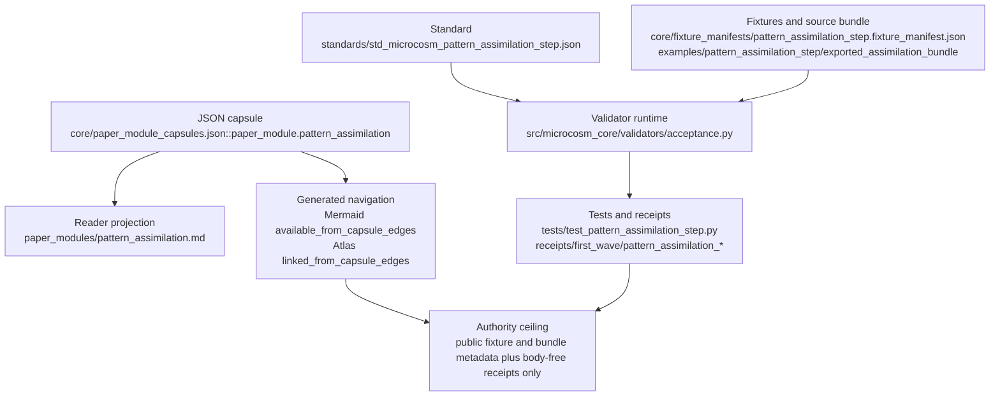

# Pattern Assimilation

## Route Card

- Organ id: `pattern_assimilation_step`
- JSON capsule authority: `core/paper_module_capsules.json::paper_module.pattern_assimilation`
- Accepted-organ evidence class: `semantic_validator`
- Standard: `standards/std_microcosm_pattern_assimilation_step.json`
- Validator authority: `src/microcosm_core/validators/acceptance.py`
- Fixture manifest: `core/fixture_manifests/pattern_assimilation_step.fixture_manifest.json`
- Fixture input: `fixtures/first_wave/pattern_assimilation_step/input`
- Runtime bundle: `examples/pattern_assimilation_step/exported_assimilation_bundle`
- Primary receipts: `receipts/first_wave/pattern_assimilation_acceptance.json`,
  `receipts/first_wave/pattern_assimilation_receipt.json`, and
  `receipts/first_wave/pattern_assimilation_step/exported_assimilation_bundle_validation_result.json`
- Projection posture: the JSON capsule is the paper-module source authority.
  This Markdown is the cold-reader explanation. The generated JSON instance,
  Mermaid availability, atlas card, fixture manifests, receipts, and Task/Work
  Ledger projections are validator- or builder-owned evidence surfaces and
  should be refreshed through their owner commands, not hand-edited from here.

## Shape



The capsule is present, so the cold-reader path starts from
`core/paper_module_capsules.json::paper_module.pattern_assimilation`, not from a
legacy-only boundary. That capsule binds this Markdown to the accepted
`pattern_assimilation_step` organ, the `acceptance.py` validator locus, the
standard, first-wave fixture manifest, exported assimilation bundle, focused
tests, body-free receipts, and generated Mermaid/Atlas navigation status.

Read the diagram as an evidence route, not an authority upgrade. The validator
and tests can check same-lane closeout metadata, negative cases, public-relative
receipts, source-module manifest digests, and body-free bundle handling; the
generated Mermaid and Atlas surfaces only make those capsule edges walkable.
The ceiling remains public fixture and exported-bundle metadata plus body-free
receipts, with no live ledger mutation, source mutation, raw-seed ingestion,
private-root equivalence, global doctrine promotion, release or publication
authority, behavior-change proof, or whole-system correctness.

## JSON Capsule Binding

- Source row: `core/paper_module_capsules.json::paper_modules[74:paper_module.pattern_assimilation]`
- `source_authority: json_capsule`
- This Markdown is a reader projection. The generated Mermaid projection and
  generated Atlas projection are navigation surfaces derived from the capsule
  edges; they are not source authority.
- The Atlas card is linked from capsule edges, and the Mermaid projection is
  available from the same fixture-bound subject, principle, axiom, dependency,
  and code-locus row set.
- The proof boundary is the pattern-assimilation fixture, copied non-secret
  body-import manifest, validator negative cases, body-free receipts, and
  validation receipts.
- The authority ceiling excludes complete pattern coverage, private macro-root
  equivalence, live Task Ledger or Work Ledger mutation, raw-seed ingestion,
  source mutation, release or publication, provider dispatch, global doctrine
  promotion, and whole-system correctness.

## JSON Capsule Boundary

The JSON capsule is the source of record for this paper-module row. This
Markdown is the reader projection over that capsule, not a second authority
plane.

The capsule resolves the row into:

- accepted organ subject: `pattern_assimilation_step`;
- mechanism subject:
  `mechanism.pattern_assimilation_step.validates_public_pattern_assimilation_step`;
- route-contract concept:
  `concept.architecture_and_navigation_route_contract_bundle`;
- validator locus: `src/microcosm_core/validators/acceptance.py`.

The generated JSON row currently exposes 26 capsule-derived relationship edges:
two subject explanation edges, one concept edge, eleven principle edges, eight
axiom edges, three paper-module dependency edges, and one code-locus edge.
Mermaid is `available_from_capsule_edges`, Atlas is
`linked_from_capsule_edges`, and there are no unresolved selective relations.
Those projections make the capsule walkable; they do not promote a local
closeout lesson into global doctrine.

## First Command

From `microcosm-substrate`:

```bash
PYTHONPATH=src python3 -m microcosm_core.validators.acceptance \
  --only pattern_assimilation_step \
  --input fixtures/first_wave/pattern_assimilation_step/input \
  --out receipts/first_wave/pattern_assimilation_acceptance.json
```

Use the exported bundle validator when the question is whether the public source-open body imports still match their declared source bodies:

```bash
PYTHONPATH=src python3 -m microcosm_core.validators.acceptance \
  validate-assimilation-bundle \
  --input examples/pattern_assimilation_step/exported_assimilation_bundle \
  --out receipts/first_wave/pattern_assimilation_step
```

## Validation Receipt Path

From `microcosm-substrate`, keep validation receipts outside tracked first-wave
paths unless the owning receipt lane intends to refresh them:

```bash
PYTHONPATH=src ../repo-python -m microcosm_core.validators.acceptance \
  --only pattern_assimilation_step \
  --input fixtures/first_wave/pattern_assimilation_step/input \
  --out /tmp/microcosm-pattern-assimilation/acceptance.json
PYTHONPATH=src ../repo-python -m microcosm_core.validators.acceptance \
  validate-assimilation-bundle \
  --input examples/pattern_assimilation_step/exported_assimilation_bundle \
  --out /tmp/microcosm-pattern-assimilation/bundle
PYTHONPATH=src ../repo-python scripts/build_doctrine_projection.py --check-paper-module-corpus
PYTHONPATH=src ../repo-python scripts/build_doctrine_projection.py --check
```

The fixture and bundle receipts prove same-lane closeout-learning shape over
the public fixtures and copied body imports only; they do not promote a local
lesson to global doctrine authority. Source-copy or receipt drift is an owning
validator/manifest lane issue, not Markdown source authority.

Focused pytest re-entry is:

```bash
PYTHONPATH=src ../repo-python -m pytest -p no:cacheprovider tests/test_pattern_assimilation_step.py -q --basetemp=/tmp/microcosm_pattern_assimilation_pytest
```

Use an isolated `/tmp` basetemp for focused pytest runs so receipt scratch paths
do not rewrite macro-run rows inside the checkout.

## What It Proves

Pattern assimilation is the public closeout-learning contract for landed
organs. It validates that each landed organ in the fixture set has exactly one
same-lane closeout decision: either a concrete refinement receipt naming the
owner surface and changed artifact, or a typed `nothing_to_refine` receipt with
stewardship checked, next-best-lane checked, and a re-entry condition.

A cold agent should use this organ when a pass claims that local work taught
the system something. The validator makes that claim inspectable: it checks
owner-surface evidence, duplicate receipt ids, off-lane closeouts, missing
closeout decisions, residual lifecycle posture, and attempts to promote a local
lesson into global doctrine authority without the governing lane.

## Capsule-Bound Reader Shape

The paper-module capsule binds this Markdown to two explained subjects:
`pattern_assimilation_step` and
`mechanism.pattern_assimilation_step.validates_public_pattern_assimilation_step`.
It also carries the route-contract concept
`concept.architecture_and_navigation_route_contract_bundle`.

The executable locus is `src/microcosm_core/validators/acceptance.py`,
specifically `validate_pattern_assimilation`, `run_assimilation_bundle`,
`validate_source_module_manifest`, `_write_jsonl_upsert`,
`EXPECTED_NEGATIVE_CASES`, `PATTERN_ASSIMILATION_AUTHORITY_CEILING`, and
`main`.

Its law edges are bounded to the local closeout-learning claim ceiling:
`P-1`, `P-2`, `P-3`, `P-5`, `P-6`, `P-7`, `P-8`, `P-9`, `P-12`, `P-13`,
`P-15`, `AX-1`, `AX-4`, `AX-5`, `AX-6`, `AX-7`, `AX-8`, `AX-11`, and
`AX-12`. Its paper-module neighbors are `cold_reader_route_map`,
`pattern_binding_contract`, and `voice_to_doctrine_self_improvement_loop`.

The generated Mermaid and atlas projections are useful navigation surfaces, not
authority. If the generated JSON instance disagrees with the capsule or
validator source, the capsule and validator win; refresh the projection rather
than editing it.

## Structured Lattice Bindings

- Capsule row:
  `core/paper_module_capsules.json::paper_modules[74:paper_module.pattern_assimilation]`
  is the source of record for this paper-module projection.
- Subject edges: `pattern_assimilation_step` and
  `mechanism.pattern_assimilation_step.validates_public_pattern_assimilation_step`
  are the only explained accepted organ/mechanism subjects.
- Concept edge: `concept.architecture_and_navigation_route_contract_bundle` is
  the capsule-named route-contract concept.
- Law edges: `P-1`, `P-2`, `P-3`, `P-5`, `P-6`, `P-7`, `P-8`, `P-9`, `P-12`,
  `P-13`, `P-15`, `AX-1`, `AX-4`, `AX-5`, `AX-6`, `AX-7`, `AX-8`, `AX-11`,
  and `AX-12` are bounded to the local closeout-learning claim ceiling.
- Dependency edges: `paper_module.cold_reader_route_map`,
  `paper_module.pattern_binding_contract`, and
  `paper_module.voice_to_doctrine_self_improvement_loop` contextualize reader
  routing, pattern binding, and voice-to-doctrine refinement.
- Code locus: `src/microcosm_core/validators/acceptance.py` is the validator
  and receipt-writing source for fixture, bundle, source-module manifest, and
  negative-case checks.
- Projection edges: Mermaid `available_from_capsule_edges` and Atlas
  `linked_from_capsule_edges` are generated navigation surfaces derived from
  capsule edges.

## Source-Backed Substrate

This organ is more than a prose rule. The exported assimilation bundle imports
four non-secret bodies by manifest:

- `macro_pattern_autonomy_process_contract_body_import` from `state/microcosm_portfolio/reconstruction/macro_pattern_autonomy_process_contract_v1.json`
- `macro_pattern_assimilation_fixture_manifest_body_import` from `state/microcosm_portfolio/reconstruction/fixture_manifests/pattern_assimilation_step.fixture_manifest.json`
- `pattern_assimilation_retracted_adapter_receipt_body_import` from `state/microcosm_portfolio/reconstruction/pattern_assimilation_step_real_substrate_adapter_receipt_v1.json`
- `pattern_assimilation_acceptance_validator_source_body_import` from `microcosm-substrate/src/microcosm_core/validators/acceptance.py`

The manifest is
`examples/pattern_assimilation_step/exported_assimilation_bundle/source_module_manifest.json`.
It must keep `body_in_receipt: false`, exact source and target digests,
required anchors, and validation refs. The copied validator body anchors
`validate_pattern_assimilation`, `run_assimilation_bundle`, and
`PATTERN_ASSIMILATION_AUTHORITY_CEILING`.

## Public Site Availability Boundary

Public pages may show the closeout-learning shape, fixture and validator
commands, negative-case codes, source-module manifest refs, digest and anchor
status summaries, body-free receipt refs, capsule subject ids, concept and law
refs, dependency paper-module links, code-locus refs, generated projection
statuses, and authority ceilings.

The source inputs for website availability are the JSON capsule row, this
reader projection, and `paper_modules/pattern_assimilation.json`.
`tools/meta/dissemination/build_microcosm_public_site.py` owns the generated
public-site projections. `content-graph.json`, `object-map.json`, search index
rows, `llms.txt`, and HTML pages are routeability projections, not source
authority. Do not hand-edit generated site outputs to make this module visible;
refresh through the existing builder when site ownership is safe.

Site copy may not describe pattern assimilation as complete pattern coverage,
private-root equivalence, live Task Ledger or Work Ledger mutation authority,
raw-seed ingestion, provider authority, global doctrine promotion,
behavior-change proof, release approval, publication approval, or
whole-system correctness. A public site card is a navigation layer over the
capsule, validator, fixture, source-module manifest, and body-free receipt
paths above.

## Public-Safe Body Handling

The public-safe body rule is body-free receipts plus source refs. The exported
assimilation bundle may verify copied non-secret bodies by manifest id, source
path, target path, digest, anchor, and validation ref, but public receipts and
site payloads should not inline copied body text. They may name the four
body-material ids, counts, hashes, replacement refs, negative-case codes, and
authority ceilings.

Generated public surfaces must continue excluding raw operator voice, private
macro-root bodies, provider/account material, browser or HUD state,
credentials, live ledger mutation state, and copied third-party body text. If a
future source-module manifest changes body-material classes, rerun the
source-module validator before refreshing the site projection.

## Receipt Floor

A passing fixture run emits:

- `receipts/first_wave/pattern_assimilation_acceptance.json`
- `receipts/first_wave/pattern_assimilation_receipt.json`
- `state/microcosm_portfolio/reconstruction/macro_pattern_autonomy_process_runs_v1.jsonl`

A passing exported-bundle run emits:

- `receipts/first_wave/pattern_assimilation_step/exported_assimilation_bundle_validation_result.json`

The first-wave receipts must include public-relative paths, no private root
paths, no copied body text, a redacted private-state scan with zero blocking
hits, observed negative cases, error codes, authority ceiling, anti-claim, and
the exact receipt paths. The bundle receipt must show
`source_module_manifest_status: pass`, `body_copied_material_count: 4`, the
four body-material ids above, `body_in_receipt: false`,
`body_text_in_receipt: false`, and only public replacement refs.

## Reader Evidence Routing

A cold reader should inspect the evidence in this order:

1. Open the JSON capsule row to confirm subject ids, dependency ids, principle
   and axiom refs, and code locus.
2. Run the focused acceptance test or fixture command to prove the closeout
   learning shape still accepts valid fixture rows and rejects the required
   negative cases.
3. Run the exported bundle validator when source-module digest, anchor, copied
   body, or public-safe replacement posture is the question.
4. Treat generated JSON, Mermaid, Atlas, and coverage as projection evidence
   only; if they drift, refresh them through the doctrine-lattice builder.
5. Use the receipt floor to check public-relative paths, body-free source
   verification, raw-seed exclusion, and local-lesson authority ceilings.

## Receipt Expectations

Receipts must prove same-lane closeout learning over public fixtures and copied
non-secret body imports. They should include owner-surface refinement evidence,
typed `nothing_to_refine` decisions, stewardship and re-entry fields, duplicate
receipt rejection, raw-seed exclusion, source-module digest and anchor checks,
and public-relative paths.

Receipts must not include raw operator voice, private roots, provider/account
material, copied body text in receipt payloads, live Task Ledger or Work Ledger
mutation, global doctrine promotion, behavior-change proof, release authority,
publication authority, or whole-system correctness claims.

## Negative Cases

The current negative-case floor is:

- `MISSING_PATTERN_ASSIMILATION_CLOSEOUT` for a landed organ without a refinement or typed no-op closeout.
- `MISSING_REFINEMENT_OWNER_SURFACE`, `MISSING_STEWARDSHIP_CHECK`, and
  `MISSING_REENTRY_CONDITION` for refinement receipts that cannot route the
  lesson to an owner surface and re-entry condition.
- `DUPLICATE_REFINEMENT_RECEIPT_ID` for duplicate refinement receipts.
- `LOCAL_LESSON_AUTHORITY_UPGRADE` for local lessons that claim global doctrine authority.
- `RAW_SEED_BODY_IN_ASSIMILATION_FIXTURE` for raw operator voice or private raw-seed bodies in the public fixture.
- `ASSIMILATION_BUNDLE_SOURCE_MODULE_INVALID` for exported source-module digest or anchor mismatch.

These are not ornamental checks. If a run stops observing them, the module can
no longer support the claim that Microcosm learns from landed work without
turning local notes into unsupported global doctrine.

## Authority Ceiling

Pattern assimilation validates public closeout-learning metadata plus
regression fixtures. It does not ingest private lessons, read raw-seed bodies,
mutate live Task Ledger or Work Ledger state, promote global doctrine,
authorize release or publication, make provider calls, claim private-data
equivalence, prove behavior changes, or certify public runtime behavior.

Its useful claim is narrower: over the supplied fixtures and copied public body
imports, the organ shows that closeout learning has a typed, same-lane,
owner-routed shape and that invalid closeout claims are rejected before they
become doctrine.

## Claim Ceiling

This module may claim public closeout-learning validation over the supplied
fixtures and copied non-secret body-import manifests: same-lane closeout
decisions, owner-surface refinement evidence, typed `nothing_to_refine`
receipts, stewardship and re-entry fields, duplicate receipt rejection,
local-lesson authority ceilings, raw-seed exclusion, public-relative receipts,
and body-free source-module verification.

It does not claim complete pattern coverage, private macro-root equivalence,
live Task Ledger or Work Ledger mutation, raw-seed ingestion, provider calls,
global doctrine promotion, behavior-change proof, release or publication
authority, or whole-system correctness. The generated diagram and atlas views
are navigation surfaces; they do not upgrade local lessons into global
doctrine.

## Validation Anchors

Focused coverage lives in `tests/test_pattern_assimilation_step.py` and checks:

- streamed JSONL loading and upsert behavior;
- required negative-case observation;
- public-relative redacted receipts;
- macro receipt field floors from the fixture manifest;
- exported assimilation bundle runtime shape;
- source-module digest mismatch rejection;
- public-safe exported bundle receipts;
- exact copied non-secret macro body imports.

## Prior Art Grounding

Pattern assimilation is grounded in software pattern-language practice:
recurring engineering lessons should be named, bounded, reviewed, and connected
to the context where they apply. The
[Hillside patterns library](https://hillside.net/patterns/) is the direct
prior-art family for treating patterns as a shared engineering vocabulary
rather than one-off notes.

The receipt and trace shape also borrows from provenance and observability
practice. [W3C PROV](https://www.w3.org/TR/prov-overview/) informs the
requirement that each refinement cite its owner surface and evidence relation,
while [OpenTelemetry traces](https://opentelemetry.io/docs/concepts/signals/traces/)
are a useful analogue for linking spans of work into an inspectable causal
chain. Microcosm uses those inspirations for closeout learning only; a local
lesson still needs the owning lane before it can become broader doctrine.

## Re-Entry Conditions

Re-enter this module when:

- `source_module_manifest.json` changes module ids, digests, target refs, required anchors, or body-material classes;
- `acceptance.py` changes `validate_pattern_assimilation`, `run_assimilation_bundle`, or `PATTERN_ASSIMILATION_AUTHORITY_CEILING`;
- the fixture manifest changes negative cases, receipt field floors, or autonomy-process ratchet rules;
- the accepted-organ atlas row or standard claims stronger authority than the receipts prove;
- a new organ family begins consuming pattern assimilation as a dependency;
- receipts include body text, private paths, raw-seed bodies, provider/account material, or live ledger state.

On re-entry, patch the validator, standard, fixture manifest, or source-import
bundle through the owning lane first, regenerate receipts with the commands
above, and then update this authored module to reflect the verified
source-backed state.
