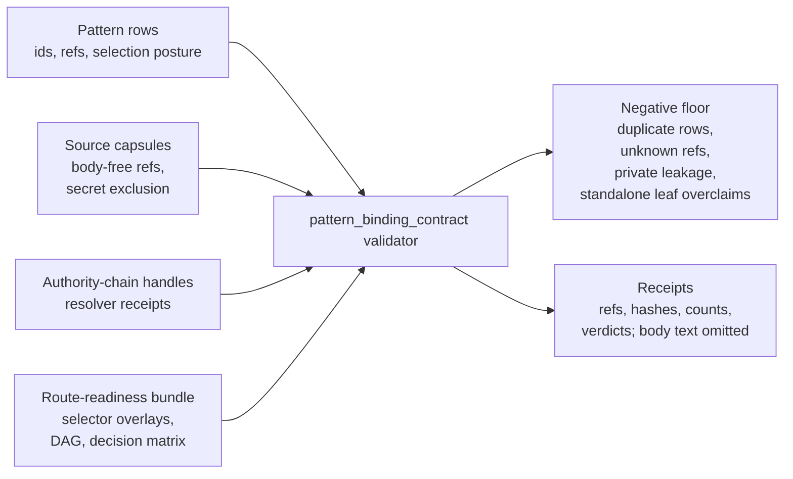

# Pattern Binding Contract

## Teleology

`pattern_binding_contract` is the public root organ that binds pattern rows to
source-available source capsules, public runtime refs, authority-chain handles,
anti-claims, and secret-exclusion receipts. Synthetic rows are allowed only as
regression controls or negative cases; they are not product evidence.

## Public Contract

The validator checks required binding fields, duplicate pattern conflicts,
unsupported authority-chain handles, unresolved reference capsules,
secret/provider/operator body sentinels, and public-leaf overclaim failures. It
emits command-owned receipts under
`receipts/first_wave/pattern_binding_contract/`.

The exported substrate bundle also carries the macro route-readiness selector
overlays as public source-open bodies:
`examples/pattern_binding_contract/exported_route_readiness_bundle/`. The
validator recomputes the selector contract against the imported pattern ledger,
route-readiness audit, row-to-organ router, route cards, fixture specs, decision
matrix, dependency DAG, internal routing graph, and copied macro validation
report. This closes the old gap where a mined pattern row could look selectable
without opening the organ bundle that owns it.

Cold readers should use `microcosm pattern-route-readiness validate-bundle`
against `examples/pattern_binding_contract/exported_route_readiness_bundle/`
when the question is selector admission rather than generic pattern binding.
The older `pattern-binding validate-route-readiness-bundle` action remains a
compatibility route to the same validator.

## Shape



## Source-Open Body Floor

The source-open body floor is the imported public bundle, not the private
pattern ledger. Cold readers can open
`examples/pattern_binding_contract/exported_substrate_bundle/` and
`examples/pattern_binding_contract/exported_route_readiness_bundle/` to inspect
the copied source module manifests, source capsules, reference capsules,
authority-chain handles, route-readiness overlays, selector contract inputs,
and copied macro validation report. The required body floor is named by each
`source_module_manifest.json` plus `source_capsules.json`,
`reference_capsules.json`, and `authority_chain_handles.json`.

Receipts and manifests must stay body-free where the standard requires it:
they carry refs, digests, anchors, counts, verdicts, omission receipts, and
secret-exclusion results. They do not inline private source bodies, raw
operator payloads, provider payloads, recipient data, or hidden pattern-ledger
material.

## Claim Ceiling

This module covers public pattern-binding mechanics: source-capsule validation,
reference-capsule validation, authority-handle validation, route-readiness
selector admission, duplicate and unknown-ref rejection, private-leakage
sentinel checks, and body-free receipt shape. It is evidence for the
`pattern_binding_contract` organ and
`mechanism.pattern_binding_contract.validates_public_pattern_bindings`.

The ceiling stops before private pattern-ledger authority, hosted or public
release readiness, production readiness, standalone public-leaf selector
status, private-data equivalence, provider calls, recipient work, source
mutation, publication authority, or whole-system correctness.

## Evidence Binding

Accepted organ row:
`core/organ_registry.json::implemented_organs[pattern_binding_contract]`.
Evidence class:
`core/organ_evidence_classes.json::organ_evidence_classes[pattern_binding_contract]`
with rank 5 semantic-validator authority. The runtime locus is
`src/microcosm_core/organs/pattern_binding_contract.py`, with focused coverage
in `tests/test_pattern_binding_contract.py`.

Paper capsule authority:
`core/paper_module_capsules.json#paper_module.pattern_binding_contract`.
Mechanism source:
`core/mechanism_sources.json#mechanism.pattern_binding_contract.validates_public_pattern_bindings`.

## JSON Capsule Binding

- Source row: `core/paper_module_capsules.json::paper_modules[9:paper_module.pattern_binding_contract]`
- `source_authority: json_capsule`
- This Markdown is a reader projection. The generated Mermaid projection is
  `available_from_capsule_edges`, and the generated Atlas projection is
  `linked_from_capsule_edges`; both are navigation projections derived from the
  capsule row rather than source authority.
- The proof boundary is the public pattern-binding fixtures, route-readiness
  bundle, copied validation report, decision matrix, routing graph, DAG refs,
  accepted-organ receipts, and validation receipts.
- The authority ceiling excludes private pattern-ledger authority, public
  release operations, hosted readiness, publication authority, recipients,
  provider calls, private-data equivalence, and whole-system correctness.

## Structured Lattice Bindings

- Capsule row:
  `core/paper_module_capsules.json::paper_modules[9:paper_module.pattern_binding_contract]`
- Subjects: `pattern_binding_contract` and
  `mechanism.pattern_binding_contract.validates_public_pattern_bindings`
- Runtime loci: `src/microcosm_core/organs/pattern_binding_contract.py` and
  `src/microcosm_core/macro_tools/pattern_route_readiness.py`
- Depends on: `paper_module.navigation_hologram_route_plane`,
  `paper_module.agent_route_observability_runtime`, and
  `paper_module.cold_reader_route_map`
- Generated relationship edges: the current projection reports 23 relationship
  edges across the capsule's subjects, dependencies, code loci, and governed
  doctrine refs.
- Selective residuals: the current projection reports zero unresolved
  selective relations. Future concept, principle, axiom, or dependency changes
  still belong in the JSON capsule owner lane.

## Reader Evidence Routing

Read this module as a public binding membrane for pattern rows, not as a
private pattern-ledger certificate or a standalone public-leaf selector. Start
with `paper_modules/pattern_binding_contract.json` for the capsule payload, then
open `standards/std_microcosm_pattern_binding_contract.json` to check the
required fields, public/private boundary, source-open body import floor,
route-readiness rules, and receipt expectations.

Use `core/fixture_manifests/pattern_binding_contract.fixture_manifest.json`
before inspecting fixtures or exported bundles. The manifest and the
`source_module_manifest.json` files name the copied non-secret macro body floor;
receipt payloads should carry source refs, digests, anchors, counts, verdicts,
and omission receipts rather than inlining body text.

Treat route-readiness selection as organ-first evidence. A mined pattern row can
be selectable only through the route-readiness bundle, selector contract, and
receipts that keep duplicates, unknown refs, private leakage, missing fixture
contracts, dependency cycles, hard no-standalone rows, and companion-overlay
gaps rejected.

## Reader Proof Boundary

The proof boundary for this module is the JSON capsule row, the pattern-binding
organ, the route-readiness validator, the exported substrate and
route-readiness bundles, source-module manifests, focused tests, and
body-free receipts. The current generated-row projection reports 23
relationship edges, Mermaid `available_from_capsule_edges`, Atlas
`linked_from_capsule_edges`, and zero unresolved selective relations. Those
numbers are generated projection readback; the capsule and runtime receipts
remain the authority.

The positive claim is that public pattern rows can be checked against source
capsules, reference capsules, authority-chain handles, selector overlays, and
negative cases. It is not a certificate for the private pattern ledger, hosted
readiness, public release, provider dispatch, private-data equivalence, or
whole-system correctness.

## Public Site Availability Boundary

The public site may expose the binding validator, route-readiness bundle,
negative floors, source/ref handles, receipt names, selector-admission status,
and the JSON sidecar/card payload generated from
`paper_modules/pattern_binding_contract.json`. The source page and JSON sidecar
are source inputs; `tools/meta/dissemination/build_microcosm_public_site.py`
owns the generated site outputs.

Site HTML, `content-graph.json`, `object-map.json`, search records, and
`llms.txt` are projections over the capsule, sidecar, source refs, and builder
contract. They are not source authority and must not be hand-edited to make
this module appear available. The current handoff receipt is
`receipts/public_site/pattern_binding_contract_site_handoff_20260604T2008Z.json`.

The site must keep mined pattern rows organ-first and must not turn a row or
site card into standalone public-leaf authority. Published copy should show the
anti-claim beside any selector or pattern count. It must not imply release,
hosted readiness, provider permission, private pattern-ledger authority, source
mutation authority, publication approval, or whole-system correctness.

## Public-Safe Body Handling

Receipts and site data may carry refs, digests, anchors, counts, verdicts,
omission receipts, secret-exclusion scan results, and source-manifest ids. They
must not inline private pattern-ledger bodies, raw operator material, provider
payloads, recipient data, credentials, or hidden macro source bodies. Copied
public-safe source modules belong under the exported bundles and are governed
by the source-module manifests, not by this Markdown page.

First commands:

```bash
PYTHONPATH=src python3 -m microcosm_core.organs.pattern_binding_contract validate --input fixtures/first_wave/pattern_binding_contract/input --out receipts/first_wave/pattern_binding_contract
PYTHONPATH=src python3 -m microcosm_core.organs.pattern_binding_contract validate-substrate-bundle --input examples/pattern_binding_contract/exported_substrate_bundle --out receipts/first_wave/pattern_binding_contract
PYTHONPATH=src python3 -m microcosm_core.organs.pattern_binding_contract validate-route-readiness-bundle --input examples/pattern_binding_contract/exported_route_readiness_bundle --out receipts/first_wave/pattern_binding_contract/route_readiness
```

## Validation Receipt Path

From `microcosm-substrate/`, reproduce this page's proof boundary with
temporary receipts:

```bash
PYTHONPATH=src ../repo-python -m microcosm_core.organs.pattern_binding_contract validate --input fixtures/first_wave/pattern_binding_contract/input --out /tmp/microcosm-pattern-binding-contract
PYTHONPATH=src ../repo-python -m microcosm_core.organs.pattern_binding_contract validate-substrate-bundle --input examples/pattern_binding_contract/exported_substrate_bundle --out /tmp/microcosm-pattern-binding-substrate-bundle
PYTHONPATH=src ../repo-python -m microcosm_core.organs.pattern_binding_contract validate-route-readiness-bundle --input examples/pattern_binding_contract/exported_route_readiness_bundle --out /tmp/microcosm-pattern-binding-route-readiness
../repo-pytest microcosm-substrate/tests/test_pattern_binding_contract.py
PYTHONPATH=src ../repo-python scripts/build_doctrine_projection.py --check-paper-module-corpus
```

These checks validate public pattern-binding fixtures, substrate-bundle
receipts, route-readiness selector receipts, and body-free authority handles
only; they do not certify the private pattern ledger, hosted readiness,
release, provider calls, private-data equivalence, or whole-system
correctness.

The current authority is the runtime receipt set under
`receipts/first_wave/pattern_binding_contract/`; do not cite a separate
pattern-specific acceptance receipt unless an acceptance-lane artifact is
actually present. Cold readers should inspect receipt fields rather than
markdown constants: `status`, `secret_exclusion_scan`,
`source_open_body_imports`, `truth_accounting`, `route_readiness_summary`,
`selection_contract`, and `source_manifest`.

## Receipt Expectations

The primary receipt is
`receipts/first_wave/pattern_binding_contract/pattern_binding_validation_result.json`.
Supporting receipts include source capsules, omission receipts, reference
capsule resolver receipts, and authority-chain resolver receipts. Positive
receipts must expose `secret_exclusion_scan`, `body_in_receipt`,
`real_runtime_receipt`, `public_runtime_refs`, and
`synthetic_receipt_standin_allowed: false`. The substrate-bundle receipt must
also expose `real_pattern_route_readiness_consumed`,
`route_readiness_summary`, `selection_contract`, `source_manifest`, and
`route_readiness_error_rules`. The standalone route-readiness receipt is
`receipts/first_wave/pattern_binding_contract/route_readiness/exported_route_readiness_bundle_validation_result.json`.

## Prior Art Grounding

This organ follows the software pattern-language tradition of making reusable
engineering structures explicit, named, and reviewable. The
[Hillside patterns library](https://hillside.net/patterns/) is the direct
prior-art family for treating patterns as shared vocabulary rather than loose
implementation notes.

The binding layer also borrows from provenance and supply-chain attestation
patterns. [W3C PROV](https://www.w3.org/TR/prov-overview/) motivates the
source/ref/evidence relation shape, while [SLSA](https://slsa.dev/spec/) and
[in-toto](https://in-toto.io/) motivate digest-bound artifact claims and
step-level metadata. Microcosm applies those ideas to pattern rows and
route-readiness selectors, not to release certification.

Re-entry condition: if copied macro bodies, route-readiness overlays, or
negative-case rules change, rerun the three first commands above and update this
paper module plus `standards/std_microcosm_pattern_binding_contract.json` from
the new receipt fields. Do not raise the authority ceiling from selector and
binding validation to release, publication, private-data equivalence, or
standalone public-leaf authority.

## Anti-Claim

This module documents public pattern-binding mechanics and regression harnesses.
It does not certify the private pattern ledger, public release operations,
hosted-public readiness, publication, recipient work, provider calls,
private-data equivalence, or whole-system correctness. Route-readiness import
does not make any mined pattern row a standalone public leaf; selection remains
organ-first and fixture-bound.
