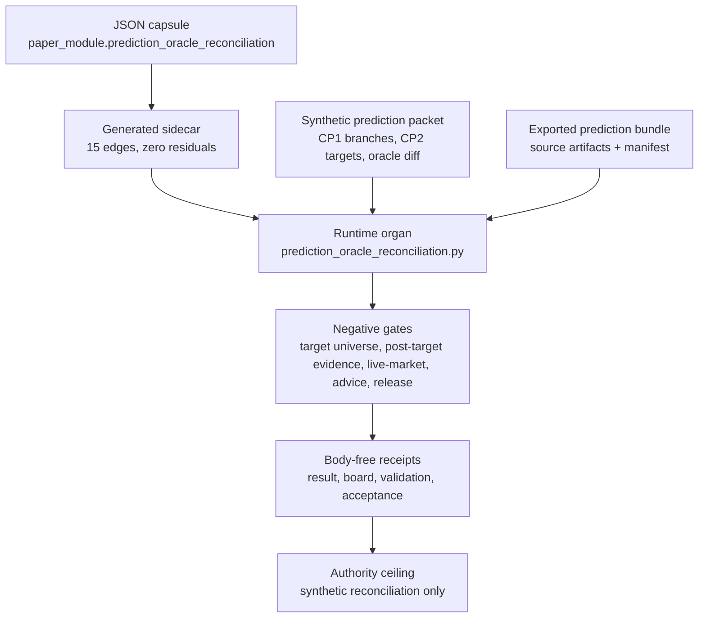

# Prediction Oracle Reconciliation

`prediction_oracle_reconciliation` is a source-available runtime fixture organ for the
prediction-engine slice. It compresses the macro pattern group around CP1
bifurcation resolution, CP2 valid target universes, oracle grounding firewalls,
diff grading, and dossier mutation into a synthetic packet a cold reader can run.

It is deliberately not a market product. The organ has no live data, no provider
calls, no trading authority, no financial or investment advice authority, no
publication authority, and no release authority. Its job is to make the reasoning
shape inspectable without making performance or action claims. The receipt
contract is source-open by default: public fixture packets, exported bundle refs,
source refs, and runtime receipts carry the evidence, while
`secret_exclusion_scan` blocks only live market feeds, provider payload bodies,
account/session material, private dossiers, and credential-equivalent access.

## Public Contract

The input packet names:

- `source_pattern_ids` for the macro pattern family being projected.
- `valid_prediction_targets` and `target_universe` for the CP2 gate.
- `cp1_branches` with selected side, rationale refs, and opposite-side
  invalidation refs.
- `cp2_predictions` with pre-target evidence refs and grounding ids.
- `oracle_diff` rows that grade synthetic realized direction against prediction.
- `dossier_mutations` constrained to fixture deltas.
- `public_runtime_refs` for the public fixture, exported bundle, and paper module
  substrate refs.
- `authority_ceiling` values that explicitly keep trading, advice, provider,
  live-market, publication, release, and secret-export authority false.

## JSON Capsule Binding

- Source row: `core/paper_module_capsules.json::paper_modules[54:paper_module.prediction_oracle_reconciliation]`
- `source_authority: json_capsule`
- This Markdown is a reader projection. The generated Mermaid projection is
  `available_from_capsule_edges`, and the generated Atlas projection is
  `linked_from_capsule_edges`; both are navigation projections derived from the
  capsule row rather than source authority.
- The proof boundary is the synthetic prediction packet, declared target
  universe, CP1 branch resolution, CP2 prediction evidence, oracle diff rows,
  fixture-bounded dossier mutations, public runtime refs, negative cases, and
  validation receipts.
- The authority ceiling excludes trading, financial or investment advice, live
  market providers, provider calls, private dossier import, forecast-performance
  claims, publication authority, and release authority.

## Governing Lattice Relation

- Capsule row: `core/paper_module_capsules.json::paper_modules[54:paper_module.prediction_oracle_reconciliation]`.

- Subject edges: explains organ `prediction_oracle_reconciliation` and
  mechanism
  `mechanism.prediction_oracle_reconciliation.validates_public_prediction_oracle_reconciliation`.
- Doctrine edges: governed by principles `P-2`, `P-6`, `P-8`, and `P-9`;
  abides by axioms `AX-5`, `AX-7`, `AX-8`, and `AX-10`.
- Dependency edges: depends on `paper_module.finance_forecast_evaluation_spine`,
  `paper_module.world_model_projection_drift_control_room`, and
  `paper_module.research_replication_rubric_artifact_replay`.
- Runtime code locus:
  `src/microcosm_core/organs/prediction_oracle_reconciliation.py`, including
  `run`, `run_prediction_bundle`, `validate_source_module_imports`,
  `validate_reconciliation_packet`, `_source_open_body_import_summary`,
  `_build_result`, `write_receipts`, `result_card`,
  `EXPECTED_NEGATIVE_CASES`, and `AUTHORITY_CEILING`.
- Generated row proof: 15 resolved relationship edges, no unpopulated
  selective relations, Mermaid `available_from_capsule_edges`, and Atlas
  `linked_from_capsule_edges`.

The governing lattice turns the organ into a bounded reconciliation checker
rather than a forecast authority. `P-2` lowers every positive claim to the
checker strength: CP1/CP2 accounting, oracle-diff grading, numeric-row gates,
source-module digest checks, negative cases, and body-free receipts. `P-6`
fails closed when a branch is unresolved, a target escapes the declared
universe, a source digest mismatches, or an authority flag tries to rise above
the accepted organ ceiling. `P-8` makes those refusals typed outcomes instead
of prose warnings. `P-9` carries source refs, public runtime refs, copied-body
material status, and receipt refs across the fixture and exported bundle.

The axiom layer supplies the same boundary. `AX-5` prevents the fixture from
upgrading synthetic reconciliation evidence into trading, advice, live-market,
provider, publication, release, or performance-track-record authority. `AX-7`
permits partiality: degraded feed health, missing realized numeric truth, and
asset-class split pressure are surfaced as scoped findings rather than hidden
successes. `AX-8` keeps copied non-secret macro bodies public-safe while
excluding live market data, provider payload bodies, private dossiers, and
credential-equivalent material. `AX-10` requires the target-universe, CP1/CP2,
oracle-diff, and source-module evidence to be tied to the current fixture or
bundle receipts before the Markdown projection is treated as current.

The sidecar's 15 edges prove route parity only. Runtime authority remains with
`prediction_oracle_reconciliation.py`, its fixture and bundle consumers, and the
focused regression test; source authority for this reader projection remains
the JSON capsule.

## Shape



Evidence/accounting:

- Capsule authority:
  `core/paper_module_capsules.json::paper_modules[54:paper_module.prediction_oracle_reconciliation]`
  sets `source_authority: json_capsule`, binds the organ, binds
  `mechanism.prediction_oracle_reconciliation.validates_public_prediction_oracle_reconciliation`,
  and resolves
  `src/microcosm_core/organs/prediction_oracle_reconciliation.py`.
- Generated instance:
  `paper_modules/prediction_oracle_reconciliation.json` reports
  `paper_module_payload.source_authority: json_capsule`, Mermaid
  `available_from_capsule_edges`, Atlas `linked_from_capsule_edges`, 15
  relationship edges, and no unpopulated selective relations.
- Runtime and fixture floor:
  `src/microcosm_core/organs/prediction_oracle_reconciliation.py` exposes
  `run`, `run_prediction_bundle`, `validate_source_module_imports`,
  `validate_reconciliation_packet`, `_source_open_body_import_summary`,
  `write_receipts`, `EXPECTED_NEGATIVE_CASES`, and `AUTHORITY_CEILING`.
  `fixtures/first_wave/prediction_oracle_reconciliation/input/reconciliation_packet.json`
  carries the synthetic CP1/CP2, oracle-diff, target-universe, and
  dossier-mutation evidence shape.
- Exported bundle and receipts:
  `examples/prediction_oracle_reconciliation/exported_prediction_oracle_bundle/source_module_manifest.json`
  and the exported source artifacts provide source-open replay evidence.
  `receipts/first_wave/prediction_oracle_reconciliation/prediction_oracle_reconciliation_result.json`,
  `prediction_oracle_validation_receipt.json`, and
  `receipts/acceptance/first_wave/prediction_oracle_reconciliation_fixture_acceptance.json`
  keep the receipt body-free and fixture-bounded.
- Test and claim boundary:
  `tests/test_prediction_oracle_reconciliation.py` checks invalid target
  universes, unresolved CP1 branches, post-target evidence, unsafe dossier
  mutation, live-market/trading/advice overclaims, exported-bundle validation,
  and source-module digest gates. The sidecar authority ceiling excludes
  forecasting correctness, financial advice, trading authority, live market
  data, provider calls, prediction publication, performance track record,
  private data import, release approval, publication approval, and
  whole-system correctness.

## Reader Evidence Routing

Open this module as a reader map, not as prediction evidence. Use the runtime
fixture input for packet shape, the exported bundle for source-open replay, the
generated JSON sidecar for relationship edges, and the test file for the
negative cases that enforce the authority ceiling.

Route evidence in this order:

1. Read the structured lattice bindings section to confirm the capsule row path
   and subject edges.
2. Inspect the fixture input for declared target universes, CP1 branches,
   CP2 prediction evidence, oracle-diff rows, and fixture-bounded dossier
   mutations.
3. Run the fixture and exported-bundle commands to produce body-free receipts.
4. Check `tests/test_prediction_oracle_reconciliation.py` for the negative
   cases that reject target-universe escapes, unresolved CP1 branches,
   post-target evidence, live-market overclaims, and authority overclaims.
5. Use `paper_modules/prediction_oracle_reconciliation.json` as the generated
   relationship graph for this module.

## Claim Ceiling

This module covers only fixture-bounded prediction-oracle
reconciliation: synthetic target-universe accounting, CP1/CP2 separation,
oracle-diff grading, dossier mutation constraints, copied source-module import
evidence, negative cases, and public receipts. They do not prove forecasting
accuracy, financial advice, trading authority, live-market access, provider
behavior, prediction publication, performance track record, private-data import,
release approval, publication approval, or whole-system correctness.

## Limitations

The target universe, CP1 branches, CP2 evidence, realized values, oracle diff,
and dossier mutations are fixture artifacts. They exercise the shape of a
reconciliation pipeline, but they are not live market data, a validated
forecasting track record, an investment strategy, or a prediction publication
surface. A direction hit or numeric miss inside the receipt is evidence about
the synthetic packet only.

The exported bundle is source-open in the narrow body-floor sense. It digest
checks copied non-secret macro contracts, node manifests, tool code, pattern
rows, and route-decision artifacts while keeping body text out of receipts. That
does not certify private macro-root equivalence, provider behavior, account or
session state, hidden market feeds, private dossiers, or release readiness.

The negative cases are scoped regression guards. They reject invalid targets,
unresolved bifurcations, post-target evidence, unconfirmed equity-lane claims,
unsafe dossier mutation, trading/advice overclaims, degraded feed misuse,
missing realized numeric truth, and asset-class mixing. Those refusals do not
prove full financial safety, whole-system correctness, runtime correctness
outside the named organ, or complete secret absence beyond the declared scanner
envelope.

## Negative Cases

The fixture rejects:

- a CP2 prediction outside the target universe;
- an unresolved CP1 bifurcation;
- post-target evidence used as prediction evidence;
- unconfirmed equity or market-lane claims;
- unsafe high-severity dossier mutation;
- trading, advice, live-provider, publication, release, or secret-export
  authority overclaims.

## Prior Art Grounding

This organ is grounded in probabilistic forecast evaluation and prediction
market infrastructure. The
[Brier score](https://journals.ametsoc.org/doi/10.1175/1520-0493%281950%29078%3C0001%3AVOFEIT%3E2.0.CO%3B2)
is an early probability-forecast verification anchor, proper-scoring-rule work
such as [Gneiting and Raftery](https://sites.stat.washington.edu/people/raftery/Research/PDF/Gneiting2007jasa.pdf)
motivates incentive-compatible forecast scoring, and Hanson's
[logarithmic market scoring rule](https://hanson.gmu.edu/mktscore.pdf) grounds
the prediction-market idea that forecasts can be updated and evaluated through
explicit scoring mechanisms. Forecasting tournament work around tracking and
calibration also motivates separating prediction evidence from post-outcome
explanation.

Microcosm borrows the reconciliation pattern: declare the target universe before
the outcome, keep pre-target evidence separate from post-target evidence, grade
against a synthetic oracle diff, and constrain dossier mutation to declared
fixture deltas. It does not trade, advise, publish predictions, or claim forecast
performance.

## Commands

```bash
PYTHONPATH=src python3 -m microcosm_core.organs.prediction_oracle_reconciliation run \
  --input fixtures/first_wave/prediction_oracle_reconciliation/input \
  --out receipts/first_wave/prediction_oracle_reconciliation

PYTHONPATH=src python3 -m microcosm_core.organs.prediction_oracle_reconciliation run-prediction-bundle \
  --input examples/prediction_oracle_reconciliation/exported_prediction_oracle_bundle \
  --out receipts/runtime_shell/demo_project/organs/prediction_oracle_reconciliation
```

## Receipt Expectations

Receipts should stay body-free and source-open. A useful receipt names:

- fixture refs and exported-bundle refs;
- source module manifests and digest checks;
- numeric reconciliation summaries;
- CP1 branch accounting and CP2 target-universe accounting;
- oracle-diff grading rows;
- fixture-bounded dossier mutation rows;
- negative-case coverage; and
- authority-ceiling booleans.

The receipt proves only pre-target evidence separation, synthetic
target-universe reconciliation, oracle-diff grading, fixture-bounded dossier
mutation, public source-module digest checks, and secret-exclusion scanning.
It does not need live market data, provider payloads, private dossier bodies,
or account/session material; those materials must remain excluded by the
negative cases and forbidden-class scan.

## Validation Receipt Path

Run from `microcosm-substrate`:

```bash
PYTHONPATH=src ../repo-python -m microcosm_core.organs.prediction_oracle_reconciliation run \
  --input fixtures/first_wave/prediction_oracle_reconciliation/input \
  --out /tmp/microcosm-prediction-oracle-reconciliation/fixture \
  --card
PYTHONPATH=src ../repo-python -m microcosm_core.organs.prediction_oracle_reconciliation run-prediction-bundle \
  --input examples/prediction_oracle_reconciliation/exported_prediction_oracle_bundle \
  --out /tmp/microcosm-prediction-oracle-reconciliation/bundle \
  --card
PYTHONPATH=src ../repo-python -m pytest -p no:cacheprovider tests/test_prediction_oracle_reconciliation.py -q
PYTHONPATH=src ../repo-python scripts/build_doctrine_projection.py --check-paper-module-corpus
```

A passing run proves only synthetic target-universe reconciliation, CP1/CP2 accounting,
oracle-diff grading, and fixture-bounded dossier mutation; it does not prove
forecasting performance, financial advice, trading authority, live market access,
publication, or release.

## Re-Entry Conditions

Reopen this module when the capsule row changes, the runtime code locus changes,
the source-module manifest changes, or the exported prediction bundle changes.
Keep re-entry scoped to the affected plane:

- If the capsule changes, refresh generated sidecars with the owning builder.
- If runtime or fixture behavior changes, rerun
  `tests/test_prediction_oracle_reconciliation.py` and update receipt wording.
- If only this Markdown projection changes, keep the diff Markdown-only and
  rerun the paper-module corpus and coverage contract.
- If live market, provider, publication, release, or advice language appears,
  route it through the authority ceiling and negative-case tests before any
  reader copy changes.

## Authority Ceiling

Synthetic invented prediction packet and source-module import evidence only; no forecasting correctness or accuracy, no trading, financial, or investment advice, no live market data, no provider calls, no prediction publication, no performance track record, no private data import, no release approval, no publication approval, and no whole-system correctness.

## Anti-Claim

This module demonstrates synthetic prediction-reconciliation mechanics only. It
does not trade, give financial or investment advice, call live market providers,
publish predictions, claim forecasting performance, import private data, or
authorize release.
