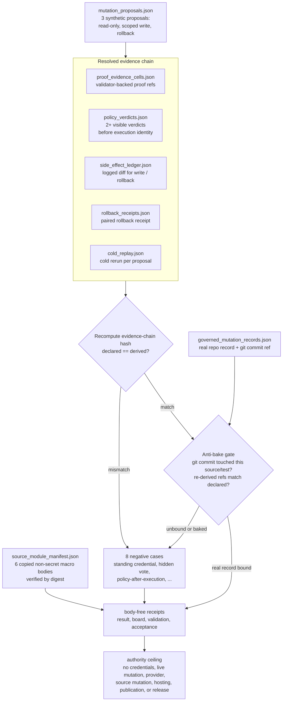

# Proof-Derived Governed Mutation Authorization

`proof_derived_governed_mutation_authorization` is the public mutation-authority
replay organ for showing that a mutation proposal cannot grant itself authority.
It validates a synthetic governed-mutation bundle where read-only inspection,
scoped config write, and rollback proposals are admitted only when proof cells,
visible pre-execution policy verdicts, side-effect logs, rollback receipts,
cold replay, negative cases, private-state scan, and authority ceilings line up.

This module is source-backed public doctrine, not the source of authority. The
source rows are the JSON capsule, mechanism registry row, organ atlas binding,
standard contract, fixture, exported bundle, organ source module, and receipts
named below. Markdown remains an authored projection over those rows.

## Purpose

The organ answers one question: can a mutation proposal acquire the authority to
change something just by asserting that it should? In an agent system the danger
is an action that grants itself permission, for example by claiming a standing
credential, by recording a policy vote nobody can see, or by reporting success
after the fact. This fixture is the boundary that refuses each of those moves.

Authorisation here is derived, not asserted. A proposal is admitted only when an
independent chain resolves: redacted proof cells that name validator receipts,
at least two visible policy verdicts evaluated before any execution identity is
minted, a logged side-effect diff for write and rollback proposals, a paired
rollback receipt, and a cold-replay receipt. The validator recomputes an
evidence-chain hash from those resolved rows and rejects the proposal if the
declared hash does not match. Impressive language, an admin-looking identity, or
a final answer that says it worked all fail on their own.

The less obvious part is the anti-bake gate. Passing the synthetic chain is not
enough: every authorised proposal must also bind to a real repository record, a
concrete git commit that the validator resolves with a `git` subprocess and
checks touched this organ's own source or its focused test. The validator then
re-derives the proof, policy, and rollback refs from the evidence indices and
compares them to what the record declares. A fixture cannot pre-bake its answer,
because the answer is reconstructed from real commit scope and the resolved
rows rather than read from the file. The fixture admits exactly three synthetic
proposals (read-only inspection, scoped config write, rollback) and rejects
eight named overclaims; none of this grants any live mutation authority.

## Shape

- Subject: `proof_derived_governed_mutation_authorization`, with mechanism
  `mechanism.proof_derived_governed_mutation_authorization.validates_synthetic_governed_mutation_authorization`.
- Runtime locus:
  `src/microcosm_core/organs/proof_derived_governed_mutation_authorization.py`,
  especially `run`, `run_authorization_bundle`,
  `validate_mutation_proposals`, `validate_proof_evidence_cells`,
  `validate_policy_verdicts`, `validate_side_effect_ledger`,
  `validate_rollback_receipts`, `validate_cold_replay`,
  `_source_module_manifest_result`, `_source_open_body_import_summary`,
  `EXPECTED_NEGATIVE_CASES`, and `AUTHORITY_CEILING`.
- The positive fixture admits exactly three synthetic proposals: read-only
  inspection, scoped config write, and rollback.
- Every admitted proposal must bind intent capsule refs, proof-cell validator
  receipts, visible pre-execution policy verdicts, ephemeral execution identity
  refs, an evidence-chain hash, cold replay refs, and an authority ceiling.
- Write and rollback proposals also need logged side-effect diff refs and a
  paired rollback receipt before authorization.
- The exported bundle imports six copied non-secret macro bodies through
  `source_module_manifest.json` and validates them by exact-copy digest
  evidence without exporting source body text in receipts.



## How it works

Take the scoped config write proposal. To be admitted it must carry the fourteen
required fields, including `proof_cell_refs`, `policy_verdict_refs`,
`policy_evaluated_before_execution`, `side_effect_class`, `evidence_chain_hash`,
and `cold_replay_ref`. The validator then checks each one against the other
input files rather than trusting the proposal's own summary.

For the proof refs it confirms each cell names the same proposal, carries
evidence refs and validator-receipt refs, is body-redacted, and does not export
a proof body. For the policy refs it counts how many verdicts are visible to the
receipt, are not hidden votes, read allow or warn, and resolve back to a proof
cell for that proposal. Fewer than two visible resolving verdicts blocks the
proposal under `GOV_MUT_CONSENSUS_WITHOUT_EVIDENCE`. Because a scoped write has a
reversible side effect, it also needs a logged diff ref in the side-effect
ledger and a passing rollback receipt for the same proposal. A write or rollback
proposal with no rollback ref is rejected as an irreversible mutation.

The validator then recomputes the evidence-chain hash. It hashes the resolved
proof digests, policy digests, side-effect ref, rollback ref, and cold-replay
ref together and compares the result to the proposal's declared
`evidence_chain_hash`. A mismatch fails the proposal, so the hash cannot be a
hand-written constant. Only after the synthetic chain resolves does the
real-record gate run. The governed-mutation record must declare a public-safe
repo record class, a forty-character-or-shorter hex commit ref, and source refs
covering git, mission-transaction, work-landing, and ledger material. The
validator shells out to `git` to confirm the commit exists and that its changed
files include this organ's source module or its focused test, and it re-derives
the proof, policy, and rollback refs from the indices so the record's claims
must match independently computed values. An authorised proposal whose proposal
id is not in the accepted real-record set is downgraded to blocked. The result
is that a green receipt requires three synthetic proposals, three real records
bound to real commits, and a matching anti-bake status, none of which a static
fixture can fake.

## JSON Capsule Binding

- Source row: `core/paper_module_capsules.json::paper_modules[15:paper_module.proof_derived_governed_mutation_authorization]`
- `source_authority: json_capsule`
- Generated instance:
  `paper_modules/proof_derived_governed_mutation_authorization.json::paper_module_payload`.
- Capsule subjects: organ `proof_derived_governed_mutation_authorization` and
  mechanism
  `mechanism.proof_derived_governed_mutation_authorization.validates_synthetic_governed_mutation_authorization`.
- This Markdown is a reader projection. The generated Mermaid projection is
  `available_from_capsule_edges`, and the generated Atlas projection is
  `linked_from_capsule_edges`; both are navigation projections derived from the
  capsule row rather than source authority.
- The proof boundary is the synthetic governed-mutation bundle, proof cells,
  visible policy verdicts, side-effect logs, rollback receipts, cold replay
  refs, copied public-safe macro bodies, negative fixtures, and validation receipts.
- The standard boundary is
  `standards/std_microcosm_proof_derived_governed_mutation_authorization.json`.
- The fixture manifest is
  `core/fixture_manifests/proof_derived_governed_mutation_authorization.fixture_manifest.json`.
- The authority ceiling excludes standing credentials, live cloud or account
  mutation, source mutation, irreversible mutation approval, provider calls,
  proof-body or policy-vote export, benchmark-safety claims, hosting,
  publication, and release authority.

## Reader Proof Boundary

The proof boundary is the JSON capsule plus the generated JSON instance, not
this Markdown narration. Current generated-row proof is `edge_count: 7`,
`unresolved_selective_relation_count: 1`, Mermaid
`available_from_capsule_edges`, Atlas `linked_from_capsule_edges`, and
`source_authority: json_capsule`.

A cold reader may use those values to verify that the paper module is bound to
real subjects, code loci, and doctrine edges, with one honest selective
residual remaining in the generated row. They may not infer standing
credentials, live cloud/account mutation authority, source mutation permission,
provider authority, proof-body export, benchmark security, release approval,
publication approval, hosting approval, or whole-system correctness.

## Claim Ceiling

This paper module can claim backed reader wiring for the synthetic
governed-mutation replay: organ and mechanism subjects resolve, the runtime
source locus is named, and diagram and atlas views are generated for this module.
It cannot claim live mutation authority, standing credentials, cloud or account
access, irreversible approval, source mutation permission, provider authority,
proof-body export, benchmark safety, release approval, hosted deployment,
publication approval, or whole-system correctness.

Fixture receipts, exported-bundle receipts, focused tests, and public-safe
source-copy digests can support only the bounded replay claim: synthetic
proposal admission, proof-cell refs, visible policy verdicts, side-effect logs,
rollback receipts, cold replay refs, negative cases, and body-hygiene behavior.
The diagram and atlas views are navigation aids derived from the module bindings;
they do not expand the proof boundary.

## Public Site Availability Boundary

This Markdown page does not prove that the public Microcosm site, content
manifest, docs bundle, Atlas page, or hosted artifact has been regenerated. The
site and Atlas surfaces are projection-owner outputs. If a public page,
generated card, or site manifest disagrees with this source page, the correction
route is the owning site/projection builder, not a hand edit to generated
assets.

## Public-Safe Body Handling

Reader-visible evidence may carry proposal ids, proof-cell refs, policy-verdict
refs, side-effect diff refs, rollback receipt refs, source-module refs, target
refs, sha256 digests, body-material classes, negative-case labels, and receipt
paths. It must not carry standing credentials, account/session state, live cloud
access, proof bodies, policy vote bodies, provider payload bodies, browser/HUD
state, recipient-send state, raw operator voice, private macro-root bodies, or
copied source bodies inside receipts.

## Public Contract

- The source pattern is `proof_derived_governed_mutation_authorization_compound`.
- The fixture lives at
  `fixtures/first_wave/proof_derived_governed_mutation_authorization/input/`.
- The runtime example lives at
  `examples/proof_derived_governed_mutation_authorization/exported_governed_mutation_authorization_bundle/`.
- The validator is
  `microcosm_core.organs.proof_derived_governed_mutation_authorization`.
- The governing standard is
  `standards/std_microcosm_proof_derived_governed_mutation_authorization.json`.
- The organ model row is
  `core/organ_atlas.json#proof_derived_governed_mutation_authorization`.
- The acceptance row is
  `core/organ_registry.json#proof_derived_governed_mutation_authorization`.

The fixture has three positive proposals: read-only inspection, scoped config
write, and rollback. Every admitted proposal must cite an intent capsule,
authority ceiling, proof cell, visible policy verdicts, ephemeral execution
identity, evidence-chain hash, and cold replay ref. Write and rollback proposals
also require logged side-effect diff refs and a verified rollback receipt paired
before the mutation is admitted.

## Source-Backed Mechanism

The mechanism row
`mechanism.proof_derived_governed_mutation_authorization.validates_synthetic_governed_mutation_authorization`
points at these runnable source loci:

- `run` and `run_authorization_bundle` for fixture and exported-bundle entry.
- `validate_mutation_proposals`, `validate_proof_evidence_cells`,
  `validate_policy_verdicts`, `validate_side_effect_ledger`,
  `validate_rollback_receipts`, and `validate_cold_replay` for the authorization
  predicate.
- `_source_module_manifest_result` and `_source_open_body_import_summary` for
  digest-verified copied macro-body evidence without body text in receipts.
- `EXPECTED_NEGATIVE_CASES` and `AUTHORITY_CEILING` for falsification and
  anti-claim enforcement.

The exported governed-mutation bundle imports six public-safe macro bodies
through
`examples/proof_derived_governed_mutation_authorization/exported_governed_mutation_authorization_bundle/source_module_manifest.json`.
Those bodies are copied into `source_modules/` with digest provenance:

- `state/microcosm_portfolio/extracted_patterns_ledger.jsonl`
- `state/microcosm_portfolio/reconstruction/high_novelty_substrate_gap_scout_v1.json`
- `tools/meta/control/mission_transaction_preflight.py`
- `tools/meta/control/scoped_commit.py`
- `tools/meta/factory/work_ledger.py`
- `system/lib/work_landing_status.py`

Receipts may report module ids, refs, counts, classes, hashes, and verdicts.
They may not duplicate source body text, proof bodies, policy vote bodies,
provider payloads, credentials, account refs, or live access material.

## Structured Lattice Bindings

- JSON capsule:
  `core/paper_module_capsules.json#paper_module.proof_derived_governed_mutation_authorization`
- Mechanism source:
  `core/mechanism_sources.json#mechanism.proof_derived_governed_mutation_authorization.validates_synthetic_governed_mutation_authorization`
- Atlas binding:
  `core/organ_atlas.json#proof_derived_governed_mutation_authorization`
- Code locus:
  `src/microcosm_core/organs/proof_derived_governed_mutation_authorization.py`
- Standard contract:
  `standards/std_microcosm_proof_derived_governed_mutation_authorization.json::paper_module_contract`

These bindings let the generated doctrine-lattice coverage remove the organ
from the paper-module, mechanism, and code-locus deficit buckets. They do not
make this Markdown file source authority, and they do not upgrade synthetic
authorization receipts into live mutation authority.

## Reader Evidence Routing

- Start with
  `paper_modules/proof_derived_governed_mutation_authorization.json` for source
  authority, then use this Markdown as the reader projection.
- Open
  `standards/std_microcosm_proof_derived_governed_mutation_authorization.json`
  for required witnesses, negative-floor classes, denied authority, receipt
  expectations, validator contract, and source refs.
- Open
  `core/fixture_manifests/proof_derived_governed_mutation_authorization.fixture_manifest.json`
  for positive fixture inputs, eight negative fixtures, body-import summary,
  durable receipt refs, and source-open omission rules.
- Open
  `examples/proof_derived_governed_mutation_authorization/exported_governed_mutation_authorization_bundle/source_module_manifest.json`
  before inspecting copied source modules; receipts carry refs, hashes, counts,
  and verdicts, not copied macro body text.
- Open
  `tests/test_proof_derived_governed_mutation_authorization.py` for the focused
  assertions on proposal counts, negative cases, source-module digest mismatch,
  public-relative redaction, and card receipt reuse.
- Run the fixture or exported-bundle route from `microcosm-substrate/`. The CLI
  supports `--card`, but it does not expose a `--json` flag.
- Use `scripts/build_doctrine_projection.py --check-paper-module-corpus` to
  verify this Markdown projection still satisfies the shared paper-module
  coverage contract.

## First Commands

From `microcosm-substrate/`, a cold agent can refresh the fixture receipts with:

```bash
PYTHONPATH=src python3 -m microcosm_core.organs.proof_derived_governed_mutation_authorization run --input fixtures/first_wave/proof_derived_governed_mutation_authorization/input --out receipts/first_wave/proof_derived_governed_mutation_authorization --acceptance-out receipts/acceptance/first_wave/proof_derived_governed_mutation_authorization_fixture_acceptance.json --card
```

The exported bundle validator proves the copied macro-body floor without writing
durable receipts:

```bash
PYTHONPATH=src python3 -m microcosm_core.organs.proof_derived_governed_mutation_authorization run-authorization-bundle --input examples/proof_derived_governed_mutation_authorization/exported_governed_mutation_authorization_bundle --out /tmp/microcosm-proof-derived-governed-mutation --card
```

## Validation Receipt Path

Validate the reader projection from the repo root without mutating durable
receipt or generated projection surfaces:

```bash
./repo-pytest microcosm-substrate/tests/test_proof_derived_governed_mutation_authorization.py -q --basetemp=/tmp/microcosm_proof_derived_governed_mutation_authorization_pytest
./repo-python microcosm-substrate/scripts/build_doctrine_projection.py --check-paper-module-corpus
```

## Receipt Expectations

- Fixture execution writes `proof_derived_governed_mutation_authorization_result.json`,
  `proof_derived_governed_mutation_authorization_board.json`, and
  `proof_derived_governed_mutation_authorization_validation_receipt.json`.
- Acceptance output writes
  `receipts/acceptance/first_wave/proof_derived_governed_mutation_authorization_fixture_acceptance.json`.
- Exported-bundle execution writes
  `exported_governed_mutation_authorization_bundle_validation_result.json` under
  the selected output directory.
- Passing evidence must preserve three proposals, three authorized synthetic
  mutations, three proof cells, six visible policy verdicts, two logged side
  effects, two rollback passes, three cold replay passes, zero missing negative
  cases, private-state scan pass status, source-module manifest pass status, and
  six copied non-secret macro body imports.
- Source-open receipt fields must preserve `body_in_receipt: false`,
  `body_text_in_receipt: false`, and `body_text_exported_in_receipts: false`.
- Receipt success does not authorize standing credentials, live cloud/account
  mutation, source mutation, provider calls, hidden votes,
  policy-after-execution authority, benchmark-security claims, publication,
  hosting, release, or whole-system correctness.

## Evidence Receipts

- `receipts/first_wave/proof_derived_governed_mutation_authorization/proof_derived_governed_mutation_authorization_result.json`
- `receipts/first_wave/proof_derived_governed_mutation_authorization/proof_derived_governed_mutation_authorization_board.json`
- `receipts/first_wave/proof_derived_governed_mutation_authorization/proof_derived_governed_mutation_authorization_validation_receipt.json`
- `receipts/first_wave/proof_derived_governed_mutation_authorization/exported_governed_mutation_authorization_bundle_validation_result.json`
- `receipts/runtime_shell/demo_project/organs/proof_derived_governed_mutation_authorization/exported_governed_mutation_authorization_bundle_validation_result.json`
- `receipts/acceptance/first_wave/proof_derived_governed_mutation_authorization_fixture_acceptance.json`

Current receipt evidence records three proposals, three authorized synthetic
mutations, three proof cells, six visible policy verdicts, two logged side
effects, two rollback passes, three cold replay passes, no missing negative
cases, `private_state_scan.status=pass`, and `body_in_receipt=false` for copied
macro source modules.

## Negative Cases

The fixture rejects the eight named negative cases in
`core/fixture_manifests/proof_derived_governed_mutation_authorization.fixture_manifest.json`:
standing credential authority, policy-after-execution, hidden policy vote, live
cloud credential, irreversible mutation, unlogged side effect, consensus without
evidence, and final-answer-only success.

These negative fixtures are the security argument. A proposal with impressive
language, an admin-looking identity, hidden votes, post-hoc approvals, or a final
answer that says it succeeded still fails unless the public evidence tables
resolve to the authorization predicate.

## Prior Art Grounding

The governed-mutation shape is grounded in admission-control and policy-as-code
practice: a proposed state change is evaluated before it mutates the system,
and the decision is separate from the actor's own assertion. The closest public
anchors are [Open Policy Agent](https://www.openpolicyagent.org/docs), which
separates policy decision-making from enforcement over structured input, and
Kubernetes
[admission controllers](https://kubernetes.io/docs/reference/access-authn-authz/admission-controllers/),
which validate or mutate API requests before persistence.

The rollback and side-effect portions are also adjacent to controlled rollout
practice, including feature-flag and canary-release patterns described by
[Martin Fowler](https://martinfowler.com/articles/feature-toggles.html).
Microcosm keeps the pattern synthetic and replay-only: the organ validates
visible policy verdicts, side-effect logs, rollback receipts, and cold replay
without granting live mutation authority.

## Public Scope

This organ is a synthetic, public, source-open replay. It validates fixture and
exported-bundle receipts plus copied non-secret macro bodies with digest
provenance. The replay stays inside local files and does not use standing
credentials, access live cloud or account systems, call providers, mutate
source, expose private proofs, expose policy-vote bodies, or claim benchmark
safety.

## Re-Entry Conditions

Re-enter this module when any of these drift:

- `standards/std_microcosm_proof_derived_governed_mutation_authorization.json::source_open_body_imports`
- `examples/proof_derived_governed_mutation_authorization/exported_governed_mutation_authorization_bundle/source_module_manifest.json`
- `src/microcosm_core/organs/proof_derived_governed_mutation_authorization.py::EXPECTED_NEGATIVE_CASES`
- `src/microcosm_core/organs/proof_derived_governed_mutation_authorization.py::AUTHORITY_CEILING`
- any of the evidence receipt refs above

If source-module digests drift, refresh the exported bundle or downgrade the
paper claim until the manifest and receipt evidence agree. If any row claims
standing credential authority, live cloud/account mutation, source mutation,
provider authority, benchmark security, publication, hosting, or release
authority, keep it out of the public organ claim and route it as a blocked or
private-lane residual instead.
