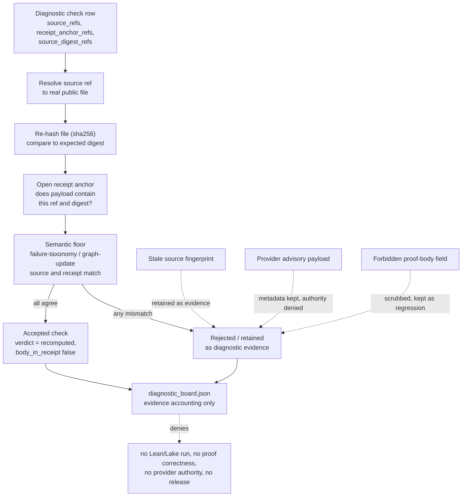

# Proof Diagnostic Evidence Spine

`proof_diagnostic_evidence_spine` sits one step before formal proof authority. It
holds diagnostic evidence from the formal-math evaluation and premise-retrieval
pipeline as receipt-backed cells, and refuses to let any of them be read as a
proof.

## Purpose

The organ answers a single question: does a diagnostic check that claims to be
backed by real Ring2 runtime evidence actually recompute against that evidence,
or is it asserting more than its refs support? Without this membrane, a check row
could name a failure-taxonomy report or a graph-update candidate set, declare
itself passing, and be trusted on its own word. The spine refuses that.

What is unusual is that the validator does not trust the fixture's own pass
label. It ignores the legacy `expected_result` field as a non-authoritative
fixture label and rederives the verdict itself. For each check it resolves the
named `source_ref` to a real public-safe file, re-hashes that file with sha256,
and confirms the hash matches the expected digest. It then opens the named
receipt anchor and checks that the receipt payload actually contains that source
ref and digest. A check is accepted only when the source, the digest, and the
receipt all agree. The pass is a recomputation, not a claim copied from the
fixture.

The second idea is that negative evidence is kept rather than hidden. A stale
source fingerprint is recorded as `source_fingerprint_status: stale` and retained
as diagnostic evidence; a provider advisory row is preserved as metadata while
being rejected as authority; a forbidden proof-body field turns a row into a
regression fixture rather than silently dropping it. The board shows what did not
hold, which is the point of an evidence membrane.

## Teleology

`proof_diagnostic_evidence_spine` is the body-safe evidence membrane before
formal proof work. It records proof/evidence diagnostics while rejecting proof
bodies, provider output bodies, source-authority upgrades, stale coupling, and
runtime-correctness overclaims.

## Public Contract

The validator consumes failure-taxonomy records, graph-update traces, verifier-trace
repair artifacts, and formal evidence-cell anchor receipt refs from the formal-math
evaluation and premise-retrieval pipeline, then emits diagnostic receipts over those
refs. Provider-advisory rows are not proof authority. Passing diagnostic checks do
not become formal proof authority or theorem correctness.

## How a check is accepted

A check row carries three lists: `source_refs`, `receipt_anchor_refs`, and
`source_digest_refs`. The validator does not take the row's word for whether it
passes. It recomputes the verdict from the substrate.

For each `source_ref` it resolves a real public-safe file, reads it, and hashes
the bytes with sha256. That hash must equal the expected digest the organ holds
for the ref. It then opens each receipt anchor and checks that the receipt
payload actually contains the source ref and its digest, so a check is only
"receipt-backed" if the receipt it cites genuinely references it. On top of that
the organ applies a semantic floor: a check whose id mentions a failure taxonomy
must point at a source file that carries a failure-taxonomy report with
representative failures and at a receipt that carries a failure-mode ledger; a
graph-update check needs graph-update candidates with ids and a matching
receipt anchor. The check is accepted only when every source resolves, every
digest matches, every cited receipt backs the ref, the semantic floor is
satisfied, and no expected-negative error code is declared.

The concrete failure mode this guards against is a plausible-looking row that
names real artifact paths but does not actually recompute: a digest that has
drifted, a receipt that does not mention the ref it claims, or a check labelled
as failure-taxonomy evidence while pointing at an unrelated file. Each of those
becomes a rejection finding rather than a silent pass. The recompute is also why
a passing check stays bounded. It establishes that the named evidence is present
and coupled, not that the underlying runtime is correct, which is why a row that
adds `claims_runtime_correctness` is rejected as an overclaim.

## JSON Capsule Binding

Source authority for this reader page is `core/paper_module_capsules.json::paper_modules[14:paper_module.proof_diagnostic_evidence_spine]`; the generated instance is `paper_modules/proof_diagnostic_evidence_spine.json` with `source_authority: json_capsule`.

This Markdown is a reader projection over the capsule, not the authority plane. The generated Mermaid projection is `available_from_capsule_edges`, and the generated Atlas projection is `linked_from_capsule_edges`; both statuses are builder-owned projections and do not expand the authority ceiling.

The proof boundary is public diagnostic receipt refs, copied Ring2 runtime artifacts, and copied public organ source body only. A cold reader should not treat this page, Mermaid availability, Atlas linkage, or validation receipts as Lean/Lake execution, formal proof authority, theorem correctness, provider-call authority, runtime correctness, publication approval, release approval, or whole-system correctness.

## Claim Ceiling

This module can claim reader wiring for the proof-diagnostic evidence membrane:
the organ and mechanism subject resolve, and the runtime source locus is named.
It cannot claim Lean or Lake execution, formal proof authority, theorem
correctness, provider authority, runtime correctness of the imported systems,
source mutation authority, release approval, publication approval, hosted
deployment, or whole-system correctness.

Diagnostic receipts, copied runtime artifacts from the formal-math evaluation
pipeline, copied public organ source, source digests, and focused tests can
support only bounded evidence-accounting claims: which public refs, manifests,
negative cases, and body-hygiene checks were validated. A diagram view and atlas
entry are generated for this module; they do not convert diagnostics into proof
correctness or provider/publication authority.

## Source-Open Body Floor

The public bundle carries two bounded body floors. The runtime-artifact floor
copies thirteen public-safe diagnostic artifacts from the formal-math evaluation
and premise-retrieval pipeline under
`examples/proof_diagnostic_evidence_spine/exported_evidence_bundle/source_artifacts`
and records their source/target digest coupling in `bundle_manifest.json`.
Three rows are source-faithful public-light edits that redact operator absolute
paths and retain both source and target digests.

The organ-source floor copies the non-secret public source body for
`src/microcosm_core/organs/proof_diagnostic_evidence_spine.py` under
`source_body_floor/source_modules`. Generated `state/runs` JSON artifacts are
evidence bodies, not source-body authority. Neither body floor places body text
in receipts or workingness cards, and neither imports proof bodies, provider
payload bodies, account/session state, browser/HUD live access, recipient-send
state, credentials, private proof bodies, or oracle-needed premise ids.

## Structured Lattice Bindings

The structured capsule row is
`core/paper_module_capsules.json#paper_module.proof_diagnostic_evidence_spine`.
It binds this Markdown projection to the organ, the resolved mechanism row
`mechanism.proof_diagnostic_evidence_spine.validates_ring2_diagnostic_evidence_membrane`,
and the runtime source locus
`src/microcosm_core/organs/proof_diagnostic_evidence_spine.py`.

The source atlas row carries the matching `paper_module_ref`, `mechanism_refs`,
and `code_loci` entries. Generated atlas docs remain builder-owned projections:
refresh them with `PYTHONPATH=src python3 scripts/build_organ_atlas.py --write`
instead of editing `ORGANS.md`, `ARCHITECTURE.md`, `AGENT_ROUTES.md`, or
`atlas/agent_task_routes.json` by hand.

The mechanism binds to two source-backed evidence floors:

- `fixtures/first_wave/proof_diagnostic_evidence_spine/input` exercises the
  negative cases for proof/provider body exposure, source-authority upgrade,
  stale coupling, and runtime-correctness overclaim.
- `examples/proof_diagnostic_evidence_spine/exported_evidence_bundle` carries
  the copied Ring2 runtime artifact body floor plus
  `source_body_floor/source_module_manifest.json` for the copied public organ
  source body.

These bindings make the organ discoverable to cold agents without raising its
authority ceiling. The evidence class remains `algorithmic_projection`: the
organ validates diagnostic evidence accounting, not Lean proof execution,
theorem correctness, provider authority, release approval, or whole-system
correctness.

## Shape



Evidence/accounting refs:

- Capsule authority: `core/paper_module_capsules.json::paper_modules[14]`
  sets `source_authority: json_capsule`, names subjects
  `proof_diagnostic_evidence_spine` and
  `mechanism.proof_diagnostic_evidence_spine.validates_ring2_diagnostic_evidence_membrane`,
  resolves `code_loci[0].path` to
  `src/microcosm_core/organs/proof_diagnostic_evidence_spine.py`, and keeps
  `generated_projections.markdown.generated: false`,
  `generated_projections.mermaid.status: available_from_capsule_edges`, and
  `generated_projections.atlas_card.status: linked_from_capsule_edges`.
- Generated instance boundary:
  `paper_modules/proof_diagnostic_evidence_spine.json::paper_module_payload.projection_contract`
  records `authority_flip_status: not_flipped`, while
  `paper_modules/proof_diagnostic_evidence_spine.json::relationships.edges`
  carries source-justified links to the organ, mechanism, concept, principles,
  axioms, dependencies, and code locus.
- Organ/source locus: `organs/proof_diagnostic_evidence_spine.json::organ_payload.source_atlas_row`
  names the first command, `claim_ceiling_restated`, `mechanism_refs[0]`,
  `wires_to`, and the same code-locus symbols implemented in
  `src/microcosm_core/organs/proof_diagnostic_evidence_spine.py`
  (`PROOF_AUTHORITY_CEILING`, `EXPECTED_NEGATIVE_CASES`,
  `validate_copied_macro_body_artifacts`, `validate_evidence_receipts`,
  `validate_provider_payload_policy`, `validate_authority_ceiling`, `run`, and
  `run_evidence_bundle`).
- Standard contract:
  `standards/std_microcosm_proof_diagnostic_evidence_spine.json::authority_boundary_detail`
  limits the organ to copied public-safe Ring2 diagnostic runtime artifacts,
  summary metrics, graph-variant metadata, and anchor receipt refs. Its
  `body_import_verification.source_open_body_import_floor` records 13 copied
  artifact bodies, 10 exact copies, 3 public-light edits, and
  `body_text_exported_in_receipts: false`; its
  `body_import_verification.public_organ_source_body_floor` records one exact
  copied public organ source body.
- Bundle floor:
  `examples/proof_diagnostic_evidence_spine/exported_evidence_bundle/bundle_manifest.json`
  has `schema_version: proof_diagnostic_evidence_spine_exported_evidence_bundle_v1`,
  `bundle_id: ring2_proof_diagnostic_evidence_runtime_example`,
  `copied_macro_body_artifacts` count 13, and an authority ceiling of Ring2
  diagnostic receipt refs only, not formal proof authority.
- Source-body floor:
  `examples/proof_diagnostic_evidence_spine/exported_evidence_bundle/source_body_floor/source_module_manifest.json::modules[0]`
  records source ref
  `src/microcosm_core/organs/proof_diagnostic_evidence_spine.py`,
  `source_to_target_relation: exact_copy`, `sha256_match: true`,
  `body_in_receipt: false`, and omitted material including provider payload
  bodies, account/session state, browser/HUD live-access state, recipient-send
  state, private proof bodies, and oracle-needed premise ids.
- Receipt behavior:
  `receipts/first_wave/proof_diagnostic_evidence_spine/proof_evidence_validation_receipt.json`
  records `accepted_count: 2`, `rejected_count: 1`, `missing_negative_cases: []`,
  `body_in_receipt: false`, `source_fingerprint_status: stale`, and observed
  negative cases for source-authority upgrade, missing receipt fields,
  runtime-correctness overclaim, provider/proof body rejection, and stale
  coupling. The sibling
  `provider_payload_policy_result.json::provider_payload_policy` preserves
  advisory metadata while rejecting the forbidden proof-body payload, and
  `diagnostic_board.json::authority_ceiling` rejects provider payload authority,
  source-authority upgrade, runtime-correctness claims, and formal prover
  execution.
- Focused regression surface:
  `tests/test_proof_diagnostic_evidence_spine.py` asserts the observed negative
  cases match `EXPECTED_NEGATIVE_CASES` and checks the exported evidence bundle
  path. These tests support reader wiring and evidence accounting only; they do
  not establish theorem correctness, provider authority, runtime correctness,
  publication approval, or release readiness.

## Reader Evidence Routing

Route currentness questions through `## JSON Capsule Binding` and the validation
commands in `## Validation Receipt Path`. The tests and corpus check confirm reader
wiring and projection health; they do not establish proof authority.

Route source/body-floor questions through `## Source-Open Body Floor` and the
fixture/example paths named under `## Structured Lattice Bindings`. The diagnostic
artifact copies from the formal-math evaluation pipeline, public organ-source copy,
manifests, and digest coupling are evidence-accounting inputs; they are not proof
bodies, provider payload bodies, runtime correctness claims, or source-authority
upgrades.

Route claim-safety and public-copy questions through `## Claim Ceiling`,
`## Evidence-As-Accounting Shape`, and `## Anti-Claim`, then pair this module
with `batch12_release_claim_language_gate` when public wording is being checked.
If the question is "did the validator still enforce the membrane?", use the
focused pytest and corpus check in `## Validation Receipt Path` before citing the
reader page.

## Validation Receipt Path

Validate the reader projection from the repo root without mutating durable
receipt or generated projection surfaces:

```bash
./repo-pytest microcosm-substrate/tests/test_proof_diagnostic_evidence_spine.py -q --basetemp=/tmp/microcosm_proof_diagnostic_evidence_spine_pytest
./repo-python microcosm-substrate/scripts/build_doctrine_projection.py --check-paper-module-corpus
```

## Receipt Expectations

The command emits proof receipts, provider payload policy results, diagnostic
board output, proof-evidence validation, and fixture acceptance receipts.

## Evidence-As-Accounting Shape

This organ is the proof-adjacent evidence membrane behind Microcosm's claim
ceilings. It accepts diagnostic runtime artifacts, receipt refs, source digests,
and negative-case results as evidence cells, while refusing to treat any of them
as theorem authority.

The accounting rule is two-sided. A copied artifact from the formal-math
evaluation and premise-retrieval pipeline can strengthen only the diagnostic
claim named by its receipt, digest, and validator; it cannot upgrade itself into
proof correctness, provider authority, release readiness, or private-root
equivalence. Stale source coupling is retained as diagnostic evidence instead of
hidden, and provider-advisory rows remain metadata without payload bodies.

Use this module with `batch12_release_claim_language_gate` when evaluating public
copy: the evidence spine says what receipt-backed cells exist, and the language
gate decides whether a public sentence stays within that ceiling.

## Prior Art Grounding

The evidence spine is grounded in assurance-case practice: evidence should be
connected to claims, assumptions, and limits before it is treated as support.
NASA's Goal Structuring Notation example for spacecraft assurance is a useful
public analogue because it frames assurance as model-structured evidence
rather than document-level persuasion:
[NTRS 20160005295](https://ntrs.nasa.gov/citations/20160005295).

The receipt membrane also borrows from
[W3C PROV](https://www.w3.org/TR/prov-overview/) and observability practice:
diagnostic artifacts are evidence cells with provenance, not theorem authority.
That is why the organ accepts digest-coupled diagnostic refs and negative cases
while rejecting proof bodies, provider payload bodies, and stale source-coupling
overclaims.

## Anti-Claim

This module documents diagnostic receipt anchors over real substrate from the
formal-math evaluation and premise-retrieval pipeline, and keeps forbidden
proof/provider body cases as regression-only guards. It does not run Lean, call
providers, expose proof bodies, prove runtime correctness, certify public release
operations, authorize publication or recipient work, establish secret export, or
claim whole-system correctness.
