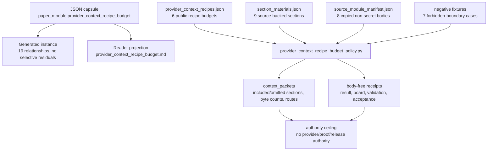

# Provider Context Recipe Budget

`provider_context_recipe_budget_policy` is the public Microcosm organ for
turning retrieved proof-support metadata into bounded provider context recipes.

It validates six public recipe shapes: `minimal_4kb`, `premise_16kb`,
`skill_32kb`, `repair_32kb`, `fewshot_64kb`, and
`strategy_classification_4kb`. Each recipe has a fixed byte ceiling, ordered
section fill, a graph role, a reducer deliverable type, and an omitted-sections
manifest when a section cannot fit.

## Authority Ceiling

This organ does not call providers, run Lean or Lake, prove a theorem, expose a
proof body, or reveal oracle-only truth-side material. Its output is context
metadata: which sections would be admitted, which sections were omitted, which
deliverable route is allowed, and which authority claims remain false.

The `strategy_classification_4kb` route emits only
`strategy_id_classification`. It is not a proof-body route and cannot carry a
provider answer body.

## Claim Ceiling

This module covers only public context-recipe metadata:
byte ceilings, ordered section admission, omitted-section manifests,
deliverable routing, copied non-secret source-module refs, digest and anchor
checks, negative cases, and body-free receipts. They do not authorize provider
or API calls, Lean or Lake execution, theorem correctness, proof-body export,
oracle-only truth-side material, provider answer bodies, release approval,
publication approval, or whole-system correctness.

## Shape



Evidence and accounting:

- Capsule authority:
  `core/paper_module_capsules.json::paper_modules[55:paper_module.provider_context_recipe_budget]`
  sets `source_authority: json_capsule`, subjects the organ
  `provider_context_recipe_budget_policy` plus mechanism
  `mechanism.provider_context_recipe_budget_policy.validates_public_context_budget_boundary`,
  and names `generated_projections.mermaid.status:
  available_from_capsule_edges` plus `generated_projections.atlas_card.status:
  linked_from_capsule_edges`.
- Generated instance:
  `paper_modules/provider_context_recipe_budget.json::relationships.edges`
  contains 19 capsule-derived relationship edges, and
  `relationships.unpopulated_selective_relations` is empty. That is lattice
  wiring evidence, not implementation-correctness proof.
- Runtime accounting:
  `src/microcosm_core/organs/provider_context_recipe_budget_policy.py` defines
  `EXPECTED_RECIPE_BUDGETS` for the six recipes, `EXPECTED_DELIVERABLES` for
  their reducer routes, `_recipe_projection` for included/omitted section
  accounting, `_recipe_findings` and `_section_findings` for boundary errors,
  and `_write_receipts` for body-free receipt output.
- Fixture inputs:
  `fixtures/first_wave/provider_context_recipe_budget_policy/input/provider_context_recipes.json`
  carries six public recipes with byte budgets from 4096 to 65536, while
  `.../section_materials.json` carries nine section rows with source refs and
  anchors.
- Body-floor and receipts:
  `core/fixture_manifests/provider_context_recipe_budget_policy.fixture_manifest.json`
  records `body_copied_material_count: 8`, seven `negative_case_ids`, four
  expected fixture receipt paths, and
  `source_open_body_imports.authority_ceiling` fields that keep provider calls,
  Lean/Lake execution, proof authority, truth-side material, payload export,
  runtime-correctness claims, and release authority false.
- Focused tests:
  `tests/test_provider_context_recipe_budget_policy.py` checks the six recipe
  ids, expected negative cases, source-backed section materials, public-relative
  redacted receipts, exported bundle validation, omitted-section movement when
  section size changes, digest mismatch rejection, and manifest body-text
  receipt-boundary rejection.

## Technical Mechanism

The runtime mechanism is a context-packet compiler plus boundary validator. It
does not ask a provider for an answer. `run` loads fixture inputs with negative
cases enabled; `run_budget_bundle` loads the exported bundle shape without the
fixture-only negative cases. Both routes call `_build_result`, which loads recipe
rows, section rows, copied source-module bodies, and the private-state scan
policy before it constructs any receipt.

Recipe projection is deterministic. `_recipe_projection` walks each recipe's
ordered section ids, computes each section's byte size with `_byte_size`, admits
a section only while the running total stays within the recipe's `byte_budget`,
and records omitted sections when the next section would exceed the budget. The
projection records graph role, deliverable type, included and omitted section
ids, included bytes, approximate tokens, and whether the omitted-sections
manifest is emitted. The six public recipes are the closed set in
`EXPECTED_RECIPE_BUDGETS`: `minimal_4kb`, `premise_16kb`, `skill_32kb`,
`repair_32kb`, `fewshot_64kb`, and `strategy_classification_4kb`.

The validator then checks three independent boundaries. `_recipe_findings`
rejects budget changes, forbidden truth-side section ids, proof/provider body
fields, provider-call authorization, deliverable-route drift, and over-budget
context with no omitted-sections manifest. `_section_findings` requires each
public section to cite an allowed source ref and source anchor, verifies those
anchors against the copied macro bodies, and rejects synthetic or truth-side
section material. `_source_module_findings` checks the source-module manifest,
expected module ids, body-free receipt flags, target presence, source/target
digest equality, and required anchors for the eight copied non-secret macro
bodies.

The receipt mechanism is deliberately body-free. `_write_receipts` writes the
fixture result, board, validation receipt, and acceptance receipt for fixture
mode; bundle mode writes only the exported-bundle validation result. `result_card`
emits a compact command card while omitting context packets, source-module
imports, source refs, receipt paths, private scan hit bodies, and the anti-claim
payload. The full receipts keep counts, ids, hashes, routes, and verdicts, not
proof bodies or provider answers.

In lattice terms, the JSON capsule binds this Markdown projection to
`provider_context_recipe_budget_policy`, to
`mechanism.provider_context_recipe_budget_policy.validates_public_context_budget_boundary`,
and to `concept.agent_reliability_and_safety_validator_bundle`. The principle
and axiom refs in the capsule (`P-1`, `P-2`, `P-3`, `P-6`, `P-8`, `P-16` and
`AX-1`, `AX-2`, `AX-5`, `AX-7`, `AX-8`, `AX-9`) are implemented here as
admission control over public evidence: bounded context metadata is allowed,
truth-side material and provider authority are not.

## Runtime Surfaces

```bash
PYTHONPATH=src python3 -m microcosm_core.organs.provider_context_recipe_budget_policy run \
  --input fixtures/first_wave/provider_context_recipe_budget_policy/input \
  --out receipts/first_wave/provider_context_recipe_budget_policy
PYTHONPATH=src python3 -m microcosm_core.cli provider-context-recipe-budget-policy run-budget-bundle \
  --input examples/provider_context_recipe_budget_policy/exported_provider_context_budget_bundle \
  --out receipts/runtime_shell/demo_project/organs/provider_context_recipe_budget_policy
```

## Validation Receipt Path

Run from `microcosm-substrate`:

```bash
PYTHONPATH=src ../repo-python -m microcosm_core.organs.provider_context_recipe_budget_policy run \
  --input fixtures/first_wave/provider_context_recipe_budget_policy/input \
  --out /tmp/microcosm-provider-context-recipe-budget-policy/fixture \
  --card
PYTHONPATH=src ../repo-python -m microcosm_core.organs.provider_context_recipe_budget_policy run-budget-bundle \
  --input examples/provider_context_recipe_budget_policy/exported_provider_context_budget_bundle \
  --out /tmp/microcosm-provider-context-recipe-budget-policy/bundle \
  --card
PYTHONPATH=src ../repo-python -m pytest -p no:cacheprovider tests/test_provider_context_recipe_budget_policy.py -q
PYTHONPATH=src ../repo-python scripts/build_doctrine_projection.py --check-paper-module-corpus
```

A green receipt proves only public context-recipe metadata, byte ceilings, omitted
sections, deliverable routing, copied non-secret source-module refs, and negative
cases; it does not call providers, run Lean or Lake, prove theorem correctness,
export proof bodies, expose oracle-only material, authorize release, or convert
context metadata into proof authority.

## Named Proof Consumers

The named proof consumer is
`tests/test_provider_context_recipe_budget_policy.py`. It verifies streaming
hash and line-count helpers, real-text byte sizing, all six expected recipe ids,
all seven negative cases, source-backed section material, public-relative and
redacted receipts, exported-bundle validation, omitted-section movement when a
section becomes small enough to fit, source-module digest mismatch rejection,
source/target digest mismatch rejection, manifest and row body-text receipt
boundary rejection, compact `--card` output, exact copied macro body imports,
and fixture-manifest source-open body-floor counts.

The runtime proof consumers are the two module commands in the Validation
Receipt Path: `provider_context_recipe_budget_policy run` for fixture mode and
`provider_context_recipe_budget_policy run-budget-bundle` for exported-bundle
mode. Fixture mode must observe the negative-case set and write result, board,
validation, and acceptance receipts. Bundle mode must validate the exported
runtime shape and write one body-free bundle validation result.

The corpus proof consumer is
`scripts/build_doctrine_projection.py --check-paper-module-corpus`. It proves
that the Markdown/capsule-backed paper-module corpus remains reproducible after
the reader projection changes; it does not refresh generated Mermaid, Atlas,
site, verifier, or capsule state.

## Source-Open Body Floor

The public bundle carries exact non-secret macro bodies for the context recipe
compiler, formal ladder consumer, provider receipt reducer, batch calibration
report, transform-job ABI, provider adapter policy, compute-provider policy,
and provider-navigation transform receipt policy. The validator checks every
copied module by digest and required anchors; receipts report only paths,
hashes, counts, anchor status, and verdicts.

The body floor is deliberately body-free at the receipt edge: runtime receipts
may prove copied-module paths, digests, anchor presence, counts, and verdicts,
but they must not expose proof bodies, oracle-only truth-side material,
provider answer bodies, account state, credentials, or release-send authority.

## JSON Capsule Binding

- Source row:
  `core/paper_module_capsules.json::paper_modules[55:paper_module.provider_context_recipe_budget]`.
- `source_authority: json_capsule`.
- This Markdown is a reader projection. The generated Mermaid projection is
  `available_from_capsule_edges`; the generated Atlas projection is
  `linked_from_capsule_edges`. Both are navigation projections derived from the
  capsule row rather than source authority.
- The proof boundary is the public recipe set, byte ceilings, ordered section
  fills, omitted-section manifests, deliverable routes, copied non-secret macro
  bodies, digest and anchor checks, negative cases, and validation receipts.
- The authority ceiling excludes provider calls, Lean or Lake execution, proof
  correctness, proof-body export, oracle-only truth-side material, provider
  answer bodies, release authority, and treating context metadata as proof
  authority.

## Structured Lattice Bindings

- Identity and subject binding:
  `paper_module.provider_context_recipe_budget` explains the
  `provider_context_recipe_budget_policy` organ and the
  `mechanism.provider_context_recipe_budget_policy.validates_public_context_budget_boundary`
  mechanism.
- Runtime locus:
  `src/microcosm_core/organs/provider_context_recipe_budget_policy.py` is the
  resolved code locus for fixture validation, section-fill checks,
  omitted-section manifests, digest checks, negative cases, and authority
  ceilings.
- Generated-row evidence:
  `paper_modules/provider_context_recipe_budget.json` currently contributes 19
  relationship edges, 0 unresolved selective relations, Mermaid
  `available_from_capsule_edges`, and Atlas `linked_from_capsule_edges`.
- Projection boundary:
  the Mermaid and Atlas statuses are capsule-derived navigation projections;
  this page explains them for a reader without treating either generated
  surface as source authority.

## Reader Evidence Routing

- Start with the JSON Capsule Binding to identify the capsule row and the
  release-safe authority ceiling before reading any validation result as a
  capability claim.
- Use Structured Lattice Bindings for navigation: it names the organ, mechanism,
  generated row, and runtime code locus that the capsule binds.
- Use Validation Receipt Path for reproducibility: fixture and bundle commands
  produce body-free receipts, the focused pytest exercises negative cases, and
  the corpus check verifies paper-module projection parity.
- The lattice wiring for this module supports discoverability and internal
  consistency checks; it does not prove provider execution, Lean/Lake execution,
  theorem correctness, release readiness, or public-send permission.

## Receipt Expectations

A complete local receipt includes:

- fixture command output for
  `provider_context_recipe_budget_policy run`;
- exported-bundle command output for `run-budget-bundle`;
- focused pytest output for
  `tests/test_provider_context_recipe_budget_policy.py`;
- paper-module corpus check output from
  `scripts/build_doctrine_projection.py --check-paper-module-corpus`;
- generated-row proof showing 19 relationship edges, Mermaid
  `available_from_capsule_edges`, Atlas `linked_from_capsule_edges`,
  `source_authority: json_capsule`, and no unpopulated selective relations.

Fixture and bundle receipts must preserve public context-recipe metadata, byte
ceilings, omitted-section manifests, deliverable routing, copied non-secret
source-module refs, digest and anchor checks, negative cases, and the authority
ceiling that excludes provider calls, Lean/Lake execution, theorem correctness,
proof-body export, oracle-only truth-side material, provider answer bodies,
release authority, and treating context metadata as proof authority.

## Negative Cases

- `budget_overflow_recipe` rejects recipes above the public byte ceiling.
- `truth_side_section` rejects oracle-only section ids.
- `proof_body_leakage` rejects proof and provider body fields.
- `provider_call_authorized` rejects any public fixture that authorizes a provider call.
- `deliverable_type_route_mismatch` rejects a recipe whose reducer output type changed.
- `omitted_sections_suppressed` rejects over-budget context without an omitted-sections manifest.

## Re-Entry Conditions

Re-enter this page when one of these changes:

- `core/paper_module_capsules.json::paper_modules[55:paper_module.provider_context_recipe_budget]`
  changes the subject, code-locus, doctrine-ref, or generated-projection
  binding.
- `src/microcosm_core/organs/provider_context_recipe_budget_policy.py` changes
  the accepted recipe shapes, omitted-section accounting, digest/anchor checks,
  negative cases, or authority ceiling.
- `paper_modules/provider_context_recipe_budget.json` no longer reports 19
  relationship edges, 0 unresolved selective relations, Mermaid
  `available_from_capsule_edges`, Atlas `linked_from_capsule_edges`, and
  `source_authority: json_capsule`.
- `tests/test_provider_context_recipe_budget_policy.py` changes the public
  negative-case set or exported-bundle validation contract.

## Why It Matters

Microcosm needs provider context to look like a small operating substrate, not a
prompt dump. This organ makes the context boundary inspectable: a cold reader
can see the exact byte ceilings, section order, omitted material, and deliverable
routes before any provider or proof authority is even in scope.

## Prior Art Grounding

The recipe budget is grounded in retrieval-augmented generation and context
packing practice. Lewis et al.'s
[Retrieval-Augmented Generation](https://arxiv.org/abs/2005.11401) paper is the
direct research anchor for conditioning generation on retrieved supporting
material rather than relying only on model parameters. Microcosm narrows that
idea into recipe metadata: retrieved proof-support sections are budgeted,
ordered, and omitted explicitly before any provider call is in scope.

The command-facing budget style also borrows from the
[Command Line Interface Guidelines](https://clig.dev/) principle of saying
enough but not too much. The organ turns that UX pressure into fixed byte
ceilings, omitted-section manifests, and deliverable-type routing so "more
context" does not silently become proof authority or provider authorization.
