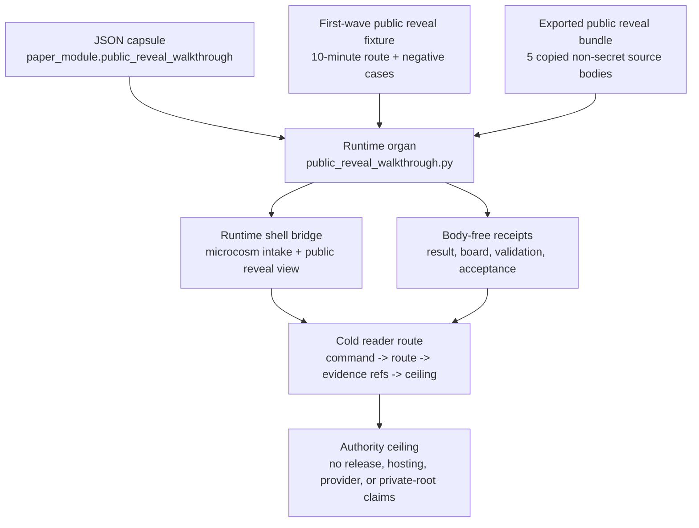

# Public Reveal Walkthrough

`public_reveal_walkthrough` is the accepted organ that makes Microcosm's
public reveal executable instead of descriptive.

It validates a ten-minute cold-reader path:

1. Compile a project into `.microcosm/`.
2. Inspect catalog, patterns, and routes.
3. Explain one route through patterns, standard pressure, work, events, and
   evidence.
4. Open the observatory causal chain before raw JSON drilldown.
5. Run `microcosm intake` to see the macro projection intake cells connected
   to spine, reveal, and runtime evidence.
6. Read the receipts and authority ceiling.

The organ reads public fixtures from
`fixtures/first_wave/public_reveal_walkthrough/input/` and exported runtime
input from
`examples/public_reveal_walkthrough/exported_public_reveal_bundle/`.

It emits:

- `receipts/first_wave/public_reveal_walkthrough/public_reveal_walkthrough_result.json`
- `receipts/first_wave/public_reveal_walkthrough/ten_minute_reveal_board.json`
- `receipts/first_wave/public_reveal_walkthrough/public_reveal_validation_receipt.json`
- `receipts/acceptance/first_wave/public_reveal_walkthrough_fixture_acceptance.json`

The reveal path treats `microcosm intake` as a runtime bridge rather than a
private planning note. The command exposes
`runtime_reveal_import_bridge`, keeps `formal_math_readiness_extensions`
visible as a landed public replacement when its extension board exists, and
points back to the macro projection intake board without copying private
macro bodies.

## Purpose

A cold reader meeting Microcosm for the first time needs one thing the README
cannot give them on its own: proof that the first ten minutes are real and not
a tour of screenshots. This organ answers a single question. Can a reader who
has never seen the system run a short, fixed path from a command to local
state, to a route, to the receipt and source boundary behind it, with nothing
on that path that the system does not actually run?

The validator enforces that path as an accounting floor rather than a
narrative. A reveal only passes if it carries at least five steps, four
distinct runnable commands, and four evidence refs, and if four overclaim
fixtures stay rejected: a release or hosting claim, a private-data equivalence
claim, a step with no evidence ref, and marketing copy with no command behind
it. The floor exists because a walkthrough drifts towards a hero pitch the
moment it is allowed to. Removing the commands and the receipt refs is the
easiest way to make a reveal look broader than its evidence supports.

The part worth noting is the real-lane witness. The fixture run does not pass
on its own paperwork. It is gated on the exported reveal bundle actually
running, with its copied non-secret source bodies present and digest-verified.
If that backing run is missing or blocked, the fixture is marked blocked too,
with `real_runtime_receipt` set to false. So the reveal cannot describe a
runnable path while the runnable path is broken underneath it, which is the
quiet failure mode of every quick-start guide that says more than it can
execute.

## Shape

Public Reveal Walkthrough is the source-backed entry membrane for a cold
technical reader. It turns the local Microcosm first-run path into a runnable
accounting exercise: commands produce local state, routes point at work and
events, evidence refs point at receipts, and authority ceilings keep the visual
or browser layer from becoming a product or publication claim.



The runtime shape has five bounded inputs:

- the public reveal fixture under `fixtures/first_wave/public_reveal_walkthrough/input`;
- the exported reveal bundle under `examples/public_reveal_walkthrough/exported_public_reveal_bundle`;
- the source-module manifest for copied non-secret macro bodies;
- the organ source and focused tests that enforce command, evidence, and
  negative-case behavior;
- the standard and JSON capsule that bind the paper module to the mechanism,
  source locus, and authority ceiling.

The proof shape is route-first rather than dashboard-first. A valid reveal
shows a command, a selected route, the route explanation through work/events/
evidence, receipt refs, evidence-class counts, and the anti-claim beside any
large total. Generated cards, observatory views, and browser/video boards
are presentation layers over that accounting path.

The negative-case shape is part of the floor. Release or hosting overclaims,
private-data equivalence, missing evidence refs, and marketing-only reveal
material must remain rejected. If those refusals stop appearing, the reveal is
no longer bounded enough for a cold reader.

The source-open shape is also bounded. The exported bundle carries five copied
non-secret public bodies, and the manifest verifies exact-copy relation,
digests, material classes, and body-free receipts. Receipts may carry refs,
hashes, counts, and verdicts; they must not embed private macro bodies,
provider payloads, account/session state, or release/recipient authority.

Evidence/accounting:

- Capsule authority:
  `core/paper_module_capsules.json::paper_modules[paper_module.public_reveal_walkthrough]`
  sets `source_authority: json_capsule`, binds the organ, binds
  `mechanism.public_reveal_walkthrough.validates_public_reveal_walkthrough`,
  and resolves `src/microcosm_core/organs/public_reveal_walkthrough.py`.
- Generated instance:
  `paper_modules/public_reveal_walkthrough.json` reports
  `source_authority: json_capsule`, Mermaid
  `available_from_capsule_edges`, Atlas
  `linked_from_capsule_edges_after_atlas_binding`, 20 relationship edges, and
  a resolved `paper_module.depends_on.paper_module` edge to
  `paper_module.first_screen_composition_root` because the reveal path spends
  the first-screen composition contract before deeper route/evidence drilldown.
- Runtime and shell consumers:
  `src/microcosm_core/organs/public_reveal_walkthrough.py` exposes `run`,
  `run_reveal_bundle`, `_source_module_manifest_result`,
  `_source_open_body_import_summary`, `EXPECTED_NEGATIVE_CASES`,
  `AUTHORITY_CEILING`, and `PUBLIC_SAFE_SOURCE_BODY_CLASSES`.
  `src/microcosm_core/runtime_shell.py` routes the exported reveal bundle
  through `public_reveal_walkthrough.run_reveal_bundle` and publishes the
  `public_reveal_view` runtime lens.
- Receipt and test floor:
  `receipts/first_wave/public_reveal_walkthrough/public_reveal_walkthrough_result.json`,
  `ten_minute_reveal_board.json`,
  `public_reveal_validation_receipt.json`, and
  `receipts/acceptance/first_wave/public_reveal_walkthrough_fixture_acceptance.json`
  are body-free evidence. `tests/test_public_reveal_walkthrough.py` checks the
  fixture path, exported-bundle path, source-module digest validation,
  negative cases, and public-relative receipt posture.
- Claim boundary:
  `standards/std_microcosm_public_reveal_walkthrough.json`, the generated
  sidecar, and this page limit the module to public reveal walkability,
  route/evidence accounting, exact-copy public source-body import evidence,
  negative-case rejection, and body-free receipts. They do not authorize
  release, hosted deployment, publication, recipient work, provider calls,
  secret export, private-root equivalence, source mutation, Lean/Lake
  execution, or whole-system correctness.

## Source-Backed Mechanism

The source mechanism is
`mechanism.public_reveal_walkthrough.validates_public_reveal_walkthrough` in
`core/mechanism_sources.json`.

The runtime locus is
`src/microcosm_core/organs/public_reveal_walkthrough.py`. The source symbols
that matter for cold-agent drilldown are:

- `run`
- `run_reveal_bundle`
- `_source_module_manifest_result`
- `_source_open_body_import_summary`
- `EXPECTED_NEGATIVE_CASES`
- `AUTHORITY_CEILING`
- `PUBLIC_SAFE_SOURCE_BODY_CLASSES`

The governing standard is
`standards/std_microcosm_public_reveal_walkthrough.json`. Its
`paper_module_contract` binds this Markdown module to
`core/paper_module_capsules.json#paper_module.public_reveal_walkthrough` and to
the mechanism row above.

The atlas source row is intentionally not claimed as complete in this pass:
`core/organ_atlas.json` is the source surface that must later receive
`paper_module_ref`, `mechanism_refs`, and `code_loci` for this organ. The
re-entry capture is
`cap_quick_public_reveal_atlas_edge_population_wait_147e39c7a896`.

## Source-Open Body Imports

The exported reveal bundle carries five copied non-secret source bodies under
`examples/public_reveal_walkthrough/exported_public_reveal_bundle/source_modules/`.
The authority manifest is
`examples/public_reveal_walkthrough/exported_public_reveal_bundle/source_module_manifest.json`.

The copied materials are:

| Module id | Material class | What it contributes |
|---|---|---|
| `public_reveal_first_slice_execution_receipt_body_import` | `public_macro_receipt_body` | First public Microcosm slice validation receipt with release/publication/hosting boundaries. |
| `public_reveal_runtime_shell_reorientation_receipt_body_import` | `public_macro_receipt_body` | Macro receipt for the shift from receipt archive posture to runnable runtime shell posture. |
| `public_reveal_clean_clone_state_fixture_receipt_body_import` | `public_macro_receipt_body` | Clean-clone fixture repair receipt showing self-contained public validation. |
| `public_reveal_public_substrate_boundary_policy_body_import` | `public_macro_tool_body` | Boundary policy for public-safe macro import and excluded material classes. |
| `public_reveal_walkthrough_control_plane_source_body_import` | `public_python_source_body` | The public organ source body that validates reveal commands, claims, digest evidence, and body-free receipts. |

All five rows are exact-copy imports, `body_in_receipt=false`, and digest
checks must pass before the exported reveal bundle can count as source-backed.
Receipts may name refs, hashes, counts, and verdicts; they do not embed copied
body text.

## First Commands

From `microcosm-substrate/`, the first fixture command is:

```bash
PYTHONPATH=src python3 -m microcosm_core.organs.public_reveal_walkthrough run --input fixtures/first_wave/public_reveal_walkthrough/input --out receipts/first_wave/public_reveal_walkthrough --acceptance-out receipts/acceptance/first_wave/public_reveal_walkthrough_fixture_acceptance.json
```

The exported bundle command is:

```bash
PYTHONPATH=src python3 -m microcosm_core.organs.public_reveal_walkthrough run-reveal-bundle --input examples/public_reveal_walkthrough/exported_public_reveal_bundle --out receipts/runtime_shell/demo_project/organs/public_reveal_walkthrough --card
```

Focused regression:

```bash
PYTHONPATH=src ../repo-pytest tests/test_public_reveal_walkthrough.py -q --basetemp=/tmp/microcosm-public-reveal-pytest --ignore-host-pressure
```

## Validation Receipt Path

Validate the reader projection from the repo root without mutating durable
receipt or generated projection surfaces:

```bash
PYTHONPATH=microcosm-substrate/src ./repo-pytest microcosm-substrate/tests/test_public_reveal_walkthrough.py -q --basetemp=/tmp/microcosm_public_reveal_walkthrough_pytest --ignore-host-pressure
./repo-python microcosm-substrate/scripts/build_doctrine_projection.py --check-paper-module-corpus
```

## Receipt Expectations

First-wave receipts are expected to bind the ten-minute walkthrough to public
commands and evidence refs: `status: pass`, five walkthrough steps, command
coverage, evidence-ref coverage, authority ceiling, anti-claim, secret-exclusion
scan, real runtime receipt status, `body_in_receipt: false`, and public runtime
refs.

Runtime-bundle receipts are expected to bind the exported public reveal bundle
to the source-open body floor: `input_mode: exported_public_reveal_bundle`,
`body_copied_material_count: 5`, source-module manifest status `pass`, exact
digest and anchor verification, body-free receipt posture, and no private-state
scan or body-redaction substitute in the output.

The receipt set is sufficient only for the supplied fixture and exported
bundle. It does not authorize release, hosted deployment, publication, recipient
work, provider calls, secret export, private-root equivalence, source mutation,
Lean/Lake execution, or whole-system correctness.

## Evidence Counts In The Reveal

The reveal board should not ask a cold reader to decode evidence-class numbers
from context. When the walkthrough shows source-open body material counts,
verified import counts, subprocess witnesses, algorithmic projection counts, or
rows with source imports, it should pair each number with the evidence class
and the anti-claim:

- Counts prove that the public route exposes an inspectable accounting surface.
- Counts do not prove release readiness, whole-system correctness, or equal
  evidence depth across every organ.
- A small high-authority count is stronger than a large low-authority count
  for the claim it actually covers.
- Generated or projected rows are reveal handles; source files, validators,
  receipts, and authority ceilings remain the proof surfaces.

This keeps the public reveal from becoming a dashboard of unsupported totals.
The first reveal task is to show how a reader can move from number to receipt
to source boundary without crossing into private bodies, provider payloads,
account/session state, or release claims.

## Reveal First View

The reveal board should open with the same compression grammar as the
first-screen card, then widen only after the reader has a route to inspect:

1. Restate the bounded claim frame.
2. Show the command that produced the local state.
3. Show one route explanation with receipt refs.
4. Show the evidence-count legend beside the receipt refs.
5. Show the authority ceiling before any totals, drilldowns, or observatory
   links.

This gives video-first or browser-first readers a visible artifact without
turning the reveal into a marketing hero. Motion, screenshots, and observatory
views are allowed presentation layers only when the same evidence legend,
anti-claim, and receipt refs remain on the first view.

## Discipline In The Reveal

The reveal should make discipline legible as prevented failure, not as a wall
of policy labels. Before showing totals or motion, the board should pair each
claim-heavy artifact with the boundary that keeps it honest:

| Reveal artifact | Boundary shown beside it | What the boundary prevents |
|---|---|---|
| Local `.microcosm/` state | `source_files_mutated=false` plus route/work/event/evidence refs. | Reading a local demo as source mutation, hosted release, or provider execution. |
| Body-import counts | `verified_macro_body_import` rows with validator or receipt refs. | Reading copied public material as private-root equivalence. |
| Projection counts | Source-coupling and generated-row anti-claims. | Reading generated cards as source authority or domain proof. |
| Observatory views | Compact endpoint first, full model as drilldown. | Letting browser motion replace command, receipt, and evidence-class checks. |
| Doctrine constraints | Failure mode or anti-claim beside the constraint. | Reading governance as ceremony rather than as a specific overclaim guard. |

If the reveal cannot show those boundaries on the first view, it should defer
the visual flourish and keep the compact receipt-backed route visible instead.

## Prior Art Grounding

The public reveal path is grounded in first-run CLI and progressive-disclosure
practice. The [Command Line Interface Guidelines](https://clig.dev/) motivate a
single runnable command, examples, discoverable next steps, and machine-readable
output. Nielsen Norman Group's
[progressive disclosure](https://www.nngroup.com/articles/progressive-disclosure/)
pattern motivates showing the bounded first route before expanding into full
observatory or JSON drilldowns.

The reveal's evidence walk also borrows from provenance and tracing patterns:
[W3C PROV](https://www.w3.org/TR/prov-overview/) for moving from artifact to
source and receipt, and
[OpenTelemetry traces](https://opentelemetry.io/docs/concepts/signals/traces/)
for representing causal chains as inspectable linked work. Microcosm applies
those patterns to a local walkthrough so the visual board remains evidence
accounting, not a release or maturity claim.

## Browser/Video Reveal Board

The reveal board is the public visual candidate for a 60-second walkthrough. It
must therefore be more than raw JSON, but it must still be less than a product
claim. The first browser/video frame should show:

1. The command that produced the local state.
2. The selected route and one-line route reason.
3. The route explanation through work, events, evidence, and receipt refs.
4. The evidence legend, including evidence class and anti-claim.
5. The compact observatory or first-screen endpoint used for the board.
6. The authority ceiling before totals, motion, or full-model drilldown.

Motion is allowed to make the causal order easier to inspect: command to local
state, local state to selected route, selected route to work/event/evidence,
and evidence to receipt or validator. Motion is not allowed to displace the
command, receipt/evidence ref, anti-claim, or authority ceiling from the first
view.

The board should end by offering exactly three next steps: reader-specific
branch, receipt drilldown, and full observatory JSON. That keeps the visual
surface from expanding into a second README while still making the public
reveal inspectable by readers who will not start in the terminal.

The validated claim is narrow:

> Microcosm turns a repo into a local operating substrate: patterns, routes,
> work transactions, events, evidence, and explanations.

Negative fixtures reject release or hosting overclaim, private-data
equivalence, missing evidence refs, and marketing-only reveal material without
runtime commands.

## Reader Evidence Routing

- Start with the first commands and the JSON Capsule Binding to identify the
  fixture, exported bundle, capsule row, mechanism row, standard, and receipt
  surfaces.
- For behavior questions, read
  `src/microcosm_core/organs/public_reveal_walkthrough.py` and
  `tests/test_public_reveal_walkthrough.py` before trusting this prose.
- For source-open body questions, read the exported bundle's
  `source_module_manifest.json`; it is the evidence for exact-copy relation,
  digest match, material class, and body-free receipt posture.
- For visual or browser walkthrough questions, read the evidence legend,
  receipt refs, anti-claim, and authority ceiling before reading totals,
  observatory links, or motion as meaningful.
- Treat generated atlas docs, generated coverage projections, generated
  receipts, copied-body presence, and browser/video boards as navigation or
  validation projections. They do not become source authority for release,
  hosting, provider, private-root-equivalence, or whole-system claims.

## Reader Proof Boundary

The proof boundary for this module is the JSON capsule row, the public reveal
organ, the fixture manifest, the exported reveal bundle, the source-module
manifest, focused tests, and body-free receipts. A diagram view of this module
is generated from the lattice; an atlas card is staged pending atlas owner-lane
binding. One selective relation remains unresolved in the current pass; that
residual requires a governed capsule update to close.

The positive claim is that a cold reader can run a local walkthrough from
command to route explanation to receipt and source boundary. It is not hosted
deployment, public launch approval, provider execution, private-root
equivalence, Lean/Lake execution, or whole-system correctness.

## Public Site Availability Boundary

The public site may show the bounded reveal claim, first command, selected
route explanation, evidence-count legend, receipt refs, authority ceiling, and
observatory drilldowns. It must keep the evidence legend and anti-claim visible
before totals, browser motion, screenshots, or video boards. A visual reveal is
a presentation layer over the command and receipt path, not a release claim.

## Public-Safe Body Handling

The exported reveal bundle may carry copied non-secret source bodies under the
source-module manifest. Receipts and site data may expose refs, hashes, counts,
verdicts, anchors, material classes, and omission receipts. They must not
inline private macro bodies, provider payload bodies, account/session state,
recipient data, credentials, raw operator voice, or release-only material.

## Authority Ceiling

This paper module describes public reveal walkthrough validation only. It does
not authorize release, hosted deployment, publication, recipient work, provider
calls, secret export, private-root equivalence, Lean/Lake execution, source
mutation, or whole-system correctness.

Generated atlas docs, generated coverage projections, generated receipts,
copied-body presence, browser/video boards, and broad evidence totals are
not source authority. The source authority remains with the standard, capsule,
mechanism row, organ source, source-module manifest, validators, and receipt
refs named above.

## Claim Ceiling

This module may claim a bounded public reveal walkthrough over the local
fixture and exported bundle: runnable commands, selected route explanation,
work/event/evidence refs, source-open body import manifest checks, evidence
legend, negative-case refusals, body-free receipts, and authority ceilings. A
diagram view is generated for this module; an atlas card is a staged exercise
pending atlas owner-lane binding. One selective dependency remains open and
requires a governed capsule update to resolve.

It does not claim release readiness, hosted deployment, publication approval,
recipient work, provider execution, secret export, private-root equivalence,
Lean/Lake execution, source mutation, or whole-system correctness. Visual
boards, screenshots, observatory motion, copied-body counts, and generated
cards remain presentation or navigation projections over the receipt path.

## Re-Entry Conditions

Re-enter this module when any of these change:

- `core/organ_atlas.json` is available for the deferred
  `paper_module_ref` / `mechanism_refs` / `code_loci` source-row binding.
- `examples/public_reveal_walkthrough/exported_public_reveal_bundle/source_module_manifest.json`
  changes digest, relation, material class, or omitted-material rows.
- `src/microcosm_core/organs/public_reveal_walkthrough.py` changes source
  symbols, negative cases, source-module boundary checks, or command names.
- The generated doctrine lattice coverage still reports this organ in the
  paper, mechanism, or code-locus deficit buckets after the atlas row is
  claimable.

## JSON Capsule Binding

- Capsule row: `paper_module.public_reveal_walkthrough` in `core/paper_module_capsules.json::paper_modules[28:paper_module.public_reveal_walkthrough]`.
- source_authority: json_capsule
- This Markdown is a reader projection; the JSON capsule is source authority for subjects, code loci, doctrine refs, and generated projection state.
- The generated Mermaid projection is `available_from_capsule_edges`; the generated Atlas projection is `linked_from_capsule_edges_after_atlas_binding`.
- The proof boundary is the local reveal fixture and exported-bundle receipts named above, not release, hosted deployment, recipient work, provider authority, private-root equivalence, or whole-system correctness.
- authority ceiling: Public reveal fixture and exported-bundle receipts only; no release, hosted deployment, publication, recipient work, provider call, secret export, private-root equivalence, Lean/Lake execution, source mutation, or whole-system correctness.
