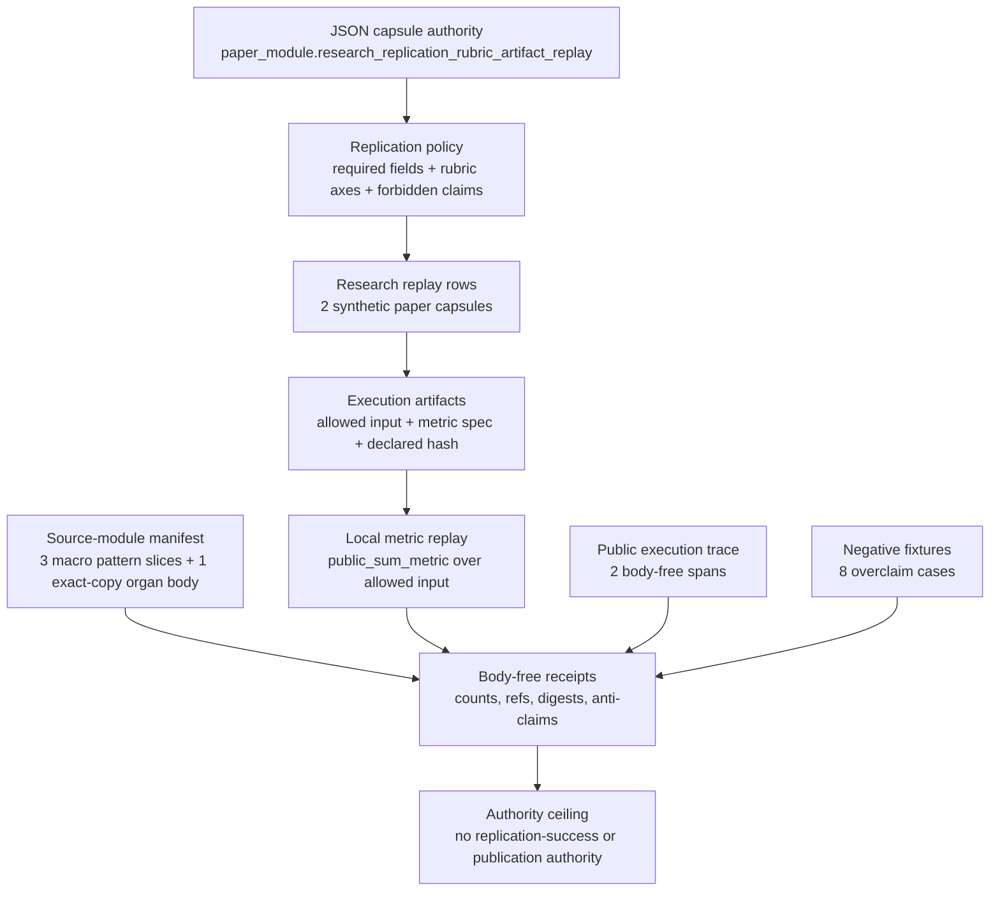

# Research Replication Rubric-Artifact Replay

## Abstract

`research_replication_rubric_artifact_replay` is a public Microcosm organ that
turns "an agent replicated a paper" into a replayable evidence contract. It does
not rerun a real paper, call providers, certify benchmark performance, or grant
publication authority. It checks whether a public replay bundle exposes the
objects a replication claim must cite before its authority can rise:
contribution decomposition refs, rubric-tree refs, allowed input refs,
scratch-scaffold refs, experiment-DAG refs, metric-script refs, declared
artifact hashes, grader reports, runtime budgets, ablation diffs, failure
taxonomies, cold-rerun refs, public execution-trace spans, and source-module
digests.

The technical result is an R3 local artifact replay: one public metric script is
executed over one allowed public input table, the produced output is compared
with a declared output artifact, and the declared hash file is checked against
that artifact. A successful run says the replay packet is structurally
accountable, digest-bound, redaction-aware, and negative-case tested. It does
not say that a real paper was independently replicated.

## Purpose

The single question this organ answers is narrow: before an agent is allowed to
say it replicated a paper, can the claim be forced into a bundle that a cold
runtime can check without trusting any prose? The interesting move is that the
organ refuses to treat "replicated" as one fact. It pulls the claim apart into
the objects a real replication would have left behind, a contribution
decomposition, a grading rubric tree, the allowed public inputs, an experiment
DAG, metric scripts, declared artifact hashes, a grader report, a runtime
budget, an ablation diff, a failure taxonomy, and a cold-rerun receipt, and it
asks for each one by name.

What keeps this from being a checklist linter is the small executable core. The
exported bundle does not just assert that an artifact hash exists. The runtime
reads one public metric script, runs it over one allowed public input table,
produces an output, and then checks that output against both the declared output
artifact and the declared hash file. A replay row can name all the right refs
and still fail here if the numbers do not reproduce. The negative-case fixtures
attack exactly the gap a plausible fake would exploit: report-only success,
benchmark-performance language, final-answer-only grading, undeclared hashes,
and reuse of the original author's code.

The deliberately modest part is the subject matter. The two paper capsules are
public synthetic examples, and the metric is a single sum over a small table.
The organ's value is the boundary, not the science. It does not run a real
paper, call a provider, search compute without bound, or grant any release or
publication authority. It only makes a replication claim accountable enough that
an independent reader can see where the evidence stops.

## Telos

Research-agent demos often collapse four objects into one sentence: the paper,
the runnable artifact, the grading rubric, and the evidence that an independent
rerun happened. This organ keeps those objects separate. A replay is admissible
only when it names each evidence object and when the local runtime can check the
public artifact replay without touching private paper bodies, private data
bodies, hidden rubrics, provider payloads, original-author code bodies, or
release/publication authority.

The central bet is modest and technical: before any replication claim is made,
the system can force the claim into a falsifiable bundle with declared hashes,
bounded metric execution, body-free receipts, and explicit anti-claims.

## Mechanism

The mechanism row is
`mechanism.research_replication_rubric_artifact_replay.validates_public_research_replication_replay`.
It runs in
`src/microcosm_core/organs/research_replication_rubric_artifact_replay.py` and
is backed by the functions `run`, `run_replication_bundle`,
`validate_source_module_imports`, `validate_projection_protocol`,
`validate_replication_policy`, `validate_research_replays`, `_build_result`,
`_freshness_basis`, and the constants `EXPECTED_NEGATIVE_CASES`,
`AUTHORITY_CEILING`, `SOURCE_MODULE_MANIFEST_REF`, `BUNDLE_RESULT_NAME`, and
`CARD_SCHEMA_VERSION`.

The runtime has two modes:

- Fixture mode reads
  `fixtures/first_wave/research_replication_rubric_artifact_replay/input`,
  includes positive replay rows plus eight negative-case fixtures, and writes
  first-wave result, board, validation, and acceptance receipts.
- Exported-bundle mode reads
  `examples/research_replication_rubric_artifact_replay/exported_research_replication_bundle`,
  validates the public runtime example, checks the source-module manifest, and
  writes
  `receipts/runtime_shell/demo_project/organs/research_replication_rubric_artifact_replay/exported_research_replication_bundle_validation_result.json`.

The proof object is the tuple:

1. `replication_policy.json`, which states required replay fields, rubric axes,
   and forbidden claims.
2. `research_replays.json`, which supplies two synthetic paper capsules that
   cite public inputs, metrics, artifact hashes, grader reports, budgets,
   failures, and cold-rerun receipts.
3. `execution_artifacts/execution_artifact_manifest.json`, which authorizes the
   replayable artifact relation.
4. `source_module_manifest.json`, which names copied non-secret source bodies
   and digest obligations.
5. Runtime receipts, which expose refs, counts, digests, trace spans, and
   anti-claims without embedding private bodies.

## Metric-Script and Artifact Evidence

The exported bundle includes a small but real artifact-replay loop:

| Role | Public artifact |
|---|---|
| Input body | `execution_artifacts/inputs/public_synthetic_table.json` |
| Input hash | `execution_artifacts/inputs/public_synthetic_table.sha256.json` |
| Metric script | `execution_artifacts/metrics/public_sum_metric.json` |
| Metric hash | `execution_artifacts/metrics/public_sum_metric.sha256.json` |
| Declared output | `execution_artifacts/artifacts/result_table.json` |
| Declared output hash | `execution_artifacts/artifacts/result_table.sha256.json` |

`run_replication_bundle` reads
`execution_artifacts/execution_artifact_manifest.json`, executes the
`public_sum_metric` over the allowed public input, compares the produced payload
with `execution_artifacts/artifacts/result_table.json`, and verifies the
declared hash in `execution_artifacts/artifacts/result_table.sha256.json`. The
focused tests mutate each side of that relation, so the pass is not just a
field-presence check.

## Pipeline



The diagram is a reader projection, not source authority. The generated
Mermaid projection is available from capsule edges; the generated Atlas
projection remains blocked until the organ-atlas owner lane binds the atlas row.

## Evidence Contract

The policy file requires fourteen replay fields: `paper_id`,
`contribution_decomposition_ref`, `rubric_tree_ref`,
`allowed_public_input_refs`, `scratch_repo_scaffold_ref`,
`experiment_dag_ref`, `metric_script_refs`, `artifact_hash_refs`,
`declared_artifact_hash_refs`, `grader_report_ref`,
`cost_runtime_budget_ref`, `ablation_diff_ref`, `failure_taxonomy_ref`, and
`cold_rerun_receipt_ref`.

The policy also requires eight rubric axes: contribution decomposition,
artifact replay, experiment DAG, metric script, grader alignment, budget
boundary, failure taxonomy, and cold rerun. A replay row can therefore pass only
as a structured evidence packet, not as a final answer or narrative report.

The exported runtime receipt currently records the following evidence floor:
two synthetic paper capsules, two replay rows, two artifact replay rows, two
cold-rerun refs, two public execution-trace spans, four copied source modules,
no findings, no error codes, source-module status `pass`, and
`input_mode: exported_research_replication_bundle`. The fixture receipt records
all eight negative cases as observed.

## Source-Open Body Floor

The source-module manifest at
`examples/research_replication_rubric_artifact_replay/exported_research_replication_bundle/source_module_manifest.json`
is the source-open body floor. It declares four copied non-secret modules:

- `research_replication_extracted_pattern_ledger_row_body_import`, a public
  macro pattern body slice.
- `research_replication_high_novelty_growth_receipt_body_import`, a public
  macro reconstruction receipt slice.
- `research_replication_deterministic_pattern_order_body_import`, a public
  deterministic pattern-order slice.
- `research_replication_replay_control_plane_source_body_import`, an exact-copy
  public Python control-plane body for this organ.

Each row carries a source ref, target ref, material class, copied-body flag,
receipt-body exclusion flag, line count or byte count, and sha256 digest. The
runtime verifies target digests; for the exact-copy Python row it also checks
source currentness and source-target byte equality. Receipts expose refs,
counts, digests, and verdicts only. They do not embed source bodies.

## Failure Modes and Guardrails

The expected negative cases are:

- original-author code reuse
- hidden-rubric leakage
- report-only success
- benchmark-performance overclaim
- private paper or data body leakage
- unbounded compute search
- final-answer-only grading
- undeclared artifact hash refs

The tests also cover source-module digest mismatch, local bundle body tamper,
rehashing a swapped source module, wrong execution-artifact hashes, wrong
artifact refs with matching hashes, report-only exported replays, metric
perturbation, replay metric-script ref tamper, input perturbation, output body
tamper, baked output swaps, and self-consistent input/output/hash rewrites. These
cases make the organ stronger than a field-presence linter: it rejects common
ways to produce plausible but unaccountable replication prose.

## Test Matrix

The focused regression file
`tests/test_research_replication_rubric_artifact_replay.py` carries the source
proof for this module.

| Class | Examples | What it proves |
|---|---|---|
| Real-good | `test_research_replication_replay_observes_negative_cases`, `test_research_replication_exported_bundle_validates_runtime_shape`, `test_public_agent_execution_trace_refactor_builds_research_replay_spans` | The fixture and exported bundle produce body-free receipts, observe the required negative cases, execute the local metric replay, and build two public trace spans. |
| Real-bad | `test_research_replication_rejects_source_module_digest_mismatch`, `test_research_replication_rejects_bundle_local_source_module_body_tamper`, `test_research_replication_rejects_rehashed_source_module_body_swap`, `test_research_replication_rejects_metadata_only_bundle` | The validator rejects broken source-module provenance, local bundle tamper, self-consistent source swaps, and metadata-only replay packets. |
| Perturbation | `test_research_replication_rejects_wrong_execution_artifact_hash`, `test_research_replication_rejects_wrong_artifact_ref_with_matching_hash`, `test_research_replication_rejects_metric_perturbation`, `test_research_replication_rejects_valid_metric_script_body_swap`, `test_research_replication_rejects_replay_metric_script_ref_tamper`, `test_research_replication_rejects_replay_allowed_input_ref_tamper`, `test_research_replication_rejects_input_perturbation`, `test_research_replication_rejects_output_artifact_body_tamper`, `test_research_replication_rejects_output_artifact_baked_swap`, `test_research_replication_rejects_self_consistent_input_output_hash_rewrite` | Metric, input, output, hash, and replay-row mutations stay blocked even when the tampered bundle tries to preserve self-consistency. |
| Label forgery | `test_research_replication_ignores_forged_negative_case_labels`, `test_research_replication_negative_case_id_follows_semantics_not_filename`, `test_research_replication_exported_bundle_ignores_self_declared_pass_labels` | Verdicts are derived from semantic replay-row fields, not filenames, declared status labels, or expected error-code labels. |
| Receipt economy | `test_research_replication_receipts_are_public_relative_and_secret_excluded`, `test_research_replication_bundle_card_reuses_fresh_receipt`, `test_research_replication_bundle_card_rejects_stale_receipt_after_input_mutation` | Receipts remain public-relative and secret-excluded; command cards reuse fresh receipts and reject stale ones after input mutation. |

## Realness Rungs

This module's realness is intentionally runged:

1. **Synthetic replay subjects.** The two paper capsules are public synthetic
   examples, one ML-method replay and one computational-science replay.
2. **Real schema pressure.** The required fields, rubric axes, declared hash
   roster, source-module manifest, and private-state exclusions are enforced by
   runtime code and focused tests.
3. **Local artifact replay.** The exported bundle executes a local metric over
   allowed public input and compares produced output against declared artifact
   hashes.
4. **Source-open provenance.** Three public macro pattern bodies and one exact
   Python control-plane body are copied into the bundle and digest-checked.
5. **Body-free public receipts.** Receipts carry counts, refs, digests, verdicts,
   trace spans, and anti-claims while excluding private/live/provider material.

The rung contract matters: the organ is more than generic documentation polish,
but it is still not paper-replication authority.

## Relation to Concepts, Principles, and Axioms

The JSON capsule binds the module to
`concept.research_and_science_replay_evidence_bundle`. That concept is
instantiated by the mechanism above and abides by `AX-1`, `AX-6`, `AX-8`, and
`AX-12` at the concept layer. The capsule's direct axiom refs are `AX-1`,
`AX-2`, `AX-5`, and `AX-7`.

The capsule's principle refs are `P-1`, `P-2`, `P-3`, `P-6`, `P-8`, and `P-15`.
For this organ, the important principle pressure is:

- Evidence must be structured and replayable before authority rises.
- Receipts and anti-claims are part of the artifact, not commentary after it.
- Projections stay below source authority; a readable paper module does not
  outrank the JSON capsule, mechanism row, runtime code, source-module manifest,
  or receipts.
- Typed refusal is part of the mechanism: benchmark, provider, publication,
  private-body, original-code, and unbounded-compute claims remain false unless
  another authority surface actually grants them.

The module depends on
`paper_module.agent_benchmark_integrity_anti_gaming_replay`. Benchmark
performance overclaim controls stay routed through that sibling instead of
being reinvented here.

## Limitations

- The two replay subjects are synthetic public paper capsules, not real external
  paper replications.
- The metric replay is intentionally small: one public metric spec over one
  public input table with one declared output artifact. Its value is boundary
  enforcement, not benchmark substance.
- Source-open proof is limited to three public macro pattern body slices and
  one exact-copy public Python control-plane body. It does not expose private
  macro-root bodies, raw operator voice, provider payloads, account/session
  state, browser/HUD state, or original-author code bodies.
- The generated Mermaid projection is available from capsule edges, but the
  generated Atlas projection remains blocked until the organ-atlas owner lane
  binds the atlas row.
- A green run does not prove research truth, paper novelty, theorem
  correctness, benchmark performance, provider execution, release readiness, or
  publication approval.

## JSON Capsule Binding

- `source_authority: json_capsule`
- This Markdown is a reader projection over
  `core/paper_module_capsules.json#paper_module.research_replication_rubric_artifact_replay`.
- The generated Mermaid projection is
  `paper_module.research_replication_rubric_artifact_replay.mermaid` with
  status `available_from_capsule_edges`.
- The generated Atlas projection is
  `organ_atlas.research_replication_rubric_artifact_replay` with status
  `blocked_until_organ_atlas_owner_lane_binds_edges`.
- The proof boundary is the capsule plus mechanism row, runtime code,
  source-module manifest, exported-bundle receipt, first-wave fixture receipts,
  and focused tests.
- The authority ceiling is copied public macro pattern provenance bodies, an
  exact-copy public Python control-plane body, body-free replay receipts, public
  trace spans, and fixture validation only.
- The validation receipts are:
  `receipts/first_wave/research_replication_rubric_artifact_replay/research_replication_rubric_artifact_replay_result.json`,
  `receipts/first_wave/research_replication_rubric_artifact_replay/research_replication_rubric_artifact_replay_board.json`,
  `receipts/first_wave/research_replication_rubric_artifact_replay/research_replication_rubric_artifact_replay_validation_receipt.json`,
  `receipts/acceptance/first_wave/research_replication_rubric_artifact_replay_fixture_acceptance.json`,
  and
  `receipts/runtime_shell/demo_project/organs/research_replication_rubric_artifact_replay/exported_research_replication_bundle_validation_result.json`.

## Reader Evidence Routing

Open evidence in this order:

1. `core/paper_module_capsules.json#paper_module.research_replication_rubric_artifact_replay`
   for the source-authority capsule, claim ceiling, doctrine refs, generated
   projection statuses, and code loci.
2. `core/mechanism_sources.json#mechanism.research_replication_rubric_artifact_replay.validates_public_research_replication_replay`
   for the validator command, exported-bundle validator command, focused
   regression, guardrails, input refs, receipt refs, and upstream mechanisms.
3. `standards/std_microcosm_research_replication_rubric_artifact_replay.json`
   for the first-wave standard, public/private boundary, source-body floor, and
   hard release/publication/provider/source-mutation flags.
4. `examples/research_replication_rubric_artifact_replay/exported_research_replication_bundle/source_module_manifest.json`
   for source-open body-floor counts and digest obligations.
5. `receipts/runtime_shell/demo_project/organs/research_replication_rubric_artifact_replay/exported_research_replication_bundle_validation_result.json`
   for the current exported-bundle validation result.
6. `tests/test_research_replication_rubric_artifact_replay.py` for negative
   cases, digest tamper tests, metric replay tests, public-relative receipt
   tests, command-card economy, and source-body exclusion.

## Validation

Focused runtime validation:

```bash
./repo-pytest microcosm-substrate/tests/test_research_replication_rubric_artifact_replay.py -q --basetemp=/tmp/microcosm_research_replication_rubric_artifact_replay_pytest
```

Paper-module corpus validation:

```bash
./repo-python microcosm-substrate/scripts/build_doctrine_projection.py --check-paper-module-corpus
```

The runtime commands behind the receipts are:

```bash
python -m microcosm_core.organs.research_replication_rubric_artifact_replay run \
  --input fixtures/first_wave/research_replication_rubric_artifact_replay/input \
  --out receipts/first_wave/research_replication_rubric_artifact_replay \
  --acceptance-out receipts/acceptance/first_wave/research_replication_rubric_artifact_replay_fixture_acceptance.json

python -m microcosm_core.organs.research_replication_rubric_artifact_replay run-replication-bundle \
  --input examples/research_replication_rubric_artifact_replay/exported_research_replication_bundle \
  --out receipts/runtime_shell/demo_project/organs/research_replication_rubric_artifact_replay
```

## Authority Boundary

This organ validates synthetic public replay metadata, local public artifact
replay, source-module digest boundaries, public trace spans, negative-case
coverage, and body-free receipt shape. It does not claim actual paper
replication success, benchmark performance, provider execution, hidden-rubric
access, original-author-code reuse, private paper/data export, unbounded
compute search, final-answer-only grading, release approval, publication
approval, source mutation, product progress, or whole-system correctness.
