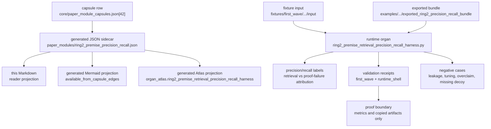

# Ring-2 Premise Precision Recall

`ring2_premise_retrieval_precision_recall_harness` is the public Microcosm
organ for evaluating copied Ring-2 premise retrieval rankings against
after-the-fact labels.

The organ computes precision and recall per problem, then classifies the result
as `retrieval_hit`, `partial_retrieval_miss`, `retrieval_miss`, or
`proof_failure_despite_hit`. That distinction matters because a failed proof
with all needed premises retrieved is a different failure than a missing premise
retrieval path.

## Shape



## Technical Mechanism

The runtime splits the proof consumer into three evidence classes before it
reports any metric. `_load_payloads` reads the declared fixture or exported
bundle inputs; `_validate_run_material` checks that copied Ring-2 run material
carries source refs, target refs, validation refs, digests, and the expected
`copied_non_secret_macro_body_with_provenance` status; and
`_validate_source_artifacts` verifies the four copied source artifacts against
either the macro digest or the public-safe private-path rewrite digest. The
receipt therefore proves the presence and provenance of the copied public
artifacts before the precision/recall scores can be interpreted.

The scoring core is `_evaluate`. It indexes after-the-fact labels by
`problem_id`, applies the policy `default_top_k` or per-ranking `top_k`,
truncates retrieved premise ids to that cutoff, intersects retrieved ids with
labelled needed-premise ids, and computes `precision_at_k = hits/top_k` and
`recall_at_k = hits/needed`. Aggregate precision and recall use total hit,
candidate, and needed-premise counts, then compare the computed aggregate
metrics with the policy's expected values. This is why the paper module can
distinguish a retrieval miss from a proof failure after full premise recall
without asserting anything about the downstream proof.

The failure taxonomy is mechanical rather than rhetorical. Full recall plus a
passing proof is `retrieval_hit`; full recall plus a non-passing proof is
`proof_failure_despite_hit`; partial overlap is `partial_retrieval_miss`; and
zero overlap is `retrieval_miss`. The policy floor also requires expected
failure modes and an adversarial decoy whose needed premise is absent or missed.
Those gates make the metric harness test the shape of the evaluation set, not
just the happy path.

The negative cases enforce the claim ceiling. `EXPECTED_NEGATIVE_CASES` requires
oracle labels planted in rankings, proof-body leakage, test-split tuning,
metric-overclaim, and missing-decoy inputs to produce typed refusal codes. The
receipt-writing path then exposes import ids, target refs, digest status,
aggregate counts, failure-mode counts, and secret-scan status while keeping
proof bodies, provider payloads, and private paths outside the public receipt.
That implements the capsule's P-1/P-2/P-6/P-8/P-9 and AX-1/AX-2/AX-5/AX-7
posture: metrics are recomputed from copied artifacts, blocked states stay
blocked, and no metric label becomes Lean, provider, benchmark, or release
authority.

## Authority Ceiling

This organ does not run Lean or Lake, call providers, emit proof bodies, tune
retrieval on test answers, claim benchmark performance, prove theorem
correctness, or authorize release. Its labels are metric labels only; they are
not allowed to flow into provider context recipes.

## Claim Ceiling

This module supports only the reader-verifiable claim that copied public
premise-retrieval records can be scored for precision/recall labels, adversarial
decoys, body-floor imports, and metric overclaim refusals. It does not prove
Lean correctness, benchmark performance, provider output quality, theorem
truth, release readiness, publication approval, or whole-system correctness.

## JSON Capsule Binding

Source authority for this reader page is `core/paper_module_capsules.json::paper_modules[42:paper_module.ring2_premise_precision_recall]`; the generated instance is `paper_modules/ring2_premise_precision_recall.json` with `source_authority: json_capsule`.

This Markdown is a reader projection over the capsule, not the authority plane. The generated Mermaid projection is `available_from_capsule_edges`, and the generated Atlas projection is `linked_from_capsule_edges`; both statuses are builder-owned projections and do not expand the authority ceiling.

The proof boundary is copied non-secret Ring2 retrieval records and public fixture/exported-bundle receipts only. A cold reader should not treat this page, Mermaid availability, Atlas linkage, or validation receipts as Lean/Lake execution, theorem proof, benchmark performance, provider-call authority, provider-context label flow, publication approval, or release approval.

## Structured Lattice Bindings

The generated JSON row currently contributes 18 relationship edges: two
`paper_module.explains.organ_or_mechanism` edges for the organ and mechanism
subjects, one `paper_module.governed_by.concept` edge, six
`paper_module.governed_by.principle` edges, six `paper_module.abides_by.axiom`
edges, two sibling `paper_module.depends_on.paper_module` edges, and one
resolved `paper_module.cites.code_locus` edge.

The Mermaid projection is `available_from_capsule_edges`; the Atlas projection is `linked_from_capsule_edges`. At this HEAD the generated row reports zero unresolved selective relations; future concept or dependency edges still belong in the JSON capsule row, not in Markdown prose.

## Governing Lattice Relation

Ring-2 precision/recall sits between premise retrieval and proof diagnosis. The
capsule explains the runtime organ and the
`mechanism.ring2_premise_retrieval_precision_recall_harness.validates_public_premise_retrieval_attribution`
mechanism, which is grounded in the same organ source and in
`concept.formal_math_and_proof_witness_bundle`. That relation is deliberately
proof-adjacent rather than proof-authoritative: it can show whether copied
retrieval rankings hit the labelled needed premises, but it cannot promote a
hit into a Lean proof, a benchmark claim, or a provider-context label.

The governing principles make the scoring path stricter than a label echo. P-1
requires recomputing precision and recall from copied rankings and labels; P-2
keeps the claim ceiling at metric-checker strength; P-3 concentrates authority
in the small harness and focused tests; P-6 keeps missing source artifacts,
negative cases, or digests blocked; P-8 turns leakage, tuning, and overclaim
cases into typed refusals; and P-9 preserves provenance as records cross from
macro run artifacts into public fixture and bundle receipts. The axiom layer
matches that mechanism: AX-1 and AX-2 require derived checker evidence, AX-5
and AX-7 force blocked or refused states instead of inflated metrics, AX-6 keeps
the labelled premise domain explicit, and AX-8 prevents metric labels from
flowing into forbidden sinks.

## Reader Evidence Routing

- Capsule authority: `core/paper_module_capsules.json::paper_modules[42:paper_module.ring2_premise_precision_recall]` names the organ subject, mechanism subject, concept ref, principle refs, axiom refs, dependencies, runtime code locus, and projection statuses. Edit the capsule row, not this page, if those relationships change.
- Generated sidecar: `paper_modules/ring2_premise_precision_recall.json` is the sidecar to inspect for `source_authority: json_capsule`, the 18 generated relationship edges, zero unresolved selective relations, Mermaid `available_from_capsule_edges`, and Atlas `linked_from_capsule_edges`.
- Runtime locus: `src/microcosm_core/organs/ring2_premise_retrieval_precision_recall_harness.py` owns `run`, `run_precision_recall_bundle`, `_build_result`, `_write_receipts`, `EXPECTED_NEGATIVE_CASES`, and `AUTHORITY_CEILING`. It computes aggregate precision/recall, enforces copied source-artifact digests, writes receipts, and carries the provider/proof/release refusal flags.
- Fixture and exported bundle: `fixtures/first_wave/ring2_premise_retrieval_precision_recall_harness/input/` includes the public input records plus five negative cases; `examples/ring2_premise_retrieval_precision_recall_harness/exported_ring2_precision_recall_bundle/` is the runtime-shell bundle. Both routes expose source artifacts under `source_artifacts/` while receipts carry import ids, target refs, and digest status rather than private proof bodies.
- Receipt and test surfaces: `receipts/first_wave/ring2_premise_retrieval_precision_recall_harness/ring2_precision_recall_result.json`, `receipts/first_wave/ring2_premise_retrieval_precision_recall_harness/ring2_precision_recall_validation_receipt.json`, `receipts/acceptance/first_wave/ring2_premise_retrieval_precision_recall_harness_fixture_acceptance.json`, `receipts/runtime_shell/demo_project/organs/ring2_premise_retrieval_precision_recall_harness/exported_ring2_precision_recall_bundle_validation_result.json`, and `tests/test_ring2_premise_retrieval_precision_recall_harness.py` are the reader-verifiable validation receipts for the local public boundary.

## Public Site Availability Boundary

This page is public-site input, not a hand-authored site page. The existing
site builder consumes the capsule row, generated sidecar, organ atlas, and this
Markdown projection to emit `content-graph.json`, `object-map.json`, the
site-wide search index, `docs/area-formal-math.html`, and
`docs/paper-modules.html#paper-module-ring2-premise-precision-recall`.

That route makes the module walkable from the formal-math area card, the paper
modules page, object-map entries, and source links after a validated site
projection refresh. The generated outputs remain builder-owned projections:
do not hand-edit `sites/microcosm/*` to expose this module, and do not treat a
search hit, object-map row, or public card as stronger authority than the JSON
capsule plus runtime/test receipts named above.

If the public-site builder reports `source_coupling.status` other than clear,
the source-side availability repair can still stand, but generated-site landing
must remain a separate projection-lane receipt until the site owner reruns
`build_microcosm_public_site.py --write --validate`,
`build_microcosm_public_site.py --check --validate`, and the public secret scan
under the site projection claim.

## Runtime Surfaces

```bash
PYTHONPATH=src python3 -m microcosm_core.organs.ring2_premise_retrieval_precision_recall_harness run --input fixtures/first_wave/ring2_premise_retrieval_precision_recall_harness/input --out receipts/first_wave/ring2_premise_retrieval_precision_recall_harness
PYTHONPATH=src python3 -m microcosm_core.cli ring2-premise-retrieval-precision-recall-harness run-precision-recall-bundle --input examples/ring2_premise_retrieval_precision_recall_harness/exported_ring2_precision_recall_bundle --out receipts/runtime_shell/demo_project/organs/ring2_premise_retrieval_precision_recall_harness
```

## Receipt Expectations

A complete local receipt includes the organ and bundle commands with temporary
outputs, the focused pytest, the paper-module corpus check, generated-row proof
showing 18 relationship edges, zero unresolved selective relations, Mermaid
`available_from_capsule_edges`, Atlas `linked_from_capsule_edges`, and
`source_authority: json_capsule`, plus public-site builder readback when the
site projection lane is source-coupling-clear.

## Validation Receipt Path

From `microcosm-substrate/`, reproduce this page's proof boundary with
temporary receipts:

```bash
PYTHONPATH=src ../repo-python -m microcosm_core.organs.ring2_premise_retrieval_precision_recall_harness run --input fixtures/first_wave/ring2_premise_retrieval_precision_recall_harness/input --out /tmp/microcosm-ring2-premise-precision-recall --acceptance-out /tmp/microcosm-ring2-premise-precision-recall-acceptance.json
PYTHONPATH=src ../repo-python -m microcosm_core.organs.ring2_premise_retrieval_precision_recall_harness run-precision-recall-bundle --input examples/ring2_premise_retrieval_precision_recall_harness/exported_ring2_precision_recall_bundle --out /tmp/microcosm-ring2-premise-precision-recall-bundle
../repo-pytest microcosm-substrate/tests/test_ring2_premise_retrieval_precision_recall_harness.py
PYTHONPATH=src ../repo-python scripts/build_doctrine_projection.py --check-paper-module-corpus
jq -r '[.id, (.relationships.edges | length), ((.relationships.unpopulated_selective_relations // []) | length), .paper_module_payload.generated_projections.mermaid.status, .paper_module_payload.generated_projections.atlas_card.status] | @tsv' paper_modules/ring2_premise_precision_recall.json
```

The expected projection row is `paper_module.ring2_premise_precision_recall`
with 18 generated relationship edges, zero unresolved selective relations,
Mermaid status `available_from_capsule_edges`, and Atlas status
`linked_from_capsule_edges`. These checks validate copied retrieval records,
metric labels, and bundle receipts only; they do not become Lean/Lake,
benchmark, provider, or theorem authority.

## Body-Floor Import

The fixture and exported bundle both carry exact copied source artifacts under
`source_artifacts/` for the Ring2 aggregate report, graph-variant run summary,
graph comparison, and problem-source manifest. The validator treats those four
digest-matched files as `source_open_body_imports` with
`body_in_receipt=false`: workingness can count the real macro receipt bodies,
while receipts expose only import ids, target refs, and digest status.

## Negative Cases

- `oracle_labels_in_ranking` rejects oracle-needed premise ids inside rankings.
- `proof_body_leakage` rejects proof, provider, or private body fields.
- `test_split_tuning_attempt` rejects retrieval tuned on test labels.
- `metric_overclaim` rejects proof, benchmark, provider, release, or publication authority claims.
- `missing_adversarial_decoy` rejects a metric harness without a decoy miss case.

## Limitations

The harness is a local evidence-accounting check over copied public-safe
artifacts. It does not execute Lean, Lake, Sledgehammer, or any external prover;
it does not inspect proof bodies; and it does not decide whether a theorem is
true. A `retrieval_hit` label means the needed-premise ids appeared in the
ranking under this fixture policy, not that the downstream proof search is
sound or complete.

The reported precision and recall are bounded by the declared Ring-2 fixture
and exported bundle. Different corpora, retrieval cutoffs, premise labels,
decoy construction, or source-artifact digests require rerunning the organ and
cannot be inferred from this page. The negative cases prove specific forbidden
flows are rejected here; they do not exhaust all possible leakage, tuning,
private-state, provider-output, or benchmark-gaming failures. Public-site
visibility, Mermaid availability, and Atlas linkage remain projections over the
capsule and receipts, not additional release, publication, or performance
authority.

## Prior Art Grounding

This organ is grounded in information-retrieval evaluation. NIST's
[TREC evaluation measures](https://trec.nist.gov/pubs/trec20/appendices/measures.pdf)
provide the older precision/recall frame for judging retrieval systems, and
scikit-learn's
[precision/recall metric API](https://scikit-learn.org/stable/modules/generated/sklearn.metrics.precision_recall_fscore_support.html)
shows the common machine-learning interface for reporting those labels.

The theorem-proving side is adjacent to premise-selection and hammer workflows,
such as Isabelle
[Sledgehammer](https://isabelle.in.tum.de/doc/sledgehammer.pdf), where finding
the right facts is a distinct step from replaying a proof. Microcosm keeps that
distinction explicit: precision/recall can say whether needed support was
ranked, but it cannot become Lean correctness, benchmark performance, or
provider-output authority.

## Why It Matters

Premise retrieval should be measurable without becoming theorem authority. This
organ gives Microcosm a compact public harness for asking whether a retrieval
path missed the needed support, hit the support but failed later, or hid a
dangerous truth-side shortcut inside the public runtime.
