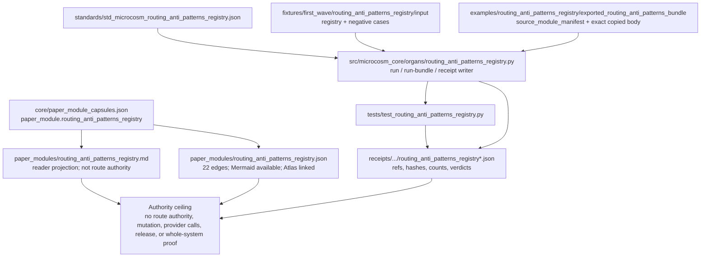

# Routing Anti-Patterns Registry

`routing_anti_patterns_registry` is the public contract diagnostic for the macro
system's typed navigation failure rows. It validates the copied
`codex/doctrine/routing_anti_patterns.json` registry as runnable Microcosm
substrate: the input must declare `kind: routing_anti_patterns`, carry a
positive version, and expose stable `anti_patterns` rows with unique ids and
plain explanatory text.

The positive fixture imports the real macro registry body. The exported runtime
bundle also carries a source module manifest and a byte-for-byte copy under
`source_modules/codex/doctrine/routing_anti_patterns.json`, with sha256 hashes
and anchors for `kernel_before_grep`, `bridge_before_scope`, and
`mode_in_chat_only`. Receipts carry refs, hashes, counts, and verdicts only;
they do not inline the copied body.

The organ rejects five boundary failures:

- missing `kind`
- duplicate anti-pattern ids
- anti-pattern rows missing explanatory text
- release, provider, source-mutation, route-policy mutation, maturity, or
  whole-system-correctness overclaims
- private routing bodies, raw seed bodies, provider payload bodies, or secret
  values in public inputs

## Shape

This module is a projection over a capsule-backed public routing diagnostic, not
route source authority. Cold readers should read it as a bounded chain: the JSON
capsule and standard name the contract; the runtime organ validates fixtures and
an exported source bundle; receipts preserve hashes, counts, verdicts, and
negative cases; generated Mermaid and Atlas rows expose the capsule edges; the
claim ceiling remains projection-only.



## JSON Capsule Binding

- source_ref:
  `core/paper_module_capsules.json::paper_modules[58:paper_module.routing_anti_patterns_registry]`
- source_authority: json_capsule
- Projection role: This Markdown is a reader projection of the JSON capsule
  row, not the source authority. The generated Mermaid projection is
  `paper_module.routing_anti_patterns_registry.mermaid` with status
  `available_from_capsule_edges`, and the generated Atlas projection is
  `organ_atlas.routing_anti_patterns_registry` with status
  `linked_from_capsule_edges`.
- proof boundary: the capsule binds the organ subject, resolved runtime source
  locus, governed concept edge, declared law refs, three dependency edges, and
  22 generated relationship edges.
- authority ceiling: this page can explain public anti-pattern registry
  validation, source-module digest checks, private-leak rejection, negative
  cases, and validation receipts, but it cannot become route source authority,
  mutate routes, authorize providers, authorize release, or widen the proof
  boundary.

## Structured Lattice Bindings

The capsule row yields 22 generated relationship edges: two `explains` edges,
one `code_locus` edge, one governed concept edge, nine principle edges, six
axiom edges, and three `depends_on` paper-module edges. The Mermaid projection is
`available_from_capsule_edges`, the Atlas projection is
`linked_from_capsule_edges`, `source_authority` remains `json_capsule`, and
the generated row has zero unresolved selective relations.

## Technical Mechanism

The organ is a contract checker around a public routing-registry copy, not a
router. `run` loads the first-wave fixture and asks `_build_result` to validate
the positive `routing_anti_patterns.json` payload, all declared negative cases,
the secret-exclusion scan, and the body-free receipt bundle. The positive path
requires `kind: routing_anti_patterns`, a positive integer `version`, stable
anti-pattern ids, explanatory text, and the named macro anchors
`kernel_before_grep`, `bridge_before_scope`, and `mode_in_chat_only`.

The failure lattice is explicit. `_payload_findings` records typed evidence for
missing kind, non-positive version, missing rows, missing ids, duplicate ids,
missing text, forbidden authority-role masquerade, private-source fields, and
overclaims about release, provider calls, source mutation, route-policy
mutation, maturity, readiness, or whole-system correctness. A pass is admitted
only when every expected negative case appears with its expected error code and
`missing_negative_cases` is empty. That makes the negative cases proof
obligations rather than illustrative examples.

The exported-bundle path adds source-copy accountability. `run-bundle` calls
`run_routing_anti_patterns_bundle`, which requires `bundle_manifest.json`,
`source_module_manifest.json`, and the copied body under
`source_modules/codex/doctrine/routing_anti_patterns.json`. The manifest checker
streams sha256 over the copied target, verifies `sha256`, `source_sha256`, and
`target_sha256`, checks required anchors, classifies the material as
`copied_non_secret_macro_body`, and rejects any body-in-receipt claim. The source
body is available in the exported source-module tree; receipts keep only refs,
hashes, counts, verdicts, and omission fields.

The governing lattice is deliberately narrow. The capsule binds this mechanism
to `concept.architecture_and_navigation_route_contract_bundle`, `P-1`, `P-2`,
`P-3`, `P-5`, `P-6`, `P-8`, `P-9`, `P-12`, `P-15`, and `AX-1`, `AX-4`, `AX-5`,
`AX-7`, `AX-8`, `AX-11`, but the checker consumes those refs as a claim ceiling:
evidence must be replayable, typed, public-safe, and below projection authority.
It also depends on `navigation_hologram_route_plane`,
`agent_route_observability_runtime`, and `cold_reader_route_map`, so the registry
can describe navigation failure shapes without becoming the control-plane route
source.

## Claim Ceiling

This module may claim public fixture evidence that anti-pattern row shape,
stable anti-pattern ids, source-module digest checks, private-leak rejection,
negative cases, and validation receipts support the declared routing anti-pattern
registry contract. It may also claim that the JSON row resolves the accepted
organ subject, mechanism subject, runtime source locus, governed concept,
principles, axioms, and dependency modules.

This module may not claim route source authority, live route freshness,
route-policy mutation, provider authorization, private routing-note disclosure,
maturity proof, hosted-public readiness, release approval, publication
approval, implementation correctness beyond the listed witnesses, or
whole-system correctness.

## Reader Evidence Routing

Read this module through the following source-to-proof route:

1. Start at the capsule row
   `core/paper_module_capsules.json::paper_modules[58:paper_module.routing_anti_patterns_registry]`.
   It is the source authority for `source_authority: json_capsule`, the organ
   subject, mechanism subject, runtime source locus, concept, principles,
   axioms, dependency modules, and the projection statuses.
2. Read the generated sidecar
   `paper_modules/routing_anti_patterns_registry.json` only as a projection
   from that capsule row. Its 22 relationship edges, zero unresolved selective
   relations, Mermaid availability, and Atlas linkage are corpus receipts, not
   route authority.
3. Follow the runtime proof path through
   `src/microcosm_core/organs/routing_anti_patterns_registry.py`,
   `fixtures/first_wave/routing_anti_patterns_registry/input/`, and
   `examples/routing_anti_patterns_registry/exported_routing_anti_patterns_bundle/`.
   Those surfaces carry the public registry fixture, negative cases,
   `source_module_manifest.json`, copied body target, required anchors, and
   digest checks.
4. Confirm the public receipt floor with the named fixture command, bundle
   command, focused regression, and corpus check below. Receipts may carry ids,
   refs, hashes, counts, verdicts, and omission fields, but not private routing
   bodies or provider payloads.
5. Treat generated diagram, Atlas, search, object-map, and site cards as
   reachability projections from the same source row. They help a public reader
   find the module; they do not outrank the capsule, runtime, manifest, tests,
   or body-free receipts.

## Named Proof Consumers

- First-wave fixture consumer:
  `PYTHONPATH=src ../repo-python -m microcosm_core.organs.routing_anti_patterns_registry run --input fixtures/first_wave/routing_anti_patterns_registry/input --out /tmp/microcosm-routing-anti-patterns-registry/fixture --acceptance-out /tmp/microcosm-routing-anti-patterns-registry/acceptance.json --card`
  consumes the public registry fixture, six expected negative-case families,
  private-source rejection, secret-exclusion scan, body-free receipt writer, and
  command-card omission boundary.
- Exported-bundle consumer:
  `PYTHONPATH=src ../repo-python -m microcosm_core.organs.routing_anti_patterns_registry run-bundle --input examples/routing_anti_patterns_registry/exported_routing_anti_patterns_bundle --out /tmp/microcosm-routing-anti-patterns-registry/bundle --card`
  consumes the source-module manifest, exact copied macro registry body, sha256
  digest floor, required anchors, public-safe material class, and source-open
  summary while keeping body text out of receipts.
- Focused regression consumer:
  `PYTHONPATH=src ../repo-python -m pytest -p no:cacheprovider tests/test_routing_anti_patterns_registry.py -q`
  pins negative-case coverage, source-authority masquerade rejection, digest
  mismatch blockers, exact copied-body imports, secret-exclusion receipt policy,
  and fresh-card reuse behavior.
- Corpus consumer:
  `PYTHONPATH=src ../repo-python scripts/build_doctrine_projection.py --check-paper-module-corpus`
  checks that the Markdown reader projection, JSON capsule row, and generated
  sidecar stay in corpus parity. It is a read-only receipt for this Markdown
  slice, not permission to hand-edit generated projections.

## Reader Proof Boundary

The proof boundary is public anti-pattern registry validation, copied registry
digest checks, stable anti-pattern ids, private-leak rejection, negative cases,
and validation receipts. It does not become route source authority, mutate
routes, expose private routing notes, authorize provider work, authorize
release, or prove whole-system correctness.

## Public Site Availability Boundary

This Markdown page is a public-site input, not a hand-authored site page. The
existing site builder consumes the capsule row, generated sidecar, organ atlas,
mechanism row, and this Markdown projection to emit `content-graph.json`,
`object-map.json`, the site-wide search index, `llms.txt`, component cards,
area pages, and `docs/paper-modules.html#paper-module-routing-anti-patterns-registry`.

After a validated builder refresh, the module is reachable through the
architecture and entry area cards, the component anchor
`components.html#component-routing_anti_patterns_registry`, the paper-module
anchor above, object-map rows, search records, rule-feed links, and source
links. Those generated routes may summarize this registry as a public
navigation-failure diagnostic only when the anti-claim stays beside the positive
claim.

The public site may expose the source-module manifest refs, anti-pattern ids,
negative-case floor, digest checks, validation-result names, and body-free
receipt refs. It must not turn anti-pattern rows into route policy authority,
live routing freshness, provider permission, release readiness, maturity proof,
or whole-system correctness.

The current handoff receipt is
`receipts/public_site/routing_anti_patterns_registry_site_handoff_20260604T2012Z.json`.
If `build_microcosm_public_site.py --check --validate` reports non-clear source
coupling, this source-side availability repair can stand, but generated-site
landing remains a separate projection-lane receipt. Do not hand-edit
`sites/microcosm/*` to make this module appear available.

## Public-Safe Body Handling

Receipts and public projections may include anti-pattern ids, counts, refs,
source-module hashes, anchor checks, leak-scan verdicts, and negative-case
outcomes. They must not inline private routing bodies, raw seed, provider
payloads, account/session data, secrets, or route-policy mutation material.

## Authority Ceiling

This is a projection-only diagnostic. It can explain public anti-pattern
registry validation, copied-body digest checks, private-leak rejection, negative
cases, and validation receipts. It does not become route source authority,
mutate routes, expose private routing notes, authorize providers, authorize
release, or prove whole-system correctness.

## Prior Art Grounding

This registry follows the same family as pattern and anti-pattern catalogs:
name recurring failure shapes so future operators can recognize and avoid them.
The [Hillside patterns library](https://hillside.net/patterns/) is the positive
pattern-language ancestor, and the software anti-pattern literature supplies
the inverse move: documenting repeated practices that look useful but produce
bad outcomes.

The routing-specific presentation also borrows from CLI usability practice.
The [Command Line Interface Guidelines](https://clig.dev/) emphasize
discoverability, clear errors, and suggested next actions; this organ applies
that pressure to navigation failures by requiring stable ids and explanatory
text while keeping the registry projection below route-source authority.

## Receipt Expectations

A complete local receipt includes the fixture run, exported bundle run, focused
pytest, paper-module corpus check, projection check when the shared builder lane
is clean, and generated row proof from
`paper_modules/routing_anti_patterns_registry.json`. The receipt should preserve
registry refs, source-module digests, anti-pattern counts, leak-rejection
verdicts, and route-source-authority exclusions.

## Validation Receipt Path

From `microcosm-substrate`, validate the public routing-registry diagnostic
without writing tracked receipts:

```bash
PYTHONPATH=src ../repo-python -m microcosm_core.organs.routing_anti_patterns_registry run --input fixtures/first_wave/routing_anti_patterns_registry/input --out /tmp/microcosm-routing-anti-patterns-registry/fixture --acceptance-out /tmp/microcosm-routing-anti-patterns-registry/acceptance.json --card
PYTHONPATH=src ../repo-python -m microcosm_core.organs.routing_anti_patterns_registry run-bundle --input examples/routing_anti_patterns_registry/exported_routing_anti_patterns_bundle --out /tmp/microcosm-routing-anti-patterns-registry/bundle --card
PYTHONPATH=src ../repo-python -m pytest -p no:cacheprovider tests/test_routing_anti_patterns_registry.py -q
PYTHONPATH=src ../repo-python scripts/build_doctrine_projection.py --check-paper-module-corpus
PYTHONPATH=src ../repo-python scripts/build_doctrine_projection.py --check
```

Passing validation proves the public anti-pattern registry fixture and
copied-body digest floor only. It does not make this registry route source
authority, and it does not authorize route-policy mutation, provider dispatch,
release, or whole-system correctness.
