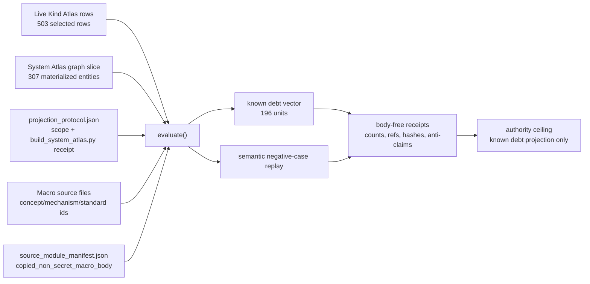

# Self-Ignorance Coverage Ledger

## Purpose

A navigation system that lists what it knows is easy to build. A system that can state, precisely, what it has not yet covered is harder, and it is the more honest signal to a cold reader. This organ answers one question: for a declared set of Kind Atlas families, how many rows does the option surface expose that the generated System Atlas has not yet materialised?

The answer is a small debt vector, computed rather than asserted. For each selected kind the organ recomputes the live Kind Atlas row count through `system.lib.kind_atlas.build_kind_atlas`, counts the entities the `build_system_atlas.py` graph has actually materialised for that kind, and reports the difference as known coverage debt. Concepts, mechanisms and standards are checked back to real macro source files so the materialised set cannot be inflated with names that have no file behind them.

The unusual part is what the validator refuses. It will not accept a fixture that claims its unknown-unknowns are exhaustive: declaring `claims_unknown_unknowns_exhaustive` raises a finding rather than passing. The ledger reports a bounded count of gaps it can see and explicitly declines to claim there are no others. Known debt is treated as typed residual pressure, not as a completeness proof, and absence of a row is never read as proof that nothing is missing.

## Abstract

`self_ignorance_coverage_ledger` is a public Microcosm Crown Jewel organ that measures a narrow, source-grounded form of self-ignorance: known row-level coverage debt between live Kind Atlas option-surface counts and generated System Atlas materialization evidence. It recomputes the selected Kind Atlas families, derives materialized entity IDs from a `build_system_atlas.py` graph snapshot, source-validates graph-derived entity IDs, replays semantic negative cases, and emits body-free receipts with anti-claims.

The current exported bundle is a realness-rung R4 check when the macro repo is available: live Kind Atlas counts are bound, the System Atlas graph slice is builder-bound, the live System Atlas graph is cross-checked, expected entity IDs are source-backed, and copied non-secret macro source bodies are digest-bound through a public-safe manifest. The claim is only `known_kind_atlas_coverage_debt_projection_only`: it is not absence proof, unknown-unknown omniscience, total repository search proof, source mutation authority, release approval, publication approval, private-root equivalence, provider affiliation, or whole-system correctness.

## Problem

Navigation systems can overstate themselves in two opposite ways. A vague "coverage is incomplete" tells a cold reader nothing operational. A confident "nothing else is missing" is worse: it converts absence of evidence into evidence of absence. This organ exists to occupy the narrow technical middle: for a declared finite domain of Kind Atlas families, compute the gap between what the option surface exposes and what the System Atlas graph has materialized.

The result is a self-ignorance ledger, not a universal discovery engine. Its positive output is a bounded debt vector. Its negative output is equally important: the validator must refuse fixtures that claim exhaustive unknown-unknown coverage, hand-author materialization counts, substitute entity IDs, use stale/baked expected IDs as authority, tamper with the System Atlas builder receipt, or repair a copied-source manifest into a self-reference.

## Mechanism

The runtime locus is `src/microcosm_core/organs/self_ignorance_coverage_ledger.py`. The exported-bundle entrypoint is `run_self_ignorance_bundle`; the core evaluator is `evaluate`; the semantic negative-case replayer is `evaluate_negative_case`; the local claim ceiling is `AUTHORITY_CEILING`.

The evaluator consumes four public bundle files:

| Input | Required semantics | Main checks |
|---|---|---|
| `kind_atlas_rows.json` | Declared Kind Atlas families, expected entity IDs, known-debt floors, and absence policy. | Recompute live row counts through `system.lib.kind_atlas.build_kind_atlas`; reject forbidden unknown-unknown exhaustiveness. |
| `system_atlas_graph.json` | Generated graph slice carrying materialized System Atlas entity IDs. | Require non-empty entities and `generated_by == tools/meta/factory/build_system_atlas.py`; derive materialized IDs from graph rows. |
| `materialized_entities.json` | Declared materialization rows and snapshot metadata. | Check declared counts against graph-derived counts; use graph-derived counts as authority. |
| `projection_protocol.json` | Receipt for the System Atlas check and coverage scope. | Require the exact coverage scope and a valid `build_system_atlas.py --check` receipt or blocked-refresh receipt. |

Algorithmically, the organ performs this loop:

1. Load bundle inputs and the source-module manifest through the Crown Jewel common runner.
2. Recompute selected Kind Atlas rows from the macro repo when `system/lib/kind_atlas.py` is available.
3. Load `system_atlas_graph.json`, require the System Atlas builder marker, and derive materialized IDs by kind.
4. Cross-check the bundled graph slice against `state/system_atlas/system_atlas.graph.json` when the macro repo is available.
5. For concepts, mechanisms, and standards, verify that graph-derived expected IDs resolve to real macro source files.
6. Compute `known_coverage_debt_count = live_kind_atlas_row_count - graph_derived_materialized_count` by kind.
7. Replay semantic negative cases from clean input copies instead of trusting declared error labels.
8. Write receipts with refs, counts, hashes, findings, realness evidence, and anti-claims; copied body text stays out of receipts.

For the current exported bundle, the public count vector is:

| Kind | Live Kind Atlas rows | Graph-derived materialized entities | Known debt |
|---|---:|---:|---:|
| `concepts` | 41 | 30 | 11 |
| `mechanisms` | 36 | 28 | 8 |
| `paper_modules` | 225 | 220 | 5 |
| `standards` | 201 | 29 | 172 |
| **Total** | **503** | **307** | **196** |

Those numbers come from `examples/self_ignorance_coverage_ledger/exported_self_ignorance_coverage_ledger_bundle/kind_atlas_rows.json`, `materialized_entities.json`, and `system_atlas_graph.json`, and are proof-consuming snapshot facts. They are not stable doctrine constants; rerun the validator after Kind Atlas, System Atlas, or source manifests move.

## Projection Protocol Receipt

`projection_protocol.json` is the receipt that prevents a static graph slice from masquerading as live authority. The accepted bundle must carry:

| Field | Accepted value | Meaning |
|---|---|---|
| `coverage_scope` | `live_kind_atlas_vs_generated_system_atlas_materialization_snapshot` | The domain is live Kind Atlas rows against generated System Atlas materialization. |
| `system_atlas_check_command` | `./repo-python tools/meta/factory/build_system_atlas.py --check` | The refresh/check route is named, not implied. |
| `system_atlas_check_status` | `pass` or `blocked_source_inputs_changed_since_artifact_generation` | A blocked refresh is admissible only when declared as such; it does not upgrade the snapshot. |
| `system_atlas_refresh_blocked_by_active_source_claims` | Boolean | The receipt can explain why a fresh generated graph was not rebuilt during the bundle. |
| `body_in_receipt` | `false` | Receipt fields carry metadata and verdicts, not copied source bodies. |

The focused tests `test_self_ignorance_coverage_ledger_rejects_projection_scope_tamper` and `test_self_ignorance_coverage_ledger_rejects_system_atlas_receipt_tamper` are the proof consumers for this protocol. They force the R4 claim down to R3 or block when the scope or check receipt is hand-authored away from the builder-owned route.

## Mermaid Flow



The generated Mermaid projection `paper_module.self_ignorance_coverage_ledger.mermaid` remains the machine lattice view. This diagram is the human proof path and must stay subordinate to the capsule and generated projection.

## Real-Good / Real-Bad / Perturbation Evidence

The positive case is `test_self_ignorance_coverage_ledger_projects_real_bundle_known_debt` plus the bundle route:

```bash
PYTHONPATH=src ../repo-python -m microcosm_core.organs.self_ignorance_coverage_ledger run-self-ignorance-bundle --input examples/self_ignorance_coverage_ledger/exported_self_ignorance_coverage_ledger_bundle --out /tmp/microcosm-self-ignorance-coverage-ledger/bundle --card
```

The accepted result must report status `pass`, known debt `196`, observed negative cases `forbidden_absence_inference` and `coverage_debt_mismatch`, `realness_rung: R4`, `live_kind_atlas_recompute_used: true`, `live_system_atlas_graph_crosscheck_used: true`, and source-module digest success.

The real-bad cases are not marketing examples; they are the contract. Treat a guard as validated only when the focused pytest route passes in the current checkout:

| Evidence class | Test / mutation | Required refusal |
|---|---|---|
| Missing real graph | `test_self_ignorance_static_fixture_blocks_without_real_graph` | `CROWN_JEWEL_INPUT_MISSING` and `SELF_IGNORANCE_REAL_ATLAS_GRAPH_EMPTY`. |
| Absence overclaim | `test_self_ignorance_coverage_ledger_rejects_absence_omniscience` | `SELF_IGNORANCE_FORBIDDEN_ABSENCE_INFERENCE`. |
| Expected ID mismatch | `test_self_ignorance_coverage_ledger_rejects_coverage_debt_mismatch` | `SELF_IGNORANCE_EXPECTED_ENTITY_IDS_MISMATCH`. |
| Baked IDs without graph authority | `test_self_ignorance_coverage_ledger_rejects_baked_expected_ids_without_source` | `SELF_IGNORANCE_EXPECTED_ENTITY_IDS_NOT_SOURCE_BACKED`; realness rank falls. |
| Declared entity substitution | `test_self_ignorance_coverage_ledger_rejects_declared_entity_id_substitution` | Missing-from-graph and missing-from-expected mismatch rows. |
| Count tamper | `test_self_ignorance_coverage_ledger_rejects_materialized_count_tamper` | `SELF_IGNORANCE_MATERIALIZATION_COUNT_NOT_GRAPH_DERIVED`. |
| Graph materialization tamper | `test_self_ignorance_coverage_ledger_rejects_graph_materialization_tamper` | Expected-ID mismatch and changed debt vector. |
| Graph builder tamper | `test_self_ignorance_coverage_ledger_rejects_graph_builder_tamper` | `SELF_IGNORANCE_ATLAS_GRAPH_BUILDER_MISMATCH`. |
| Protocol scope/check tamper | projection protocol tests | Scope or check receipt blocked; R4 cannot stand. |
| Declared negative labels lie | `test_self_ignorance_negative_cases_are_semantic_not_declared_labels` | Semantic evaluator still finds the expected error codes. |
| Copied source self-reference | `test_self_ignorance_bundle_rejects_stale_copied_target_source_ref` | `CROWN_JEWEL_SOURCE_SELF_REFERENCE_UNVERIFIED`. |
| Copied source digest drift | `test_self_ignorance_bundle_rejects_source_module_digest_mismatch` | `CROWN_JEWEL_SOURCE_DIGEST_MISMATCH`. |

Perturbation evidence is `test_self_ignorance_coverage_debt_moves_with_materialized_entity_graph`: adding a real, source-backed standard entity moves the known-debt count from 196 to 195 and keeps the result passing. That proves the ledger is coupled to the graph-derived materialization set, not to a fixed prose number.

The unsourced-materialization guard target is `test_self_ignorance_coverage_ledger_rejects_coherent_fake_standard_entity`. Its intended refusal is `SELF_IGNORANCE_EXPECTED_ENTITY_ID_SOURCE_MISSING`, but the paper must not count that guard as validated unless the focused pytest route currently blocks the fake standard entity. If it regresses, lower the source-validation claim to the passing guards above and route the source/test issue through the Task Ledger before closeout.

## Source-Backed Concept / Mechanism / Law Links

The capsule row `core/paper_module_capsules.json::paper_modules[49:paper_module.self_ignorance_coverage_ledger]` binds this reader projection to the following source-backed links:

| Link | Source-backed support | Claim supported |
|---|---|---|
| Organ `self_ignorance_coverage_ledger` | `organs/self_ignorance_coverage_ledger.json` and `core/organ_atlas.json::organs[51:self_ignorance_coverage_ledger]` | This is an accepted public organ with the named runtime locus and paper-module drilldown. |
| Mechanism `mechanism.self_ignorance_coverage_ledger.validates_public_self_ignorance_coverage_ledger` | `core/mechanism_sources.json` and `mechanisms/mechanism.self_ignorance_coverage_ledger.validates_public_self_ignorance_coverage_ledger.json` | The mechanism validates known Kind Atlas coverage-debt fixtures while refusing overclaims. |
| Concept `concept.architecture_and_navigation_route_contract_bundle` | `concepts/concept.architecture_and_navigation_route_contract_bundle.json` | The organ is part of the executable architecture/navigation route-contract family. |
| Principle `P-2` | `principles/P-2.json` | Claim strength must be no stronger than the named checker and receipt. |
| Principle `P-7` | `principles/P-7.json` | Known gaps remain typed residual pressure, not completeness claims. |
| Principle `P-11` | `principles/P-11.json` | Freshness-sensitive claims require dated receipts and refresh routes. |
| Principle `P-15` | `principles/P-15.json` | Generated projections stay below source registries and receipts. |
| Axiom `AX-6` | `axioms/AX-6.json` | Closed-world coverage is valid only inside declared finite domains; absence is not negation. |
| Axiom `AX-7` | `axioms/AX-7.json` | Partial computation must totalize as pass or typed refusal with evidence. |
| Axiom `AX-8` | `axioms/AX-8.json` | Provenance and labels must survive source-to-projection and public-safe body-import boundaries. |
| Axiom `AX-10` | `axioms/AX-10.json` | Live-state counts require freshness, basis, and rederive contracts. |

`P-19` appears in the organ atlas row as an adjacent governing principle for residual classification, but it is not part of the paper-module capsule's `principle_refs`. Treat it as organ-level context unless the capsule is later updated through the JSON authority lane.

## JSON Capsule Binding

- Source row: `core/paper_module_capsules.json::paper_modules[49:paper_module.self_ignorance_coverage_ledger]`
- `source_authority: json_capsule`
- Source boundary: `public_paper_module_json_seeded_from_capsule_registry_not_legacy_markdown_authority`; this Markdown is `legacy_markdown_projection_not_source_authority`.
- Markdown projection status: `legacy_import_projection_until_roundtrip_builder`
- This Markdown is a reader projection. The generated Mermaid projection is `available_from_capsule_edges`, and the generated Atlas projection is `linked_from_capsule_edges`; both are navigation projections derived from the capsule row rather than source authority.
- The generated paper-module JSON reports `relationships.unpopulated_selective_relations: []`; that means the declared capsule lattice edges resolve, not that runtime correctness or release readiness is proven.
- The proof boundary is the public Kind Atlas coverage fixture, materialized Atlas rows, copied non-secret macro bodies, source manifest digests, required anchors, secret-exclusion checks, forbidden-absence negative case, coverage-mismatch negative case, source-backed expected entity checks, live graph cross-checks, and validation receipts.
- The source import class is `public_microcosm_crown_jewel_organ_projection_with_copied_non_secret_macro_body_floor`: the bundle uses `copied_non_secret_macro_body` evidence with `source_faithful_public_safe_path_normalized_copy` treatment and body-free receipts.
- The authority ceiling excludes `no literal unknown-unknown omniscience, no absence proof, no total repository search proof, no source mutation, no release approval, no publication approval, and no whole-system correctness`.

## Evidence Contract

The fixture contract lives at `core/fixture_manifests/self_ignorance_coverage_ledger.fixture_manifest.json`. The active standard lives at `standards/std_microcosm_self_ignorance_coverage_ledger.json`. Together they admit public synthetic fixtures, copied non-secret macro source bodies, hashes, anchors, validator refs, and generated receipts. They forbid private repo bodies outside copied public fixtures, provider payload bodies, credential or account-bound material, operator private notes, raw thread bodies, and receipt body text for copied material.

The exported bundle manifest at `examples/self_ignorance_coverage_ledger/exported_self_ignorance_coverage_ledger_bundle/source_module_manifest.json` currently carries one source module: `tools/meta/factory/build_system_atlas.py`, copied into the bundle under `source_modules/tools/meta/factory/build_system_atlas.py`. The manifest records the source/target relation, digests, line count, required anchors `System Atlas` and `kind`, public-safe replacements, and the boundary that transform receipts record hashes and replacement classes rather than source bodies.

The standard's receipt contract requires a real runtime receipt, a source-module manifest for the exported bundle, a secret-exclusion scan, at least the `forbidden_absence_inference` negative case, and `body_in_receipt: false`. Synthetic receipts are not accepted as stand-ins for this organ's authority.

## Reader Evidence Routing

Read this module in this order:

1. `paper_modules/self_ignorance_coverage_ledger.json` for the generated paper-module projection and relationship edges.
2. `core/paper_module_capsules.json::paper_modules[49:paper_module.self_ignorance_coverage_ledger]` for source authority.
3. `standards/std_microcosm_self_ignorance_coverage_ledger.json` for the public/private boundary, validator contract, receipt expectations, and authority ceiling.
4. `src/microcosm_core/organs/self_ignorance_coverage_ledger.py` for `evaluate`, `evaluate_negative_case`, `run`, and `run_self_ignorance_bundle`.
5. `examples/self_ignorance_coverage_ledger/exported_self_ignorance_coverage_ledger_bundle/` for the current public evidence bundle.
6. `tests/test_self_ignorance_coverage_ledger.py` for proof consumers, bad cases, and perturbation cases.

Treat negative cases as part of the positive claim. The paper should cite only guards that the focused validation route blocks in the current checkout. The validated guard set must include forbidden absence inference, coverage mismatch, baked expected IDs without source, declared entity substitution, materialized count tamper, graph materialization tamper, graph builder tamper, projection protocol tamper, stale source self-reference, and digest mismatch. Fake-but-coherent standard entities remain a required unsourced-materialization guard target, but not an observed passing guard unless the focused test route blocks that perturbation.

## Validation Receipt Path

From `microcosm-substrate`, run:

```bash
PYTHONPATH=src ../repo-python -m pytest -p no:cacheprovider tests/test_self_ignorance_coverage_ledger.py -q
PYTHONPATH=src ../repo-python scripts/build_doctrine_projection.py --check-paper-module-corpus
PYTHONPATH=src ../repo-python scripts/build_doctrine_projection.py --check
```

Use a throwaway receipt directory for manual bundle checks:

```bash
PYTHONPATH=src ../repo-python -m microcosm_core.organs.self_ignorance_coverage_ledger run-self-ignorance-bundle --input examples/self_ignorance_coverage_ledger/exported_self_ignorance_coverage_ledger_bundle --out /tmp/microcosm-self-ignorance-coverage-ledger/bundle --card
```

Passing validation proves that the declared public bundle, source-module manifest, negative cases, and paper-module corpus remain coherent. It does not prove freshness beyond the checked snapshot or authorize generated projection edits by hand.

## Limitations

This organ is intentionally closed-world over selected artifact kinds. It does not discover arbitrary missing files, prove that all System Atlas materialization gaps are known, or search every repo surface. It counts row-level debt over selected Kind Atlas families and only within the graph/materialization/protocol evidence supplied to the bundle.

Freshness is conditional. `projection_protocol.json` can record that a System Atlas refresh was blocked by active source claims. In that state, the organ reports a bounded snapshot plus a refresh boundary; it does not silently upgrade stale generated materialization into live truth.

Source-open evidence is public-safe, not public-total. The bundle may carry copied non-secret macro bodies with transformed private paths, hashes, line counts, and anchors. That does not export raw operator voice, provider payload bodies, account/session state, credentials, browser/HUD state, or private macro-root equivalence.

The current generated paper-module JSON has resolved capsule edges and `relationships.unpopulated_selective_relations: []`. That is a discoverability and lattice-coherence statement. It is not implementation-correctness proof, release readiness, provider authority, or proof that every related concept/principle/axiom has full empirical support.

## Claim Ceiling

The authority ceiling is narrow. Self-Ignorance Coverage Ledger can claim that public fixture evidence, graph-derived materialization rows, live Kind Atlas recomputation, source-backed expected entity IDs, copied non-secret source evidence, semantic negative cases, and receipts make declared Kind Atlas coverage debt visible, recomputable, and checkable.

It cannot claim literal unknown-unknown omniscience, absence proof, total repository search proof, source mutation, live Atlas mutation, private-source export, release authority, publication authority, provider affiliation, product readiness, or whole-system correctness. The active v2 standard status is a source JSON contract state only and does not expand the authority ceiling.

## Prior Art Grounding

The nearest ordinary analogue is software coverage measurement: coverage tools report what was exercised or missed over a declared surface, not all possible missing behaviors. `coverage.py` is useful as a reference pattern for bounded observed coverage over a source set.

The health-signal side is adjacent to automated repository checks such as OpenSSF Scorecard: bounded checks can produce useful risk signals without becoming complete security or quality proof. Microcosm applies that pattern to navigation coverage debt and keeps the anti-claim in the same receipt frame as the count.
