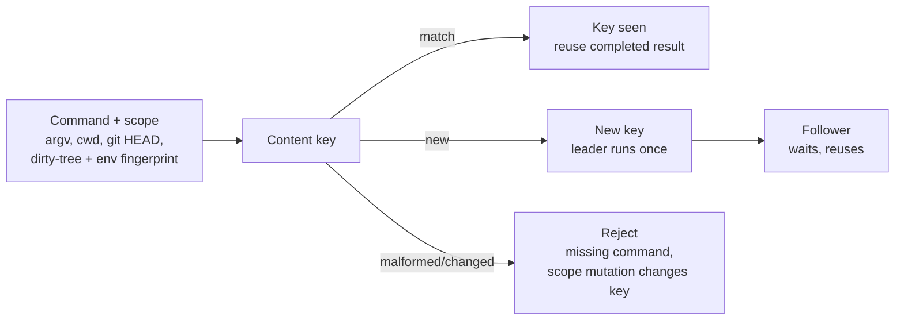

# Semantic Singleflight Dedup Runtime

`semantic_singleflight_dedup_runtime` collapses repeated runs of the same command
into one, keyed by a fingerprint of the state the command actually depends on, so
a follower reuses the leader's result instead of recomputing it.

## Purpose

Re-running an identical command is wasteful; re-using a stale result is wrong. The
hard part is deciding when two runs are "the same." This organ answers that with
an explicit content key rather than a guess.

It surfaces the public `command_run_singleflight` capsule. The key is built from
the argv, the resolved working directory, the git HEAD, a scoped dirty-tree
fingerprint, and an environment fingerprint. A second run with the same key reuses
the first run's completed result; a leader/follower handoff coordinates a single
execution under a local file lock. The boundary is deliberate: this is local,
repo-state-scoped deduplication, not a distributed lock and not a guarantee of
global mutual exclusion.

## Shape



## JSON Capsule Binding

- source_ref:
  `core/paper_module_capsules.json::paper_modules[93:paper_module.semantic_singleflight_dedup_runtime]`
- source_authority: json_capsule
- Projection role: This Markdown is a reader projection of the JSON capsule row,
  not the source authority. The generated Mermaid projection is
  `paper_module.semantic_singleflight_dedup_runtime.mermaid` with status
  `available_from_capsule_edges`, and the generated Atlas projection is
  `organ_atlas.semantic_singleflight_dedup_runtime` with status
  `linked_from_capsule_edges`.
- proof boundary: the capsule binds the accepted organ, the resolved mechanism
  row, the runtime locus, the surfaced engine-room capsule, and the governing
  concept, principle, and axiom edges; the generated JSON projection carries the
  exact resolved relationship edges.
- authority ceiling: this page can explain the bounded dedup fixtures and the
  validation receipts, but it cannot become a global mutual-exclusion guarantee,
  a lock service, a cross-host correctness claim, a job scheduler, or release
  authority.

## Structured Lattice Bindings

The structured capsule row is
`core/paper_module_capsules.json#paper_module.semantic_singleflight_dedup_runtime`.
It binds this Markdown projection to the organ, the resolved mechanism row
`mechanism.semantic_singleflight_dedup_runtime.dedups_command_runs_by_repo_state_key`,
the runtime locus
`src/microcosm_core/organs/semantic_singleflight_dedup_runtime.py`, and the
surfaced capsule `src/microcosm_core/engine_room/command_run_singleflight.py`. It
abides by axiom `AX-2` (a small checker decides claims over certificates) and
principle `P-3` (prefer a small, rerunnable verifier over narrative confidence).

Generated atlas docs remain builder-owned projections: refresh them with
`PYTHONPATH=src python3 scripts/build_organ_atlas.py --write` instead of editing
`ORGANS.md`, `ARCHITECTURE.md`, `AGENT_ROUTES.md`, or
`atlas/agent_task_routes.json` by hand.

## Reader Evidence Routing

The honest unit is the content key, not "runs saved." Read what goes into the key
before trusting that two runs are the same:

- A safety/evals engineer should check what the key includes — argv, cwd, HEAD,
  the dirty-tree fingerprint, the env fingerprint. The useful question is whether
  a meaningful change in inputs changes the key, so a follower never reuses a
  result computed under different state.
- A hiring reviewer should read the two negative cases. The useful question is
  whether deduplication fails closed: a missing command is rejected, and a scope
  mutation changes the key rather than silently reusing a stale result.
- A peer developer should run the fixtures and inspect the key derivation. The
  useful question is whether the leader/follower handoff is local-file-lock
  coordination over a temp scope, not a claim about distributed execution.

## Validation

```bash
PYTHONPATH=src python3 -m microcosm_core.organs.semantic_singleflight_dedup_runtime run --input fixtures/first_wave/semantic_singleflight_dedup_runtime/input --out receipts/first_wave/semantic_singleflight_dedup_runtime --acceptance-out receipts/acceptance/first_wave/semantic_singleflight_dedup_runtime_fixture_acceptance.json
../repo-pytest microcosm-substrate/tests/test_semantic_singleflight_dedup_runtime.py
```

The positive cases (`completed_reuse`, `single_leader`) reuse a completed result
and coordinate a single leader. The negative cases are rejected by recomputation:
`missing_command_rejected` fails closed on an absent command, and
`scope_mutation_changes_key` proves a changed scope yields a different key rather
than a stale reuse.

## Authority Ceiling

A green run shows that the content key deduplicated bounded fixture commands and
that scope changes and malformed commands were rejected. It does not guarantee
global mutual exclusion, does not replace a lock service, cannot prove cross-host
correctness, is not a job scheduler or daemon, and does not authorize release,
publication, provider calls, or source mutation.
