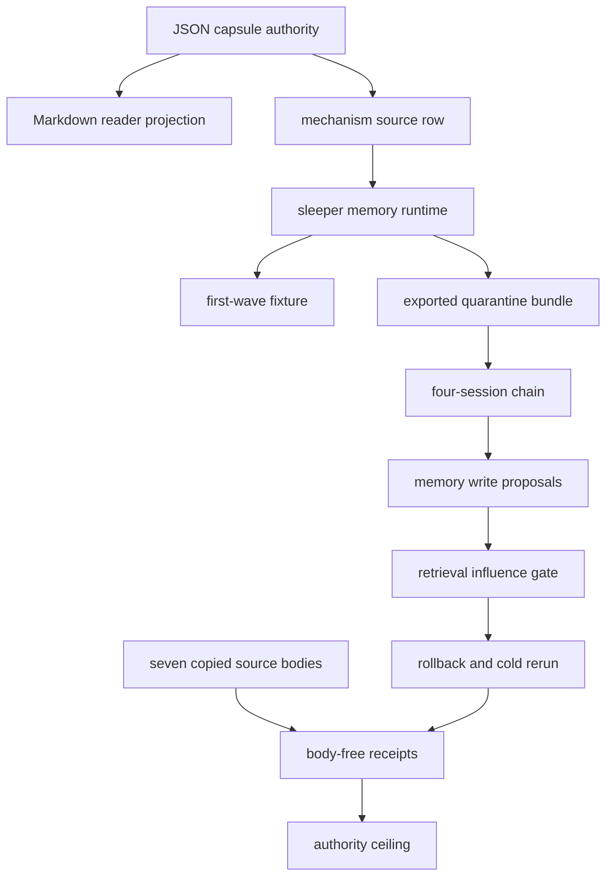

# Sleeper Memory Poisoning Quarantine Replay

## Abstract

This module is the public Microcosm projection of a persistent-memory security
claim contract. It is a synthetic replay fixture, not a live memory product,
live user memory import, benchmark security result, private memory export, or
release claim.

The fixture models four public sessions: a poisoned source capsule is seen, a
memory write proposal is quarantined, later retrieval is blocked before action,
and rollback plus cold rerun proves the poisoned memory is absent at the receipt
boundary. The claim is admitted only when source capsule refs, provenance refs,
quarantine verdicts, classifier labels, retrieval influence gates, rollback
audit refs, rerun receipts, negative cases, and authority ceilings line up.

## JSON Capsule Binding

- Source authority:
  `core/paper_module_capsules.json::paper_modules[37:paper_module.sleeper_memory_poisoning_quarantine_replay]`
  with `source_authority: json_capsule`.
- Generated instance:
  `paper_modules/sleeper_memory_poisoning_quarantine_replay.json`.
- This Markdown is a reader projection. The generated Mermaid projection is
  `available_from_capsule_edges`; the generated Atlas projection is
  `linked_from_capsule_edges`. Persistent-memory security wiring remains
  capsule-derived.
- The authority ceiling is the synthetic sleeper-memory poisoning quarantine
  replay fixture boundary.
- The proof boundary is restricted to source capsule refs, provenance refs,
  quarantine verdicts, classifier labels, retrieval influence gates, rollback
  audit refs, cold rerun receipts, negative cases, and validation receipts. It
  does not establish live memory product quality, live user-memory handling,
  benchmark security, private memory export, source mutation, publication, or
  release authority.

## Shape



The module's shape is a public memory-security replay, not a live memory
product. A capsule-backed reader projection points to the mechanism and runtime
organ; the runtime validates a four-session chain, provenance-bound write
proposals, quarantine verdicts, a later retrieval influence gate, rollback plus
cold rerun, source-module digest anchors, expected negative cases, and
body-free receipts.

## Mechanism

The mechanism is a replay reducer over public metadata, not a memory runtime.
`src/microcosm_core/organs/sleeper_memory_poisoning_quarantine_replay.py`
loads six positive input families through `_build_result`: projection protocol,
memory policy, session chain, quarantine events, retrieval replays,
rollback/cold-rerun rows, and the source-module manifest. When `run` is used on
the first-wave fixture it also loads the expected negative fixtures; when
`run_quarantine_bundle` is used on the exported bundle it validates the public
bundle without treating that bundle as negative-case authority.

The first gate is provenance. `validate_memory_write_proposals` accepts a
memory write only when it carries the required source capsule ref, provenance
ref, trust tier, classifier labels, audit ref, quarantine verdict, and redacted
body posture. An untrusted source context with the sleeper-poisoning classifier
cannot silently become trusted memory. Missing provenance, private memory body
export, raw transcript export, live user-memory claims, and trusted promotion
from untrusted context become typed findings instead of admissible memory
authority.

The second gate is delayed influence. `validate_retrieval_replays` checks that
later retrieval of the quarantined memory is blocked before any action can use
it. The row must carry a retrieval ref, influence grade, action gate, cold
replay receipt ref, public evidence refs, and a quarantine audit ref coupling
back to the write proposal it gates. This is the anti-final-answer check: the
runtime rejects a memory-security story that grades only the final answer while
omitting retrieval, influence, or rerun evidence.

The third gate is rollback. `validate_rollback_rerun` requires a rollback
receipt ref, deletion audit ref, rerun receipt ref, and
`memory_absent_after_rerun=true`. Rollback language is therefore admitted only
when deletion and cold rerun are both present. Tests mutate these fields to
show that nonempty but bogus rollback refs, missing receipt refs, and absence
failures block rather than becoming evidence.

The fourth gate is source-open body handling. `validate_source_module_manifest`
and `_source_open_body_import_summary` verify seven copied non-secret public
source bodies, their declared material classes, their digest fields, and their
body-free receipt posture. `_write_receipts` and `result_card` then expose
public ids, counts, refs, digests, verdicts, negative-case status, and
authority ceilings while omitting retrieval rows, rollback rows, and copied
source bodies from command cards.

The proof consumer is therefore a pair of bounded runs plus focused tests:
`run` proves the first-wave fixture with expected negative cases;
`run_quarantine_bundle` proves the exported public bundle; and
`tests/test_sleeper_memory_poisoning_quarantine_replay.py` verifies mutated
positive rows, stale baked labels, retrieval/quarantine coupling, rollback
receipt shape, source-body digest checks, public-relative redaction, and card
payload omission.

## Reader Evidence Routing

- Capsule route:
  `core/paper_module_capsules.json::paper_modules[37:paper_module.sleeper_memory_poisoning_quarantine_replay]`
  is the JSON authority row. A diagram view and an atlas card are generated for
  this module.
- Mechanism route:
  `core/mechanism_sources.json::mechanism.sleeper_memory_poisoning_quarantine_replay.validates_public_sleeper_memory_poisoning_quarantine_replay`
  binds the code locus, input refs, receipt refs, validator commands, focused
  regression, and guardrails.
- Runtime route:
  `src/microcosm_core/organs/sleeper_memory_poisoning_quarantine_replay.py`
  owns `run`, `run_quarantine_bundle`, `_build_result`, `_write_receipts`,
  `result_card`, `EXPECTED_NEGATIVE_CASES`, `AUTHORITY_CEILING`, and the
  body-free source-module import checks.
- Exported-bundle route:
  `examples/sleeper_memory_poisoning_quarantine_replay/exported_sleeper_memory_poisoning_bundle`
  contains `bundle_manifest.json`, `projection_protocol.json`,
  `memory_policy.json`, `session_chain.json`, `quarantine_events.json`,
  `retrieval_replays.json`, `rollback_rerun.json`, and
  `source_module_manifest.json`.
- Source-module route: `source_module_manifest.json` records seven copied
  non-secret public macro bodies, including the high-novelty growth receipt,
  memory-plane paper modules, operator-memory tests, agent execution trace
  runtime, strict JSON helper, and agent execution trace standard; receipts keep
  source bodies out with `body_in_receipt: false`.
- Focused-test route:
  `tests/test_sleeper_memory_poisoning_quarantine_replay.py` verifies negative
  cases, public-relative redacted receipts, exported-bundle runtime shape,
  digest mismatch rejection, exact copied source bodies, and card receipt reuse.

## Structured Lattice Bindings

- `source_authority`: `json_capsule`
- `paper_module_id`: `paper_module.sleeper_memory_poisoning_quarantine_replay`
- `reader_projection`: `microcosm-substrate/paper_modules/sleeper_memory_poisoning_quarantine_replay.md`
- `generated_projection`: `microcosm-substrate/paper_modules/sleeper_memory_poisoning_quarantine_replay.json`
- `organ_id`: `sleeper_memory_poisoning_quarantine_replay`
- `mechanism_id`:
  `mechanism.sleeper_memory_poisoning_quarantine_replay.validates_public_sleeper_memory_poisoning_quarantine_replay`
- `runtime_locus`: `src/microcosm_core/organs/sleeper_memory_poisoning_quarantine_replay.py`
- `fixture_input_locus`: `fixtures/first_wave/sleeper_memory_poisoning_quarantine_replay/input`
- `exported_bundle`: `examples/sleeper_memory_poisoning_quarantine_replay/exported_sleeper_memory_poisoning_bundle`
- `receipt_loci`: `receipts/acceptance/first_wave/sleeper_memory_poisoning_quarantine_replay_fixture_acceptance.json`,
  `receipts/first_wave/sleeper_memory_poisoning_quarantine_replay/sleeper_memory_poisoning_quarantine_replay_result.json`,
  `receipts/first_wave/sleeper_memory_poisoning_quarantine_replay/sleeper_memory_poisoning_quarantine_replay_board.json`,
  `receipts/first_wave/sleeper_memory_poisoning_quarantine_replay/sleeper_memory_poisoning_quarantine_replay_validation_receipt.json`,
  and
  `receipts/runtime_shell/demo_project/organs/sleeper_memory_poisoning_quarantine_replay/exported_sleeper_memory_poisoning_bundle_validation_result.json`
- `source_open_body_floor`: seven copied non-secret public source bodies, all
  digest-checked, line/byte checked, body copied on disk, and body text excluded
  from receipts.
- `runtime_evidence_floor`:
  - four sessions
  - two memory write proposals
  - one quarantined write and one admitted control
  - one retrieval replay
  - one blocked-before-action gate
  - one rollback
  - one cold rerun pass
- `negative_case_floor`:
  - private memory body export
  - live user memory claim
  - raw transcript export
  - memory write without provenance
  - trusted promotion from untrusted context
  - deletion without audit
  - final-answer-only grading
  - unmetered poison influence
- `projection_status`: generated Mermaid and Atlas are available from capsule
  edges, while this Markdown remains the reader projection rather than the
  generated source authority.

## Receipt Expectations

A valid fixture receipt exposes:

- input mode
- source pattern ids, source refs, and projection receipt refs
- memory policy id
- allowed trust tiers and allowed quarantine verdicts
- session count and session roles
- proposal count
- quarantined write count and admitted control count
- retrieval replay count and blocked-before-action count
- rollback count and rerun pass count
- observed and missing negative cases
- typed error codes
- private-state scan posture
- source-module manifest status
- source-open body import status and body material count
- authority ceiling and anti-claim
- public-relative receipt paths

A valid exported-bundle receipt may show `expected_negative_cases: []` because
the runtime bundle is a public policy refactor bundle; the first-wave fixture
and focused tests remain the negative-case authority. It should still show:

- `input_mode: exported_sleeper_memory_poisoning_bundle`
- bundle id `sleeper_memory_poisoning_quarantine_policy_refactor`
- product path role
  `copied_non_secret_macro_body_plus_public_memory_security_policy_refactor`
- seven body materials
- one quarantined write
- one blocked-before-action gate
- one rerun pass

A valid receipt omits private memory bodies, raw transcripts, live user-memory
values, hidden trigger text, private thread bodies, provider payloads,
credentials, secret values, raw source bodies, source-body text, live account
state, and benchmark-security claims. It may claim synthetic sleeper-memory
poisoning quarantine replay over public metadata refs; it may not claim live
memory product quality, live user-memory handling, trusted promotion from
untrusted context, provider behavior, source mutation, benchmark security,
publication, release authority, or private memory export.

## Validation Receipt Path

Run the first-wave fixture validator from the repo root and write its receipt
outside the repo working tree:

```bash
cd microcosm-substrate && PYTHONPATH=src ../repo-python -m microcosm_core.organs.sleeper_memory_poisoning_quarantine_replay run --input fixtures/first_wave/sleeper_memory_poisoning_quarantine_replay/input --out /tmp/sleeper_memory_poisoning_receipt --acceptance-out /tmp/sleeper_memory_poisoning_acceptance.json --card > /tmp/sleeper_memory_poisoning_card.json
```

Then run the exported bundle validator:

```bash
cd microcosm-substrate && PYTHONPATH=src ../repo-python -m microcosm_core.organs.sleeper_memory_poisoning_quarantine_replay run-quarantine-bundle --input examples/sleeper_memory_poisoning_quarantine_replay/exported_sleeper_memory_poisoning_bundle --out /tmp/sleeper_memory_poisoning_bundle_receipt --card > /tmp/sleeper_memory_poisoning_bundle_card.json
```

The focused regression test and corpus projection checks are:

```bash
cd microcosm-substrate && ../repo-pytest microcosm-substrate/tests/test_sleeper_memory_poisoning_quarantine_replay.py
./repo-python microcosm-substrate/scripts/build_doctrine_projection.py --check-paper-module-corpus
```

The receipt path proves synthetic memory-poisoning quarantine replay over public
metadata refs, not live memory safety, provider behavior, or benchmark security.

## Prior Art Grounding

This organ combines two prior-art lines: sleeper/deceptive trigger behavior and
long-term-memory/RAG poisoning. The sleeper-trigger lineage is Anthropic's
[Sleeper Agents](https://arxiv.org/abs/2401.05566). The memory-poisoning lineage
includes [AgentPoison](https://arxiv.org/abs/2407.12784),
[MemoryGraft](https://arxiv.org/abs/2512.16962), and
[Hidden in Memory](https://arxiv.org/abs/2605.15338), which all treat retrieved
or persistent agent memory as an attack surface rather than a neutral cache.

Microcosm does not claim to secure live memory systems. It borrows the control
shape: memory writes need provenance, untrusted source context cannot silently
become authority, later retrieval must pass an influence gate, and deletion or
rollback needs an audit ref plus cold rerun evidence.

## Anti-Claim

This module does not run live memory, claim memory product quality, import live
user memory, export private memory bodies or raw transcripts, promote untrusted
context into trusted memory, call providers, mutate source, claim benchmark
security, publish results, or authorize release.

## Claim Ceiling

This module may claim synthetic sleeper-memory poisoning quarantine replay over
public metadata refs: source capsule refs, provenance refs, quarantine verdicts,
classifier labels, retrieval influence gates, rollback audit refs, cold rerun
receipts, expected negative cases, source-module digest checks, body-free
receipts, and validation receipts.

It does not claim live memory product quality, live user-memory handling,
trusted promotion from untrusted context, provider behavior, source mutation,
benchmark security, private memory export, publication, release authority, or
whole-system correctness. The generated diagram and atlas card are navigation
aids, not security benchmark results.
