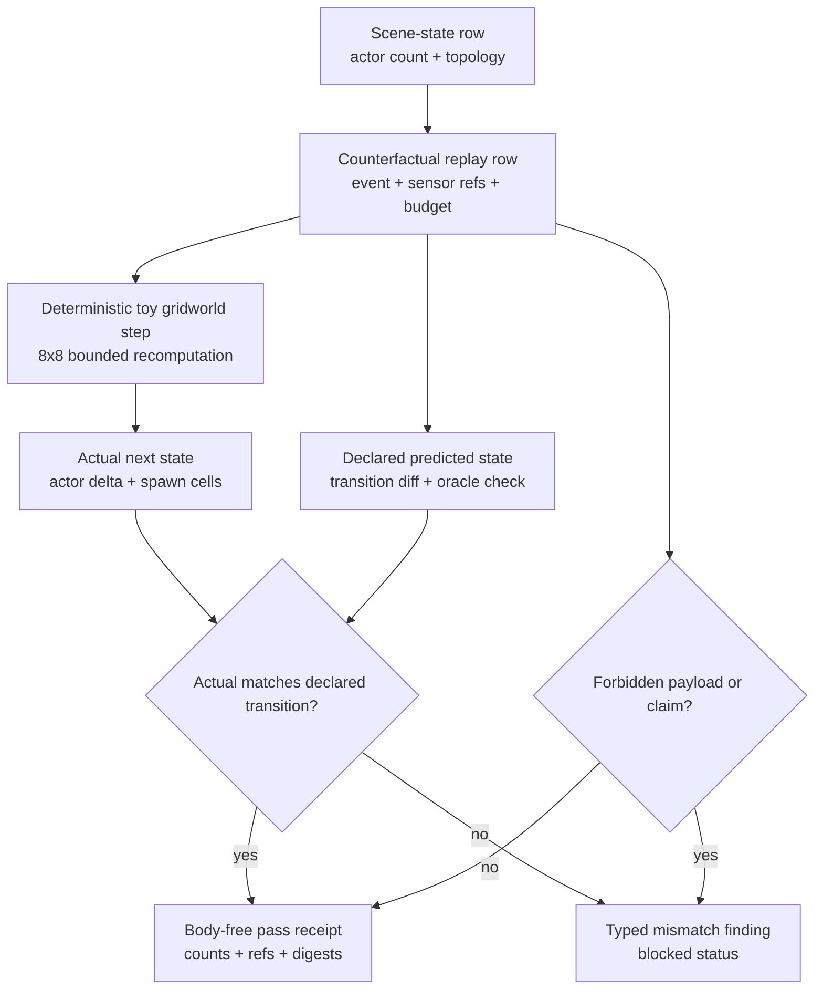

# Spatial World-Model Counterfactual Simulation Replay

## Purpose

Spatial world-model demos are unusually easy to oversell. A plausible-looking
video, or a row that simply asserts "the model predicted the next state
correctly", can pass for understanding without anything having been checked.
This organ exists to answer one narrow question: does a declared spatial
counterfactual row actually bind a source state, an event, and a predicted
outcome that survive an independent recomputation, or is it just a shape that
looks right?

The approach is the unusual part. Rather than trust the predicted state in the
fixture, the runtime rebuilds a small deterministic toy gridworld from the
declared scene and event and steps it forward itself, then compares its own
result against what the row claims. The predicted actor count, transition delta,
event label, and spawn cells are derived from the inputs (sensor-packet refs,
consistency budget, topology), so a stale or hand-edited prediction no longer
matches and the row blocks. The point is not a good simulator. The point is that
a spatial-AI claim cannot pass on appearance alone: it has to agree with a
recomputation a reader can audit in one screen.

## Abstract

`spatial_world_model_counterfactual_simulation_replay` is a public-safe
Microcosm organ for checking spatial world-model counterfactual claims as
metadata transitions, not as generated video, robotics control, AV simulation,
geographic truth, or benchmark authority. The organ validates six synthetic
scene-state rows, six counterfactual replay rows, six predicted transition rows,
eight forbidden-claim negative cases, and an exported source-module bundle whose
receipt stays body-free.

The technical claim is deliberately small: for each replay row, the runtime
recomputes a deterministic toy gridworld next state from the declared scene
state, counterfactual event, sensor-packet refs, consistency budget, topology
ref, and limitation labels; it then compares that actual transition against the
declared predicted state, transition diff, and oracle check. A green run proves
the public replay rows are internally consistent and bounded by their authority
ceiling. It does not prove real-world spatial accuracy, trained simulator
quality, generated-video correctness, robot or AV operation, provider behavior,
hosting, publication, release readiness, or whole-system correctness.

## Telos

World-model demos are easy to overstate because visual plausibility can hide
whether any state transition was checked. This organ makes the proof surface
inspectable: a reader can see the scene-state ref, action trace, predicted-state
ref, transition-diff ref, oracle-check ref, fidelity limit, limitation labels,
negative cases, and source-module digest evidence before accepting any spatial
counterfactual claim.

The useful result is not a better simulator. The useful result is an evidence
spine that refuses to let a spatial-AI claim advance unless the public row binds
input state, counterfactual event, predicted output, actual recomputation, and
anti-claim boundary in one receipt.

## JSON Capsule Binding

- Source authority:
  `core/paper_module_capsules.json::paper_modules[53:paper_module.spatial_world_model_counterfactual_simulation_replay]`
  with `source_authority: json_capsule`.
- Generated instance:
  `paper_modules/spatial_world_model_counterfactual_simulation_replay.json`.
- This Markdown is a reader projection. The generated Mermaid projection is
  `available_from_capsule_edges`; the generated Atlas projection is
  `linked_from_capsule_edges`. Counterfactual-simulation edges are generated
  from capsule authority.
- The authority ceiling is the public synthetic spatial counterfactual-replay
  and source-module import boundary.
- The proof boundary is restricted to scene-state refs, action-trace refs,
  predicted-state refs, transition diffs, oracle checks, fidelity limits,
  unsafe-payload exclusions, cold replay, negative cases, and validation
  receipts. It does not establish robot or AV operation, real-world geographic
  accuracy, simulator-product validation, generated-video authority, provider
  behavior, benchmark scores, publication, hosting, or release authority.

## Structured Lattice Bindings

- Capsule row: `core/paper_module_capsules.json::paper_modules[53:paper_module.spatial_world_model_counterfactual_simulation_replay]`.
- Subject edges: explains organ
  `spatial_world_model_counterfactual_simulation_replay` and mechanism
  `mechanism.spatial_world_model_counterfactual_simulation_replay.validates_public_spatial_world_model_counterfactual_simulation_replay`.
- Runtime code locus:
  `src/microcosm_core/organs/spatial_world_model_counterfactual_simulation_replay.py`
  with `run`, `run_simulation_bundle`, `_state_transition_analysis`,
  `_replay_policy_findings`, `_source_module_manifest_result`,
  `_source_open_body_import_summary`, `_build_result`, `_write_receipts`,
  `result_card`, `EXPECTED_NEGATIVE_CASES`, and `AUTHORITY_CEILING`.
- Doctrine edges: governed by principles `P-1`, `P-2`, `P-3`, `P-6`, `P-8`,
  `P-9`, and `P-15`; abides by axioms `AX-1`, `AX-2`, `AX-5`, `AX-7`, `AX-8`,
  and `AX-10`; grounds
  `concept.research_and_science_replay_evidence_bundle`.
- Dependency edges: depends on
  `paper_module.research_replication_rubric_artifact_replay`,
  `paper_module.world_model_projection_drift_control_room`, and
  `paper_module.materials_chemistry_closed_loop_lab_safety_replay`.
- Generated row proof: Mermaid `available_from_capsule_edges`, Atlas
  `linked_from_capsule_edges`, and 20 generated relationship edges.

## Mechanism

The positive fixture has six scene states and six matching replay rows:
warehouse occlusion, crosswalk emergence, drone-corridor gust recovery, mobile
robot reflective-floor detour, loading-dock pallet shift, and unprotected-turn
late yield. Each row declares a source scene-state ref, action-trace ref,
counterfactual event, predicted-state ref, transition-diff ref,
oracle-state-check ref, two public sensor-packet refs, a rare-event label, a
fidelity-limit label, limitation labels, and explicit false values for private
video, raw sensor export, live operation, geography, simulator-product,
generated-video-only, benchmark, and release claims.

Runtime transition checking happens in `_state_transition_analysis`:

1. The organ resolves each replay to exactly one state-transition row.
2. It builds an 8 x 8 toy gridworld from the source scene's actor count and
   topology ref.
3. It maps the counterfactual event to a deterministic event action such as
   `new_dynamic_actor`.
4. It recomputes the actual next state and transition diff from the input row.
5. It compares predicted actor count, transition delta, event label, spawn cell
   or cells, predicted-state ref, diff ref, oracle-check ref, and body-free
   receipt status.

The input-driven part matters. Actor-count delta is not copied from the expected
fixture. It is recomputed as:

```text
min(
  base_event_actor_count_delta
  + max(0, sensor_packet_count - max_timestep_lag - base_event_actor_count_delta),
  4,
  free_cell_count
)
```

Spawn cells are also input-derived: the runtime hashes the event, replay id,
scene-state ref, topology ref, sensor-packet refs, consistency budget,
limitation labels, and source actor count, then walks the bounded grid from the
declared event cell. This makes the row sensitive to real input changes while
remaining small enough to audit.

## Transition Evidence

The current fixture proves a narrow but useful invariant: all six declared
predicted states match the runtime's actual toy-gridworld step. The focused test
expects:

- `scene_state_count == 6`
- `replay_count == 6`
- `state_transition_count == 6`
- `predicted_state_body_count == 6`
- `deterministic_simulation_pass_count == 6`
- `gridworld_step_count == 6`
- `predicted_actual_match_count == 6`
- `transition_diff_count == 6`
- `oracle_state_check_count == 6`
- `sensor_packet_ref_count == 12`

Those counts are technical evidence only because the runtime recomputes the
state transition before accepting them. The receipt cannot be read as a learned
world-model score; it is a public replay consistency check over synthetic
metadata and copied non-secret source-module digests.

## Real-Bad Mutation Contract

The regression suite includes deliberately bad mutations that show the proof is
not just shape validation:

- If a transition row changes `actor_count_delta` from the recomputed value,
  `run_simulation_bundle` blocks with
  `SPATIAL_STATE_TRANSITION_SIMULATION_MISMATCH`.
- If the predicted state misses the gridworld step, the transition row records
  `predicted_state_actor_count_mismatch` while the recomputed actual state still
  shows the expected gridworld execution.
- If a replay gains an extra sensor-packet ref, the recomputed actor delta moves
  from 1 to 2. The stale expected transition blocks until the predicted actor
  count, actor delta, and spawn cells are updated to match the new actual
  transition.
- If the source scene actor count and topology ref change, the recomputed
  source and spawn-cell state moves. The stale predicted state blocks until the
  transition row is updated.
- If a source-module manifest tries to place copied body text inside a receipt,
  the source-module summary blocks with
  `SPATIAL_SOURCE_BODY_TEXT_IN_RECEIPT_FORBIDDEN` and
  `SPATIAL_SOURCE_MODULE_BODY_TEXT_IN_RECEIPT_FORBIDDEN`.

The negative payload cases are similarly typed: private video export, raw sensor
export, live robot or AV operation, real-world location claims,
simulator-product claims, generated-video-only authority, geographic accuracy
claims, and benchmark-score claims without state-diff receipts all have explicit
forbidden-code coverage.

## Public Boundary

The exported bundle may include copied non-secret Station geometry source bodies
as public source-open material, but receipts carry refs, digests, counts, and
verdicts only. They must not carry private video bodies, raw sensor payloads,
GPS trace bodies, provider payloads, account/session state, credentials, or
live-access material.

The authority ceiling is therefore:

- allowed: synthetic scene-state refs, action-trace refs, predicted-state refs,
  transition-diff refs, oracle-check refs, source-open public sensor-packet refs,
  rare-event labels, fidelity-limit labels, limitation labels, source-module
  digests, negative-case receipts, and body-free validation receipts;
- not allowed: simulator-product authority, private video export, raw sensor
  export, live robot or AV operation, real-world geography claims, benchmark
  scores, provider calls, hosting, publication, release approval, private-root
  equivalence, or whole-system correctness.

## Shape



This diagram is a reader map for the runtime proof. The generated doctrine
lattice Mermaid remains the capsule-derived edge proof.

## Reader Evidence Routing

Read this page from source authority outward:

1. Open
   `core/paper_module_capsules.json::paper_modules[53:paper_module.spatial_world_model_counterfactual_simulation_replay]`
   for the JSON capsule and authority ceiling.
2. Open `paper_modules/spatial_world_model_counterfactual_simulation_replay.json`
   for generated relationship edges, Mermaid status, Atlas status, and
   `source_authority: json_capsule`.
3. Inspect
   `src/microcosm_core/organs/spatial_world_model_counterfactual_simulation_replay.py`,
   especially `_state_transition_analysis`, `_gridworld_step`,
   `_gridworld_actor_count_delta`, `_gridworld_spawn_cells`,
   `_replay_policy_findings`, and `_source_module_manifest_result`.
4. Inspect fixture inputs under
   `fixtures/first_wave/spatial_world_model_counterfactual_simulation_replay/input`
   and exported-bundle inputs under
   `examples/spatial_world_model_counterfactual_simulation_replay/exported_spatial_world_model_simulation_bundle`.
5. Inspect
   `tests/test_spatial_world_model_counterfactual_simulation_replay.py` for the
   positive replay, public-relative receipt, source-module import, body-text
   rejection, transition-delta mutation, predicted-state mutation,
   input-perturbation, scene-perturbation, and fresh-card reuse contracts.

## Runtime Command

```bash
microcosm spatial-world-model-counterfactual-simulation-replay run-simulation-bundle --input examples/spatial_world_model_counterfactual_simulation_replay/exported_spatial_world_model_simulation_bundle --out receipts/runtime_shell/demo_project/organs/spatial_world_model_counterfactual_simulation_replay
```

The runtime shell also exposes the compressed lens at:

```bash
microcosm spatial-simulation
```

## Validation Receipt Path

Run from `microcosm-substrate`:

```bash
PYTHONPATH=src ../repo-python -m microcosm_core.organs.spatial_world_model_counterfactual_simulation_replay run \
  --input fixtures/first_wave/spatial_world_model_counterfactual_simulation_replay/input \
  --out /tmp/microcosm-spatial-world-model-counterfactual-simulation-replay/fixture \
  --acceptance-out /tmp/microcosm-spatial-world-model-counterfactual-simulation-replay/acceptance.json \
  --card
PYTHONPATH=src ../repo-python -m microcosm_core.organs.spatial_world_model_counterfactual_simulation_replay run-simulation-bundle \
  --input examples/spatial_world_model_counterfactual_simulation_replay/exported_spatial_world_model_simulation_bundle \
  --out /tmp/microcosm-spatial-world-model-counterfactual-simulation-replay/bundle \
  --card
PYTHONPATH=src ../repo-python -m pytest -p no:cacheprovider tests/test_spatial_world_model_counterfactual_simulation_replay.py -q
PYTHONPATH=src ../repo-python scripts/build_doctrine_projection.py --check-paper-module-corpus
jq '{mermaid: .paper_module_payload.generated_projections.mermaid.status, atlas: .paper_module_payload.generated_projections.atlas_card.status, edge_count: (.relationships.edges | length)}' paper_modules/spatial_world_model_counterfactual_simulation_replay.json
```

The expected capsule projection is Mermaid `available_from_capsule_edges`,
Atlas `linked_from_capsule_edges`, and 20 generated relationship edges. These
checks prove the public synthetic replay and source-module import boundary only;
they do not validate real geography, robot or AV operation, simulator-product
claims, benchmark scores, publication, hosting, or release.

## Limitations

The dynamics are toy dynamics. The 8 x 8 gridworld models actor counts and spawn
cells from public metadata; it does not model perception, control, physics,
sensor calibration, camera geometry, lidar, maps, vehicle dynamics, human
behavior, or material truth. The synthetic events are useful because they force
state-diff accounting, not because they approximate the real world.

The fixture is also finite. It covers six public replay rows, six transition
rows, two sensor refs per replay, eight negative claim families, and three
copied non-secret source modules. It does not prove all possible spatial
counterfactuals, full secret absence outside the scanner envelope, complete
robotics safety, simulator correctness, or future fixture coverage.

The source-open body floor is limited to exact copied non-secret Station
geometry guardrail bodies named by the source-module manifest and verified by
digest. That does not certify private macro-root equivalence, private video or
raw sensor availability, account/session state, provider behavior, hidden GPS
trace bodies, live-access material, or release readiness.

## Claim Ceiling

This module may claim fixture-bound evidence that the organ ran over public synthetic inputs and produced the receipts and projections described above, reproduced by the validation receipts named on this page.

It may not claim more than its capsule authority ceiling allows: Declared public synthetic spatial counterfactual-replay metadata and source-module import evidence only; no robot or AV operation, real-world geographic accuracy, simulator product validation, generated-video authority, benchmark scores, provider calls, hosting, release approval, publication approval, or whole-system correctness.

## Prior Art Grounding

This replay exercises a spatial world model under counterfactual interventions. It is grounded in the world-models line of work ([Ha and Schmidhuber, World Models](https://arxiv.org/abs/1803.10122)), where an agent learns a compressed model of its environment it can roll forward under hypothetical actions. Microcosm borrows the counterfactual-rollout shape over synthetic metadata; the result is fixture-bound replay evidence, not robot or AV operation, real-world geography, or a calibrated simulator.
